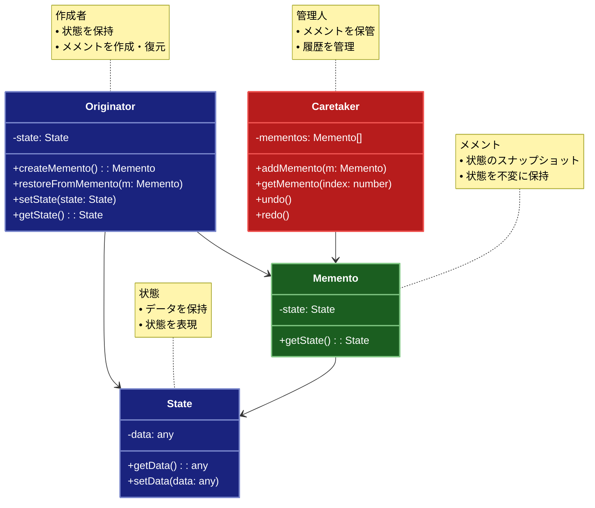

# Memento（メメント）パターン

## 目的

オブジェクトの内部状態を保存し、後でその状態を復元できるようにするパターンです。

## 価値・解決する問題

- オブジェクトの状態を保存できます
- カプセル化を破ることなく状態を保存できます
- 状態の復元が容易です
- 変更履歴を管理できます
- アンドゥ・リドゥ機能を実装できます

## 概要・特徴

### 概要

Mementoパターンは、オブジェクトの内部状態をカプセル化を破ることなく外部に保存し、後で元の状態に復元することを可能にする設計パターンです。このパターンでは、オブジェクト（Originator）の状態を保存するためのスナップショット（Memento）を作成し、それを管理する役割（Caretaker）を分離します。これにより、オブジェクトの内部実装を公開せずに状態の保存と復元を行え、特にテキストエディタやグラフィックツールなどでの「元に戻す」機能の実装に有効です。

### 特徴

#### 状態のカプセル化と保存

オブジェクトの内部状態を外部に漏らすことなく保存できます。Mementoオブジェクトは内部状態のスナップショットを保持し、その状態の詳細はOriginatorオブジェクトのみがアクセスできるようにします。これにより、オブジェクトのカプセル化の原則を損なうことなく、状態の保存と復元ができます。例えば、テキストエディタでは、ドキュメントの内容、カーソル位置、選択範囲などの複雑な状態をMementoオブジェクトに保存し、後で正確に復元できます。

#### 履歴管理と状態追跡

複数のMementoオブジェクトを保持することで、オブジェクトの状態変化の履歴を管理できます。Caretakerが履歴スタックやリストとしてMementoを管理し、ユーザーが必要に応じて過去の状態に戻れるようにします。これにより、変更履歴の追跡や、特定時点の状態への復元が容易になります。例えば、画像編集ソフトでは、各編集操作後の画像状態をMementoとして保存することで、複数の編集ステップを遡ることができます。

#### アンドゥ・リドゥ機能の実現

状態の保存と復元の仕組みを利用して、簡単にアンドゥ（元に戻す）・リドゥ（やり直し）機能を実装できます。ユーザーの操作ごとにMementoを作成し、それを履歴スタックに追加することで、操作の取り消しや再適用が可能になります。これは、ドキュメント編集、グラフィックデザイン、ゲーム開発など、ユーザーが試行錯誤するアプリケーションにとって重要な機能です。

#### 責任の分離と保守性向上

状態の保存・復元ロジックをOriginatorから分離することで、コードの責務が明確になり、保守性が向上します。OriginatorはビジネスロジックやUI操作など本来の責務に集中でき、状態管理の複雑さを軽減できます。また、状態の保存・復元方法を変更する場合も、Originatorのコア機能に影響を与えずに修正できます。この分離により、システム全体の柔軟性と拡張性が向上します。

#### スナップショットの効率化

効率的な実装を行うことで、リソースを最適化できます。すべての状態を毎回保存するのではなく、変更された部分のみを保存する差分Mementoや、特定の条件を満たす場合のみスナップショットを作成する選択的なアプローチも可能です。例えば、大規模なデータ構造を扱うアプリケーションでは、完全なコピーではなく変更されたコンポーネントだけを保存することで、メモリ使用量を削減できます。

### 概要図



## 類似パターンとの比較

- [Command (コマンド)](command.md): Memento は状態を保存し、これに対して Command は操作をカプセル化します。
- [Prototype (プロトタイプ)](prototype.md): Memento は状態を保存し、これに対して Prototype はオブジェクトをコピーします。
- [State (ステート)](state.md): Memento は状態を保存し、これに対して State は状態に応じた振る舞いを変更します。

## 利用されているライブラリ／フレームワークの事例

- [Redux](https://github.com/reduxjs/redux): 状態管理
- [Originator](https://github.com/originator-js/originator): 状態の保存と復元
- [Undo Manager](https://github.com/ArthurClemens/undo-manager): Undo/Redo管理

## 解説ページリンク

- [Refactoring Guru - Memento](https://refactoring.guru/design-patterns/memento)
- [Microsoft - Memento Pattern](https://docs.microsoft.com/en-us/previous-versions/msp-n-p/ee658117(v=pandp.10))
- [SourceMaking - Memento](https://sourcemaking.com/design_patterns/memento)

## コード例

### Before:

状態の保存と復元を直接実装

```typescript
// テキストエディタクラス
class TextEditor {
  private content: string = "";
  private cursorPosition: number = 0;
  private selectedText: string = "";

  setContent(content: string): void {
    this.content = content;
  }

  setCursorPosition(position: number): void {
    this.cursorPosition = position;
  }

  setSelectedText(text: string): void {
    this.selectedText = text;
  }

  getContent(): string {
    return this.content;
  }

  getCursorPosition(): number {
    return this.cursorPosition;
  }

  getSelectedText(): string {
    return this.selectedText;
  }

  // 状態を直接保存
  saveState(): { content: string; cursorPosition: number; selectedText: string } {
    return {
      content: this.content,
      cursorPosition: this.cursorPosition,
      selectedText: this.selectedText
    };
  }

  // 状態を直接復元
  restoreState(state: { content: string; cursorPosition: number; selectedText: string }): void {
    this.content = state.content;
    this.cursorPosition = state.cursorPosition;
    this.selectedText = state.selectedText;
  }
}

// 使用例
function example() {
  const editor = new TextEditor();

  // 初期状態
  console.log("=== 初期状態 ===");
  console.log("内容:", editor.getContent());
  console.log("カーソル位置:", editor.getCursorPosition());
  console.log("選択テキスト:", editor.getSelectedText());
  console.log();

  // テキストを編集
  editor.setContent("Hello, World!");
  editor.setCursorPosition(7);
  editor.setSelectedText("World");

  // 編集後の状態
  console.log("=== 編集後 ===");
  console.log("内容:", editor.getContent());
  console.log("カーソル位置:", editor.getCursorPosition());
  console.log("選択テキスト:", editor.getSelectedText());
  console.log();

  // 状態を保存
  const savedState = editor.saveState();

  // さらに編集
  editor.setContent("Goodbye, World!");
  editor.setCursorPosition(0);
  editor.setSelectedText("");

  // 編集後の状態
  console.log("=== さらに編集後 ===");
  console.log("内容:", editor.getContent());
  console.log("カーソル位置:", editor.getCursorPosition());
  console.log("選択テキスト:", editor.getSelectedText());
  console.log();

  // 保存した状態に復元
  editor.restoreState(savedState);

  // 復元後の状態
  console.log("=== 復元後 ===");
  console.log("内容:", editor.getContent());
  console.log("カーソル位置:", editor.getCursorPosition());
  console.log("選択テキスト:", editor.getSelectedText());
}

example();
```

### After:

Mementoパターンを関数型プログラミングスタイルで適用した実装

```typescript
// Mementoパターンを関数型プログラミングスタイルで適用した実装

// エディタの状態の型定義（イミュータブル）
type EditorState = Readonly<{
  content: string
  cursorPosition: number
  selectedText: string
  fontName: string
  fontSize: number
  isBold: boolean
  isItalic: boolean
  textColor: string
  backgroundColor: string
}>

// メメントの型定義（イミュータブル）
type EditorMemento = Readonly<{
  state: EditorState
  timestamp: Date
  description: string
}>

// 履歴管理の型定義
type History = Readonly<{
  mementos: ReadonlyArray<EditorMemento>
  currentIndex: number
}>

// エディタ操作の結果の型定義
type EditorResult = Readonly<{
  newState: EditorState
  newHistory: History
}>

// 初期状態の定義
const initialEditorState: EditorState = Object.freeze({
  content: '',
  cursorPosition: 0,
  selectedText: '',
  fontName: 'Arial',
  fontSize: 12,
  isBold: false,
  isItalic: false,
  textColor: 'black',
  backgroundColor: 'white'
})

// 初期履歴の定義
const initialHistory: History = Object.freeze({
  mementos: [],
  currentIndex: -1
})

// メメントを作成する純粋関数
const createMemento = (state: EditorState): EditorMemento => {
  const timestamp = new Date()
  const contentPreview = state.content.substring(0, 20)
  const ellipsis = state.content.length > 20 ? '...' : ''
  
  return Object.freeze({
    state,
    timestamp,
    description: `${timestamp.toLocaleString()} - ${contentPreview}${ellipsis}`
  })
}

// 履歴にメメントを追加する純粋関数
const addMemento = (history: History, memento: EditorMemento): History => {
  // 現在位置より後の履歴を削除
  const newMementos = [
    ...history.mementos.slice(0, history.currentIndex + 1),
    memento
  ]
  
  return Object.freeze({
    mementos: newMementos,
    currentIndex: history.currentIndex + 1
  })
}

// 状態を復元する関数を生成する高階関数
const createRestoreFunction = (history: History): ((action: 'undo' | 'redo') => EditorResult | null) => {
  return (action: 'undo' | 'redo'): EditorResult | null => {
    let newIndex: number
    
    if (action === 'undo') {
      // 元に戻せない場合
      if (history.currentIndex <= 0) {
        return null
      }
      newIndex = history.currentIndex - 1
    } else { // redo
      // やり直せない場合
      if (history.currentIndex >= history.mementos.length - 1) {
        return null
      }
      newIndex = history.currentIndex + 1
    }
    
    const memento = history.mementos[newIndex]
    const newHistory = Object.freeze({
      ...history,
      currentIndex: newIndex
    })
    
    return {
      newState: memento.state,
      newHistory
    }
  }
}

// 履歴情報を取得する純粋関数
const getHistoryInfo = (history: History): ReadonlyArray<string> =>
  history.mementos.map((memento, index) => {
    const current = index === history.currentIndex ? '* ' : '  '
    return current + memento.description
  })

// テキストを挿入する純粋関数
const insertText = (state: EditorState, text: string): EditorState => {
  const before = state.content.substring(0, state.cursorPosition)
  const after = state.content.substring(state.cursorPosition)
  
  return Object.freeze({
    ...state,
    content: before + text + after,
    cursorPosition: state.cursorPosition + text.length,
    selectedText: ''
  })
}

// 選択テキストを削除する純粋関数
const deleteSelection = (state: EditorState): EditorState => {
  // 選択がない場合は何もしない
  if (!state.selectedText) return state
  
  const selectionStart = state.cursorPosition
  const selectionEnd = selectionStart + state.selectedText.length
  const before = state.content.substring(0, selectionStart)
  const after = state.content.substring(selectionEnd)
  
  return Object.freeze({
    ...state,
    content: before + after,
    cursorPosition: selectionStart,
    selectedText: ''
  })
}

// フォント名を設定する純粋関数
const setFontName = (state: EditorState, fontName: string): EditorState =>
  Object.freeze({
    ...state,
    fontName
  })

// フォントサイズを設定する純粋関数
const setFontSize = (state: EditorState, fontSize: number): EditorState =>
  Object.freeze({
    ...state,
    fontSize
  })

// 太字を切り替える純粋関数
const toggleBold = (state: EditorState): EditorState =>
  Object.freeze({
    ...state,
    isBold: !state.isBold
  })

// 斜体を切り替える純粋関数
const toggleItalic = (state: EditorState): EditorState =>
  Object.freeze({
    ...state,
    isItalic: !state.isItalic
  })

// 操作を実行して履歴を更新する高階関数
const executeOperation = (
  operation: (state: EditorState, ...args: any[]) => EditorState,
  state: EditorState,
  history: History,
  ...args: any[]
): EditorResult => {
  // 新しい状態を計算（純粋関数）
  const newState = operation(state, ...args)
  
  // 新しいメメントを作成
  const memento = createMemento(newState)
  
  // 履歴を更新
  const newHistory = addMemento(history, memento)
  
  return { newState, newHistory }
}

// エディタの状態を文字列として取得する純粋関数
const getStateAsString = (state: EditorState): string => `
=== 現在の状態 ===
内容: ${state.content}
カーソル位置: ${state.cursorPosition}
選択テキスト: ${state.selectedText}
フォント: ${state.fontName} (${state.fontSize}px)
スタイル: ${state.isBold ? "太字 " : ""}${state.isItalic ? "斜体 " : ""}
文字色: ${state.textColor}
背景色: ${state.backgroundColor}
`

// 複数の操作をパイプラインで実行するヘルパー関数
const pipe = <T>(...fns: Array<(arg: T) => T>) => 
  (value: T): T => fns.reduce((acc, fn) => fn(acc), value)

// 使用例
const example = (): void => {
  console.log('=== Mementoパターン（関数型アプローチ）のデモ ===\n')
  
  // 初期状態と履歴を設定
  let editorState = initialEditorState
  let history = initialHistory
  
  // 初期状態を履歴に追加
  const initialMemento = createMemento(editorState)
  history = addMemento(history, initialMemento)
  
  // 状態の表示
  console.log(getStateAsString(editorState))
  
  // テキストの入力
  console.log('テキストを入力します...')
  let result = executeOperation(insertText, editorState, history, 'Hello, ')
  editorState = result.newState
  history = result.newHistory
  
  result = executeOperation(insertText, editorState, history, 'World!')
  editorState = result.newState
  history = result.newHistory
  
  console.log(getStateAsString(editorState))
  
  // フォントの変更
  console.log('フォントを変更します...')
  result = executeOperation(setFontName, editorState, history, 'Times New Roman')
  editorState = result.newState
  history = result.newHistory
  
  result = executeOperation(setFontSize, editorState, history, 16)
  editorState = result.newState
  history = result.newHistory
  
  console.log(getStateAsString(editorState))
  
  // スタイルの変更
  console.log('スタイルを変更します...')
  result = executeOperation(toggleBold, editorState, history)
  editorState = result.newState
  history = result.newHistory
  
  console.log(getStateAsString(editorState))
  
  // さらにテキストを追加
  console.log('テキストを追加します...')
  result = executeOperation(insertText, editorState, history, ' Welcome to Memento Pattern!')
  editorState = result.newState
  history = result.newHistory
  
  console.log(getStateAsString(editorState))
  
  // 履歴の表示
  console.log('=== 編集履歴 ===')
  console.log(getHistoryInfo(history).join('\n'))
  console.log()
  
  // 復元関数の作成
  const restore = createRestoreFunction(history)
  
  // 元に戻す操作
  console.log('変更を元に戻します...')
  const undoResult = restore('undo')
  if (undoResult) {
    editorState = undoResult.newState
    history = undoResult.newHistory
    console.log(getStateAsString(editorState))
  }
  
  console.log('さらに元に戻します...')
  const undoResult2 = restore('undo')
  if (undoResult2) {
    editorState = undoResult2.newState
    history = undoResult2.newHistory
    console.log(getStateAsString(editorState))
  }
  
  // やり直し操作
  console.log('変更をやり直します...')
  const redoResult = restore('redo')
  if (redoResult) {
    editorState = redoResult.newState
    history = redoResult.newHistory
    console.log(getStateAsString(editorState))
  }
  
  // 最終的な履歴の表示
  console.log('=== 編集履歴 ===')
  console.log(getHistoryInfo(history).join('\n'))
}

// 実行
example()
```
