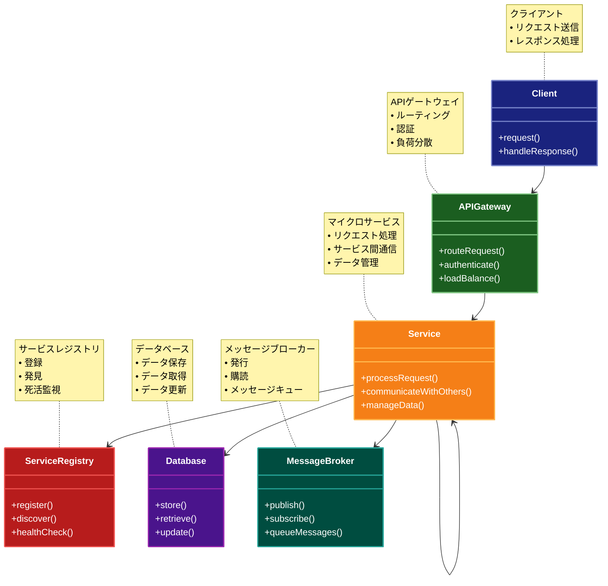

# Microservices（マイクロサービス）アーキテクチャ

## 目的

大規模なアプリケーションを独立して開発・デプロイ・スケーリング可能な小さなサービスに分割し、それぞれのサービスが特定のビジネス機能に焦点を当てることで、システムの柔軟性と保守性を向上させます。

## 解説ページリンク

- [Martin Fowler - Microservices](https://martinfowler.com/articles/microservices.html)  
  - マイクロサービスアーキテクチャの提唱者による包括的な解説で、基本概念から実装の詳細まで網羅しています。

- [Microsoft - Microservices architecture](https://learn.microsoft.com/ja-jp/azure/architecture/guide/architecture-styles/microservices)  
  - クラウド環境でのマイクロサービスアーキテクチャの実装方法と、具体的な設計パターンを提供しています。

- [AWS - Microservices on AWS](https://aws.amazon.com/jp/microservices/)  
  - AWSプラットフォームにおけるマイクロサービスの実装方法と、ベストプラクティスを解説しています。

- [Kubernetes - Microservices Architecture](https://kubernetes.io/docs/concepts/services-networking/)  
  - Kubernetesを使用したマイクロサービスの実装と、コンテナオーケストレーションの詳細を説明しています。

## 価値・解決する問題

- サービスごとの独立した開発とデプロイ
- 技術スタックの柔軟な選択
- 障害の局所化
- スケーリングの柔軟性
- チーム単位での開発効率向上
- 既存システムの段階的な刷新が可能

## 概要・特徴

### 概要

マイクロサービスアーキテクチャは、アプリケーションを独立したサービスに分割し、それぞれのサービスが特定のビジネス機能を担当する設計パターンです。各サービスは独自のデータベースを持ち、APIを通じて他のサービスと通信します。

### 特徴

#### サービスの独立性
マイクロサービスアーキテクチャの最も重要な特徴は、各サービスが完全に独立して開発、デプロイ、スケーリングが可能である点です。サービス間は意図的に疎結合に設計され、あるサービスの変更が他のサービスに影響を与えにくい構造になっています。各サービスは自身の責任範囲内のビジネス機能に集中し、単一責任の原則に従って設計されます。例えば、ECサイトであれば商品管理、注文処理、顧客管理などが個別のサービスとして実装されます。この独立性により、チームごとに異なるサービスを担当でき、組織構造に合わせた開発（コンウェイの法則に沿った設計）が可能になります。また、サービスごとに最適な技術スタックを選択できるため、特定の機能に最適なプログラミング言語やフレームワークを採用することができます。

#### 分散データ管理
マイクロサービスアーキテクチャでは、各サービスが独自のデータベースを持ち、データの所有権が明確に分かれています。これにより、サービスは自身が管理するデータに対して完全な制御権を持ち、他のサービスからのデータアクセスは明示的なAPIを通じてのみ行われます。このアプローチではデータの一貫性は最終的一貫性（Eventual Consistency）によって保たれることが多く、強い一貫性よりもシステムの可用性と分断耐性が優先されます。サービス間のトランザクション管理には、従来のACIDトランザクションの代わりにSAGAパターンなどの分散トランザクション手法が用いられます。また、データの複製や同期が必要な場合は、イベント駆動型のアプローチが採用されることが多く、サービス間でイベントを発行・購読することでデータの整合性を維持します。この分散データ管理により、システム全体の柔軟性と耐障害性が向上する一方で、データ一貫性の管理が複雑化するという課題も生じます。

#### API Gateway
マイクロサービスアーキテクチャでは、APIゲートウェイがクライアントとマイクロサービス間の仲介役として機能し、リクエストのルーティングを担当します。APIゲートウェイは認証・認可、レート制限、キャッシュ、リクエスト/レスポンスの変換などの横断的な機能を提供し、各サービスがこれらの共通機能を重複して実装する必要がなくなります。また、バックエンドサービスのAPIを集約し、クライアント向けに最適化されたインターフェースを提供することで、ネットワークの往復を減らし、モバイルデバイスなどのパフォーマンスが制限された環境でのユーザー体験を向上させます。さらに、APIゲートウェイはサービスの場所や内部構造をクライアントから隠蔽し、内部アーキテクチャの変更を容易にします。これにより、バックエンドサービスの再構成や分割・統合をクライアントに影響を与えることなく実施できます。

#### サービスディスカバリ
マイクロサービス環境では、サービスインスタンスは動的に作成・削除され、IPアドレスやポートが頻繁に変更される可能性があります。サービスディスカバリは、このように動的に変化するサービスインスタンスの場所を特定するメカニズムを提供します。サービスディスカバリシステムは、サービスの登録、検出、ヘルスチェックを自動化し、システムの信頼性を向上させます。例えば、新しいサービスインスタンスが起動すると自動的にレジストリに登録され、他のサービスはこのレジストリを参照してサービスの場所を特定します。これにより、スケールアウト/インやサービスの再デプロイ時にも、クライアントがシームレスに接続できるようになります。また、サービスディスカバリはサービスインスタンス間の負荷分散を実現し、システム全体のパフォーマンスを最適化します。ConsulやEtcd、Zookeeperなどのツールや、KubernetesのServiceのような機能がサービスディスカバリを実現する手段として利用されます。

#### 非同期通信
マイクロサービスアーキテクチャでは、サービス間の通信は同期的なHTTP/REST APIだけでなく、メッセージブローカーを使用した非同期通信も積極的に活用されます。非同期通信はサービス間の時間的結合を緩和し、一方のサービスが一時的に利用できなくても、システム全体が機能し続けることを可能にします。イベント駆動型のアーキテクチャと組み合わせることで、システムの応答性と耐障害性を向上させることができます。例えば、注文サービスが注文を受け付けた後、「注文作成イベント」を発行し、在庫サービスや配送サービスがそのイベントに反応して処理を行うといった形です。メッセージキューを使用することで、一時的なサービス停止や負荷スパイクにも対応でき、システムの弾力性が向上します。また、発行-購読（Pub/Sub）モデルを採用することで、新しいサービスを追加する際にも既存のサービスを変更する必要がなく、サービス間の疎結合がさらに促進されます。RabbitMQ、Apache Kafka、Amazon SNS/SQSなどのメッセージングシステムがこの目的で広く利用されています。

#### コンテナ化
マイクロサービスアーキテクチャでは、Dockerなどのコンテナ技術を活用して、サービスの依存関係や実行環境を一貫して管理することが一般的です。コンテナはアプリケーションとその依存関係を軽量でポータブルなユニットにパッケージ化し、あらゆる環境で一貫した動作を保証します。Kubernetesなどのオーケストレーションツールを用いることで、これらのコンテナのデプロイ、スケーリング、ネットワーキング、ロードバランシング、セルフヒーリングなどの運用を自動化できます。コンテナ化により、環境間の一貫性が確保され、「開発環境では動くが本番では動かない」といった問題が軽減されます。また、マイクロサービスの移植性と再現性が高まり、クラウドやオンプレミスなど異なる環境での実行が容易になります。さらに、コンテナのイメージ化によりサービスのバージョン管理や復元が容易になり、デプロイメントの信頼性が向上します。このようなコンテナ技術はマイクロサービスアーキテクチャの導入と運用を大幅に効率化し、その採用を加速させる要因となっています。

#### 自動デプロイ
マイクロサービスアーキテクチャの効果を最大化するためには、CI/CD（継続的インテグレーション/継続的デリバリー）パイプラインを活用した自動デプロイが不可欠です。多数のサービスが独立して頻繁に更新される環境では、手動デプロイは非効率で誤りが生じやすくなります。自動デプロイによって、コードのビルド、テスト、デプロイのプロセスが標準化され、一貫性が確保されます。ブルー/グリーンデプロイやカナリアリリースなどの高度なデプロイ戦略を採用することで、リスクを最小化しながら新機能をリリースすることができます。小さな変更を頻繁にリリースすることで、各変更のリスクが低減し、問題が発生した場合の原因特定が容易になり、フィードバックサイクルも高速化します。また、インフラストラクチャ・アズ・コード（IaC）を採用することで、環境のプロビジョニングと構成も自動化され、環境間の一貫性が確保されます。Jenkins、GitLab CI/CD、GitHub Actions、CircleCIなどのツールがこの自動デプロイプロセスを支援し、マイクロサービスの開発ライフサイクル全体を効率化しています。

### 概要図



## 類似パターンとの比較

- [Event-Driven Architecture（イベント駆動アーキテクチャ）](event-driven-architecture.md): マイクロサービスアーキテクチャはサービス分割を重視し、Event-Driven Architecture はイベントベースの疎結合な通信を重視します。
- [Service-Oriented Architecture（SOA）](soa.md): マイクロサービスはより小さく独立したサービスを推奨し、SOA は大きめのサービス単位と中央集権的な制御を特徴とします。
- [Monolithic Architecture（モノリシックアーキテクチャ）](monolithic.md): マイクロサービスは分散システムの複雑さを受け入れ、モノリシックは単一のデプロイ単位としての単純さを重視します。

## 利用されているライブラリ／フレームワークの事例

- [Spring Cloud](https://github.com/spring-cloud/spring-cloud-netflix): Netflix が開発したマイクロサービスパターンの実装を提供
- [Kubernetes](https://github.com/kubernetes/kubernetes): コンテナオーケストレーションによるマイクロサービスの運用を支援
- [Istio](https://github.com/istio/istio): サービスメッシュによるマイクロサービス間の通信制御を実現

## コード例

### Before:

```typescript
// モノリシックなEコマースアプリケーション
class ECommerceApp {
  async createOrder(req: Request, res: Response) {
    try {
      const {userId, items} = req.body;

      // ユーザー情報の取得
      const user = await prisma.user.findUnique({
        where: {id: userId},
      });

      if (!user) {
        res.status(404).json({error: "User not found"});
        return;
      }

      // 在庫チェック
      for (const item of items) {
        const product = await prisma.product.findUnique({
          where: {id: item.productId},
        });
        if (!product || product.stock < item.quantity) {
          res
            .status(400)
            .json({error: `Insufficient stock for product ${item.productId}`});
          return;
        }
      }

      // 注文作成
      const order = await prisma.order.create({
        data: {
          userId,
          items: {
            create: items.map((item) => ({
              productId: item.productId,
              quantity: item.quantity,
              price: item.price,
            })),
          },
        },
      });

      // 在庫更新
      for (const item of items) {
        await prisma.product.update({
          where: {id: item.productId},
          data: {
            stock: {decrement: item.quantity},
          },
        });
      }

      // 支払い処理
      const payment = await stripe.charges.create({
        amount: items.reduce(
          (sum, item) => sum + item.price * item.quantity,
          0
        ),
        currency: "usd",
        customer: user.stripeCustomerId,
      });

      // メール送信
      await sendgrid.send({
        to: user.email,
        subject: "Order Confirmation",
        text: `Your order #${order.id} has been received.`,
      });

      res.json(order);
    } catch (error) {
      res.status(500).json({error: "Internal server error"});
    }
  }
}
```

### After:

```typescript
// 注文サービス
// order-service/src/controllers/OrderController.ts
class OrderController {
  constructor(
    private orderService: OrderService,
    private userServiceClient: UserServiceClient,
    private inventoryServiceClient: InventoryServiceClient,
    private paymentServiceClient: PaymentServiceClient,
    private notificationServiceClient: NotificationServiceClient
  ) {}

  async createOrder(req: Request, res: Response) {
    try {
      const {userId, items} = req.body;

      // ユーザー情報の取得（サービス間通信）
      const user = await this.userServiceClient.getUser(userId);
      if (!user) {
        res.status(404).json({error: "User not found"});
        return;
      }

      // 在庫チェック（サービス間通信）
      const stockCheck = await this.inventoryServiceClient.checkStock(items);
      if (!stockCheck.available) {
        res.status(400).json({error: stockCheck.message});
        return;
      }

      // 注文作成
      const order = await this.orderService.createOrder(userId, items);

      // 在庫予約（サービス間通信）
      await this.inventoryServiceClient.reserveStock(items);

      // 支払い処理（サービス間通信）
      const payment = await this.paymentServiceClient.processPayment({
        userId,
        orderId: order.id,
        amount: order.totalAmount,
      });

      if (payment.status === "succeeded") {
        // 注文確定
        await this.orderService.confirmOrder(order.id);

        // 通知送信（サービス間通信）
        await this.notificationServiceClient.sendOrderConfirmation({
          userId,
          orderId: order.id,
          email: user.email,
        });

        res.json(order);
      } else {
        // 注文キャンセル
        await this.orderService.cancelOrder(order.id);
        await this.inventoryServiceClient.releaseStock(items);
        res.status(400).json({error: "Payment failed"});
      }
    } catch (error) {
      res.status(500).json({error: "Internal server error"});
    }
  }
}

// 在庫サービス
// inventory-service/src/controllers/InventoryController.ts
class InventoryController {
  constructor(private inventoryService: InventoryService) {}

  async checkStock(req: Request, res: Response) {
    const {items} = req.body;
    const result = await this.inventoryService.checkStock(items);
    res.json(result);
  }

  async reserveStock(req: Request, res: Response) {
    const {items} = req.body;
    await this.inventoryService.reserveStock(items);
    res.sendStatus(200);
  }
}

// 支払いサービス
// payment-service/src/controllers/PaymentController.ts
class PaymentController {
  constructor(private paymentService: PaymentService) {}

  async processPayment(req: Request, res: Response) {
    const {userId, orderId, amount} = req.body;
    const result = await this.paymentService.processPayment({
      userId,
      orderId,
      amount,
    });
    res.json(result);
  }
}

// 通知サービス
// notification-service/src/controllers/NotificationController.ts
class NotificationController {
  constructor(private notificationService: NotificationService) {}

  async sendOrderConfirmation(req: Request, res: Response) {
    const {userId, orderId, email} = req.body;
    await this.notificationService.sendOrderConfirmation({
      userId,
      orderId,
      email,
    });
    res.sendStatus(200);
  }
}

// サービス間通信のクライアント実装例
// order-service/src/clients/UserServiceClient.ts
class UserServiceClient {
  private readonly baseUrl: string;

  constructor() {
    this.baseUrl = process.env.USER_SERVICE_URL;
  }

  async getUser(userId: string): Promise<User | null> {
    const response = await axios.get(`${this.baseUrl}/users/${userId}`);
    return response.data;
  }
}

// イベントバスを使用したサービス間通信の例
// order-service/src/events/OrderEventPublisher.ts
class OrderEventPublisher {
  constructor(private eventBus: EventBus) {}

  async publishOrderCreated(order: Order) {
    await this.eventBus.publish("order.created", {
      orderId: order.id,
      userId: order.userId,
      items: order.items,
      timestamp: new Date(),
    });
  }
}

// inventory-service/src/events/OrderEventSubscriber.ts
class OrderEventSubscriber {
  constructor(private inventoryService: InventoryService) {
    this.setupSubscriptions();
  }

  private setupSubscriptions() {
    eventBus.subscribe("order.created", async (event) => {
      await this.inventoryService.processOrderCreated(event);
    });
  }
}
