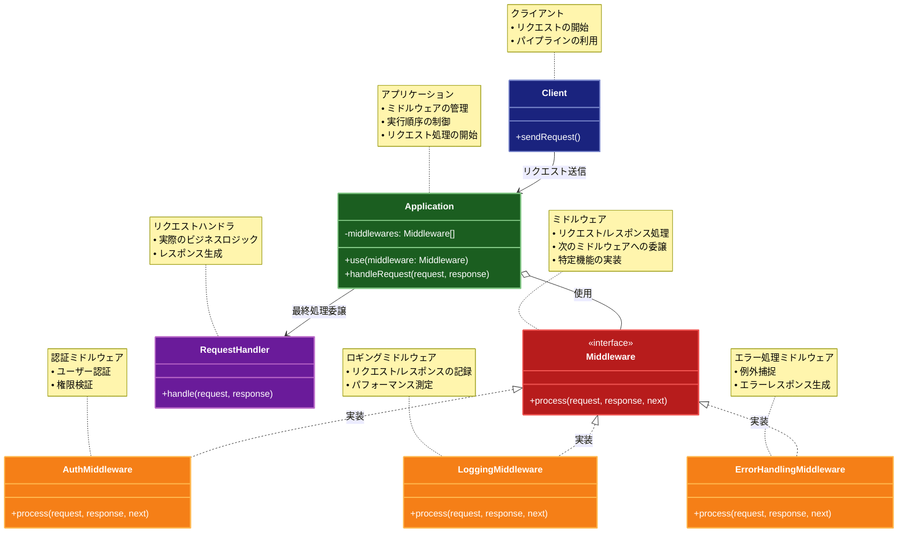

# Middleware (ミドルウェア)

## 目的

リクエスト処理のパイプラインを構築し、各処理層が連続的にリクエストを処理する仕組みを提供します。これにより、クロスカッティングコンサーンを分離し、アプリケーションの機能を柔軟に拡張できます。

## 価値・解決する問題

- 共通処理（ログ、認証、エラーハンドリングなど）を分離して再利用可能
- リクエスト処理の流れを柔軟にカスタマイズ可能
- アプリケーションの機能を段階的に拡張可能
- 関心事の分離による保守性の向上
- パフォーマンス監視やキャッシュなどの機能を透過的に追加可能
- セキュリティ対策（CORS、CSP、XSSなど）を一元管理
- リクエスト/レスポンスの変換や加工を柔軟に実装
- エラーハンドリングの一元化と詳細なエラー情報の収集
- 非同期処理のフロー制御と例外ハンドリング
- テスト容易性の向上（各ミドルウェアを独立してテスト可能）

## 概要・特徴

### 概要

Middlewareパターンは、アプリケーションのリクエスト処理パイプラインに追加機能を挿入するための設計パターンです。各ミドルウェアコンポーネントは特定の機能（認証、ロギング、エラーハンドリングなど）を担当し、リクエストとレスポンスを処理する前後に実行されます。これにより、クロスカッティングコンサーンを分離し、アプリケーションコアのロジックをクリーンに保つことができます。

### 特徴

#### 連鎖的実行
ミドルウェアコンポーネントは定義された順序で連鎖的に実行されます。各ミドルウェアはリクエストを処理した後、次のミドルウェアに制御を渡し、そのミドルウェアの処理が完了すると逆順に戻ってレスポンスを処理します。この双方向の処理フローにより、リクエストの前処理とレスポンスの後処理の両方を実装できます。特にWebフレームワークでは、このリクエスト/レスポンスサイクルを通じて、認証、ロギング、圧縮、キャッシュなどの処理を順番に適用できます。

#### 分離された関心事
各ミドルウェアは単一の明確な責任を持ち、特定の機能や関心事を担当します。この分離により、アプリケーションのコアロジックはビジネス要件に集中し、クロスカッティングコンサーン（認証、ロギング、エラーハンドリングなど）は個別のミドルウェアに分けて実装できます。これにより、コードの保守性と可読性が向上し、機能ごとに独立した開発やテストが可能になります。

#### コンポーザブル
ミドルウェアは組み合わせて使用することで、複雑な機能を構築できます。必要なミドルウェアを選択し、適切な順序で組み合わせることで、アプリケーションの要件に合わせたカスタムパイプラインを構築できます。この柔軟性により、基本的なミドルウェアコンポーネントから複雑な処理フローを作り出せるため、コードの再利用性が高まり、アプリケーション全体の構造がシンプルになります。

#### 拡張性
新しい機能や要件が発生した場合、既存のコードを変更することなく、新しいミドルウェアを追加するだけでアプリケーションを拡張できます。この「開放/閉鎖原則」に基づいたアプローチにより、アプリケーションは将来の変更に対して柔軟に対応できます。例えば、新しいセキュリティ要件や監視機能を追加する場合、既存のコードに影響を与えることなく実装できます。

#### 条件付き処理
特定の条件下でのみ実行されるミドルウェアを定義できます。例えば、特定のURLパターンに対してのみ認証を要求したり、特定のコンテンツタイプに対してのみ圧縮を適用したりすることが可能です。この条件付きミドルウェアの実行により、パフォーマンスを最適化し、必要な場合にのみ特定の処理を適用することができます。

#### リクエスト/レスポンスの修正
ミドルウェアはリクエストとレスポンスの両方を変更することができます。リクエスト処理の過程でヘッダーを追加、変更、または削除したり、ボディデータを変換したりすることが可能です。同様に、レスポンスデータも修正できるため、コンテンツネゴシエーション、データフォーマット変換、圧縮などの処理を透過的に実装できます。

#### エラーハンドリング
ミドルウェアチェーン内でエラーが発生した場合、専用のエラーハンドリングミドルウェアがそれをキャッチして適切に処理できます。これにより、一貫したエラーレスポンスフォーマットの実装や、エラーログの集中管理が可能になります。また、エラー処理に関するロジックを一元化することで、アプリケーション全体でのエラーハンドリングの一貫性を確保できます。

#### 再利用性
一度作成したミドルウェアは、複数のアプリケーションやプロジェクトで再利用できます。汎用的なミドルウェア（認証、ロギング、CSRFプロテクションなど）はライブラリとして共有でき、プロジェクト固有の要件には特殊なミドルウェアを追加で実装することができます。この再利用性により、開発効率が向上し、テスト済みのコードを活用することでバグの可能性も減少します。

#### テスト容易性
各ミドルウェアは独立したコンポーネントであるため、個別にユニットテストを実施できます。これにより、複雑なアプリケーションフローの中でも、特定の機能を分離してテストすることが可能になります。また、テスト時には特定のミドルウェアのみを使用したり、モックミドルウェアと置き換えたりすることで、さまざまなシナリオを効率的にテストできます。

### 概要図



## 類似パターンとの比較

- [Chain of Responsibility (責任の連鎖)](chain-of-responsibility.md): Middlewareは双方向の処理とコンテキスト共有に注力し、これに対してChain of Responsibilityは単方向の処理委譲に焦点を当てています。
- [Decorator (デコレーター)](decorator.md): Middlewareはリクエスト処理のパイプライン構築に注力し、これに対してDecoratorはオブジェクトの機能拡張に焦点を当てています。
- [Pipeline (パイプライン)](pipeline.md): Middlewareは双方向処理とコンテキスト共有に注力し、これに対してPipelineは単方向のデータ変換に焦点を当てています。
- [Interceptor (インターセプター)](interceptor.md): Middlewareはリクエスト処理の拡張に注力し、これに対してInterceptorはメソッド呼び出しの前後処理に焦点を当てています。

## 利用されているライブラリ／フレームワークの事例

- [Express.js](https://expressjs.com/): Webアプリケーションのミドルウェア
- [Koa](https://koajs.com/): 次世代Webフレームワークのミドルウェア
- [ASP.NET Core](https://docs.microsoft.com/ja-jp/aspnet/core/): HTTPリクエストパイプライン
- [Laravel](https://laravel.com/): HTTPミドルウェア
- [Redux Middleware](https://redux.js.org/understanding/history-and-design/middleware): 状態管理のミドルウェア

## 解説ページリンク

- [Express.js - Using middleware](https://expressjs.com/en/guide/using-middleware.html)
- [ASP.NET Core Middleware](https://docs.microsoft.com/ja-jp/aspnet/core/fundamentals/middleware/)
- [Understanding Redux Middleware](https://redux.js.org/understanding/history-and-design/middleware)
- [Koa - Middleware](https://github.com/koajs/koa/blob/master/docs/guide.md#middleware)

## コード例

### Before:

単一の関数で全ての処理を行う実装

```typescript
interface Request {
  path: string;
  method: string;
  headers: Record<string, string>;
  body: any;
  user?: {
    id: string;
    role: string;
  };
}

interface Response {
  status: number;
  headers: Record<string, string>;
  body: any;
}

class APIServer {
  async handleRequest(req: Request): Promise<Response> {
    try {
      console.log(`リクエスト受信: ${req.method} ${req.path}`);
      const startTime = Date.now();

      // CORS チェック
      if (!this.checkCORS(req)) {
        return {
          status: 403,
          headers: {},
          body: { error: "CORS Error" }
        };
      }

      // レート制限チェック
      if (!this.checkRateLimit(req)) {
        return {
          status: 429,
          headers: {},
          body: { error: "Too Many Requests" }
        };
      }

      // 認証チェック
      if (!await this.authenticate(req)) {
        return {
          status: 401,
          headers: {},
          body: { error: "Unauthorized" }
        };
      }

      // キャッシュチェック
      const cachedResponse = this.checkCache(req);
      if (cachedResponse) {
        return cachedResponse;
      }

      // リクエストのバリデーション
      if (!this.validateRequest(req)) {
        return {
          status: 400,
          headers: {},
          body: { error: "Bad Request" }
        };
      }

      // メイン処理
      const result = await this.processRequest(req);
      
      // レスポンスの加工
      const response = this.transformResponse(result);

      // キャッシュの更新
      this.updateCache(req, response);

      // ログ出力
      const endTime = Date.now();
      console.log(`処理完了: ${endTime - startTime}ms`);

      return response;
    } catch (error) {
      console.error("エラー発生:", error);
      return {
        status: 500,
        headers: {},
        body: { error: "Internal Server Error" }
      };
    }
  }

  private checkCORS(req: Request): boolean {
    // CORS チェックの実装
    return true;
  }

  private checkRateLimit(req: Request): boolean {
    // レート制限の実装
    return true;
  }

  private async authenticate(req: Request): Promise<boolean> {
    // 認証の実装
    return true;
  }

  private checkCache(req: Request): Response | null {
    // キャッシュチェックの実装
    return null;
  }

  private validateRequest(req: Request): boolean {
    // バリデーションの実装
    return true;
  }

  private async processRequest(req: Request): Promise<any> {
    // メイン処理の実装
    return { data: "処理結果" };
  }

  private transformResponse(result: any): Response {
    // レスポンス変換の実装
    return {
      status: 200,
      headers: {
        "Content-Type": "application/json"
      },
      body: result
    };
  }

  private updateCache(req: Request, res: Response): void {
    // キャッシュ更新の実装
  }
}

// 使用例
const server = new APIServer();
const request: Request = {
  path: "/api/data",
  method: "GET",
  headers: {
    "Authorization": "Bearer token"
  },
  body: {}
};

server.handleRequest(request).then(console.log);
```

### After:

Middleware パターンを利用して処理を分離した実装

```typescript
interface Request {
  path: string;
  method: string;
  headers: Record<string, string>;
  body: any;
  user?: {
    id: string;
    role: string;
  };
  context: Map<string, any>; // ミドルウェア間でデータを共有
}

interface Response {
  status: number;
  headers: Record<string, string>;
  body: any;
}

type NextFunction = () => Promise<void>;

type Middleware = (
  req: Request,
  res: Response,
  next: NextFunction
) => Promise<void>;

class MiddlewareChain {
  private middlewares: Middleware[] = [];
  private errorHandlers: Array<(error: Error, req: Request, res: Response) => Promise<void>> = [];
  private currentIndex: number = -1;
  private req: Request;
  private res: Response;

  constructor(req: Request) {
    this.req = {
      ...req,
      context: new Map()
    };
    this.res = {
      status: 200,
      headers: {},
      body: null
    };
  }

  use(middleware: Middleware): void {
    this.middlewares.push(middleware);
  }

  catch(handler: (error: Error, req: Request, res: Response) => Promise<void>): void {
    this.errorHandlers.push(handler);
  }

  async execute(): Promise<Response> {
    try {
      await this.next();
    } catch (error) {
      await this.handleError(error as Error);
    }
    return this.res;
  }

  private next: NextFunction = async () => {
    this.currentIndex++;
    if (this.currentIndex < this.middlewares.length) {
      await this.middlewares[this.currentIndex](this.req, this.res, this.next);
    }
  };

  private async handleError(error: Error): Promise<void> {
    for (const handler of this.errorHandlers) {
      try {
        await handler(error, this.req, this.res);
        return;
      } catch (e) {
        console.error("エラーハンドラでエラー発生:", e);
      }
    }
    // デフォルトのエラーハンドリング
    this.res.status = 500;
    this.res.body = { error: "Internal Server Error" };
  }
}

// ミドルウェアの実装

const loggingMiddleware: Middleware = async (req, res, next) => {
  const startTime = Date.now();
  console.log(`リクエスト受信: ${req.method} ${req.path}`);
  
  await next();
  
  const endTime = Date.now();
  console.log(`レスポンス送信: ${res.status}, 処理時間: ${endTime - startTime}ms`);
};

const corsMiddleware: Middleware = async (req, res, next) => {
  // CORS チェック
  const origin = req.headers["origin"];
  if (origin && !isAllowedOrigin(origin)) {
    res.status = 403;
    res.body = { error: "CORS Error" };
    return;
  }
  
  res.headers["Access-Control-Allow-Origin"] = "*";
  await next();
};

const rateLimitMiddleware: Middleware = async (req, res, next) => {
  const clientIP = req.headers["x-forwarded-for"] || "unknown";
  if (!checkRateLimit(clientIP)) {
    res.status = 429;
    res.body = { error: "Too Many Requests" };
    return;
  }
  await next();
};

const authMiddleware: Middleware = async (req, res, next) => {
  const token = req.headers["authorization"]?.split(" ")[1];
  if (!token) {
    res.status = 401;
    res.body = { error: "Unauthorized" };
    return;
  }

  try {
    const user = await authenticateToken(token);
    req.user = user;
    req.context.set("authenticated", true);
    await next();
  } catch (error) {
    res.status = 401;
    res.body = { error: "Invalid Token" };
  }
};

const cacheMiddleware: Middleware = async (req, res, next) => {
  const cacheKey = `${req.method}:${req.path}`;
  const cached = await getCache(cacheKey);
  
  if (cached) {
    res.status = 200;
    res.body = cached;
    return;
  }

  await next();

  if (res.status === 200) {
    await setCache(cacheKey, res.body);
  }
};

const validationMiddleware: Middleware = async (req, res, next) => {
  if (!validateRequest(req)) {
    res.status = 400;
    res.body = { error: "Bad Request" };
    return;
  }
  await next();
};

const businessLogicMiddleware: Middleware = async (req, res, next) => {
  try {
    const result = await processRequest(req);
    res.status = 200;
    res.body = result;
  } catch (error) {
    throw new Error("Business Logic Error");
  }
  await next();
};

// ヘルパー関数
function isAllowedOrigin(origin: string): boolean {
  // CORS チェックの実装
  return true;
}

function checkRateLimit(clientIP: string): boolean {
  // レート制限の実装
  return true;
}

async function authenticateToken(token: string): Promise<any> {
  // トークン認証の実装
  return { id: "1", role: "user" };
}

async function getCache(key: string): Promise<any> {
  // キャッシュ取得の実装
  return null;
}

async function setCache(key: string, value: any): Promise<void> {
  // キャッシュ設定の実装
}

function validateRequest(req: Request): boolean {
  // リクエストバリデーションの実装
  return true;
}

async function processRequest(req: Request): Promise<any> {
  // ビジネスロジックの実装
  return { data: "処理結果" };
}

// 使用例
async function example() {
  const request: Request = {
    path: "/api/data",
    method: "GET",
    headers: {
      "Authorization": "Bearer token",
      "Origin": "https://example.com"
    },
    body: {},
    context: new Map()
  };

  const chain = new MiddlewareChain(request);

  // ミドルウェアの登録
  chain.use(loggingMiddleware);
  chain.use(corsMiddleware);
  chain.use(rateLimitMiddleware);
  chain.use(authMiddleware);
  chain.use(cacheMiddleware);
  chain.use(validationMiddleware);
  chain.use(businessLogicMiddleware);

  // エラーハンドラの登録
  chain.catch(async (error, req, res) => {
    console.error("エラー発生:", error);
    res.status = 500;
    res.body = { error: "Internal Server Error" };
  });

  const response = await chain.execute();
  console.log("最終レスポンス:", response);
}

example();
```
