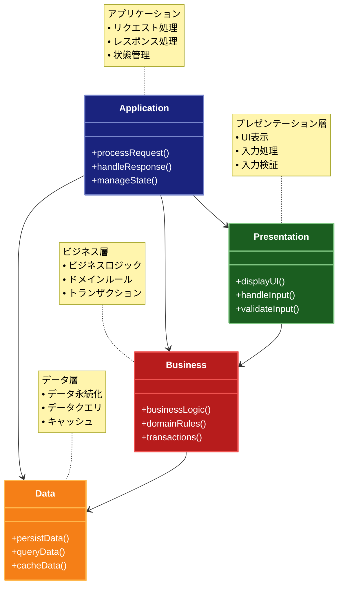

# モノリシックアーキテクチャ

## 目的

アプリケーションの全ての機能を単一のプロセスとして実装し、シンプルな開発・デプロイ・運用を実現します。

## 価値・解決する問題

- シンプルな開発プロセス
- 容易なデプロイメント
- 単純な運用管理
- 高いパフォーマンス
- 低い初期コスト

## 概要・特徴

### 概要

モノリシックアーキテクチャは、アプリケーションの全ての機能を単一のプロセスとして実装する設計パターンです。全てのコンポーネントが密に結合され、単一のデプロイメントユニットとして動作します。

### 特徴

#### 単一のコードベース
モノリシックアーキテクチャの最も基本的な特徴は、アプリケーション全体が単一のコードベースとして開発・構築・デプロイされることです。すべての機能モジュール、ビジネスロジック、データアクセスレイヤーが一つのプロジェクト内に統合されており、コンポーネント間の呼び出しはプロセス内メソッド呼び出しやライブラリ関数呼び出しとして実装されます。この単一コードベースのアプローチには、開発の初期段階での単純さと効率性というメリットがあります。すべてのコードが同じ開発環境で編集でき、モジュール間の統合は比較的直接的です。さらに、IDEのリファクタリング機能や型チェックなどのツールを最大限に活用でき、コード間の依存関係も明確に把握できます。ただし、アプリケーションが成長するにつれて、このコードベースは複雑さを増し、十分な構造化とモジュール化が行われていない場合、保守が困難になる可能性があります。大規模なモノリシックアプリケーションでは、変更の影響範囲の特定や、テスト範囲の最適化がマイクロサービスに比べて難しくなることがあります。

#### 共有データベース
モノリシックアーキテクチャでは通常、アプリケーション全体で単一の共有データベースを使用します。これにより、データの一貫性を維持し、トランザクションの管理が比較的容易になります。すべてのデータが一箇所に集中しているため、複雑なクエリやレポート生成も効率的に実行できます。データベーストランザクションを使用して、複数のテーブルや機能領域にまたがる操作でもACID特性（原子性、一貫性、分離性、耐久性）を確保できる点も大きな利点です。例えば、注文処理と在庫管理など複数のビジネスプロセスにまたがる操作を、一貫性を保ちながら実行できます。また、データベーススキーマの最適化や正規化も、全体を見渡しながら行うことができます。一方、この共有データベースアプローチは、アプリケーションが大規模になるにつれて課題も生じます。テーブル数が増えるとスキーマの管理が複雑になり、データベースの変更が広範囲に影響を与える可能性があります。また、データアクセスのボトルネックが発生しやすく、スケーリング時には垂直スケーリング（より強力なハードウェアへの移行）に依存せざるを得ないケースが多くなります。

#### 同期通信
モノリシックアーキテクチャでは、アプリケーション内のコンポーネント間通信は同期的に行われるのが一般的です。機能間の呼び出しは直接的なメソッド呼び出しとして実装され、呼び出し元は応答が返るまで待機します。この同期通信モデルは理解しやすく、デバッグしやすいという利点があります。処理フローが直線的で追跡しやすく、エラー処理も比較的単純です。また、結果が必要な時点で即座に取得できるため、実装が直感的になります。同期通信は特にユーザーインターフェースと密接に関わる処理や、即時の応答が必要なケースで適しています。例えば、ユーザー認証やフォーム送信など、ユーザーが結果を待っている操作では、同期処理により明確なフィードバックを提供できます。しかし、この通信モデルは長時間実行される処理や、外部サービスへの依存がある場合には課題があります。一つの処理が遅延すると、それに依存する他のプロセスも遅延し、全体のパフォーマンスに影響を与える可能性があります。また、並列処理の実装が複雑になり、システムリソースの効率的な利用が難しくなることもあります。

#### 垂直スケーリング
モノリシックアーキテクチャは主に垂直スケーリング（スケールアップ）によって処理能力を拡張します。つまり、負荷が増大した場合、アプリケーションを実行するサーバーのCPU、メモリ、ディスク容量などのリソースを増強する方法で対応します。この垂直スケーリングは実装が比較的簡単で、アプリケーションの変更をほとんど必要としないことが多いです。システム管理者はより強力なハードウェアに移行するか、クラウド環境ではインスタンスサイズをアップグレードするだけで対応できます。また、データの一貫性やトランザクション管理が単純になり、レイテンシも低く抑えられるという利点があります。しかし、垂直スケーリングには物理的な限界があり、コストは線形以上に増加することが多いです。また、スケーリングの粒度が粗く、アプリケーション全体をスケールアップする必要があるため、特定の高負荷コンポーネントのみをスケールすることができません。そのため、トラフィックの急増やバースト的な負荷に対して柔軟に対応することが難しく、過剰なリソースの割り当てによるコスト増や、リソースの不足によるパフォーマンス低下のリスクがあります。また、スケールアップには通常、一時的なダウンタイムが必要となることも実運用上の課題となります。

#### 一元的な管理
モノリシックアーキテクチャでは、アプリケーションの配備、監視、メンテナンスが一元的に管理されます。単一のアプリケーションとして運用されるため、デプロイプロセスがシンプルで、バージョン管理も比較的容易です。開発環境から本番環境への移行パスが明確で、全体として一貫した管理が可能です。運用面では、単一のログファイルやモニタリングダッシュボードでアプリケーション全体の状態を把握できるため、問題の診断や性能のボトルネックの特定が直接的に行えます。また、バックアップやリカバリ、セキュリティパッチの適用なども、一つのシステムに対して行えばよいため、運用の労力とコストを削減できます。セキュリティの観点からも、境界が明確で外部への露出ポイントが限られているため、セキュリティポリシーの適用や監査が容易になります。一方で、この一元的な管理は、大規模なアプリケーションではリリースサイクルの硬直化を招くこともあります。小さな変更でも全体のテストとデプロイが必要になるため、頻繁なアップデートが難しく、イノベーションの速度が低下する可能性があります。また、障害が発生した場合、アプリケーション全体に影響を与える可能性が高く、部分的な機能ダウンでも全面的なサービス停止につながることがあります。

### 概要図



## 類似パターンとの比較

- [マイクロサービスアーキテクチャ](microservices.md): モノリシックは単一のプロセスとして実装されますが、マイクロサービスは独立したサービスに分割されます。
- [SOA（Service-Oriented Architecture）](soa.md): モノリシックは密結合な単一のアプリケーションとして実装されますが、SOAはサービス単位で疎結合に実装されます。
- [レイヤードアーキテクチャ](layered-architecture.md): モノリシックは単一のデプロイメントユニットとして実装されますが、レイヤードアーキテクチャは層の分離を重視します。

## 利用されているライブラリ／フレームワークの事例

- [Ruby on Rails](https://github.com/rails/rails): モノリシックアーキテクチャを採用した代表的なフレームワーク
- [Django](https://github.com/django/django): Pythonのモノリシックウェブフレームワーク
- [Laravel](https://github.com/laravel/laravel): PHPのモノリシックウェブフレームワーク

## コード例

### Before:

```typescript
// 機能が混在した実装
class Application {
  private database: Database;
  private cache: Cache;
  private logger: Logger;

  async handleRequest(req: Request, res: Response): Promise<void> {
    try {
      // 認証
      const token = req.headers.authorization;
      if (!token) {
        res.status(401).json({ error: 'Unauthorized' });
        return;
      }

      // ユーザー取得
      const user = await this.database.query(
        'SELECT * FROM users WHERE token = ?',
        [token]
      );

      if (!user) {
        res.status(401).json({ error: 'User not found' });
        return;
      }

      // 商品一覧取得
      const products = await this.database.query(
        'SELECT * FROM products WHERE user_id = ?',
        [user.id]
      );

      // キャッシュ
      await this.cache.set(`products:${user.id}`, products);

      // ログ記録
      await this.logger.log('info', `User ${user.id} fetched products`);

      // レスポンス
      res.status(200).json(products);
    } catch (error) {
      // エラーログ
      await this.logger.log('error', error.message);
      res.status(500).json({ error: 'Internal server error' });
    }
  }
}
```

### After:

```typescript
// 層に分割された実装
// プレゼンテーション層
class ProductController {
  constructor(
    private authService: AuthService,
    private productService: ProductService,
    private logger: Logger
  ) {}

  async getProducts(req: Request, res: Response): Promise<void> {
    try {
      // 認証
      const user = await this.authService.authenticate(req);

      // 商品一覧取得
      const products = await this.productService.getProductsByUser(user.id);

      // レスポンス
      res.status(200).json(products);
    } catch (error) {
      this.handleError(error, res);
    }
  }

  private handleError(error: Error, res: Response): void {
    if (error instanceof AuthError) {
      res.status(401).json({ error: error.message });
    } else {
      this.logger.error(error.message);
      res.status(500).json({ error: 'Internal server error' });
    }
  }
}

// ビジネス層
class AuthService {
  constructor(private userRepository: UserRepository) {}

  async authenticate(req: Request): Promise<User> {
    const token = req.headers.authorization;
    if (!token) {
      throw new AuthError('No token provided');
    }

    const user = await this.userRepository.findByToken(token);
    if (!user) {
      throw new AuthError('Invalid token');
    }

    return user;
  }
}

class ProductService {
  constructor(
    private productRepository: ProductRepository,
    private cacheService: CacheService,
    private logger: Logger
  ) {}

  async getProductsByUser(userId: string): Promise<Product[]> {
    // キャッシュチェック
    const cachedProducts = await this.cacheService.get<Product[]>(
      `products:${userId}`
    );
    if (cachedProducts) {
      return cachedProducts;
    }

    // 商品一覧取得
    const products = await this.productRepository.findByUserId(userId);

    // キャッシュ保存
    await this.cacheService.set(`products:${userId}`, products);

    // ログ記録
    this.logger.info(`User ${userId} fetched products`);

    return products;
  }
}

// データ層
class UserRepository {
  constructor(private database: Database) {}

  async findByToken(token: string): Promise<User | null> {
    const result = await this.database.query(
      'SELECT * FROM users WHERE token = ?',
      [token]
    );
    return result ? new User(result) : null;
  }
}

class ProductRepository {
  constructor(private database: Database) {}

  async findByUserId(userId: string): Promise<Product[]> {
    const results = await this.database.query(
      'SELECT * FROM products WHERE user_id = ?',
      [userId]
    );
    return results.map(result => new Product(result));
  }
}

class CacheService {
  constructor(private cache: Cache) {}

  async get<T>(key: string): Promise<T | null> {
    return this.cache.get(key);
  }

  async set<T>(key: string, value: T): Promise<void> {
    await this.cache.set(key, value);
  }
}

// エラー定義
class AuthError extends Error {
  constructor(message: string) {
    super(message);
    this.name = 'AuthError';
  }
}

// 依存関係の設定
const database = new Database();
const cache = new Cache();
const logger = new Logger();

const userRepository = new UserRepository(database);
const productRepository = new ProductRepository(database);
const cacheService = new CacheService(cache);

const authService = new AuthService(userRepository);
const productService = new ProductService(
  productRepository,
  cacheService,
  logger
);

const productController = new ProductController(
  authService,
  productService,
  logger
);

// ルーティング
app.get('/products', (req, res) => productController.getProducts(req, res));
```
