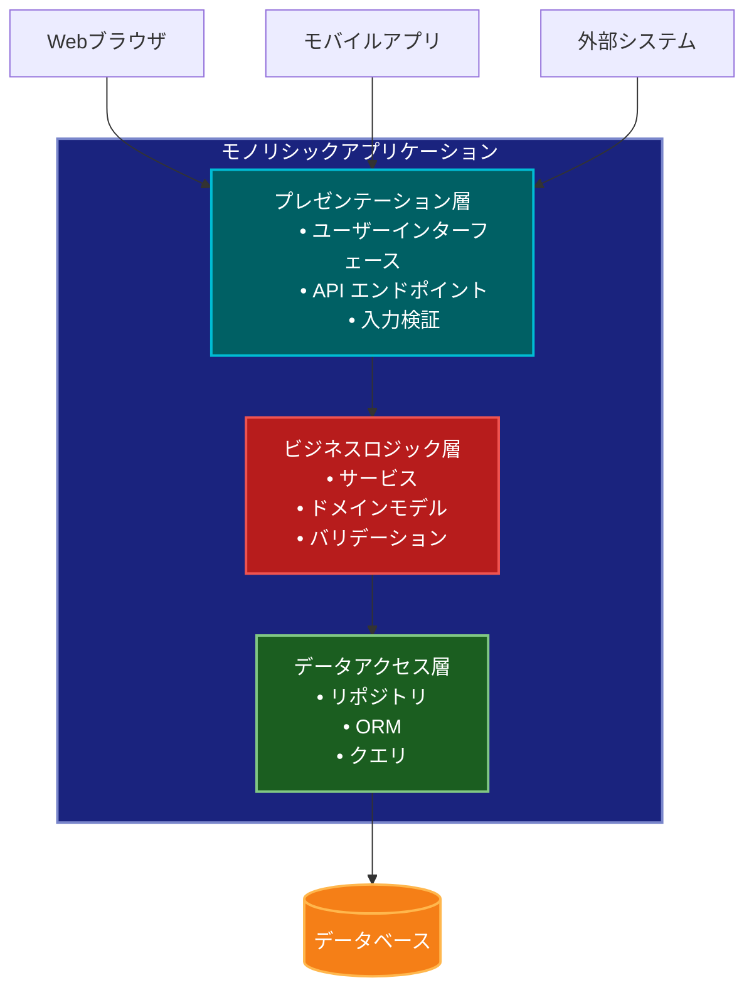

# Monolithic Architecture（モノリシックアーキテクチャ）

## 目的

アプリケーションのすべての機能を単一のデプロイ可能なユニットとして実装することで、開発とデプロイメントの単純さを実現し、システムの初期開発と運用を容易にします。

## 価値・解決する問題

- 開発の単純さと直接性
- デプロイメントの容易さ
- エンドツーエンドテストの簡素化
- 単一のコードベースによる開発効率
- トランザクション管理の容易さ
- システム全体の一貫性確保
- 初期の開発速度の向上

## 概要・特徴

### 概要

モノリシックアーキテクチャは、アプリケーションのすべてのコンポーネントと機能を単一のプログラム単位として実装・デプロイする伝統的なアプローチです。ビジネスロジック、データアクセス層、ユーザーインターフェースなどがすべて一つのコードベースに統合されています。

### 特徴

#### 単一のデプロイ可能なアーティファクト
モノリシックアプリケーションは、すべての機能が単一の実行可能ファイルやアーティファクトにパッケージ化されています。これにより、デプロイメントプロセスが非常にシンプルになり、構成管理も容易になります。例えば、Javaアプリケーションであれば単一のWARファイル、Rubyアプリケーションであれば一つのRailsアプリケーション、.NETアプリケーションであれば単一のDLLとして配布できます。このアプローチは、特に小規模から中規模のプロジェクトや、開発リソースが限られているチームにとって効率的です。単一のビルドパイプラインとデプロイプロセスだけを管理すればよいため、CI/CDの構成も単純化され、運用コストが削減されます。また、リリース管理も容易になり、アプリケーション全体を一度にロールバックすることも簡単です。これにより、特に初期段階のプロジェクトでは、インフラストラクチャや運用の複雑さを最小限に抑えながら、迅速に開発を進めることができます。

#### 共有メモリとリソース
モノリシックアプリケーションでは、異なるコンポーネント間でメモリやリソースを直接共有できるため、内部通信の効率が高くなります。例えば、あるビジネスプロセスが複数のサービスやコンポーネントを横断する場合、プロセス間通信や複雑なネットワーク呼び出しなしに、直接関数呼び出しや共有オブジェクトを通じてデータを受け渡すことができます。この特性は、特に高性能が要求されるアプリケーションや、複雑なトランザクションを処理するシステムにとって有利です。例えば、金融取引システムや在庫管理システムでは、複数のコンポーネント間で一貫性のある状態を保ちながら高速に処理を行う必要がありますが、共有メモリモデルではこれが容易に実現できます。さらに、この共有リソースモデルにより、開発者はシステム全体の状態を把握しやすくなり、デバッグやトラブルシューティングも単純化されます。ただし、この特性はアプリケーションが適切に設計されていない場合、メモリリークやリソースの競合といった問題を引き起こす可能性もあるため、適切なモジュール化と封装が重要になります。

#### 垂直スケーリング
モノリシックアーキテクチャは主に垂直スケーリング（スケールアップ）によって処理能力を向上させます。つまり、より強力なハードウェア（より多くのCPU、メモリ、ディスク容量）を追加することで、アプリケーションの処理能力を高めます。この方法は実装が単純で、アプリケーションのコードを変更することなくパフォーマンスを向上できるという利点があります。例えば、トラフィックが増加した場合、より多くのメモリやCPUコアを持つサーバーにアップグレードするだけで対応できます。これは特に予測可能な負荷パターンを持つビジネスアプリケーションや、高可用性よりも一貫したパフォーマンスが重要なシステムに適しています。また、単一のデータベースインスタンスも同様に垂直スケーリングできるため、データの整合性を維持しやすくなります。ただし、垂直スケーリングには物理的な限界があり、非常に高いトラフィック量を処理する必要がある場合や、急激な負荷の変動がある場合には制約となる可能性があります。それでも、多くの企業アプリケーションやシステムにとって、垂直スケーリングは管理の容易さとコスト効率の点で実用的な選択肢です。

#### シンプルな開発ワークフロー
モノリシックアーキテクチャの大きな利点は、開発ワークフローの単純さです。開発者は単一のコードベースで作業するため、特に新しいチームメンバーの参入障壁が低く、開発環境のセットアップも容易です。例えば、1つのリポジトリをクローンし、1つの開発サーバーを起動するだけで、アプリケーション全体を開発モードで実行できます。これにより、機能横断的な変更も容易に行えます。たとえば、データモデルの変更とそれに関連するUIの更新を同時に行い、単一のコミットとして提出できます。また、IDEのサポートも充実しており、コード間の移動、リファクタリング、デバッグが容易です。統合テストも単純化され、エンドツーエンドのテストが同じプロセス内で実行できるため、テスト環境の複雑さも軽減されます。このシンプルなワークフローは、特に小規模から中規模のチームや、迅速な開発サイクルが求められるプロジェクトにとって生産性向上に直結します。さらに、コードベースが単一であることから、コーディング規約や設計パターンを一貫して適用しやすく、コードの品質管理も容易になります。

#### 直接的な関数呼び出し
モノリシックアーキテクチャでは、異なるコンポーネント間の通信が直接的な関数呼び出しとして実装されるため、ネットワークオーバーヘッドがなく、高速な内部通信が実現します。例えば、ユーザー認証モジュールからユーザープロファイル管理モジュールへのデータ受け渡しは、単純なメソッド呼び出しで行われ、シリアライゼーション/デシリアライゼーションのオーバーヘッドも発生しません。これにより、低レイテンシが要求されるシステムや、コンポーネント間で頻繁にデータのやり取りが発生するアプリケーションで特に効果を発揮します。また、コンパイル時の型チェックや静的解析が可能なため、実行時エラーを早期に発見できる利点もあります。例えば、TypeScriptやJavaのようなコンパイル言語では、モジュール間のインターフェースの変更が他のモジュールに与える影響をビルド時に検出できます。さらに、デバッグも容易で、コールスタック全体が単一のプロセス内に存在するため、問題の原因を特定しやすくなります。この直接的な呼び出しモデルは、特に複雑なビジネスロジックや多段階のデータ処理パイプラインを持つアプリケーションにおいて、処理効率とデバッグ容易性の面で大きなメリットとなります。

#### 共有データベーストランザクション
モノリシックアーキテクチャの重要な特徴として、単一のデータベースを使用し、強力なACIDトランザクションを活用できる点があります。これにより、複数のビジネスエンティティにまたがる操作でも、データの一貫性を容易に維持できます。例えば、Eコマースシステムにおける注文処理では、在庫の確認と更新、支払い処理、注文レコードの作成など、複数のテーブルにまたがる更新を単一のトランザクションで実行できます。これにより、注文プロセスの一部が失敗した場合でも、システム全体が一貫した状態を維持することが保証されます。また、結合クエリを効率的に実行できるため、複雑なレポートや分析も容易です。例えば、ユーザーの購買履歴と製品カテゴリを結合して、パーソナライズされたレコメンデーションを生成するようなケースでも、単一のSQLクエリで効率的に処理できます。この一貫したデータモデルは、特にデータの整合性が重要なドメイン（金融、医療、在庫管理など）のアプリケーションにおいて非常に価値があります。さらに、データベース設計とスキーマ管理も単純化され、データベースの最適化も統合的に行えるため、全体としてのデータ管理が効率化されます。

### 概要図



## コード例

### Before:

```typescript
// 複数のマイクロサービスに分散された実装
// User Service
@Controller('users')
class UserController {
  @Post()
  async createUser(@Body() userData: CreateUserDTO) {
    const user = await this.userService.createUser(userData);
    // メッセージブローカー経由で他のサービスに通知
    await this.messageBroker.publish('user.created', user);
    return user;
  }
}

// Order Service
@Controller('orders')
class OrderController {
  @Post()
  async createOrder(@Body() orderData: CreateOrderDTO) {
    // ユーザーサービスへのHTTPリクエスト
    const user = await this.userClient.getUser(orderData.userId);
    if (!user) {
      throw new NotFoundException('User not found');
    }

    const order = await this.orderService.createOrder(orderData);
    // メッセージブローカー経由で他のサービスに通知
    await this.messageBroker.publish('order.created', order);
    return order;
  }
}

// Inventory Service
@Controller('inventory')
class InventoryController {
  // メッセージブローカーからの注文作成イベント購読
  @MessagePattern('order.created')
  async handleOrderCreated(order: Order) {
    await this.inventoryService.reserveStock(order.items);
  }
}

// Payment Service
@Controller('payments')
class PaymentController {
  // メッセージブローカーからの注文作成イベント購読
  @MessagePattern('order.created')
  async handleOrderCreated(order: Order) {
    await this.paymentService.processPayment(order);
  }
}
```

### After:

```typescript
// 単一のアプリケーションとして実装
@Module({
  imports: [TypeOrmModule.forRoot(), MailerModule.forRoot()],
  controllers: [UserController, OrderController],
  providers: [UserService, OrderService, PaymentService, InventoryService],
})
class AppModule {}

// ユーザー管理
@Injectable()
class UserService {
  constructor(
    @InjectRepository(User)
    private userRepository: Repository<User>,
    private mailerService: MailerService
  ) {}

  async createUser(userData: CreateUserDTO): Promise<User> {
    const user = this.userRepository.create(userData);
    await this.userRepository.save(user);
    await this.mailerService.sendWelcomeEmail(user);
    return user;
  }

  async getUser(id: string): Promise<User> {
    return this.userRepository.findOneOrFail(id);
  }
}

// 注文管理
@Injectable()
class OrderService {
  constructor(
    @InjectRepository(Order)
    private orderRepository: Repository<Order>,
    private userService: UserService,
    private inventoryService: InventoryService,
    private paymentService: PaymentService,
    private mailerService: MailerService
  ) {}

  @Transaction()
  async createOrder(orderData: CreateOrderDTO): Promise<Order> {
    // トランザクション内でのユーザー検証
    const user = await this.userService.getUser(orderData.userId);
    if (!user) {
      throw new NotFoundException('User not found');
    }

    // 在庫確認と予約
    const stockAvailable = await this.inventoryService.checkAndReserveStock(
      orderData.items
    );
    if (!stockAvailable) {
      throw new BadRequestException('Insufficient stock');
    }

    // 注文作成
    const order = this.orderRepository.create({
      ...orderData,
      status: 'PENDING',
    });
    await this.orderRepository.save(order);

    try {
      // 支払い処理
      const paymentResult = await this.paymentService.processPayment({
        orderId: order.id,
        amount: order.total,
        userId: user.id,
      });

      if (paymentResult.success) {
        order.status = 'PAID';
        await this.orderRepository.save(order);
        await this.mailerService.sendOrderConfirmation(order, user);
      } else {
        // 支払い失敗時の在庫解放
        await this.inventoryService.releaseStock(orderData.items);
        order.status = 'PAYMENT_FAILED';
        await this.orderRepository.save(order);
        throw new BadRequestException('Payment failed');
      }
    } catch (error) {
      // エラー時の在庫解放
      await this.inventoryService.releaseStock(orderData.items);
      order.status = 'ERROR';
      await this.orderRepository.save(order);
      throw error;
    }

    return order;
  }
}

// 在庫管理
@Injectable()
class InventoryService {
  constructor(
    @InjectRepository(Product)
    private productRepository: Repository<Product>
  ) {}

  @Transaction()
  async checkAndReserveStock(items: OrderItem[]): Promise<boolean> {
    for (const item of items) {
      const product = await this.productRepository.findOne(item.productId, {
        lock: { mode: 'pessimistic_write' },
      });

      if (!product || product.stock < item.quantity) {
        return false;
      }

      product.stock -= item.quantity;
      await this.productRepository.save(product);
    }

    return true;
  }

  async releaseStock(items: OrderItem[]): Promise<void> {
    for (const item of items) {
      await this.productRepository.increment(
        { id: item.productId },
        'stock',
        item.quantity
      );
    }
  }
}

// 支払い処理
@Injectable()
class PaymentService {
  constructor(private stripe: Stripe) {}

  async processPayment(paymentData: PaymentData): Promise<PaymentResult> {
    try {
      const paymentIntent = await this.stripe.paymentIntents.create({
        amount: paymentData.amount,
        currency: 'usd',
        metadata: {
          orderId: paymentData.orderId,
          userId: paymentData.userId,
        },
      });

      return {
        success: true,
        transactionId: paymentIntent.id,
      };
    } catch (error) {
      return {
        success: false,
        error: error.message,
      };
    }
  }
}

// APIエンドポイント
@Controller()
class AppController {
  constructor(
    private userService: UserService,
    private orderService: OrderService
  ) {}

  @Post('users')
  async createUser(@Body() userData: CreateUserDTO) {
    return this.userService.createUser(userData);
  }

  @Get('users/:id')
  async getUser(@Param('id') id: string) {
    return this.userService.getUser(id);
  }

  @Post('orders')
  async createOrder(@Body() orderData: CreateOrderDTO) {
    return this.orderService.createOrder(orderData);
  }

  @Get('orders/:id')
  async getOrder(@Param('id') id: string) {
    return this.orderService.getOrder(id);
  }
}
```

## 類似パターンとの比較

- [Microservices Architecture（マイクロサービスアーキテクチャ）](microservices.md): モノリシックアーキテクチャは単一のデプロイ単位としての単純さを重視し、マイクロサービスは分散システムの柔軟性を重視します。
- [Service-Oriented Architecture（SOA）](soa.md): モノリシックアーキテクチャは単一のアプリケーションとしての一貫性を重視し、SOAはサービス単位での再利用性を重視します。
- [Layered Architecture（レイヤードアーキテクチャ）](layered-architecture.md): モノリシックアーキテクチャはデプロイメントの単位を定義し、レイヤードアーキテクチャは内部構造の組織化を定義します。

## 利用されているライブラリ／フレームワークの事例

- [Ruby on Rails](https://github.com/rails/rails): 代表的なモノリシックWebアプリケーションフレームワーク
- [Laravel](https://github.com/laravel/laravel): PHPのフルスタックWebアプリケーションフレームワーク
- [Django](https://github.com/django/django): Pythonのモノリシックウェブフレームワーク 