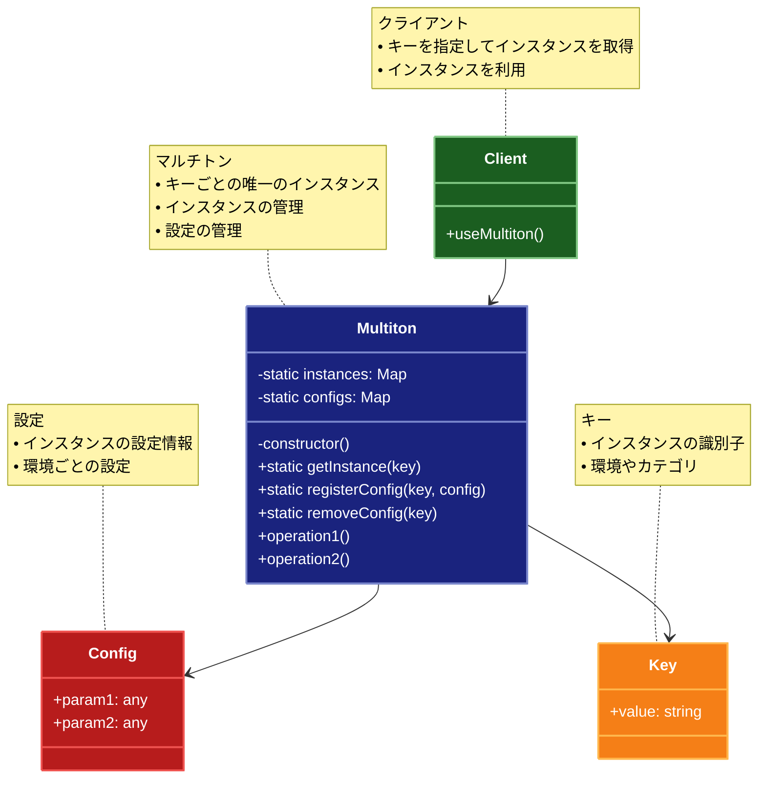

# Multiton（マルチトン）パターン

## 目的

特定のキーに対して唯一のインスタンスを提供し、複数のシングルトンを管理するパターンです。

## 価値・解決する問題

- キーに応じた唯一のインスタンスを提供します
- インスタンスの生成を制御します
- グローバルな状態を管理します
- リソースの共有を実現します
- メモリ使用量を最適化します

## 概要・特徴

### 概要

Multitonパターンは、キーに応じて唯一のインスタンスを提供する設計パターンです。Singletonパターンの拡張として、複数の制御されたインスタンスを管理します。このパターンでは、特定のキー（名前、ID、列挙値など）ごとに最大1つのインスタンスが存在することを保証し、クラス内部でそれらのインスタンスをマップやレジストリを使って管理します。これにより、キーに基づいた複数の制御されたインスタンスを効率的に管理することができます。

### 特徴

#### キーによるインスタンス管理

マルチトンパターンの最も重要な特徴は、キーに基づいてインスタンスを管理することです。各キーに対して最大1つのインスタンスが存在し、同じキーに対する複数の要求は同じインスタンスを返します。例えば、データベース接続マネージャーでは、異なるデータベース（「開発用」「本番用」「テスト用」など）ごとに1つのコネクションプールを保持できます。この管理方法により、システム全体で特定のリソースやサービスへのアクセスが一貫性を持ち、同時に異なるコンテキストやカテゴリ向けの複数のインスタンスを提供できます。

#### インスタンスの制御

マルチトンパターンはインスタンスの作成と管理を中央集権的に制御します。これにより、インスタンスの数を制限したり、特定の条件下でのみインスタンスを作成したりすることができます。例えば、ロギングシステムでは、異なるログレベル（「ERROR」「INFO」「DEBUG」など）ごとに専用のロガーインスタンスを提供しつつ、その総数と初期化を制御できます。この制御により、リソース使用の最適化、ライフサイクル管理の改善、およびインスタンス作成ロジックの一元化が実現します。

#### 遅延初期化

マルチトンパターンでは、通常、インスタンスは実際に必要になるまで作成されません（遅延初期化）。これにより、システム起動時の負荷を軽減し、使用されないインスタンスによるリソース浪費を防ぎます。例えば、多数の設定ファイルを扱うコンフィグレーションマネージャーでは、特定の設定が要求されたときにのみ対応するインスタンスが初期化されます。この遅延初期化により、特に大規模なシステムでのメモリ使用量が最適化され、起動時間が短縮されます。

#### グローバルアクセス

マルチトンは通常、静的メソッドを通じてグローバルにアクセス可能です。これにより、アプリケーションのどの部分からでも、キーを指定するだけで必要なインスタンスにアクセスできます。例えば、多言語対応アプリケーションでは、言語コード（「en」「ja」「fr」など）をキーとして、対応する翻訳サービスインスタンスに簡単にアクセスできます。このグローバルアクセスにより、依存性注入の複雑さを減らしつつ、必要なサービスへの簡潔なアクセス方法が提供されます。

#### リソースの共有

マルチトンパターンを使用すると、リソースを効率的に共有できます。同じキーに対するすべての要求は同じインスタンスを参照するため、そのインスタンスに関連するリソースも共有されます。例えば、テーマ管理システムでは、各テーマ（「ダーク」「ライト」「ハイコントラスト」など）ごとに一つのインスタンスを持ち、それぞれが関連するスタイル情報や画像リソースをキャッシュできます。この共有メカニズムにより、メモリ使用量が削減され、特に重いリソースを扱う場合にパフォーマンスが向上します。

### 概要図



## 類似パターンとの比較

- [Singleton (シングルトン)](singleton.md): Multiton は複数のキー付きインスタンスを管理し、これに対して Singleton は単一のインスタンスを管理します。
- [Flyweight (フライウェイト)](flyweight.md): Multiton はキー付きインスタンスを管理し、これに対して Flyweight は共有可能なオブジェクトを管理します。
- [Factory Method (ファクトリーメソッド)](factory-method.md): Multiton はキー付きインスタンスを管理し、これに対して Factory Method はオブジェクトの生成を抽象化します。

## 利用されているライブラリ／フレームワークの事例

- [MySQL Connections](https://github.com/mysqljs/mysql): データベース接続管理
- [Logger Instances](https://github.com/winstonjs/winston): ロガーインスタンス管理
- [Cache Managers](https://github.com/node-cache/node-cache): キャッシュ管理

## 解説ページリンク

- [Refactoring Guru - Multiton](https://refactoring.guru/design-patterns/multiton)
- [Microsoft - Multiton Pattern](https://docs.microsoft.com/en-us/previous-versions/msp-n-p/ee658117(v=pandp.10))
- [SourceMaking - Multiton](https://sourcemaking.com/design_patterns/multiton)

## コード例

### Before:

インスタンスを直接管理する実装

```typescript
// データベース接続クラス
class DatabaseConnection {
  constructor(
    private host: string,
    private port: number,
    private username: string,
    private password: string,
    private database: string
  ) {}

  connect(): void {
    console.log(`データベースに接続: ${this.host}:${this.port}/${this.database}`);
  }

  query(sql: string): void {
    console.log(`クエリを実行: ${sql}`);
  }

  disconnect(): void {
    console.log(`データベース接続を切断: ${this.host}:${this.port}/${this.database}`);
  }
}

// 使用例
function example() {
  // 開発環境用の接続
  const devDb = new DatabaseConnection(
    "localhost",
    3306,
    "dev_user",
    "dev_password",
    "dev_db"
  );

  // テスト環境用の接続
  const testDb = new DatabaseConnection(
    "test-server",
    3306,
    "test_user",
    "test_password",
    "test_db"
  );

  // 本番環境用の接続
  const prodDb = new DatabaseConnection(
    "prod-server",
    3306,
    "prod_user",
    "prod_password",
    "prod_db"
  );

  // 接続のテスト
  console.log("=== 開発環境 ===");
  devDb.connect();
  devDb.query("SELECT * FROM users");
  devDb.disconnect();

  console.log("\n=== テスト環境 ===");
  testDb.connect();
  testDb.query("SELECT * FROM users");
  testDb.disconnect();

  console.log("\n=== 本番環境 ===");
  prodDb.connect();
  prodDb.query("SELECT * FROM users");
  prodDb.disconnect();
}

example();
```

### After:

Multitonパターンを適用した実装

```typescript
// 環境の種類を定義
type Environment = "development" | "test" | "production";

// データベース設定の型定義
interface DatabaseConfig {
  host: string;
  port: number;
  username: string;
  password: string;
  database: string;
  maxConnections: number;
}

// データベース接続クラス
class DatabaseConnection {
  private static instances: Map<Environment, DatabaseConnection> = new Map();
  private static configs: Map<Environment, DatabaseConfig> = new Map();
  
  private connectionPool: Set<string> = new Set();
  private activeConnections: number = 0;
  private isInitialized: boolean = false;

  private constructor(private readonly config: DatabaseConfig) {}

  // インスタンス取得メソッド
  static getInstance(env: Environment): DatabaseConnection {
    if (!DatabaseConnection.configs.has(env)) {
      throw new Error(`環境 '${env}' の設定が見つかりません`);
    }

    if (!DatabaseConnection.instances.has(env)) {
      const config = DatabaseConnection.configs.get(env)!;
      DatabaseConnection.instances.set(env, new DatabaseConnection(config));
    }

    return DatabaseConnection.instances.get(env)!;
  }

  // 設定の登録
  static registerConfig(env: Environment, config: DatabaseConfig): void {
    DatabaseConnection.configs.set(env, config);
  }

  // 設定の削除
  static removeConfig(env: Environment): void {
    const instance = DatabaseConnection.instances.get(env);
    if (instance) {
      instance.disconnect();
      DatabaseConnection.instances.delete(env);
    }
    DatabaseConnection.configs.delete(env);
  }

  // 全ての設定とインスタンスの削除
  static reset(): void {
    DatabaseConnection.instances.forEach(instance => instance.disconnect());
    DatabaseConnection.instances.clear();
    DatabaseConnection.configs.clear();
  }

  // 接続の初期化
  initialize(): void {
    if (this.isInitialized) {
      console.log("データベース接続は既に初期化されています");
      return;
    }

    console.log(`データベース接続を初期化: ${this.config.host}:${this.config.port}/${this.config.database}`);
    console.log(`最大接続数: ${this.config.maxConnections}`);
    this.isInitialized = true;
  }

  // 新しい接続の取得
  connect(): string {
    if (!this.isInitialized) {
      this.initialize();
    }

    if (this.activeConnections >= this.config.maxConnections) {
      throw new Error("最大接続数に達しました");
    }

    const connectionId = this.generateConnectionId();
    this.connectionPool.add(connectionId);
    this.activeConnections++;

    console.log(`新しい接続を作成: ${connectionId}`);
    console.log(`アクティブな接続数: ${this.activeConnections}`);

    return connectionId;
  }

  // クエリの実行
  query(connectionId: string, sql: string): void {
    if (!this.connectionPool.has(connectionId)) {
      throw new Error(`接続 ${connectionId} が見つかりません`);
    }

    console.log(`クエリを実行 (接続 ${connectionId}): ${sql}`);
  }

  // 接続の解放
  releaseConnection(connectionId: string): void {
    if (!this.connectionPool.has(connectionId)) {
      throw new Error(`接続 ${connectionId} が見つかりません`);
    }

    this.connectionPool.delete(connectionId);
    this.activeConnections--;

    console.log(`接続を解放: ${connectionId}`);
    console.log(`アクティブな接続数: ${this.activeConnections}`);
  }

  // 全ての接続を切断
  disconnect(): void {
    this.connectionPool.clear();
    this.activeConnections = 0;
    this.isInitialized = false;
    console.log("全ての接続を切断しました");
  }

  // 接続の状態を取得
  getStatus(): string {
    return `
データベース: ${this.config.host}:${this.config.port}/${this.config.database}
初期化済み: ${this.isInitialized}
アクティブな接続数: ${this.activeConnections}
最大接続数: ${this.config.maxConnections}
接続プール: ${Array.from(this.connectionPool).join(", ") || "なし"}
`;
  }

  // ユニークな接続IDの生成
  private generateConnectionId(): string {
    return `conn_${Date.now()}_${Math.random().toString(36).substr(2, 9)}`;
  }
}

// 使用例
function example() {
  // データベース設定の登録
  console.log("=== データベース設定の登録 ===");
  
  DatabaseConnection.registerConfig("development", {
    host: "localhost",
    port: 3306,
    username: "dev_user",
    password: "dev_password",
    database: "dev_db",
    maxConnections: 5
  });

  DatabaseConnection.registerConfig("test", {
    host: "test-server",
    port: 3306,
    username: "test_user",
    password: "test_password",
    database: "test_db",
    maxConnections: 3
  });

  DatabaseConnection.registerConfig("production", {
    host: "prod-server",
    port: 3306,
    username: "prod_user",
    password: "prod_password",
    database: "prod_db",
    maxConnections: 10
  });

  // 開発環境での操作
  console.log("\n=== 開発環境での操作 ===");
  const devDb = DatabaseConnection.getInstance("development");
  
  // 複数の接続を作成
  const devConn1 = devDb.connect();
  const devConn2 = devDb.connect();
  
  // クエリの実行
  devDb.query(devConn1, "SELECT * FROM users");
  devDb.query(devConn2, "SELECT * FROM products");
  
  // 接続の解放
  devDb.releaseConnection(devConn1);
  
  // 状態の確認
  console.log(devDb.getStatus());

  // テスト環境での操作
  console.log("\n=== テスト環境での操作 ===");
  const testDb = DatabaseConnection.getInstance("test");
  
  // 同じ環境の場合は同じインスタンスを返す
  const testDb2 = DatabaseConnection.getInstance("test");
  console.log("同じインスタンス:", testDb === testDb2);
  
  // 接続とクエリの実行
  const testConn = testDb.connect();
  testDb.query(testConn, "SELECT * FROM test_data");
  testDb.releaseConnection(testConn);

  // 本番環境での操作
  console.log("\n=== 本番環境での操作 ===");
  const prodDb = DatabaseConnection.getInstance("production");
  
  // 複数の接続を作成
  const prodConns = [];
  for (let i = 0; i < 3; i++) {
    prodConns.push(prodDb.connect());
  }
  
  // クエリの実行
  prodConns.forEach(conn => {
    prodDb.query(conn, "SELECT * FROM production_data");
  });
  
  // 接続の解放
  prodConns.forEach(conn => {
    prodDb.releaseConnection(conn);
  });

  // エラーケースのテスト
  console.log("\n=== エラーケースのテスト ===");
  
  try {
    // 存在しない環境へのアクセス
    DatabaseConnection.getInstance("staging" as Environment);
  } catch (error) {
    console.error("エラー:", error.message);
  }

  try {
    // 最大接続数を超える接続
    const testDb = DatabaseConnection.getInstance("test");
    for (let i = 0; i < 5; i++) {
      testDb.connect();
    }
  } catch (error) {
    console.error("エラー:", error.message);
  }

  // クリーンアップ
  console.log("\n=== クリーンアップ ===");
  DatabaseConnection.reset();
  console.log("全ての接続と設定をリセットしました");
}

example(); 

// 関数型プログラミングスタイルによるMultitonパターンの実装

// 環境の型定義
type Environment = 'development' | 'test' | 'production';

// データベース設定の型
interface DbConfig {
  readonly host: string;
  readonly port: number;
  readonly username: string;
  readonly password: string;
  readonly database: string;
  readonly maxConnections: number;
}

// データベース接続の状態
interface ConnectionState {
  readonly config: DbConfig;
  readonly isInitialized: boolean;
  readonly activeConnections: number;
  readonly connectionPool: ReadonlySet<string>;
}

// マルチトンの状態
interface MultitonState {
  readonly instances: ReadonlyMap<Environment, ConnectionState>;
  readonly configs: ReadonlyMap<Environment, DbConfig>;
}

// 初期状態を作成
const createInitialState = (): MultitonState => ({
  instances: new Map<Environment, ConnectionState>(),
  configs: new Map<Environment, DbConfig>()
});

// 設定を登録する純粋関数
const registerConfig = (state: MultitonState, env: Environment, config: DbConfig): MultitonState => {
  const newConfigs = new Map(state.configs);
  newConfigs.set(env, config);
  
  return {
    ...state,
    configs: newConfigs
  };
};

// 設定を取得する純粋関数
const getConfig = (state: MultitonState, env: Environment): DbConfig => {
  const config = state.configs.get(env);
  if (!config) {
    throw new Error(`環境 ${env} の設定が見つかりません`);
  }
  return config;
};

// インスタンスを取得する純粋関数
const getInstance = (state: MultitonState, env: Environment): [MultitonState, ConnectionState] => {
  // すでにインスタンスが存在する場合はそれを返す
  const existingInstance = state.instances.get(env);
  if (existingInstance) {
    return [state, existingInstance];
  }
  
  // 設定を取得
  const config = getConfig(state, env);
  
  // 新しいインスタンスを作成
  const newInstance: ConnectionState = {
    config,
    isInitialized: false,
    activeConnections: 0,
    connectionPool: new Set<string>()
  };
  
  // インスタンスを保存
  const newInstances = new Map(state.instances);
  newInstances.set(env, newInstance);
  
  // 初期化を行ったステートを返す
  return [
    {
      ...state,
      instances: newInstances
    },
    newInstance
  ];
};

// データベース接続を初期化する純粋関数
const initialize = (instance: ConnectionState): ConnectionState => {
  if (instance.isInitialized) {
    return instance;
  }
  
  const { config } = instance;
  console.log(`データベース接続を初期化: ${config.host}:${config.port}/${config.database}`);
  console.log(`最大接続数: ${config.maxConnections}`);
  
  return {
    ...instance,
    isInitialized: true
  };
};

// 新しい接続IDを生成
const generateConnectionId = (): string => {
  return `conn_${Date.now()}_${Math.random().toString(36).substr(2, 9)}`;
};

// 新しい接続を作成する純粋関数
const connect = (instance: ConnectionState): [ConnectionState, string] => {
  let updatedInstance = instance;
  
  // 初期化されていない場合は初期化
  if (!instance.isInitialized) {
    updatedInstance = initialize(instance);
  }
  
  // 最大接続数のチェック
  if (updatedInstance.activeConnections >= updatedInstance.config.maxConnections) {
    throw new Error("最大接続数に達しました");
  }
  
  // 新しい接続IDを生成
  const connectionId = generateConnectionId();
  
  // 接続プールと接続数を更新
  const newConnectionPool = new Set(updatedInstance.connectionPool);
  newConnectionPool.add(connectionId);
  
  const newState: ConnectionState = {
    ...updatedInstance,
    connectionPool: newConnectionPool,
    activeConnections: updatedInstance.activeConnections + 1
  };
  
  console.log(`新しい接続を作成: ${connectionId}`);
  console.log(`アクティブな接続数: ${newState.activeConnections}`);
  
  return [newState, connectionId];
};

// クエリを実行する純粋関数（副作用のみ）
const query = (instance: ConnectionState, connectionId: string, sql: string): void => {
  if (!instance.connectionPool.has(connectionId)) {
    throw new Error(`接続 ${connectionId} が見つかりません`);
  }
  
  console.log(`クエリを実行 (接続 ${connectionId}): ${sql}`);
};

// 接続を解放する純粋関数
const releaseConnection = (instance: ConnectionState, connectionId: string): ConnectionState => {
  if (!instance.connectionPool.has(connectionId)) {
    throw new Error(`接続 ${connectionId} が見つかりません`);
  }
  
  // 接続プールから削除
  const newConnectionPool = new Set(instance.connectionPool);
  newConnectionPool.delete(connectionId);
  
  const newState: ConnectionState = {
    ...instance,
    connectionPool: newConnectionPool,
    activeConnections: instance.activeConnections - 1
  };
  
  console.log(`接続を解放: ${connectionId}`);
  console.log(`アクティブな接続数: ${newState.activeConnections}`);
  
  return newState;
};

// 全ての接続を切断する純粋関数
const disconnect = (instance: ConnectionState): ConnectionState => {
  const newState: ConnectionState = {
    ...instance,
    connectionPool: new Set(),
    activeConnections: 0,
    isInitialized: false
  };
  
  console.log("全ての接続を切断しました");
  
  return newState;
};

// 接続の状態を取得する純粋関数
const getStatus = (instance: ConnectionState): string => {
  return `
データベース: ${instance.config.host}:${instance.config.port}/${instance.config.database}
初期化済み: ${instance.isInitialized}
アクティブな接続数: ${instance.activeConnections}
最大接続数: ${instance.config.maxConnections}
接続プール: ${Array.from(instance.connectionPool).join(", ") || "なし"}
`;
};

// すべての設定とインスタンスをリセットする純粋関数
const reset = (): MultitonState => {
  console.log("全ての接続と設定をリセットしました");
  return createInitialState();
};

// インスタンスを指定された環境で更新する純粋関数
const updateInstance = (state: MultitonState, env: Environment, instance: ConnectionState): MultitonState => {
  const newInstances = new Map(state.instances);
  newInstances.set(env, instance);
  
  return {
    ...state,
    instances: newInstances
  };
};

// データベースマネージャーの作成（クロージャを使用）
const createDatabaseManager = () => {
  // マルチトンの状態を管理（内部状態）
  let state: MultitonState = createInitialState();
  
  // 設定を登録
  const registerConfig = (env: Environment, config: DbConfig): void => {
    state = registerConfig(state, env, config);
  };
  
  // インスタンスの取得
  const getInstance = (env: Environment): ConnectionState => {
    const [newState, instance] = getInstance(state, env);
    state = newState;
    return instance;
  };
  
  // 新しい接続の取得
  const connect = (env: Environment): string => {
    let instance = getInstance(env);
    const [updatedInstance, connectionId] = connect(instance);
    
    // 状態を更新
    state = updateInstance(state, env, updatedInstance);
    
    return connectionId;
  };
  
  // クエリの実行
  const executeQuery = (env: Environment, connectionId: string, sql: string): void => {
    const instance = getInstance(env);
    query(instance, connectionId, sql);
  };
  
  // 接続の解放
  const releaseConnection = (env: Environment, connectionId: string): void => {
    let instance = getInstance(env);
    const updatedInstance = releaseConnection(instance, connectionId);
    
    // 状態を更新
    state = updateInstance(state, env, updatedInstance);
  };
  
  // 全ての接続の切断
  const disconnect = (env: Environment): void => {
    let instance = getInstance(env);
    const updatedInstance = disconnect(instance);
    
    // 状態を更新
    state = updateInstance(state, env, updatedInstance);
  };
  
  // 接続状態の取得
  const getStatus = (env: Environment): string => {
    const instance = getInstance(env);
    return getStatus(instance);
  };
  
  // 全てのデータをリセット
  const resetAll = (): void => {
    state = reset();
  };
  
  // 公開API
  return {
    registerConfig,
    getInstance,
    connect,
    executeQuery,
    releaseConnection,
    disconnect,
    getStatus,
    resetAll
  };
};

// 関数型アプローチの使用例
function functionalExample() {
  console.log("\n=== 関数型プログラミングスタイルによるMultitonパターンの実装 ===");
  
  // データベースマネージャーの作成
  const dbManager = createDatabaseManager();
  
  // データベース設定の登録
  console.log("=== データベース設定の登録 ===");
  
  dbManager.registerConfig("development", {
    host: "localhost",
    port: 3306,
    username: "dev_user",
    password: "dev_password",
    database: "dev_db",
    maxConnections: 5
  });

  dbManager.registerConfig("test", {
    host: "test-server",
    port: 3306,
    username: "test_user",
    password: "test_password",
    database: "test_db",
    maxConnections: 3
  });

  dbManager.registerConfig("production", {
    host: "prod-server",
    port: 3306,
    username: "prod_user",
    password: "prod_password",
    database: "prod_db",
    maxConnections: 10
  });
  
  // 開発環境での操作
  console.log("\n=== 開発環境での操作 ===");
  
  // 複数の接続を作成
  const devConn1 = dbManager.connect("development");
  const devConn2 = dbManager.connect("development");
  
  // クエリの実行
  dbManager.executeQuery("development", devConn1, "SELECT * FROM users");
  dbManager.executeQuery("development", devConn2, "SELECT * FROM products");
  
  // 接続の解放
  dbManager.releaseConnection("development", devConn1);
  
  // 状態の確認
  console.log(dbManager.getStatus("development"));
  
  // テスト環境での操作
  console.log("\n=== テスト環境での操作 ===");
  
  // 同じ環境のインスタンスが何度アクセスしても同じであることを確認
  const testInstance1 = dbManager.getInstance("test");
  const testInstance2 = dbManager.getInstance("test");
  console.log("同じインスタンス参照:", testInstance1 === testInstance2);
  
  // 接続とクエリの実行
  const testConn = dbManager.connect("test");
  dbManager.executeQuery("test", testConn, "SELECT * FROM test_data");
  dbManager.releaseConnection("test", testConn);
  
  // 本番環境での操作
  console.log("\n=== 本番環境での操作 ===");
  
  // 複数の接続を作成
  const prodConns = [];
  for (let i = 0; i < 3; i++) {
    prodConns.push(dbManager.connect("production"));
  }
  
  // クエリの実行
  prodConns.forEach(conn => {
    dbManager.executeQuery("production", conn, "SELECT * FROM production_data");
  });
  
  // 接続の解放
  prodConns.forEach(conn => {
    dbManager.releaseConnection("production", conn);
  });
  
  // エラーケースのテスト
  console.log("\n=== エラーケースのテスト ===");
  
  try {
    // 存在しない環境へのアクセス
    dbManager.getInstance("staging" as Environment);
  } catch (error) {
    console.error("エラー:", error.message);
  }
  
  try {
    // 最大接続数を超える接続
    for (let i = 0; i < 5; i++) {
      dbManager.connect("test");
    }
  } catch (error) {
    console.error("エラー:", error.message);
  }
  
  // 関数型アプローチの特徴
  console.log("\n=== 関数型アプローチの特徴 ===");
  console.log("1. イミュータブルなデータ構造（内部の状態操作は新しいオブジェクトを生成）");
  console.log("2. 純粋関数による状態変換（副作用を限定的に分離）");
  console.log("3. クロージャによる状態の隠蔽");
  console.log("4. 関数合成による操作の明確化");
  
  // クリーンアップ
  console.log("\n=== クリーンアップ ===");
  dbManager.resetAll();
  console.log("全ての接続と設定をリセットしました");
}

functionalExample(); 
