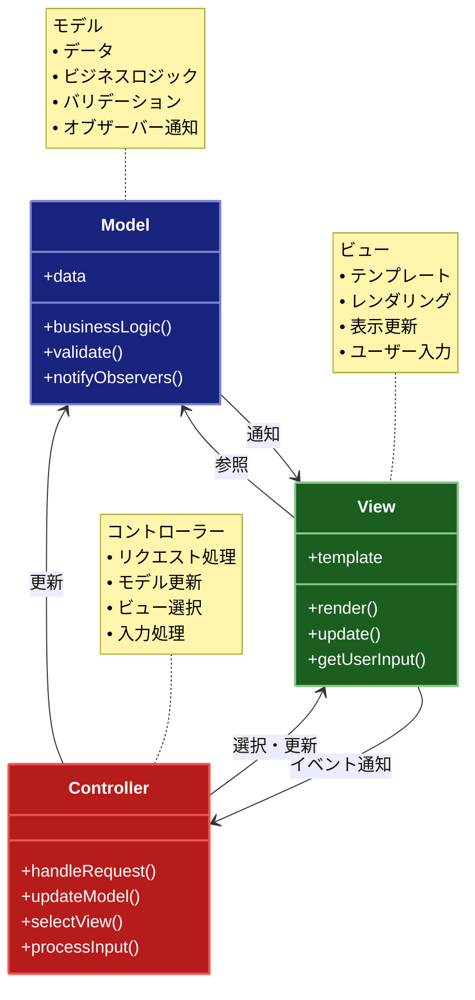

# MVC (Model-View-Controller) パターン

## 目的

アプリケーションを3つの主要なコンポーネント（Model、View、Controller）に分離し、それぞれの責務を明確に分けることで、保守性と再利用性を向上させます。

## 価値・解決する問題

- ビジネスロジック、表示、制御の分離による保守性の向上
- 各コンポーネントの独立したテストが可能
- チーム間での並行開発の促進
- 同じModelに対して異なるViewの実装が可能
- インターフェースの明確化による統合の容易さ

## 概要・特徴

### 概要

MVCパターンは、アプリケーションを Model（データとビジネスロジック）、View（表示とユーザーインターフェース）、Controller（制御とイベント処理）の3つの主要なコンポーネントに分離する設計パターンです。

### 特徴

#### 関心事の分離
MVCパターンの最も重要な特徴は、アプリケーションの異なる責務を明確に分離することです。Modelはデータ構造とビジネスロジックを担当し、Viewはユーザーインターフェースと表示を管理し、Controllerはユーザー入力の処理と全体のフローを制御します。この明確な責任分担により、各コンポーネントは自身の役割に集中でき、コードの複雑性が軽減されます。例えば、データベースの変更がModelに限定され、UIの変更はViewに限定されるため、変更の影響範囲が限定され、予測可能になります。この分離はシステムの理解しやすさも向上させ、新しい開発者がプロジェクトに参加する際の学習曲線も緩やかになります。

#### 再利用性の向上
MVCパターンを採用することで、アプリケーションの各コンポーネントを独立して再利用することが容易になります。特にModelは、ビジネスロジックとデータ操作を独立したモジュールとして実装するため、異なるインターフェース（Web、モバイル、デスクトップなど）で同じModelを共有できます。同様に、Viewコンポーネントも異なるデータセットや状況で再利用できます。例えば、同じチャートコンポーネント（View）を異なるデータソース（Model）と組み合わせて使用することができます。このコンポーネントの再利用性により、開発効率が向上し、一貫したユーザー体験を提供することが容易になります。

#### 保守性の向上
コードの分離と責任の明確化により、MVCパターンは長期的な保守性を大幅に向上させます。各コンポーネントは独立して変更できるため、他のコンポーネントに影響を与えるリスクが低減します。例えば、データベーススキーマの変更はModelに限定され、UIデザインの変更はViewに限定されます。この構造化されたアプローチにより、バグの特定と修正が容易になり、新機能の追加も既存のコードを大きく変更することなく行えます。また、各コンポーネントのコードが比較的小さく焦点が絞られているため、コードの可読性と理解しやすさも向上し、長期的なメンテナンスコストが削減されます。

#### テスト容易性
MVCパターンの分離構造は、自動テストの容易さに直接つながります。各コンポーネントは独立してテストでき、モックオブジェクトやスタブを使用して依存関係を分離できます。例えば、Modelのビジネスロジックは、ViewやControllerとの相互作用を気にせずにユニットテストできます。同様に、Viewのレンダリングロジックも、モックデータを使用してテストできます。また、統合テストも各コンポーネント間のインターフェースが明確に定義されているため実施しやすくなります。このテスト容易性により、バグの早期発見と修正が可能になり、ソフトウェアの品質と信頼性が向上します。

#### 並行開発の促進
MVCパターンは、異なるチームやチームメンバーが並行して作業することを可能にします。フロントエンド開発者はViewに集中し、バックエンド開発者はModelを、そしてアプリケーションのフローを担当する開発者はControllerを担当できます。各コンポーネント間のインターフェースが明確に定義されていれば、これらのチームは独立して作業を進めることができ、開発のボトルネックが減少します。例えば、UIデザイナーはModelの実装が完了するのを待たずに、モックデータを使用してViewの開発とテストを行うことができます。この並行性により、プロジェクトの進行が加速し、タイムラインが短縮されるだけでなく、各専門家が自分の専門分野に集中できるようになります。

### 概要図



## 解説ページリンク

- [Microsoft - MVC Pattern](https://learn.microsoft.com/ja-jp/aspnet/core/mvc/overview)  
  - ASP.NET Core MVCを例に、MVCパターンの基本概念と実装方法を詳しく解説しています。

- [Ruby on Rails Guides - MVC](https://guides.rubyonrails.org/getting_started.html#mvc-and-you)  
  - Ruby on Railsフレームワークにおける実践的なMVCパターンの実装方法と設計思想を提供しています。

- [Spring Framework - Web MVC framework](https://docs.spring.io/spring-framework/reference/web/webmvc.html)  
  - Spring MVCフレームワークを通じた、エンタープライズアプリケーションでのMVCパターンの活用方法を解説しています。

- [Django - MTV Architecture](https://docs.djangoproject.com/en/stable/faq/general/#django-appears-to-be-a-mvc-framework-but-you-call-the-controller-the-view-and-the-view-the-template-how-come-you-don-t-use-the-standard-names)  
  - DjangoのModel-Template-View（MTV）アーキテクチャを通じた、MVCパターンの実装アプローチを説明しています。

## 類似パターンとの比較

- [MVP（Model-View-Presenter）](mvp.md): MVCはControllerを通じてModelとViewを疎結合に保ちますが、MVPはPresenterを通じてViewとModelを完全に分離します。
- [MVVM（Model-View-ViewModel）](mvvm.md): MVCはControllerでユーザー入力を処理しますが、MVVMはViewModelでデータバインディングを活用し、ViewとModelの同期を自動化します。

## 利用されているライブラリ／フレームワークの事例

- [Ruby on Rails](https://github.com/rails/rails/tree/main/actionpack/lib/action_controller): ActionControllerとActiveRecordでMVCパターンを実装
- [Spring MVC](https://github.com/spring-projects/spring-framework/tree/main/spring-webmvc/src/main/java/org/springframework/web/servlet): DispatcherServletとControllerインターフェースでMVCを実現
- [Django](https://github.com/django/django/tree/main/django/views): ViewsとModelsでPython向けのMVC実装を提供

## コード例

### Before:

```typescript
// すべてのロジックが1つのクラスに混在している状態
class UserManagement {
  private users: User[] = [];

  constructor() {
    this.renderUserList();
  }

  addUser(name: string, email: string) {
    const user = {name, email};
    this.users.push(user);
    this.renderUserList();
  }

  renderUserList() {
    const container = document.getElementById("userList");
    container.innerHTML = "";

    this.users.forEach((user) => {
      const element = document.createElement("div");
      element.textContent = `${user.name} (${user.email})`;
      container.appendChild(element);
    });
  }

  handleAddUserClick() {
    const nameInput = document.getElementById("nameInput") as HTMLInputElement;
    const emailInput = document.getElementById(
      "emailInput"
    ) as HTMLInputElement;

    this.addUser(nameInput.value, emailInput.value);

    nameInput.value = "";
    emailInput.value = "";
  }
}
```

### After:

```typescript
// Model: ビジネスロジックとデータ管理
class UserModel {
  private users: User[] = [];
  private listeners: ((users: User[]) => void)[] = [];

  addUser(name: string, email: string) {
    const user = {name, email};
    this.users.push(user);
    this.notifyListeners();
  }

  getUsers(): User[] {
    return [...this.users];
  }

  addListener(listener: (users: User[]) => void) {
    this.listeners.push(listener);
  }

  private notifyListeners() {
    this.listeners.forEach((listener) => listener(this.getUsers()));
  }
}

// View: ユーザーインターフェース
class UserView {
  constructor(private container: HTMLElement) {}

  render(users: User[]) {
    this.container.innerHTML = "";

    users.forEach((user) => {
      const element = document.createElement("div");
      element.textContent = `${user.name} (${user.email})`;
      this.container.appendChild(element);
    });
  }

  bindAddUser(handler: (name: string, email: string) => void) {
    const form = document.getElementById("userForm");
    form.addEventListener("submit", (e) => {
      e.preventDefault();
      const nameInput = document.getElementById(
        "nameInput"
      ) as HTMLInputElement;
      const emailInput = document.getElementById(
        "emailInput"
      ) as HTMLInputElement;

      handler(nameInput.value, emailInput.value);

      nameInput.value = "";
      emailInput.value = "";
    });
  }
}

// Controller: ModelとViewの連携
class UserController {
  constructor(private model: UserModel, private view: UserView) {
    this.model.addListener((users) => this.view.render(users));
    this.view.bindAddUser((name, email) => this.model.addUser(name, email));
  }
}

// 使用例
const userList = document.getElementById("userList");
const model = new UserModel();
const view = new UserView(userList);
const controller = new UserController(model, view);
```
