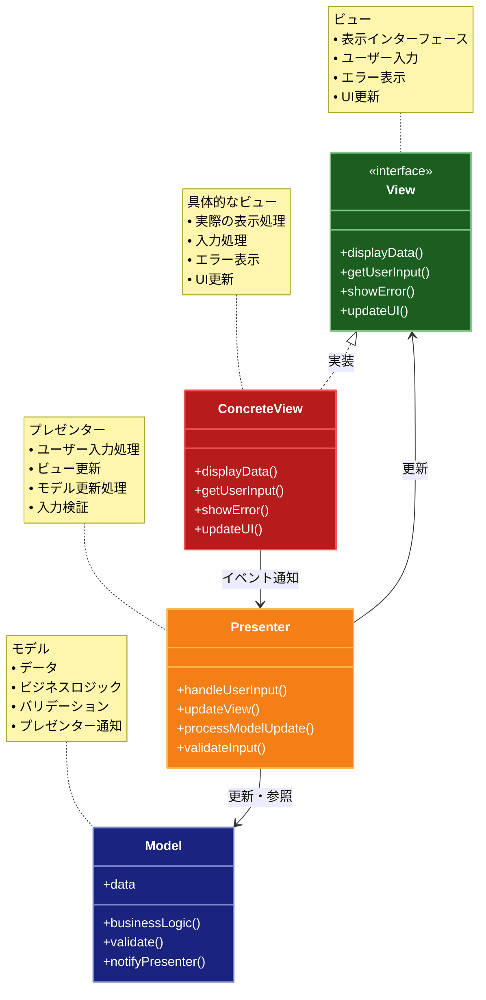

# MVP (Model-View-Presenter) パターン

## 目的

View と Model を完全に分離し、Presenter が View と Model の間の仲介役となることで、UI ロジックのテスト容易性と保守性を向上させます。

## 価値・解決する問題

- View と Model の完全な分離による依存関係の最小化
- UI ロジックのテスト容易性の向上
- View の受動性を高めることによる保守性の向上
- Presenter の再利用性の向上
- ビジネスロジックとプレゼンテーションロジックの明確な分離

## 概要・特徴

### 概要

MVPパターンは、UIロジックをViewから分離し、PresenterがViewとModelの間の仲介役となることで、UIロジックのテスト容易性と保守性を向上させる設計パターンです。

### 特徴

#### Viewの受動性
MVPパターンにおける重要な特徴の一つは、Viewの受動性です。これは「Passive View」とも呼ばれ、ViewはPresenterからの指示に従ってUIを更新するだけの受動的な役割を担います。Viewは自分でModelからデータを取得したり、ビジネスロジックを実行したりすることはなく、単にユーザー入力を受け取ってPresenterに転送し、Presenterからの指示に基づいてUIを更新するだけです。これにより、Viewの実装は非常にシンプルになり、ロジックを含まないため、UIフレームワークやプラットフォームに強く依存する部分を最小限に抑えることができます。また、ViewはPresenterに対してインターフェースを通じて実装されることが多く、これによりViewの実装を交換することが容易になります。この受動的なアプローチにより、UIの変更がビジネスロジックに影響を与えることがなくなり、アプリケーションの保守性が向上します。特に複雑なUI操作が必要なアプリケーションでは、このViewの受動性によりコードの見通しが良くなり、変更の影響範囲を限定できます。

#### Presenterによる完全な制御
MVPパターンでは、PresenterがViewとModelの間の全ての通信を制御します。ユーザーがViewで操作を行うと、ViewはそのイベントをPresenterに通知し、Presenterが適切なModelのメソッドを呼び出します。同様に、Modelのデータが変更されると、Presenterがそれを受け取り、必要に応じてViewの更新を指示します。この中央集権的な制御により、アプリケーションのフローがPresenterに集約され、複雑なUIロジックや状態管理も一箇所で行うことができます。Presenterはアプリケーションの「指揮者」として機能し、ViewとModelの協調を管理します。例えば、フォームの入力値のバリデーション、非同期処理の状態管理、複数のModelからのデータの集約なども、全てPresenterが担当します。この集中制御により、アプリケーションのフローが明確になり、デバッグやトラブルシューティングが容易になります。また、UI操作の順序や条件分岐などの複雑なロジックもPresenterに集約されるため、それらの管理が効率的になります。

#### テスト容易性
MVPパターンの大きな利点の一つは、UIロジックのテスト容易性を大幅に向上させることです。Presenterはフレームワークやプラットフォームに依存せず、純粋なビジネスロジックとプレゼンテーションロジックのみを含むため、標準的な単体テストフレームワークを用いて効率的にテストできます。ViewはインターフェースとしてPresenterに注入されるため、テスト時にはViewのモックを使用してPresenterのテストを行うことができます。これにより、UIフレームワークやプラットフォーム固有の環境を用意することなく、Presenterの全てのロジックを検証することが可能になります。例えば、ユーザー入力の処理、エラー処理、非同期処理のフロー制御など、通常はテストが難しいUI関連のロジックも、Presenterのテストとして容易に検証できます。この高いテスト容易性により、TDD（テスト駆動開発）やCI（継続的インテグレーション）との親和性が高まり、品質の高いアプリケーション開発を支援します。また、View自体は最小限のロジックしか持たないため、UI自動テストの対象を減らすことができ、テスト全体の効率も向上します。

#### 再利用性の向上
MVPパターンでは、PresenterとViewが明確に分離されているため、それぞれの再利用性が向上します。特に、Presenterはプラットフォーム固有のコードを含まないため、異なるプラットフォーム（Webブラウザ、デスクトップアプリ、モバイルアプリなど）間で再利用することが可能です。例えば、同じビジネスロジックを持つアプリケーションをWeb版とモバイル版で提供する場合、Presenterのコードを共有し、プラットフォーム固有のViewだけを個別に実装することができます。これにより、開発効率が向上し、異なるプラットフォーム間での一貫性も保証されます。また、同じアプリケーション内でも、類似した機能を持つ複数の画面でPresenterのロジックを共有することができます。例えば、異なるデータ型に対する一覧表示や編集機能などは、ジェネリックなPresenterとして実装し、複数のViewで再利用できます。この再利用性により、コードの重複が減少し、保守性が向上するとともに、機能追加や変更の際の効率も高まります。

#### 責務の明確な分離
MVPパターンでは、Model（データとビジネスロジック）、View（ユーザーインターフェース）、Presenter（プレゼンテーションロジック）の責務が明確に分離されています。Modelはアプリケーションのデータとビジネスルールを管理し、Viewはユーザーインターフェースの表示と入力の受け取りを担当し、Presenterは両者の間の調整役として機能します。この明確な責務分離により、各コンポーネントは単一の役割に集中でき、コードの組織化と理解が容易になります。例えば、データ操作のロジックを変更する場合はModelのみを、UI表示を変更する場合はViewのみを、画面遷移や表示ロジックを変更する場合はPresenterのみを修正すれば良いため、変更の影響範囲が限定されます。また、チーム開発において、UIデザイナーはView、バックエンド開発者はModel、フロントエンド開発者はPresenterといった役割分担も明確になり、並行開発が容易になります。この責務分離は、アプリケーションの複雑性が増すほど効果を発揮し、大規模なアプリケーション開発において特に重要な役割を果たします。また、新しい開発者がプロジェクトに参加する際も、コードの構造が理解しやすくなり、オンボーディングが効率化されます。

### 概要図



## 類似パターンとの比較

- [MVC（Model-View-Controller）](mvc.md): MVP は View と Model を完全に分離し、MVC は Controller を通じて疎結合を実現します。MVP の View は受動的で、MVC の View は能動的です。
- [MVVM（Model-View-ViewModel）](mvvm.md): MVP は Presenter を通じて明示的に View を更新しますが、MVVM はデータバインディングを使用して自動的に同期します。

## 利用されているライブラリ／フレームワークの事例

- [ASP.NET Web Forms](https://github.com/dotnet/aspnetcore): Web Forms の Code Behind モデルで MVP パターンを採用
- [Passive View in Windows Forms](https://github.com/microsoft/microsoft-ui-xaml): Windows Forms アプリケーションでの Passive View 実装
- [GWT (Google Web Toolkit)](https://github.com/gwtproject/gwt): MVP パターンを活用した Java ベースの Web アプリケーションフレームワーク

## コード例

### Before:

```typescript
// ViewとModelが直接結合している状態
class UserProfileView {
  private user: User;

  constructor(userId: string) {
    this.loadUser(userId);
  }

  private async loadUser(userId: string) {
    const response = await fetch(`/api/users/${userId}`);
    this.user = await response.json();
    this.render();
  }

  private render() {
    const nameElement = document.getElementById("userName");
    const emailElement = document.getElementById("userEmail");
    const saveButton = document.getElementById("saveButton");

    nameElement.value = this.user.name;
    emailElement.value = this.user.email;

    saveButton.onclick = async () => {
      this.user.name = nameElement.value;
      this.user.email = emailElement.value;

      await fetch(`/api/users/${this.user.id}`, {
        method: "PUT",
        body: JSON.stringify(this.user),
      });

      alert("保存しました");
    };
  }
}
```

### After:

```typescript
// Model: ビジネスロジック
interface User {
  id: string;
  name: string;
  email: string;
}

class UserModel {
  async getUser(id: string): Promise<User> {
    const response = await fetch(`/api/users/${id}`);
    return await response.json();
  }

  async updateUser(user: User): Promise<void> {
    await fetch(`/api/users/${user.id}`, {
      method: "PUT",
      body: JSON.stringify(user),
    });
  }
}

// View: UIの表示と入力の受け付けのみを担当
interface UserProfileView {
  setName(name: string): void;
  setEmail(email: string): void;
  getName(): string;
  getEmail(): string;
  setOnSaveClick(handler: () => void): void;
  showMessage(message: string): void;
}

class WebUserProfileView implements UserProfileView {
  private nameElement: HTMLInputElement;
  private emailElement: HTMLInputElement;
  private saveButton: HTMLButtonElement;

  constructor() {
    this.nameElement = document.getElementById("userName") as HTMLInputElement;
    this.emailElement = document.getElementById(
      "userEmail"
    ) as HTMLInputElement;
    this.saveButton = document.getElementById(
      "saveButton"
    ) as HTMLButtonElement;
  }

  setName(name: string): void {
    this.nameElement.value = name;
  }

  setEmail(email: string): void {
    this.emailElement.value = email;
  }

  getName(): string {
    return this.nameElement.value;
  }

  getEmail(): string {
    return this.emailElement.value;
  }

  setOnSaveClick(handler: () => void): void {
    this.saveButton.onclick = handler;
  }

  showMessage(message: string): void {
    alert(message);
  }
}

// Presenter: ViewとModelの仲介役
class UserProfilePresenter {
  private user: User;

  constructor(
    private view: UserProfileView,
    private model: UserModel,
    private userId: string
  ) {
    this.initialize();
  }

  private async initialize() {
    this.user = await this.model.getUser(this.userId);
    this.view.setName(this.user.name);
    this.view.setEmail(this.user.email);
    this.view.setOnSaveClick(() => this.handleSave());
  }

  private async handleSave() {
    this.user.name = this.view.getName();
    this.user.email = this.view.getEmail();

    await this.model.updateUser(this.user);
    this.view.showMessage("保存しました");
  }
}

// 使用例
const view = new WebUserProfileView();
const model = new UserModel();
const presenter = new UserProfilePresenter(view, model, "user123");
```
