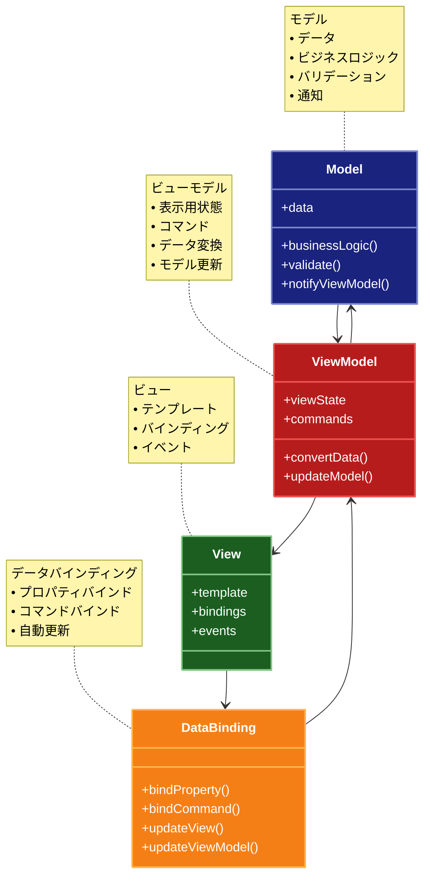

# MVVM (Model-View-ViewModel) パターン

## 目的

ビューとモデルを完全に分離し、ViewModelを介してデータバインディングによる自動的な同期を実現することで、UIロジックのテスト容易性と保守性を向上させます。

## 価値・解決する問題

- ビューとモデルの完全な分離
- データバインディングによる自動同期
- UIロジックのテスト容易性向上
- コードの再利用性向上
- 保守性の向上

## 概要・特徴

### 概要

MVVMパターンは、ビューとモデルを完全に分離し、ViewModelを介してデータバインディングによる自動的な同期を実現する設計パターンです。ViewModelはビューの状態とふるまいを表現し、モデルとビューの間の変換を担当します。

### 特徴

#### データバインディング
MVVMパターンの最も重要な特徴は、データバインディングメカニズムです。これにより、ViewとViewModelの間でデータが自動的に同期され、UIの更新やユーザー入力の処理が宣言的に行われます。開発者はビューの要素とViewModelのプロパティを「バインド」するだけで、その後の同期は自動的に処理されます。これにより、手動でUIを更新するコードが不要になり、コードが大幅に簡素化されます。例えば、ユーザーがフォームに入力すると、関連するViewModelのプロパティが自動的に更新され、逆にViewModelのデータが変更されると、関連するUIコンポーネントが自動的に更新されます。このデータバインディングは、特にリアクティブプログラミングパラダイムと組み合わせることで、複雑なUIの状態管理を大幅に簡素化し、コードの予測可能性と保守性を向上させます。

#### コマンドパターン
MVVMパターンでは、ユーザーのアクション（ボタンクリックなど）をViewModelの「コマンド」にバインドする手法が広く採用されています。コマンドはViewModelのメソッドをカプセル化したもので、実行条件（CanExecute）と実行内容（Execute）を持ちます。ビューはこのコマンドを呼び出すだけで、具体的な処理の実装を知る必要がありません。また、コマンドの実行可能状態は自動的にUIに反映され、例えばフォームが未入力の場合は送信ボタンが自動的に無効化されるといった動作が実現できます。これにより、ビューからビジネスロジックを完全に分離し、イベントハンドラーのようなコードビハインドをほぼ排除できます。コマンドパターンにより、UIのインタラクションとその処理が明確に分離され、テスト容易性とコードの再利用性が向上します。

#### 状態管理
ViewModelは、ビューの状態を完全に表現し管理します。表示データだけでなく、ページの読み込み状態、エラー状態、選択状態など、UIに関連するすべての状態情報がViewModelに集約されます。これにより、ビューは単にこの状態を視覚的に表現するだけの役割に徹することができます。ViewModelは状態変更の通知メカニズム（PropertyChangedイベントなど）を提供し、ビューはこれに基づいて自動的に更新されます。この明確な状態管理により、複雑なUIフローも制御しやすくなり、デバッグも容易になります。例えば、フォームのバリデーションエラーや、非同期操作中の読み込み表示なども、ViewModelの状態として一元管理できます。この状態管理アプローチは、特に複雑なインタラクティブなアプリケーションにおいて、UIの一貫性と予測可能性を高めます。

#### 双方向同期
MVVMパターンでは、モデルとビューの間の双方向同期がViewModelを介して実現されます。ビューの変更はViewModelに伝播され、ViewModelの変更はモデルに反映されます。同様に、モデルの変更はViewModelを通じてビューに反映されます。この双方向性により、データフローが明確になり、複雑なUI操作でもデータの整合性を保ちやすくなります。例えば、ユーザーがフォームを編集すると、それがViewModelのプロパティを更新し、必要に応じてModelが更新されます。逆に、外部からのデータ更新（APIレスポンスなど）は、Modelを更新し、それがViewModelを通じてビューに反映されます。この双方向同期は、特にリアルタイムデータを扱うアプリケーションや、複数ビューで同じデータを表示する場合に有効です。また、同期のタイミングや粒度も制御できるため、パフォーマンスとユーザー体験のバランスを取りやすくなります。

#### プレゼンテーションロジックの分離
MVVMパターンでは、ビューにロジックをほとんど持たせず、表示に関する処理（データのフォーマット変換、条件付き表示、UIの振る舞いなど）を全てViewModelに移動させます。これにより、プレゼンテーションロジックが明確に分離され、単体テストが容易になります。ViewModelはビューに依存しないため、UI環境なしでもテスト可能で、自動テストのカバレッジを高めることができます。また、同じViewModelを異なるビュー（デスクトップとモバイルなど）で再利用することも可能になります。このプレゼンテーションロジックの分離は、特にUIの複雑な条件分岐や表示ロジックを持つアプリケーションで威力を発揮し、コードの保守性と拡張性を大幅に向上させます。例えば、同じデータを異なる形式で表示したり、ユーザー権限によって表示内容を変えるといった要件も、ViewModelのロジックとして明確に実装できます。

### 概要図



## 類似パターンとの比較

- [MVC（Model-View-Controller）](mvc.md): MVVMはデータバインディングを使用して自動的に同期を行い、MVCはControllerを通じて手動で更新を制御します。
- [MVP（Model-View-Presenter）](mvp.md): MVVMはデータバインディングを使用し、MVPはPresenterを通じて明示的に更新を行います。

## 利用されているライブラリ／フレームワークの事例

- [WPF (Windows Presentation Foundation)](https://github.com/dotnet/wpf): MVVMパターンを最初に採用した主要なフレームワーク
- [Vue.js](https://github.com/vuejs/core): MVVMパターンを採用したJavaScriptフレームワーク
- [Angular](https://github.com/angular/angular): MVVMパターンを採用したTypeScriptフレームワーク

## コード例

### Before:

```typescript
// ビューとモデルが密結合した実装
class UserProfileView {
  private user: User;

  constructor() {
    this.setupEventHandlers();
  }

  private setupEventHandlers() {
    const nameInput = document.getElementById("name") as HTMLInputElement;
    const emailInput = document.getElementById("email") as HTMLInputElement;
    const saveButton = document.getElementById("save") as HTMLButtonElement;

    nameInput.addEventListener("input", () => {
      this.user.name = nameInput.value;
    });

    emailInput.addEventListener("input", () => {
      this.user.email = emailInput.value;
    });

    saveButton.addEventListener("click", () => {
      this.saveUser();
    });
  }

  private async saveUser() {
    await fetch("/api/users", {
      method: "POST",
      body: JSON.stringify(this.user),
    });
  }

  public setUser(user: User) {
    this.user = user;
    this.updateView();
  }

  private updateView() {
    const nameInput = document.getElementById("name") as HTMLInputElement;
    const emailInput = document.getElementById("email") as HTMLInputElement;

    nameInput.value = this.user.name;
    emailInput.value = this.user.email;
  }
}
```

### After:

```typescript
// Model: ビジネスロジックとデータ
interface User {
  id: string;
  name: string;
  email: string;
}

class UserModel {
  private user: User;

  async loadUser(id: string): Promise<void> {
    const response = await fetch(`/api/users/${id}`);
    this.user = await response.json();
  }

  async saveUser(): Promise<void> {
    await fetch("/api/users", {
      method: "POST",
      body: JSON.stringify(this.user),
    });
  }

  getUser(): User {
    return { ...this.user };
  }

  updateUser(updates: Partial<User>): void {
    this.user = { ...this.user, ...updates };
  }
}

// ViewModel: 表示ロジックと状態管理
class UserViewModel {
  private model: UserModel;
  private observers: Map<string, ((value: any) => void)[]> = new Map();

  constructor(model: UserModel) {
    this.model = model;
  }

  // 双方向バインディング用のプロパティ
  get name(): string {
    return this.model.getUser().name;
  }

  set name(value: string) {
    this.model.updateUser({ name: value });
    this.notifyObservers("name", value);
  }

  get email(): string {
    return this.model.getUser().email;
  }

  set email(value: string) {
    this.model.updateUser({ email: value });
    this.notifyObservers("email", value);
  }

  // コマンド
  async saveCommand(): Promise<void> {
    await this.model.saveUser();
  }

  // オブザーバーパターンの実装
  bind(property: string, callback: (value: any) => void): void {
    if (!this.observers.has(property)) {
      this.observers.set(property, []);
    }
    this.observers.get(property)?.push(callback);
  }

  private notifyObservers(property: string, value: any): void {
    this.observers.get(property)?.forEach((callback) => callback(value));
  }
}

// View: 表示とユーザー入力の処理
class UserView {
  private viewModel: UserViewModel;

  constructor(viewModel: UserViewModel) {
    this.viewModel = viewModel;
    this.setupBindings();
  }

  private setupBindings() {
    const nameInput = document.getElementById("name") as HTMLInputElement;
    const emailInput = document.getElementById("email") as HTMLInputElement;
    const saveButton = document.getElementById("save") as HTMLButtonElement;

    // 双方向バインディングの設定
    nameInput.addEventListener("input", () => {
      this.viewModel.name = nameInput.value;
    });

    this.viewModel.bind("name", (value) => {
      nameInput.value = value;
    });

    emailInput.addEventListener("input", () => {
      this.viewModel.email = emailInput.value;
    });

    this.viewModel.bind("email", (value) => {
      emailInput.value = value;
    });

    // コマンドバインディング
    saveButton.addEventListener("click", () => {
      this.viewModel.saveCommand();
    });
  }
}

// 使用例
const model = new UserModel();
const viewModel = new UserViewModel(model);
const view = new UserView(viewModel);
```
