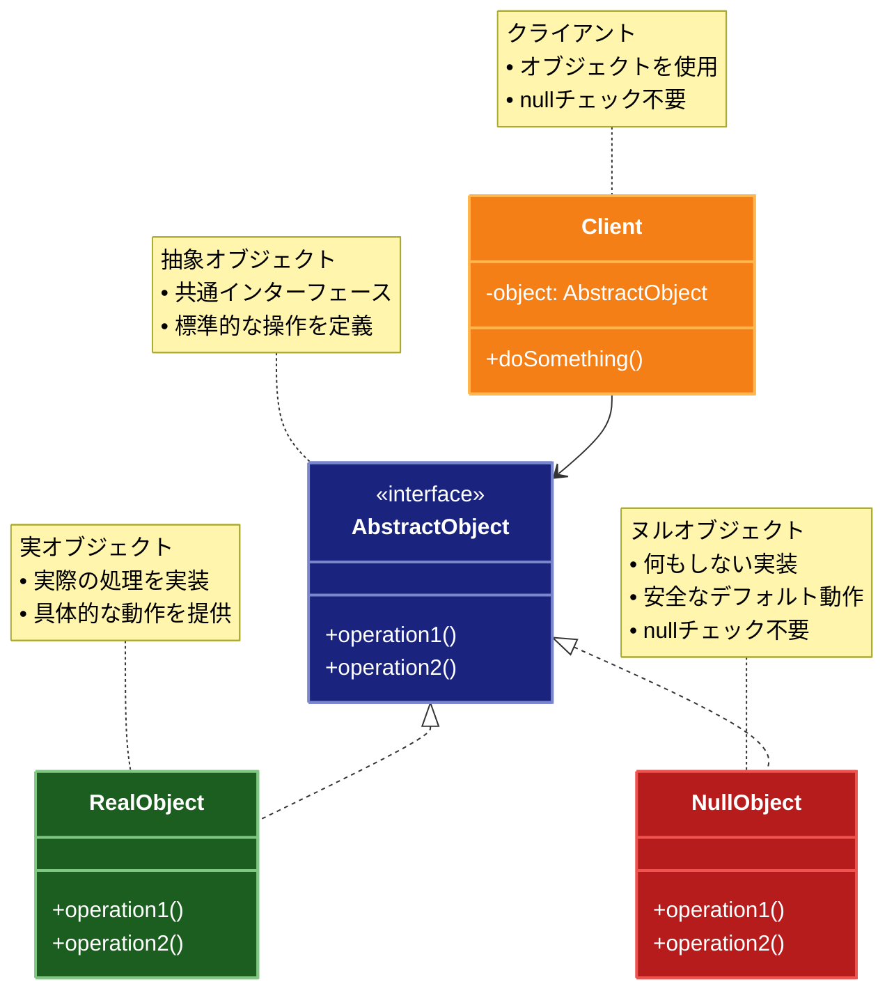

# Null Object（ヌルオブジェクト）パターン

## 目的

`null`チェックを不要にし、オブジェクトが存在しない場合でも安全に処理を継続できるようにするパターンです。

## 価値・解決する問題

- `null`チェックの削減
- コードの簡潔化
- エラー処理の統一
- デフォルト動作の提供
- 安全な処理の実現

## 概要・特徴

### 概要

Null Objectパターンは、`null`の代わりに何もしない特別なオブジェクトを提供することで、`null`チェックを不要にし、コードの安全性と可読性を向上させる設計パターンです。このパターンでは、実際のオブジェクトと同じインターフェースを実装した「何もしない」オブジェクトを使用することで、オブジェクトが存在しない状況でも一貫した振る舞いを提供します。特に、依存するコンポーネントが未設定の場合や、検索結果が見つからない場合などのエッジケースを扱う際に有効です。

### 特徴

#### `null`チェックの削減

明示的な`null`チェックを排除することで、コードの可読性と保守性を向上させます。クライアントコードは常に有効なオブジェクトが返されることを前提にできるため、繰り返し`null`や`undefined`をチェックする必要がなくなります。例えば、ユーザーオブジェクトを扱う場合、存在しないユーザーに対しても`NullUser`オブジェクトを返すことで、クライアントコードは常に同じ方法でユーザーオブジェクトを操作できます。これにより、条件分岐が減少し、コードの流れがよりスムーズになります。

#### デフォルト動作の実装

操作が適用できない場合のデフォルト動作を提供します。Null Objectは「何もしない」か、あるいは中立的な値を返すように実装され、システムの他の部分に影響を与えることなく処理を継続できます。例えば、ロギングシステムでは、ロガーが設定されていない場合に`NullLogger`がログメッセージを単に無視することで、アプリケーションは通常通り動作を継続できます。同様に、権限管理システムでは、未認証ユーザーに対して`NullPermission`オブジェクトを使用し、すべての操作に対して「許可なし」を返すことができます。

#### インターフェースの一貫性維持

Null Objectは、実際のオブジェクトと同じインターフェースを完全に実装するため、クライアントコードはオブジェクトの存在を前提とした一貫した方法でプログラミングできます。これにより、型の安全性が向上し、ランタイムエラーが減少します。例えば、支払い処理システムで、支払い方法が指定されていない場合に`NullPaymentProcessor`を使用することで、支払い処理のインターフェースは維持されながらも、実際の処理は行われないようにすることができます。この一貫性により、コード全体の構造が明確になり、新しい開発者がシステムを理解しやすくなります。

#### 特殊ケース処理の簡素化

エッジケースや例外的な状況の処理を簡素化します。データが存在しない場合や、操作が適用できない場合のような特殊なケースを、例外を投げるのではなく、Null Objectで対応することで、コードフローを中断せずに処理を継続できます。例えば、検索結果が見つからない場合に`NullSearchResult`を返すことで、結果表示ロジックは常に一貫した方法で結果を処理できます。これにより、エラー処理コードが分散せず、メインのビジネスロジックが明確に保たれます。

#### テストの容易性向上

モックやスタブの代わりにNull Objectを使用することで、テストが簡素化されます。テスト環境で依存関係を設定する際に、実際の実装ではなくNull Objectを注入することで、テスト対象のコンポーネントが依存関係なしでも正しく動作することを確認できます。例えば、データベース接続をテストする際に、実際のデータベースの代わりに`NullDatabase`を使用することで、データベース操作が正しく抽象化されていることを検証できます。この方法は、統合テストの前段階として、ユニットテストの品質と信頼性を向上させます。

### 概要図



## 類似パターンとの比較

- [Special Case (特殊ケース)](special-case.md): Null Object は何もしない動作を提供し、これに対して Special Case は特殊な状況に対する具体的な動作を提供します。
- [State (ステート)](state.md): Null Object は何もしない状態を表現し、これに対して State は状態に応じた動作を提供します。
- [Strategy (ストラテジー)](strategy.md): Null Object は何もしない戦略を提供し、これに対して Strategy は具体的な戦略を提供します。

## 利用されているライブラリ／フレームワークの事例

- [Optional in Java](https://docs.oracle.com/javase/8/docs/api/java/util/Optional.html): 値が存在しない場合の処理
- [Maybe in Haskell](https://hackage.haskell.org/package/base-4.16.0.0/docs/Data-Maybe.html): 値が存在しない可能性の表現
- [Null Object in Ruby](https://github.com/ruby/ruby/blob/master/lib/delegate.rb): デリゲートパターンの実装

## 解説ページリンク

- [Refactoring Guru - Null Object](https://refactoring.guru/design-patterns/null-object)
- [SourceMaking - Null Object](https://sourcemaking.com/design_patterns/null_object)
- [DZone - Null Object Pattern](https://dzone.com/articles/null-object-pattern-in-java)

## コード例

### Before:

`null`チェックを多用する実装

```typescript
// ロガーインターフェース
interface Logger {
  info(message: string): void;
  warn(message: string): void;
  error(message: string): void;
}

// 実際のロガー実装
class ConsoleLogger implements Logger {
  info(message: string): void {
    console.log(`[INFO] ${message}`);
  }

  warn(message: string): void {
    console.log(`[WARN] ${message}`);
  }

  error(message: string): void {
    console.log(`[ERROR] ${message}`);
  }
}

// ユーザーサービス
class UserService {
  private logger: Logger | null = null;

  constructor(logger?: Logger) {
    this.logger = logger || null;
  }

  createUser(username: string): void {
    if (this.logger) {
      this.logger.info(`ユーザー作成開始: ${username}`);
    }

    // ユーザー作成処理
    try {
      // データベースへの保存などの処理
      if (this.logger) {
        this.logger.info(`ユーザー作成成功: ${username}`);
      }
    } catch (error) {
      if (this.logger) {
        this.logger.error(`ユーザー作成失敗: ${username}, エラー: ${error}`);
      }
      throw error;
    }
  }

  deleteUser(username: string): void {
    if (this.logger) {
      this.logger.warn(`ユーザー削除開始: ${username}`);
    }

    // ユーザー削除処理
    try {
      // データベースからの削除などの処理
      if (this.logger) {
        this.logger.info(`ユーザー削除成功: ${username}`);
      }
    } catch (error) {
      if (this.logger) {
        this.logger.error(`ユーザー削除失敗: ${username}, エラー: ${error}`);
      }
      throw error;
    }
  }
}

// 使用例
function example() {
  // ロガーなしの場合
  const serviceWithoutLogger = new UserService();
  serviceWithoutLogger.createUser("user1");
  serviceWithoutLogger.deleteUser("user1");

  // ロガーありの場合
  const serviceWithLogger = new UserService(new ConsoleLogger());
  serviceWithLogger.createUser("user2");
  serviceWithLogger.deleteUser("user2");
}

example();
```

### After:

Null Objectパターンを適用した実装

```typescript
// ロガーインターフェース
interface Logger {
  info(message: string): void;
  warn(message: string): void;
  error(message: string): void;
}

// 実際のロガー実装
class ConsoleLogger implements Logger {
  info(message: string): void {
    console.log(`[INFO] ${message}`);
  }

  warn(message: string): void {
    console.log(`[WARN] ${message}`);
  }

  error(message: string): void {
    console.log(`[ERROR] ${message}`);
  }
}

// Null Objectパターンの実装
class NullLogger implements Logger {
  info(message: string): void {}
  warn(message: string): void {}
  error(message: string): void {}
}

// ファイルロガー実装
class FileLogger implements Logger {
  private logFile: string;

  constructor(logFile: string) {
    this.logFile = logFile;
  }

  info(message: string): void {
    this.writeToFile("INFO", message);
  }

  warn(message: string): void {
    this.writeToFile("WARN", message);
  }

  error(message: string): void {
    this.writeToFile("ERROR", message);
  }

  private writeToFile(level: string, message: string): void {
    // 実際のファイル書き込み処理の代わりにコンソール出力
    console.log(`[${level}] ${message} (書き込み先: ${this.logFile})`);
  }
}

// ロガーファクトリー
class LoggerFactory {
  static createLogger(type: "console" | "file" | "null", options?: { filePath?: string }): Logger {
    switch (type) {
      case "console":
        return new ConsoleLogger();
      case "file":
        if (!options?.filePath) {
          throw new Error("ファイルパスが指定されていません");
        }
        return new FileLogger(options.filePath);
      case "null":
      default:
        return new NullLogger();
    }
  }
}

// ユーザーサービス
class UserService {
  private logger: Logger;

  constructor(logger?: Logger) {
    this.logger = logger || new NullLogger();
  }

  createUser(username: string): void {
    this.logger.info(`ユーザー作成開始: ${username}`);

    try {
      // データベースへの保存などの処理
      this.logger.info(`ユーザー作成成功: ${username}`);
    } catch (error) {
      this.logger.error(`ユーザー作成失敗: ${username}, エラー: ${error}`);
      throw error;
    }
  }

  deleteUser(username: string): void {
    this.logger.warn(`ユーザー削除開始: ${username}`);

    try {
      // データベースからの削除などの処理
      this.logger.info(`ユーザー削除成功: ${username}`);
    } catch (error) {
      this.logger.error(`ユーザー削除失敗: ${username}, エラー: ${error}`);
      throw error;
    }
  }
}

// 使用例
function example() {
  console.log("=== NullLoggerの使用 ===");
  const serviceWithNullLogger = new UserService();
  serviceWithNullLogger.createUser("user1");
  serviceWithNullLogger.deleteUser("user1");

  console.log("\n=== ConsoleLoggerの使用 ===");
  const serviceWithConsoleLogger = new UserService(
    LoggerFactory.createLogger("console")
  );
  serviceWithConsoleLogger.createUser("user2");
  serviceWithConsoleLogger.deleteUser("user2");

  console.log("\n=== FileLoggerの使用 ===");
  const serviceWithFileLogger = new UserService(
    LoggerFactory.createLogger("file", { filePath: "/var/log/app.log" })
  );
  serviceWithFileLogger.createUser("user3");
  serviceWithFileLogger.deleteUser("user3");

  // エラーケースのテスト
  console.log("\n=== エラーケースのテスト ===");
  try {
    LoggerFactory.createLogger("file");
  } catch (error) {
    console.error("エラー:", error.message);
  }
}

example();
```
