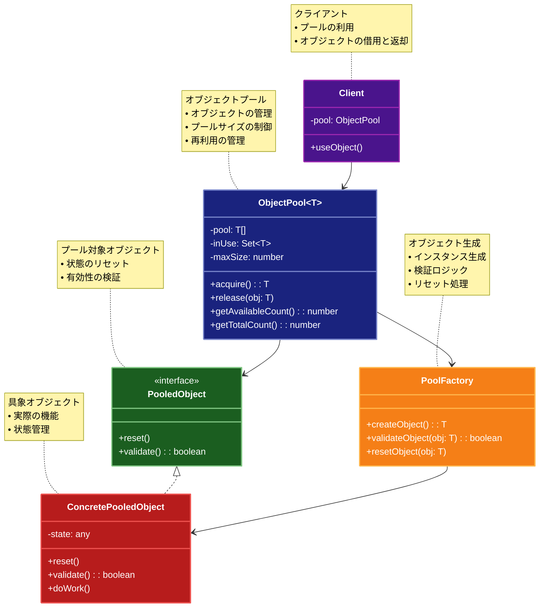

# Object Pool（オブジェクトプール）パターン

## 目的

オブジェクトの生成と破棄のコストを削減し、リソースを効率的に再利用するパターンです。

## 価値・解決する問題

- オブジェクト生成コストの削減
- メモリ使用量の最適化
- パフォーマンスの向上
- リソース管理の効率化

## 概要・特徴

### 概要

Object Poolパターンは、頻繁に使用されるオブジェクトをプールで管理し、再利用することで、オブジェクトの生成と破棄のコストを削減するパターンです。このパターンでは、使用されていないオブジェクトをプール（貯蔵庫）に保持し、必要なときにプールからオブジェクトを取得し、使用後に再びプールに戻します。これにより、頻繁なオブジェクト生成による計算コストやメモリ断片化を防ぎ、アプリケーションのパフォーマンスを向上させることができます。

### 特徴

#### オブジェクトの再利用

既に生成されたオブジェクトを再利用することで、新たなオブジェクト生成のコストを削減します。特に、生成コストが高いオブジェクト（データベース接続、スレッド、ソケットなど）を扱う場合に効果的です。例えば、Webアプリケーションでは、データベース接続を毎回作成するのではなく、接続プールから利用可能な接続を取得し、操作が完了したら接続をプールに戻します。これにより、接続の確立や破棄にかかる時間とリソースが節約され、アプリケーションの応答性が向上します。

#### リソース管理の一元化

オブジェクトの作成、管理、破棄を一箇所（プール）で集中的に行うことで、リソース管理が簡素化されます。これにより、リソースリークやメモリリークなどの問題を防ぎやすくなります。例えば、グラフィックスアプリケーションでは、多数のグラフィックリソース（テクスチャ、メッシュなど）をプールで管理することで、未使用リソースの追跡や解放を効率的に行えます。また、一元管理によって使用状況の監視やデバッグも容易になり、システム全体の安定性が向上します。

#### スレッドセーフな実装

マルチスレッド環境では、複数のスレッドが同時にプールにアクセスする可能性があるため、スレッドセーフな実装が重要です。競合状態や不整合を防ぐために、同期メカニズムを使用してプールへのアクセスを制御します。例えば、ゲームエンジンのパーティクルシステムでは、複数のスレッドが同時にパーティクルオブジェクトを要求・解放する可能性があるため、適切なロック機構や同期プリミティブを使用してプールを保護します。これにより、データの整合性を維持しながら、並行処理の利点を活かすことができます。

#### プールサイズの制御

プールのサイズを適切に管理することで、メモリ使用量とパフォーマンスのバランスを調整できます。最小・最大プールサイズの設定、未使用オブジェクトの期限切れメカニズム、動的なプールサイズ調整などの戦略を実装できます。例えば、Webサーバーのスレッドプールでは、サーバーの負荷に応じてプールサイズを動的に調整し、低負荷時には少ないスレッド数で効率的に動作し、高負荷時には必要に応じてスレッド数を増やすことができます。このような制御により、リソースの無駄遣いを防ぎながら、需要の変動に対応できます。

#### オブジェクトのライフサイクル管理

プールされたオブジェクトは、使用前の初期化（リセット）、使用中の状態管理、使用後のクリーンアップなど、ライフサイクル全体を通して適切に管理する必要があります。例えば、ネットワークパケットバッファのプールでは、バッファを再利用する前にデータをクリアし、状態をリセットします。また、長時間使用されていないオブジェクトの検出と破棄、破損したオブジェクトの修復や置換なども行います。このライフサイクル管理により、再利用されるオブジェクトが常に正しい状態で提供され、アプリケーションの安定性と信頼性が向上します。

### 概要図



## 類似パターンとの比較

- [Multiton (マルチトン)](multiton.md): Object Pool は再利用可能なオブジェクトの集合を管理し、これに対して Multiton は特定のキーに対応するインスタンスを管理します。
- [Factory Method (ファクトリーメソッド)](factory-method.md): Object Pool はオブジェクトの再利用に焦点を当て、これに対して Factory Method はオブジェクト生成の柔軟性を提供します。
- [Singleton (シングルトン)](singleton.md): Object Pool は複数のオブジェクトを管理し、これに対して Singleton は単一のインスタンスのみを管理します。

## 利用されているライブラリ／フレームワークの事例

- [Apache Commons Pool](https://commons.apache.org/proper/commons-pool/): Javaのオブジェクトプール実装
- [C3P0](https://www.mchange.com/projects/c3p0/): JDBCコネクションプール
- [Thread Pool Executor](https://docs.oracle.com/javase/8/docs/api/java/util/concurrent/ThreadPoolExecutor.html): スレッドプール実装

## 解説ページリンク

- [Microsoft - Object Pool Pattern](https://docs.microsoft.com/en-us/previous-versions/msp-n-p/ff650003(v=pandp.10))
- [SourceMaking - Object Pool Pattern](https://sourcemaking.com/design_patterns/object_pool)
- [DZone - Understanding Object Pool Pattern](https://dzone.com/articles/understanding-object-pool-pattern)

## コード例

### Before:

オブジェクトを都度生成する実装

```typescript
class Worker {
  private id: number;

  constructor(id: number) {
    this.id = id;
    // 重い初期化処理をシミュレート
    this.heavyInitialization();
  }

  private heavyInitialization(): void {
    console.log(`Worker ${this.id} の初期化中...`);
    // 重い処理をシミュレート
    for (let i = 0; i < 1000000; i++) {}
  }

  doWork(task: string): void {
    console.log(`Worker ${this.id} がタスク "${task}" を実行中`);
  }
}

// 使用例
for (let i = 0; i < 5; i++) {
  const worker = new Worker(i);
  worker.doWork(`タスク ${i}`);
}
```

### After:

オブジェクトプールパターンを適用した実装

```typescript
interface Poolable {
  reset(): void;
  validate(): boolean;
}

class ObjectPool<T extends Poolable> {
  private available: T[] = [];
  private inUse: Set<T> = new Set();
  private factory: () => T;
  private maxSize: number;
  private validateOnBorrow: boolean;
  private lastValidation: Map<T, number> = new Map();
  private validationInterval: number;

  constructor(
    factory: () => T,
    initialSize: number,
    maxSize: number,
    validateOnBorrow: boolean = true,
    validationInterval: number = 30000 // 30秒
  ) {
    this.factory = factory;
    this.maxSize = maxSize;
    this.validateOnBorrow = validateOnBorrow;
    this.validationInterval = validationInterval;

    // 初期サイズ分のオブジェクトを生成
    for (let i = 0; i < initialSize; i++) {
      this.available.push(this.createObject());
    }
  }

  private createObject(): T {
    const obj = this.factory();
    this.lastValidation.set(obj, Date.now());
    return obj;
  }

  private validateObject(obj: T): boolean {
    const lastValidationTime = this.lastValidation.get(obj);
    if (!lastValidationTime) return false;

    // 前回の検証から一定時間経過していない場合はスキップ
    if (Date.now() - lastValidationTime < this.validationInterval) {
      return true;
    }

    const isValid = obj.validate();
    if (isValid) {
      this.lastValidation.set(obj, Date.now());
    }
    return isValid;
  }

  async borrow(): Promise<T> {
    // 利用可能なオブジェクトがある場合
    while (this.available.length > 0) {
      const obj = this.available.pop()!;

      // 検証が必要な場合
      if (this.validateOnBorrow && !this.validateObject(obj)) {
        console.log("オブジェクトの検証に失敗。新しいオブジェクトを作成します。");
        continue;
      }

      this.inUse.add(obj);
      return obj;
    }

    // プールが最大サイズに達していない場合は新しいオブジェクトを作成
    if (this.size() < this.maxSize) {
      const obj = this.createObject();
      this.inUse.add(obj);
      return obj;
    }

    // プールが満杯の場合は待機
    return new Promise(resolve => {
      const checkAvailability = () => {
        if (this.available.length > 0) {
          const obj = this.available.pop()!;
          this.inUse.add(obj);
          resolve(obj);
        } else {
          setTimeout(checkAvailability, 100);
        }
      };
      checkAvailability();
    });
  }

  return(obj: T): void {
    if (!this.inUse.has(obj)) {
      throw new Error("このオブジェクトはプールから借りられていません");
    }

    obj.reset();
    this.inUse.delete(obj);
    this.available.push(obj);
  }

  size(): number {
    return this.available.length + this.inUse.size;
  }

  availableCount(): number {
    return this.available.length;
  }

  inUseCount(): number {
    return this.inUse.size;
  }
}

// ワーカーの実装
class PooledWorker implements Poolable {
  private id: number;
  private busy: boolean = false;
  private lastUsed: number = Date.now();

  constructor(id: number) {
    this.id = id;
    this.heavyInitialization();
  }

  private heavyInitialization(): void {
    console.log(`Worker ${this.id} の初期化中...`);
    // 重い処理をシミュレート
    for (let i = 0; i < 1000000; i++) {}
  }

  async doWork(task: string): Promise<void> {
    if (this.busy) {
      throw new Error("Worker is busy");
    }

    this.busy = true;
    this.lastUsed = Date.now();
    
    console.log(`Worker ${this.id} がタスク "${task}" を実行中`);
    
    // 非同期の作業をシミュレート
    await new Promise(resolve => setTimeout(resolve, 1000));
    
    this.busy = false;
  }

  reset(): void {
    this.busy = false;
  }

  validate(): boolean {
    // 最後の使用から5分以上経過している場合は無効と判断
    const isValid = Date.now() - this.lastUsed < 300000;
    if (!isValid) {
      console.log(`Worker ${this.id} は有効期限切れです`);
    }
    return isValid;
  }

  getId(): number {
    return this.id;
  }
}

// ワーカープールマネージャー
class WorkerPoolManager {
  private static instance: WorkerPoolManager;
  private pool: ObjectPool<PooledWorker>;
  private nextWorkerId: number = 0;

  private constructor() {
    this.pool = new ObjectPool<PooledWorker>(
      () => new PooledWorker(this.nextWorkerId++),
      2,  // 初期サイズ
      5,  // 最大サイズ
      true,  // 借用時に検証を行う
      10000  // 検証間隔（10秒）
    );
  }

  static getInstance(): WorkerPoolManager {
    if (!WorkerPoolManager.instance) {
      WorkerPoolManager.instance = new WorkerPoolManager();
    }
    return WorkerPoolManager.instance;
  }

  async executeTask(task: string): Promise<void> {
    const worker = await this.pool.borrow();
    try {
      await worker.doWork(task);
    } finally {
      this.pool.return(worker);
    }
  }

  getPoolStats(): Record<string, number> {
    return {
      totalSize: this.pool.size(),
      available: this.pool.availableCount(),
      inUse: this.pool.inUseCount()
    };
  }
}

// 使用例
async function example() {
  const manager = WorkerPoolManager.getInstance();

  console.log("=== プール統計（初期状態） ===");
  console.log(manager.getPoolStats());

  // 複数のタスクを同時に実行
  console.log("\n=== タスクの並行実行 ===");
  const tasks = Array.from({ length: 8 }, (_, i) => `タスク ${i + 1}`);
  
  await Promise.all(
    tasks.map(async task => {
      try {
        await manager.executeTask(task);
      } catch (error) {
        console.error(`タスク ${task} の実行中にエラー:`, error);
      }
    })
  );

  console.log("\n=== プール統計（実行後） ===");
  console.log(manager.getPoolStats());

  // シーケンシャルな実行のデモ
  console.log("\n=== シーケンシャルな実行 ===");
  for (let i = 0; i < 3; i++) {
    await manager.executeTask(`シーケンシャルタスク ${i + 1}`);
    console.log("プール統計:", manager.getPoolStats());
  }
}

// 実行
example().catch(console.error);

// 関数型プログラミングスタイルによるObject Poolパターンの実装

// 型定義
interface PoolableState {
  readonly id: number;
  readonly busy: boolean;
  readonly lastUsed: number;
}

// ワーカーの型定義
interface WorkerState extends PoolableState {
  readonly id: number;
  readonly busy: boolean;
  readonly lastUsed: number;
}

// プールの状態を表す型
interface PoolState<T extends PoolableState> {
  readonly available: ReadonlyArray<T>;
  readonly inUse: ReadonlySet<T>;
  readonly lastValidation: ReadonlyMap<T, number>;
  readonly nextId: number;
}

// プールの設定
interface PoolConfig {
  readonly initialSize: number;
  readonly maxSize: number;
  readonly validateOnBorrow: boolean;
  readonly validationInterval: number;
}

// ワーカー関連の純粋関数
const workerFunctions = {
  // 新しいワーカーを作成
  create: (id: number): WorkerState => {
    console.log(`Worker ${id} の初期化中...`);
    // 重い処理をシミュレート
    for (let i = 0; i < 1000000; i++) {}
    
    return {
      id,
      busy: false,
      lastUsed: Date.now()
    };
  },
  
  // ワーカーの状態をリセット
  reset: (worker: WorkerState): WorkerState => ({
    ...worker,
    busy: false
  }),
  
  // ワーカーが有効かどうかを検証
  validate: (worker: WorkerState, now: number = Date.now()): boolean => {
    const isValid = now - worker.lastUsed < 300000; // 5分
    if (!isValid) {
      console.log(`Worker ${worker.id} は有効期限切れです`);
    }
    return isValid;
  },
  
  // ワーカーで作業を実行
  markAsBusy: (worker: WorkerState): WorkerState => ({
    ...worker,
    busy: true,
    lastUsed: Date.now()
  })
};

// プール管理の純粋関数
const poolFunctions = {
  // 初期状態のプールを作成
  createPool: <T extends PoolableState>(config: PoolConfig, createFn: (id: number) => T): PoolState<T> => {
    const available: T[] = [];
    const lastValidation = new Map<T, number>();
    const now = Date.now();
    
    // 初期サイズ分のオブジェクトを生成
    for (let i = 0; i < config.initialSize; i++) {
      const obj = createFn(i);
      available.push(obj);
      lastValidation.set(obj, now);
    }
    
    return {
      available,
      inUse: new Set<T>(),
      lastValidation,
      nextId: config.initialSize
    };
  },
  
  // オブジェクトを借りる
  borrow: <T extends PoolableState>(
    pool: PoolState<T>,
    config: PoolConfig,
    createFn: (id: number) => T,
    validateFn: (obj: T, now: number) => boolean
  ): [PoolState<T>, T | null] => {
    const now = Date.now();
    const { available, inUse, lastValidation, nextId } = pool;
    
    // 利用可能なオブジェクトを探す
    for (let i = 0; i < available.length; i++) {
      const obj = available[i];
      
      // 検証が必要な場合
      if (config.validateOnBorrow) {
        const lastCheck = lastValidation.get(obj) || 0;
        
        // 検証間隔を過ぎていれば検証
        if (now - lastCheck >= config.validationInterval) {
          if (!validateFn(obj, now)) {
            // 検証失敗の場合、このオブジェクトをスキップして次へ
            continue;
          }
        }
      }
      
      // このオブジェクトを使用
      const newAvailable = [...available.slice(0, i), ...available.slice(i + 1)];
      const newInUse = new Set(inUse);
      newInUse.add(obj);
      
      // 検証時間を更新
      const newLastValidation = new Map(lastValidation);
      newLastValidation.set(obj, now);
      
      return [
        {
          available: newAvailable,
          inUse: newInUse,
          lastValidation: newLastValidation,
          nextId
        },
        obj
      ];
    }
    
    // 利用可能なオブジェクトがなく、最大サイズに達していない場合は新しく作成
    if (available.length + inUse.size < config.maxSize) {
      const obj = createFn(nextId);
      
      const newInUse = new Set(inUse);
      newInUse.add(obj);
      
      // 検証時間を更新
      const newLastValidation = new Map(lastValidation);
      newLastValidation.set(obj, now);
      
      return [
        {
          available,
          inUse: newInUse,
          lastValidation: newLastValidation,
          nextId: nextId + 1
        },
        obj
      ];
    }
    
    // 利用可能なオブジェクトがなく、最大サイズに達している場合はnullを返す
    return [pool, null];
  },
  
  // オブジェクトを返却
  return: <T extends PoolableState>(
    pool: PoolState<T>,
    obj: T,
    resetFn: (obj: T) => T
  ): PoolState<T> => {
    const { available, inUse, lastValidation, nextId } = pool;
    
    // オブジェクトがプールから借りられたものか確認
    if (!inUse.has(obj)) {
      throw new Error("このオブジェクトはプールから借りられていません");
    }
    
    // オブジェクトをリセット
    const resetObj = resetFn(obj);
    
    // inUseから削除し、availableに追加
    const newInUse = new Set(inUse);
    newInUse.delete(obj);
    
    return {
      available: [...available, resetObj],
      inUse: newInUse,
      lastValidation,
      nextId
    };
  },
  
  // プールのサイズを取得
  getStats: <T extends PoolableState>(pool: PoolState<T>): Record<string, number> => {
    return {
      totalSize: pool.available.length + pool.inUse.size,
      available: pool.available.length,
      inUse: pool.inUse.size
    };
  }
};

// タスク処理関数
const doWork = async (worker: WorkerState, task: string): Promise<void> => {
  console.log(`Worker ${worker.id} がタスク "${task}" を実行中`);
  // 非同期の作業をシミュレート
  await new Promise(resolve => setTimeout(resolve, 1000));
};

// ワーカープールマネージャー（関数型スタイル）
const createWorkerPoolManager = () => {
  // プールの設定
  const config: PoolConfig = {
    initialSize: 2,
    maxSize: 5,
    validateOnBorrow: true,
    validationInterval: 10000 // 10秒
  };
  
  // プールの状態（可変）
  let poolState: PoolState<WorkerState> = poolFunctions.createPool(config, workerFunctions.create);
  
  // タスクを実行
  const executeTask = async (task: string): Promise<void> => {
    // オブジェクトを借りる
    let worker: WorkerState | null = null;
    let attempts = 0;
    const maxAttempts = 50; // 最大試行回数
    
    while (!worker && attempts < maxAttempts) {
      [poolState, worker] = poolFunctions.borrow(
        poolState,
        config,
        workerFunctions.create,
        workerFunctions.validate
      );
      
      if (!worker) {
        // 利用可能なワーカーがない場合は少し待つ
        await new Promise(resolve => setTimeout(resolve, 100));
        attempts++;
      }
    }
    
    if (!worker) {
      throw new Error("利用可能なワーカーがありません");
    }
    
    try {
      // ワーカーをビジー状態にマーク
      const busyWorker = workerFunctions.markAsBusy(worker);
      
      // ワーカーで作業を実行
      await doWork(busyWorker, task);
      
      // ワーカーを返却（リセット）
      poolState = poolFunctions.return(
        poolState,
        busyWorker,
        workerFunctions.reset
      );
    } catch (error) {
      // エラー時もワーカーを返却（リセット）
      poolState = poolFunctions.return(
        poolState,
        worker,
        workerFunctions.reset
      );
      throw error;
    }
  };
  
  // プールの統計情報を取得
  const getPoolStats = (): Record<string, number> => {
    return poolFunctions.getStats(poolState);
  };
  
  return {
    executeTask,
    getPoolStats
  };
};

// 関数型アプローチの使用例
async function functionalExample() {
  console.log("\n=== 関数型プログラミングスタイルによるObject Poolパターンの実装 ===");
  
  const manager = createWorkerPoolManager();
  
  console.log("=== プール統計（初期状態） ===");
  console.log(manager.getPoolStats());
  
  // 複数のタスクを同時に実行
  console.log("\n=== タスクの並行実行 ===");
  const tasks = Array.from({ length: 8 }, (_, i) => `関数型タスク ${i + 1}`);
  
  await Promise.all(
    tasks.map(async task => {
      try {
        await manager.executeTask(task);
      } catch (error) {
        console.error(`タスク ${task} の実行中にエラー:`, error);
      }
    })
  );
  
  console.log("\n=== プール統計（実行後） ===");
  console.log(manager.getPoolStats());
  
  // シーケンシャルな実行のデモ
  console.log("\n=== シーケンシャルな実行 ===");
  for (let i = 0; i < 3; i++) {
    await manager.executeTask(`関数型シーケンシャルタスク ${i + 1}`);
    console.log("プール統計:", manager.getPoolStats());
  }
  
  // 関数型アプローチの特徴
  console.log("\n=== 関数型アプローチの特徴 ===");
  console.log("1. イミュータブルなデータ構造（プールの状態が常に新しいオブジェクトとして生成される）");
  console.log("2. 純粋関数による操作（関数は同じ入力に対して常に同じ出力を返す）");
  console.log("3. 副作用の分離（副作用を持つ処理が明示的に分離されている）");
  console.log("4. ワーカーとプールの状態管理が明確");
}

// 実行
functionalExample().catch(console.error); 