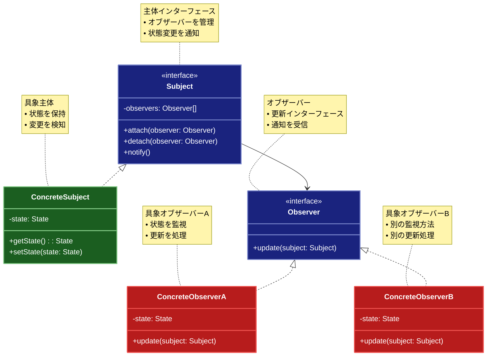

# Observer（オブザーバー）パターン

## 目的

オブジェクト間の1対多の依存関係を定義し、あるオブジェクトの状態が変化した時に、依存するすべてのオブジェクトに自動的に通知し更新するパターンです。

## 価値・解決する問題

- オブジェクト間の疎結合を実現できます
- 状態変更の通知を自動化できます
- 動的なオブザーバーの追加・削除が可能です
- イベント駆動型の設計が可能です
- 柔軟な通知メカニズムを実装できます

## 概要・特徴

### 概要

Observerパターンは、Subject（主体）とObserver（観察者）の間に1対多の依存関係を確立し、Subjectの状態変更を全てのObserverに自動的に通知する設計パターンです。このパターンは、あるオブジェクトの状態が変わったときに、依存関係にある他のオブジェクトに自動的に通知し、それらが自身を更新できるようにします。これにより、システムの様々な部分が相互に作用しつつも、疎結合を維持することが可能になります。

### 特徴

#### 疎結合の実現
Observerパターンの最も重要な特徴は、SubjectとObserver間の疎結合を実現することです。Subjectは観察者が具体的にどのクラスなのか、何をするのかを知る必要がなく、単にObserverインターフェースを実装したオブジェクトのリストを維持します。同様に、ObserverもSubjectの内部実装詳細を知る必要はなく、単に通知を受け取るインターフェースを提供するだけです。この疎結合により、システムの各部分を独立して変更できるようになります。例えば、UI更新の仕組みでは、データモデル（Subject）は表示方法（Observer）を知る必要がなく、様々な画面やコンポーネントが同じデータモデルを観察できます。これにより、新しい種類の表示（例えばグラフィカル表示に加えてテキスト表示）を追加する際に、データモデル自体を変更する必要がなくなります。また、テスト時にモックObserverを使用してSubjectの動作を検証することも容易になり、ユニットテストの実装が簡素化されます。さらに、チーム開発においても、SubjectとObserverを担当する開発者が互いの実装詳細を気にせず、合意したインターフェースに基づいて並行して作業できるため、開発効率が向上します。

#### 自動通知メカニズム
Observerパターンでは、Subjectの状態変化が発生すると、登録されているすべてのObserverに自動的に通知が送られます。この自動化により、開発者は手動で各コンポーネントに変更を伝える複雑なコードを書く必要がなくなります。例えば、センサーデータを処理するIoTアプリケーションでは、温度センサー（Subject）の値が変わるたびに、表示パネル、アラート管理システム、データロガーなど複数のコンポーネント（Observer）に自動的に通知されます。この自動通知メカニズムにより、通知のロジックがSubjectに集約され、変更の伝播が一貫した方法で行われるため、通知漏れのリスクが減少します。また、新しいObserverが追加された場合でも、既存のSubjectコードを変更する必要がなく、単にObserverリストに追加するだけで済みます。これは拡張性を高め、「開放/閉鎖原則」（Open/Closed Principle）に従ったシステム設計を可能にします。また、イベント発生と処理の分離により、コードの可読性も向上し、単一責任の原則（Single Responsibility Principle）も満たされます。

#### 動的な購読管理
Observerパターンの大きな利点は、実行時にObserverの追加・削除（購読・購読解除）が可能な点です。これにより、システムの動作中にも柔軟にイベント通知の受信者を変更できます。例えば、ユーザーがアプリケーションの特定の通知をオン/オフする設定を変更した場合、該当するObserverを動的に登録・解除することで即座に反映できます。また、リソース効率の観点からも、必要なときだけObserverとして登録し、不要になれば登録解除することで、不要な通知処理を減らすことが可能です。Webアプリケーションでは、ユーザーが特定のページを表示している間だけそのコンポーネントをObserverとして登録し、ページ移動時に登録解除することで、メモリリークを防ぎパフォーマンスを最適化できます。この動的な購読管理は、特にユーザーの関心や状況に応じて通知の受信者が変わるようなインタラクティブなアプリケーションで価値があります。また、マイクロサービスアーキテクチャでも、サービスの起動・停止時に動的に購読管理することで、システム全体の柔軟性と回復力を高めることができます。

#### イベント駆動型アーキテクチャの実現
Observerパターンは、イベント駆動型アーキテクチャの基盤となります。従来の手続き型プログラミングとは異なり、状態変化（イベント）が発生した時にのみ処理が実行されるため、ポーリングによる無駄なリソース消費を避けることができます。例えば、株価監視アプリケーションでは、株価（Subject）が変動した時にのみ、関連する分析ツール、アラートシステム、チャート表示（Observer）が更新されます。この方式により、リアルタイム性と効率性が両立し、特に多数のイベントソースと処理コンポーネントを持つ複雑なシステムで効果を発揮します。また、イベント駆動型のアプローチは非同期処理との親和性も高く、UIのフリーズを防ぎユーザー体験を向上させるのに役立ちます。現代のWeb・モバイルアプリケーションやリアクティブプログラミングフレームワーク（RxJS, ReactiveCocoa, Reactなど）は、このObserverパターンの概念を拡張し、複雑なイベントストリームを処理するための強力な機能を提供しています。さらに、マイクロサービスアーキテクチャやイベントソーシングなどの分散システムパターンでも、サービス間通信の基本メカニズムとしてObserverパターンの変形が広く利用されています。

#### 柔軟な通知形式
Observerパターンでは、通知の内容や形式を状況に応じて柔軟に設計できます。基本的な実装では、Subjectは単に変更が発生したという事実だけを通知する「プッシュモデル」、または変更の詳細データを含めて通知する「プル/プッシュモデル」の2つのアプローチがあります。プッシュモデルでは、通知時にSubjectが変更に関するすべての情報をObserverに送信します。これにより、Observerは追加のクエリを行わずに変更に対応できます。例えば、チャットアプリケーションでは、新しいメッセージがある場合、メッセージの全内容をObserverに送信できます。一方、プルモデルでは、通知時に最小限の情報（変更が発生したという事実のみ）を送信し、Observerが必要に応じてSubjectから追加情報を取得します。これは大量のデータを扱う場合や、Observerによって必要な情報が異なる場合に効率的です。例えば、データベースの変更通知システムでは、変更テーブルと主キーのみを通知し、詳細なデータはObserverが必要に応じて取得できます。さらに高度な実装では、イベントタイプによるフィルタリングや、Observerごとに異なる通知形式を提供するなど、より洗練された通知メカニズムも実現できます。この柔軟性により、システムの要件や性能特性に最適な通知戦略を選択できます。

#### 複数の関心事に対する拡張性
Observerパターンは、一つのSubjectに対して複数の異なる関心事を持つObserverを容易に追加できる拡張性を備えています。例えば、ユーザーアクションログ（Subject）の変更に対して、セキュリティ監視、分析ダッシュボード、監査ログなど、全く異なる目的を持つ複数のシステム（Observer）が同時に反応できます。これにより、新しい要件やユースケースが発生した場合でも、既存のコードを変更せずに新しいObserverを追加するだけで対応できます。例えば、ソーシャルメディアプラットフォームでは、ユーザーが新しい投稿（Subject）を作成した際に、フォロワーへの通知、タイムラインの更新、検索インデックスの更新、コンテンツモデレーションなど、多様なシステムコンポーネント（Observer）が別々の処理を行います。この特性は「単一責任の原則」と「開放/閉鎖原則」を同時に満たし、システムの保守性と拡張性を大幅に向上させます。また、マイクロサービスアーキテクチャにおいては、イベントバスやメッセージキューと組み合わせることで、分散システム全体に同様の拡張性を提供します。新しいサービスは既存のイベントを購読するだけで、システム全体に統合されることができます。このように、Observerパターンはシステムが有機的に成長し、新しい機能やコンポーネントを追加する際の基盤として非常に価値があります。

### 概要図



## 類似パターンとの比較

- [Pub-Sub (パブリッシャー・サブスクライバー)](pub-sub.md): Observer は直接的な通知を行い、これに対して Pub-Sub は中間層を介して通知を行います。
- [Mediator (メディエーター)](mediator.md): Observer は1対多の通知を行い、これに対して Mediator は多対多の通信を仲介します。
- [Chain of Responsibility (責任連鎖)](chain-of-responsibility.md): Observer は状態変更の通知を行い、これに対して Chain of Responsibility は処理の委譲を行います。

## 利用されているライブラリ／フレームワークの事例

- [RxJS](https://rxjs.dev/): リアクティブプログラミング
- [Vue.js Reactivity](https://vuejs.org/guide/extras/reactivity-in-depth.html): リアクティブシステム
- [Java Observable](https://docs.oracle.com/javase/8/docs/api/java/util/Observable.html): イベント通知

## 解説ページリンク

- [Refactoring Guru - Observer](https://refactoring.guru/design-patterns/observer)
- [SourceMaking - Observer](https://sourcemaking.com/design_patterns/observer)
- [DZone - Observer Pattern](https://dzone.com/articles/design-patterns-observer)

## コード例

### Before:

オブザーバーパターンを使用しない実装

```typescript
// 天気情報を管理するクラス
class WeatherStation {
  private temperature: number = 0;
  private humidity: number = 0;
  private pressure: number = 0;

  // 気象データを更新
  setMeasurements(temperature: number, humidity: number, pressure: number): void {
    this.temperature = temperature;
    this.humidity = humidity;
    this.pressure = pressure;

    // 各表示装置を直接更新
    this.updateCurrentConditionsDisplay();
    this.updateStatisticsDisplay();
    this.updateForecastDisplay();
  }

  // 現在の状態を表示
  private updateCurrentConditionsDisplay(): void {
    console.log(
      `現在の気象状況: 気温 ${this.temperature}°C, 湿度 ${this.humidity}%, 気圧 ${this.pressure}hPa`
    );
  }

  // 統計情報を表示
  private updateStatisticsDisplay(): void {
    console.log(
      `統計情報: 平均気温 ${this.temperature}°C, 平均湿度 ${this.humidity}%, 平均気圧 ${this.pressure}hPa`
    );
  }

  // 予報を表示
  private updateForecastDisplay(): void {
    console.log(
      `天気予報: ${this.pressure < 1013 ? "雨が降るかもしれません" : "晴れる見込みです"}`
    );
  }
}

// 使用例
function example() {
  const weatherStation = new WeatherStation();

  // 気象データの更新
  console.log("=== 1回目の測定 ===");
  weatherStation.setMeasurements(25.2, 65, 1012.1);

  console.log("\n=== 2回目の測定 ===");
  weatherStation.setMeasurements(26.5, 70, 1015.2);
}

example();
```

### After:

Observerパターンを関数型プログラミングスタイルで適用した実装

```typescript
// 気象データの型定義（読み取り専用にして不変性を確保）
type WeatherData = Readonly<{
  temperature: number
  humidity: number
  pressure: number
}>

// オブザーバーの型定義
type Observer = {
  update: (data: WeatherData) => void
}

// イベントバス型のストア
type WeatherStore = {
  // 現在の状態（読み取り専用）
  readonly state: WeatherData
  // オブザーバー管理関数
  subscribe: (observer: Observer) => () => void // 購読解除関数を返す
  // 状態更新関数
  setMeasurements: (temperature: number, humidity: number, pressure: number) => void
}

// 天気情報ストアのファクトリ関数
const createWeatherStore = (): WeatherStore => {
  // 内部状態
  const initialState: WeatherData = {
    temperature: 0,
    humidity: 0,
    pressure: 0
  }

  // クロージャでプライベート変数を保持
  let currentState = { ...initialState }
  const observers = new Set<Observer>()

  // すべてのオブザーバーに通知する（副作用）
  const notifyObservers = (data: WeatherData): void => {
    console.log('全てのオブザーバーに通知を送信')
    observers.forEach(observer => observer.update(data))
  }

  return {
    // 状態を公開（読み取り専用として）
    get state(): WeatherData {
      return { ...currentState } // イミュータブルなコピーを返す
    },

    // オブザーバーの購読
    subscribe: (observer: Observer): (() => void) => {
      observers.add(observer)
      console.log('新しいオブザーバーを登録しました')
      
      // 購読解除関数を返す (購読解除のクロージャ)
      return () => {
        observers.delete(observer)
        console.log('オブザーバーを削除しました')
      }
    },

    // 気象データの更新
    setMeasurements: (temperature: number, humidity: number, pressure: number): void => {
      console.log('気象データを更新:')
      console.log(`- 気温: ${temperature}°C`)
      console.log(`- 湿度: ${humidity}%`)
      console.log(`- 気圧: ${pressure}hPa`)

      // 不変性を保持した状態更新
      currentState = { temperature, humidity, pressure }
      
      // オブザーバーに通知
      notifyObservers(currentState)
    }
  }
}

// 現在の気象状況を表示するオブザーバーを作成する関数
const createCurrentConditionsDisplay = (): Observer => {
  // 表示用の純粋関数
  const formatDisplay = (data: WeatherData): string => {
    return `
現在の気象状況:
- 気温: ${data.temperature}°C
- 湿度: ${data.humidity}%
- 気圧: ${data.pressure}hPa`
  }

  return {
    update: (data: WeatherData): void => {
      console.log(formatDisplay(data))
    }
  }
}

// 統計情報を表示するオブザーバーを作成する関数
const createStatisticsDisplay = (): Observer => {
  // クロージャで履歴を保持
  const temperatureHistory: number[] = []
  const humidityHistory: number[] = []
  const pressureHistory: number[] = []
  
  // 平均計算のための純粋関数
  const calculateAverage = (values: readonly number[]): number => 
    values.length === 0 ? 0 : values.reduce((sum, value) => sum + value, 0) / values.length
  
  // 表示用の純粋関数
  const formatStats = (
    temps: readonly number[], 
    humids: readonly number[], 
    pressures: readonly number[]
  ): string => {
    return `
統計情報:
- 平均気温: ${calculateAverage(temps).toFixed(1)}°C
- 平均湿度: ${calculateAverage(humids).toFixed(1)}%
- 平均気圧: ${calculateAverage(pressures).toFixed(1)}hPa`
  }

  return {
    update: (data: WeatherData): void => {
      // 履歴に追加（副作用）
      temperatureHistory.push(data.temperature)
      humidityHistory.push(data.humidity)
      pressureHistory.push(data.pressure)
      
      // 結果表示
      console.log(formatStats(temperatureHistory, humidityHistory, pressureHistory))
    }
  }
}

// 天気予報を表示するオブザーバーを作成する関数
const createForecastDisplay = (): Observer => {
  // クロージャで前回の値を保持
  let currentPressure = 0
  let lastPressure = 0
  
  // 予報を計算する純粋関数
  const getPrediction = (current: number, last: number): string => {
    if (current > last) {
      return '天気は良くなる見込みです'
    } else if (current < last) {
      return '天気は悪くなる可能性があります'
    } else {
      return '天気は変わらない見込みです'
    }
  }

  return {
    update: (data: WeatherData): void => {
      // 値の更新（副作用）
      lastPressure = currentPressure
      currentPressure = data.pressure
      
      // 天気予報の表示
      console.log('\n天気予報:')
      console.log(getPrediction(currentPressure, lastPressure))
    }
  }
}

// アラート通知を行うオブザーバーを作成する関数
const createWeatherAlertDisplay = (
  // パラメータでしきい値を受け取る（依存性の注入）
  thresholds: Readonly<{
    temperatureHigh: number
    humidityHigh: number
    pressureLow: number
    pressureHigh: number
  }> = {
    temperatureHigh: 30,
    humidityHigh: 80,
    pressureLow: 1000,
    pressureHigh: 1020
  }
): Observer => {
  // アラートを計算する純粋関数
  const calculateAlerts = (data: WeatherData): readonly string[] => {
    const alerts: string[] = []

    if (data.temperature > thresholds.temperatureHigh) {
      alerts.push(`気温が高くなっています (${data.temperature}°C)`)
    }

    if (data.humidity > thresholds.humidityHigh) {
      alerts.push(`湿度が高くなっています (${data.humidity}%)`)
    }

    if (data.pressure < thresholds.pressureLow) {
      alerts.push(`気圧が低くなっています (${data.pressure}hPa)`)
    } else if (data.pressure > thresholds.pressureHigh) {
      alerts.push(`気圧が高くなっています (${data.pressure}hPa)`)
    }

    return alerts
  }
  
  // アラート表示用の純粋関数
  const formatAlerts = (alerts: readonly string[]): string => {
    if (alerts.length === 0) return ''
    
    return `
⚠️ 気象警報:
${alerts.map(alert => `- ${alert}`).join('\n')}`
  }

  return {
    update: (data: WeatherData): void => {
      const alerts = calculateAlerts(data)
      if (alerts.length > 0) {
        console.log(formatAlerts(alerts))
      }
    }
  }
}

// パイプライン処理のヘルパー関数（関数合成）
const pipe = <T>(...fns: Array<(arg: T) => T>) => 
  (value: T): T => fns.reduce((acc, fn) => fn(acc), value)

// 使用例
const example = (): void => {
  // 天気情報ストアの作成
  const weatherStore = createWeatherStore()

  // 各種ディスプレイの作成
  const currentDisplay = createCurrentConditionsDisplay()
  const statisticsDisplay = createStatisticsDisplay()
  const forecastDisplay = createForecastDisplay()
  const alertDisplay = createWeatherAlertDisplay()

  console.log('=== オブザーバーの登録 ===')
  
  // 購読と購読解除関数の取得（関数型アプローチ）
  const unsubscribeCurrentDisplay = weatherStore.subscribe(currentDisplay)
  const unsubscribeStatisticsDisplay = weatherStore.subscribe(statisticsDisplay)
  const unsubscribeForecastDisplay = weatherStore.subscribe(forecastDisplay)
  const unsubscribeAlertDisplay = weatherStore.subscribe(alertDisplay)

  // 気象データの更新
  console.log('\n=== 1回目の測定 ===')
  weatherStore.setMeasurements(25.2, 65, 1012.1)

  console.log('\n=== 2回目の測定 ===')
  weatherStore.setMeasurements(26.5, 70, 1015.2)

  // 警報テスト
  console.log('\n=== 警報テスト ===')
  weatherStore.setMeasurements(32.1, 85, 998.5)

  // オブザーバーの削除（関数型アプローチ）
  console.log('\n=== 統計ディスプレイの削除 ===')
  unsubscribeStatisticsDisplay()

  // 削除後の更新
  console.log('\n=== 4回目の測定 ===')
  weatherStore.setMeasurements(28.4, 75, 1010.3)
  
  // 必要に応じて他のオブザーバーも購読解除
  // unsubscribeCurrentDisplay()
  // unsubscribeForecastDisplay()
  // unsubscribeAlertDisplay()
}

// 実行
example()
```
