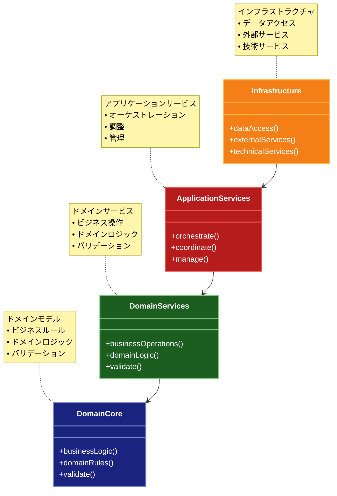

# Onion Architecture（オニオンアーキテクチャ）

## 目的

ドメインモデルを中心に据え、すべての依存関係を内側に向けることで、ビジネスロジックの純粋性を保ち、テスト容易性と保守性を向上させます。

## 価値・解決する問題

- ドメインロジックの純粋性の確保
- 依存関係の明確な方向性
- テスト容易性の向上
- ビジネスルールの保護
- 外部依存からの分離
- 変更に強い設計の実現

## 概要・特徴

### 概要

オニオンアーキテクチャは、アプリケーションを同心円状の層に分割し、すべての依存関係が内側に向かうように設計するアーキテクチャパターンです。中心にはドメインモデルとビジネスロジックを配置し、外側に行くほど具体的な実装が配置されます。これにより、ビジネスロジックが技術的な実装の詳細から完全に分離され、ドメイン中心の設計が実現します。

### 特徴

#### ドメインモデルの中心化
オニオンアーキテクチャでは、アプリケーションのコアとなるドメインモデルが中心に位置し、最も重要視されます。このドメインモデルは、ビジネスエンティティと基本的なビジネスルールを含み、外部の依存関係や技術的な詳細から完全に独立しています。例えば、顧客、注文、商品などのエンティティとそれらの基本的な振る舞いが中心層に配置されます。この中心化により、ビジネスの本質的な概念とルールが明確に表現され、技術的な実装の詳細に埋もれることなく、ドメイン駆動設計の原則に沿った開発が可能になります。また、ドメインモデルの変更がシステム全体に与える影響を最小限に抑えることができます。

#### 依存関係の一方向性
オニオンアーキテクチャの基本原則は、すべての依存関係が内側の層に向かって流れるという点です。外側の層は内側の層に依存することはできますが、内側の層は外側の層を知りません。例えば、データアクセス層はドメインサービス層に依存できますが、ドメインサービス層はデータアクセス層に依存することはできません。この一方向の依存関係により、内側の層、特にドメインモデルとビジネスロジックは、外部の技術的な実装の詳細から保護されます。この原則を適用することで、データベース、UI、フレームワークなどの外部依存が変更されても、ビジネスロジックに影響を与えないシステムを構築できます。

#### インターフェースを通じた抽象化
オニオンアーキテクチャでは、内側の層が外側の層のサービスを利用する必要がある場合、依存性逆転の原則（DIP）を適用します。内側の層はインターフェースを定義し、外側の層がそれを実装します。例えば、ドメインサービスがデータの永続化を必要とする場合、リポジトリインターフェースを定義し、データアクセス層がそれを実装します。この抽象化により、内側の層は具体的な実装に依存せず、抽象に依存することになり、結合度が低減します。また、この設計によりモックやスタブを使用したテストが容易になり、ビジネスロジックの単体テストが外部依存なしで行えるようになります。

#### 明確な層の分離
オニオンアーキテクチャは、アプリケーションを複数の同心円状の層に分割します。一般的に、中心から外側に向かって、ドメインモデル層、ドメインサービス層、アプリケーションサービス層、インフラストラクチャ層という構成になります。各層には明確な責務があり、層を越えた依存関係は常に内側に向かいます。この明確な層の分離により、各層は単一の責任を持ち、変更の影響範囲が限定されます。例えば、データベースの変更はインフラストラクチャ層のみに影響し、ビジネスロジックの変更はドメインサービス層に限定されます。この構造により、システムの理解しやすさと保守性が向上します。

#### テスト駆動開発との親和性
オニオンアーキテクチャは、テスト駆動開発（TDD）との親和性が非常に高く、テスト容易性を大幅に向上させます。内側の層、特にドメインモデルとビジネスロジックは外部依存から分離されているため、モックやスタブなしで単体テストを行うことができます。また、外側の層のテストでは、インターフェースを通じた依存関係をモックに置き換えることで、分離したテストが可能になります。この設計により、テストの実行速度が向上し、テストカバレッジを高めやすくなります。また、ビジネスロジックに対する自信を持ってリファクタリングや機能追加を行うことができ、長期的な品質と保守性が向上します。

### 概要図



## コード例

### Before:

```typescript
// 外部依存に直接結合したドメインロジック
class Order {
  constructor(
    private id: string,
    private customerId: string,
    private items: OrderItem[],
    private database: Database,
    private paymentGateway: PaymentGateway,
    private emailService: EmailService
  ) {}

  async process() {
    // データベースに直接依存
    const customer = await this.database.customers.findOne({
      id: this.customerId,
    });

    // 支払い処理に直接依存
    const paymentResult = await this.paymentGateway.processPayment({
      amount: this.calculateTotal(),
      customerId: this.customerId,
      orderId: this.id,
    });

    if (paymentResult.success) {
      // データベース更新に直接依存
      await this.database.orders.update(
        {id: this.id},
        {status: "PAID"}
      );

      // メール送信に直接依存
      await this.emailService.sendOrderConfirmation({
        to: customer.email,
        orderId: this.id,
        amount: this.calculateTotal(),
      });
    } else {
      throw new Error("Payment failed");
    }
  }

  private calculateTotal(): number {
    return this.items.reduce(
      (sum, item) => sum + item.price * item.quantity,
      0
    );
  }
}

// インフラストラクチャに依存したビジネスルール
class OrderValidator {
  constructor(private database: Database) {}

  async validate(order: Order): Promise<boolean> {
    // データベースに直接依存した検証ロジック
    const customer = await this.database.customers.findOne({
      id: order.customerId,
    });

    if (!customer) {
      return false;
    }

    for (const item of order.items) {
      const product = await this.database.products.findOne({
        id: item.productId,
      });
      if (!product || product.stock < item.quantity) {
        return false;
      }
    }

    return true;
  }
}
```

### After:

```typescript
// ドメイン層（中心）
// エンティティとビジネスルール
class Order {
  constructor(
    private props: {
      id: string;
      customerId: string;
      items: OrderItem[];
      status: OrderStatus;
    }
  ) {
    this.validateState();
  }

  private validateState(): void {
    if (this.props.items.length === 0) {
      throw new DomainError("Order must have at least one item");
    }
    if (this.calculateTotal() <= 0) {
      throw new DomainError("Order total must be positive");
    }
  }

  calculateTotal(): number {
    return this.props.items.reduce(
      (sum, item) => sum + item.price * item.quantity,
      0
    );
  }

  markAsPaid(): void {
    if (this.props.status !== "PENDING") {
      throw new DomainError("Order must be pending to be marked as paid");
    }
    this.props.status = "PAID";
  }

  // ゲッター
  get id(): string {
    return this.props.id;
  }
  get customerId(): string {
    return this.props.customerId;
  }
  get items(): OrderItem[] {
    return [...this.props.items];
  }
  get status(): OrderStatus {
    return this.props.status;
  }
}

// ドメインサービス層
class OrderService {
  constructor(private orderValidator: OrderValidator) {}

  async processOrder(order: Order): Promise<void> {
    // ドメインルールの適用
    const validationResult = await this.orderValidator.validate(order);
    if (!validationResult.isValid) {
      throw new DomainError(validationResult.error);
    }
  }
}

// アプリケーションサービス層
class OrderApplicationService {
  constructor(
    private orderService: OrderService,
    private orderRepository: OrderRepository,
    private customerRepository: CustomerRepository,
    private paymentService: PaymentService,
    private notificationService: NotificationService
  ) {}

  async processOrder(orderId: string): Promise<void> {
    // ドメインオブジェクトの取得
    const order = await this.orderRepository.findById(orderId);
    if (!order) {
      throw new ApplicationError("Order not found");
    }

    // ドメインサービスの実行
    await this.orderService.processOrder(order);

    // 支払い処理
    const paymentResult = await this.paymentService.processPayment({
      orderId: order.id,
      amount: order.calculateTotal(),
    });

    if (paymentResult.success) {
      // ドメインモデルの更新
      order.markAsPaid();
      await this.orderRepository.save(order);

      // 通知
      const customer = await this.customerRepository.findById(
        order.customerId
      );
      await this.notificationService.notifyOrderProcessed({
        orderId: order.id,
        customerEmail: customer.email,
        amount: order.calculateTotal(),
      });
    } else {
      throw new ApplicationError("Payment failed");
    }
  }
}

// インフラストラクチャ層（最外層）
// リポジトリの実装
class PrismaOrderRepository implements OrderRepository {
  constructor(private prisma: PrismaClient) {}

  async findById(id: string): Promise<Order | null> {
    const orderData = await this.prisma.order.findUnique({
      where: {id},
      include: {items: true},
    });

    if (!orderData) return null;

    return new Order({
      id: orderData.id,
      customerId: orderData.customerId,
      items: orderData.items,
      status: orderData.status,
    });
  }

  async save(order: Order): Promise<void> {
    await this.prisma.order.update({
      where: {id: order.id},
      data: {
        status: order.status,
        items: {
          deleteMany: {},
          create: order.items,
        },
      },
    });
  }
}

// 支払いサービスの実装
class StripePaymentService implements PaymentService {
  constructor(private stripe: Stripe) {}

  async processPayment(request: PaymentRequest): Promise<PaymentResult> {
    try {
      const paymentIntent = await this.stripe.paymentIntents.create({
        amount: request.amount,
        currency: "usd",
        metadata: {orderId: request.orderId},
      });

      return {
        success: true,
        transactionId: paymentIntent.id,
      };
    } catch (error) {
      return {
        success: false,
        error: error.message,
      };
    }
  }
}

// 通知サービスの実装
class SendGridNotificationService implements NotificationService {
  constructor(private sendGrid: SendGrid) {}

  async notifyOrderProcessed(notification: OrderProcessedNotification): Promise<void> {
    await this.sendGrid.send({
      to: notification.customerEmail,
      subject: `Order ${notification.orderId} Processed`,
      text: `Your order has been processed. Total amount: $${notification.amount}`,
    });
  }
}

// 依存性の注入設定
const orderRepository = new PrismaOrderRepository(prisma);
const customerRepository = new PrismaCustomerRepository(prisma);
const paymentService = new StripePaymentService(stripe);
const notificationService = new SendGridNotificationService(sendGrid);
const orderValidator = new OrderValidator();
const orderService = new OrderService(orderValidator);
const orderApplicationService = new OrderApplicationService(
  orderService,
  orderRepository,
  customerRepository,
  paymentService,
  notificationService
);
```

## 類似パターンとの比較

- [Clean Architecture（クリーンアーキテクチャ）](clean-architecture.md): Onion Architectureはドメインモデルを中心に据え、Clean Architectureはユースケースを中心に据えます。
- [Hexagonal Architecture（ヘキサゴナルアーキテクチャ）](hexagonal-architecture.md): Onion Architectureは依存関係の方向性を強調し、Hexagonal Architectureはポートとアダプターを通じた外部との通信を強調します。
- [Layered Architecture（レイヤードアーキテクチャ）](layered-architecture.md): Onion Architectureは依存関係を内側に向けることを強制し、Layered Architectureは上位から下位への依存を許容します。

## 利用されているライブラリ／フレームワークの事例

- [NestJS](https://github.com/nestjs/nest/tree/master/sample/32-graphql-federation): Onion Architectureの原則に基づいたモジュール構造を提供
- [Domain-Driven Design in .NET](https://github.com/dotnet-architecture/eShopOnContainers): Onion Architectureを採用したマイクロサービスアーキテクチャの実装
- [TypeORM](https://github.com/typeorm/typeorm/tree/master/sample/sample11-all-types-entity): エンティティとリポジトリパターンを通じたOnion Architectureの実現を支援 

### 概要図

