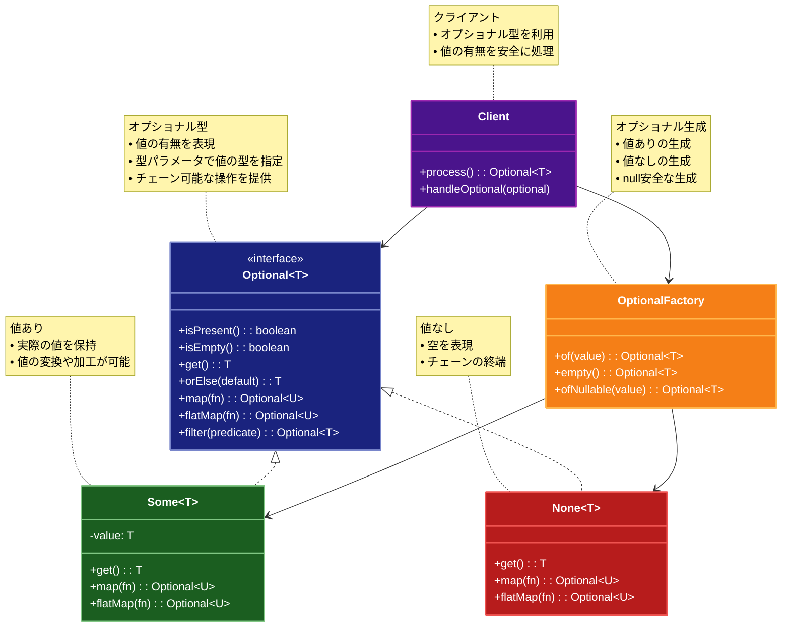

# Optional（オプショナル）パターン

## 目的

nullを使用せずに値の有無を表現し、型安全に値の存在を扱うパターンです。

## 価値・解決する問題

- nullポインタ例外の防止
- 値の有無の明示的な表現
- 型安全な値の操作
- コードの可読性向上

## 概要・特徴

### 概要

Optionalパターンは、値が存在するかしないかを表現する型を提供し、nullを使用せずに値の有無を安全に扱うパターンです。

### 特徴

#### 型安全性
Optionalパターンの主要な特徴の一つは、値の存在または不在を型システムを通じて安全に取り扱える点です。従来の方法では、存在しない値を表すためにnullを使用していましたが、これは実行時のnull参照例外（NullReferenceException）というリスクをもたらします。一方、Optionalパターンでは、値が存在するかしないかを型として明示的に表現するため、コンパイル時に潜在的な問題を検出できます。例えば、`Optional<User>`型を使用すると、コードを書く人にも読む人にも「ユーザー情報が存在しない可能性がある」ことが明確に伝わります。これにより、開発者は値を使用する前に必ず存在チェックを行うよう促され、予期せぬエラーを防止できます。また、IDEによる型チェックやコード補完も効果的に働くため、安全なコードの記述をサポートします。この型安全性は特に大規模なアプリケーションや複数人での開発において、バグの減少と保守性の向上に大きく貢献します。

#### nullの排除
Optionalパターンの重要な目的は、プログラム内からnull参照を排除することです。Javaの発明者であるトニー・ホーア氏は後に「nullの発明は10億ドルの誤り」と述べたように、nullはプログラミングにおける多くの問題の原因となっています。Optionalパターンを使用することで、nullの代わりに明示的な「値なし」の状態を表現でき、nullチェックの代わりに型安全な操作を行えるようになります。例えば、データベースからユーザーを検索する関数が「ユーザーが見つからない」場合に単にnullを返すのではなく、`Optional.empty()`を返すことで、呼び出し元はその結果を安全に扱えます。この方針を一貫して適用することで、コードベース全体から「NullPointerException」などのランタイムエラーを劇的に減らすことができます。また、nullの排除は単にエラーを減らすだけでなく、「値が存在しない」という状態を明示的にモデル化することで、ドメインの表現力を高め、コードの意図を明確にする効果もあります。

#### メソッドチェーン
Optionalパターンは、連続した操作をメソッドチェーンとして表現できる能力を提供します。これにより、値が存在する場合にのみ実行される一連の処理を、入れ子になったif文なしに簡潔に記述できます。例えば、ユーザーIDからユーザーを取得し、そのアドレスを取得し、さらに郵便番号を抽出するという一連の操作を、`userId.flatMap(this::getUser).flatMap(User::getAddress).map(Address::getZipCode)`のように記述できます。このチェーン操作では、各ステップで値が存在しない場合、後続の処理はスキップされ、最終的に空のOptionalが返されます。このスタイルは「鉄道指向プログラミング」とも呼ばれ、処理の「幸福経路」と「エラー経路」を明確に分離することができます。メソッドチェーンは特に、データの変換や抽出が複数のステップを経る場合に威力を発揮し、コードの可読性と保守性を大幅に向上させます。また、処理の流れを一直線上に表現できるため、デバッグやコードレビュー時の理解も容易になります。このようなパイプライン処理スタイルは、命令型プログラミングよりも宣言型プログラミングに近く、「何を」達成したいかに焦点を当てることができます。

#### 関数型プログラミング
Optionalパターンは関数型プログラミングのパラダイムから多くのインスピレーションを得ており、値を変換するための純粋関数の適用を促進します。`map`、`flatMap`、`filter`などの高階関数を提供することで、副作用のない方法で値を処理し、変換することができます。例えば、`optional.map(user -> user.getName())`のような処理は、値が存在する場合にのみ関数を適用し、その結果を新しいOptionalにラップします。このアプローチは、値の変換ロジックを小さな純粋関数に分解し、それらを合成することを奨励します。関数型の方法は特に、並行処理や非同期処理と相性が良く、コードの理解しやすさとテスト容易性を向上させます。また、副作用を制限することで、予期せぬ状態変更によるバグのリスクを減らし、プログラムの動作をより予測可能にします。これらの関数型アプローチはコードの再利用性も高め、共通の変換や検証ロジックを別の場所で定義し、必要な場所で適用することが容易になります。この関数型パラダイムへの傾倒は、モダンなプログラミング言語やライブラリの多くに見られる傾向と一致しており、Optionalもその一部として、より宣言的で堅牢なコーディングスタイルを促進します。

#### パターンマッチング
多くの言語実装では、Optionalパターンはパターンマッチングのような機能を提供し、値の存在・不在に応じた処理を簡潔に記述できます。例えば、`ifPresent`、`ifPresentOrElse`、`orElse`などのメソッドや、より洗練されたマッチングを可能にする構文を使用できます。これにより、値の状態に基づいた条件分岐を明示的かつ簡潔に表現できます。例えば、Javaの場合、`optional.ifPresent(user -> sendEmail(user))`や`optional.orElseThrow(() -> new UserNotFoundException())`のような形で、値の存在・不在に応じた振る舞いを指定できます。より高度なパターンマッチングをサポートする言語（ScalaやKotlinなど）では、さらに表現力豊かな構文でケースを処理できます。このアプローチは条件分岐の意図を明確にし、すべてのケースが適切に処理されることを保証します。また、新しいケースが追加された場合にコンパイラが網羅性チェックを行える言語もあり、保守性が向上します。パターンマッチングは特に、複雑なドメインロジックや、さまざまな条件に基づいた処理が必要な場合に威力を発揮し、コードの簡潔さと表現力を両立します。

### 概要図



## 類似パターンとの比較

- [Null Object (ヌルオブジェクト)](null-object.md): Optional は値の存在を型で表現し、これに対して Null Object はデフォルトの振る舞いを提供します。
- [Maybe (メイビー)](maybe.md): Optional は値の存在を型で表現し、これに対して Maybe は値の不確実性を表現します。
- [Result (リザルト)](result.md): Optional は値の存在を型で表現し、これに対して Result は成功/失敗を型で表現します。

## 利用されているライブラリ／フレームワークの事例

- [Java Optional](https://docs.oracle.com/javase/8/docs/api/java/util/Optional.html): 値の存在を表現
- [Scala Option](https://www.scala-lang.org/api/current/scala/Option.html): 値の存在を表現
- [TypeScript Optional Chaining](https://www.typescriptlang.org/docs/handbook/release-notes/typescript-3-7.html): 値の存在確認

## 解説ページリンク

- [Refactoring Guru - Optional](https://refactoring.guru/design-patterns/optional)
- [Oracle - Optional Class](https://docs.oracle.com/javase/8/docs/api/java/util/Optional.html)
- [Baeldung - Java Optional](https://www.baeldung.com/java-optional)

## コード例

### Before:

`null`チェックを直接行う実装

```typescript
// ユーザー型の定義
interface User {
  id: number;
  name: string;
  email: string | null;
  address: {
    street: string | null;
    city: string | null;
    country: string | null;
  } | null;
}

// ユーザーサービス
class UserService {
  private users: Map<number, User> = new Map();

  constructor() {
    // テストデータの追加
    this.users.set(1, {
      id: 1,
      name: "John Doe",
      email: "john@example.com",
      address: {
        street: "123 Main St",
        city: "New York",
        country: "USA"
      }
    });

    this.users.set(2, {
      id: 2,
      name: "Jane Smith",
      email: null,
      address: null
    });
  }

  findUser(id: number): User | null {
    return this.users.get(id) || null;
  }

  getEmailDomain(id: number): string | null {
    const user = this.findUser(id);
    if (!user) {
      return null;
    }

    const email = user.email;
    if (!email) {
      return null;
    }

    const atIndex = email.indexOf("@");
    if (atIndex === -1) {
      return null;
    }

    return email.slice(atIndex + 1);
  }

  getUserAddress(id: number): string | null {
    const user = this.findUser(id);
    if (!user) {
      return null;
    }

    const address = user.address;
    if (!address) {
      return null;
    }

    const street = address.street;
    const city = address.city;
    const country = address.country;

    if (!street || !city || !country) {
      return null;
    }

    return `${street}, ${city}, ${country}`;
  }

  sendEmailNotification(id: number, message: string): boolean {
    const user = this.findUser(id);
    if (!user) {
      console.log(`ユーザーが見つかりません: ${id}`);
      return false;
    }

    if (!user.email) {
      console.log(`メールアドレスが設定されていません: ${user.name}`);
      return false;
    }

    // メール送信のシミュレーション
    console.log(`メール送信: To ${user.email}`);
    console.log(`件名: 通知`);
    console.log(`本文: ${message}`);
    return true;
  }
}

// 使用例
function example() {
  const service = new UserService();

  console.log("=== メールドメインの取得 ===");
  console.log("User 1:", service.getEmailDomain(1));
  console.log("User 2:", service.getEmailDomain(2));
  console.log("User 3:", service.getEmailDomain(3));

  console.log("\n=== 住所の取得 ===");
  console.log("User 1:", service.getUserAddress(1));
  console.log("User 2:", service.getUserAddress(2));
  console.log("User 3:", service.getUserAddress(3));

  console.log("\n=== メール通知の送信 ===");
  service.sendEmailNotification(1, "こんにちは、User 1!");
  service.sendEmailNotification(2, "こんにちは、User 2!");
  service.sendEmailNotification(3, "こんにちは、User 3!");
}

example();
```

### After:

Optionalパターンを適用した実装

```typescript
// Optionalクラスの実装
class Optional<T> {
  private constructor(private value: T | null) {}

  // 値を持つOptionalを作成
  static of<T>(value: T): Optional<T> {
    if (value === null || value === undefined) {
      throw new Error("値がnullまたはundefinedです");
    }
    return new Optional(value);
  }

  // 空のOptionalを作成
  static empty<T>(): Optional<T> {
    return new Optional<T>(null);
  }

  // nullableな値からOptionalを作成
  static ofNullable<T>(value: T | null | undefined): Optional<T> {
    return value === null || value === undefined
      ? Optional.empty()
      : Optional.of(value);
  }

  // 値が存在する場合にその値を返し、存在しない場合は代替値を返す
  orElse(other: T): T {
    return this.value !== null ? this.value : other;
  }

  // 値が存在する場合にその値を返し、存在しない場合は関数を実行して値を取得
  orElseGet(supplier: () => T): T {
    return this.value !== null ? this.value : supplier();
  }

  // 値が存在する場合にその値を返し、存在しない場合は例外をスロー
  orElseThrow(errorSupplier: () => Error): T {
    if (this.value === null) {
      throw errorSupplier();
    }
    return this.value;
  }

  // 値が存在する場合に処理を実行
  ifPresent(consumer: (value: T) => void): void {
    if (this.value !== null) {
      consumer(this.value);
    }
  }

  // 値が存在する場合と存在しない場合の両方の処理を実行
  ifPresentOrElse(consumer: (value: T) => void, emptyAction: () => void): void {
    if (this.value !== null) {
      consumer(this.value);
    } else {
      emptyAction();
    }
  }

  // 値が存在し、条件を満たす場合にその値を持つOptionalを返し、
  // それ以外の場合は空のOptionalを返す
  filter(predicate: (value: T) => boolean): Optional<T> {
    if (this.value === null || !predicate(this.value)) {
      return Optional.empty();
    }
    return this;
  }

  // 値が存在する場合に変換を適用し、新しいOptionalを返す
  map<U>(mapper: (value: T) => U): Optional<U> {
    if (this.value === null) {
      return Optional.empty();
    }
    return Optional.ofNullable(mapper(this.value));
  }

  // 値が存在する場合に変換を適用し、変換結果のOptionalを返す
  flatMap<U>(mapper: (value: T) => Optional<U>): Optional<U> {
    if (this.value === null) {
      return Optional.empty();
    }
    return mapper(this.value);
  }

  // 値が存在するかどうかを返す
  isPresent(): boolean {
    return this.value !== null;
  }

  // 値が存在しないかどうかを返す
  isEmpty(): boolean {
    return this.value === null;
  }

  // 値を取得
  get(): T | null {
    return this.value;
  }
}

// ユーザー型の定義
interface User {
  id: number;
  name: string;
  email: string | null;
  address: {
    street: string | null;
    city: string | null;
    country: string | null;
  } | null;
}

// ユーザーサービス
class UserService {
  private users: Map<number, User> = new Map();

  constructor() {
    // テストデータの追加
    this.users.set(1, {
      id: 1,
      name: "John Doe",
      email: "john@example.com",
      address: {
        street: "123 Main St",
        city: "New York",
        country: "USA"
      }
    });

    this.users.set(2, {
      id: 2,
      name: "Jane Smith",
      email: null,
      address: null
    });
  }

  findUser(id: number): Optional<User> {
    return Optional.ofNullable(this.users.get(id));
  }

  getEmailDomain(id: number): Optional<string> {
    return this.findUser(id)
      .map(user => user.email)
      .filter(email => email !== null)
      .flatMap(email => {
        const atIndex = email.indexOf("@");
        return atIndex === -1
          ? Optional.empty()
          : Optional.of(email.slice(atIndex + 1));
      });
  }

  getUserAddress(id: number): Optional<string> {
    return this.findUser(id)
      .map(user => user.address)
      .filter(address => address !== null)
      .flatMap(address => {
        const { street, city, country } = address;
        return street && city && country
          ? Optional.of(`${street}, ${city}, ${country}`)
          : Optional.empty();
      });
  }

  sendEmailNotification(id: number, message: string): boolean {
    return this.findUser(id)
      .map(user => ({
        email: Optional.ofNullable(user.email),
        name: user.name
      }))
      .map(({ email, name }) => {
        return email
          .map(emailAddress => {
            // メール送信のシミュレーション
            console.log(`メール送信: To ${emailAddress}`);
            console.log(`件名: 通知`);
            console.log(`本文: ${message}`);
            return true;
          })
          .orElseGet(() => {
            console.log(`メールアドレスが設定されていません: ${name}`);
            return false;
          });
      })
      .orElseGet(() => {
        console.log(`ユーザーが見つかりません: ${id}`);
        return false;
      });
  }
}

// 使用例
function example() {
  const service = new UserService();

  console.log("=== メールドメインの取得 ===");
  service.getEmailDomain(1).ifPresentOrElse(
    domain => console.log("User 1:", domain),
    () => console.log("User 1: ドメインが取得できません")
  );

  service.getEmailDomain(2).ifPresentOrElse(
    domain => console.log("User 2:", domain),
    () => console.log("User 2: ドメインが取得できません")
  );

  service.getEmailDomain(3).ifPresentOrElse(
    domain => console.log("User 3:", domain),
    () => console.log("User 3: ドメインが取得できません")
  );

  console.log("\n=== 住所の取得 ===");
  service.getUserAddress(1).ifPresentOrElse(
    address => console.log("User 1:", address),
    () => console.log("User 1: 住所が取得できません")
  );

  service.getUserAddress(2).ifPresentOrElse(
    address => console.log("User 2:", address),
    () => console.log("User 2: 住所が取得できません")
  );

  service.getUserAddress(3).ifPresentOrElse(
    address => console.log("User 3:", address),
    () => console.log("User 3: 住所が取得できません")
  );

  console.log("\n=== メール通知の送信 ===");
  service.sendEmailNotification(1, "こんにちは、User 1!");
  service.sendEmailNotification(2, "こんにちは、User 2!");
  service.sendEmailNotification(3, "こんにちは、User 3!");

  // Optionalの高度な使用例
  console.log("\n=== Optionalの高度な使用例 ===");

  // filter の使用例
  console.log("\n# filter の使用例");
  service.findUser(1)
    .map(user => user.email)
    .filter(email => email !== null && email.endsWith("@example.com"))
    .ifPresentOrElse(
      email => console.log("example.comのメールアドレス:", email),
      () => console.log("example.comのメールアドレスではありません")
    );

  // flatMap の使用例
  console.log("\n# flatMap の使用例");
  service.findUser(1)
    .flatMap(user => Optional.ofNullable(user.address))
    .flatMap(address => Optional.ofNullable(address.country))
    .ifPresentOrElse(
      country => console.log("国:", country),
      () => console.log("国が設定されていません")
    );

  // orElseThrow の使用例
  console.log("\n# orElseThrow の使用例");
  try {
    const user3 = service.findUser(3)
      .orElseThrow(() => new Error("ユーザーが見つかりません"));
    console.log("User 3:", user3);
  } catch (error) {
    console.log("エラー:", error.message);
  }
}

example();
```

