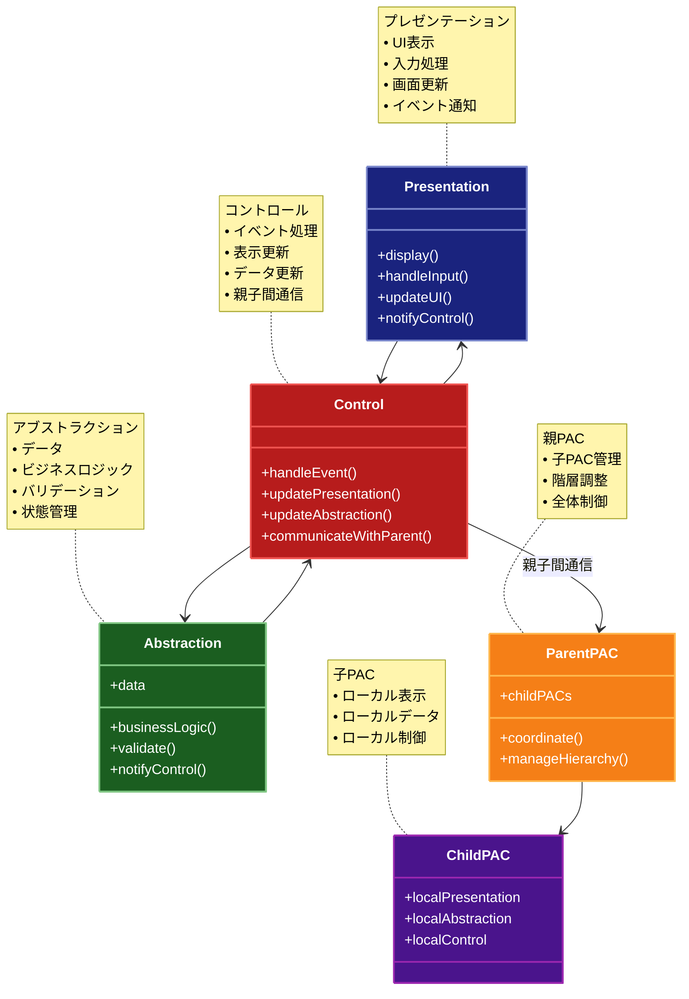

# PAC (Presentation-Abstraction-Control) パターン

## 目的

UIコンポーネントを階層的に構造化し、各コンポーネントをプレゼンテーション、アブストラクション、コントロールの3つの要素に分割することで、複雑なユーザーインターフェースを管理しやすくするパターン。

## 価値・解決する問題

- 複雑なUIを階層的に分割して管理できる
- コンポーネント間の依存関係を明確に制御できる
- UIコンポーネントの再利用性が向上する
- 各コンポーネントの役割が明確になる
- テストがしやすくなる

## 概要・特徴

### 概要

PACパターンは、複雑なユーザーインターフェースを階層的に構造化するためのアーキテクチャパターンです。各コンポーネントは、プレゼンテーション（UI表示）、アブストラクション（データと処理）、コントロール（調整役）の3つの要素で構成されます。

### 特徴

#### 階層構造による管理
PACパターンの最も顕著な特徴は、ユーザーインターフェースの複雑さを階層構造によって管理する能力です。この階層構造では、各エージェント（PAC）が独自のプレゼンテーション、アブストラクション、コントロールのコンポーネントを持ち、それらが協調して動作します。親PACは子PACを管理し、システム全体の一貫性を保ちながら、複雑なUIを論理的な単位に分割できます。例えば、複雑なダッシュボードアプリケーションでは、全体を管理する親PACの下に、グラフ表示用、データテーブル用、設定パネル用などの子PACを配置することができます。これにより、大規模なアプリケーションでも、各部分が独立して開発・テスト・メンテナンスが可能になり、全体の複雑さを効果的に管理できます。また、必要に応じて階層を深くしたり、動的に構造を変更したりすることも可能で、アプリケーションの成長に応じてアーキテクチャを進化させることができます。

#### コンポーネントの独立性
PACパターンでは、各エージェント（PAC）がプレゼンテーション（UI）、アブストラクション（データとロジック）、コントロール（調整役）の3つの明確に分離されたコンポーネントで構成されています。この明確な分離により、各コンポーネントが独立して進化・更新できるようになります。例えば、UIデザインが変更されても、基盤となるビジネスロジックは影響を受けません。同様に、データ構造やビジネスルールが変更されても、UIの変更は最小限に抑えられます。このコンポーネントの独立性は、大規模なチームでの開発において特に有益で、UI設計者、ビジネスロジック開発者、システム統合担当者などが並行して作業できます。また、各コンポーネントは明確な責任と境界を持つため、単体テストが容易になり、バグの特定や修正も効率的に行えます。さらに、コンポーネントを個別に最適化することもでき、例えばパフォーマンスクリティカルなアブストラクション部分だけを改善することも可能です。

#### 明確な役割分担
PACパターンにおいて、各コンポーネントは明確に定義された役割と責任を持っています。プレゼンテーションはユーザーへの情報表示とユーザー入力の処理を担当し、アブストラクションはデータ管理とビジネスロジックを提供し、コントロールはこれらのコンポーネント間の調整と親子PAC間の通信を管理します。この明確な役割分担により、コードの見通しが良くなり、どのコンポーネントがどの機能を担当しているかが一目で分かります。例えば、UIの変更はプレゼンテーションだけを見れば良く、ビジネスルールの変更はアブストラクションだけを対象にすれば十分です。これにより、開発チーム内での責任分担も明確になり、UI専門家はプレゼンテーション、ドメイン専門家はアブストラクション、アーキテクト担当者はコントロールとその連携に集中できます。また、コードレビューや保守も効率的に行えるようになり、特定の問題が発生した場合に、どのコンポーネントを調査すべきかが明確になります。このような明確な責任の分離は、特に長期的なメンテナンスが必要な大規模システムにおいて、コードの品質とプロジェクトの持続可能性を高めます。

#### 柔軟な拡張性
PACパターンの階層的な性質により、アプリケーションは非常に柔軟に拡張できます。新しい機能や画面を追加する場合、既存の構造を大きく変更することなく、新しいPACエージェントとして実装し、適切な階層位置に統合するだけで済みます。例えば、ダッシュボードアプリケーションに新しい分析モジュールを追加する場合、新しい子PACを作成し、既存の親PACに接続するだけです。これにより、既存機能に影響を与えることなく、新機能を段階的に導入できます。また、PACパターンは新しいUIコンポーネント、新しいデータソース、あるいは新しい制御ロジックなど、特定の側面だけを拡張することも容易にします。例えば、モバイル向けの新しいUIを追加する場合、既存のアブストラクションとコントロールを再利用しながら、プレゼンテーション部分だけを新たに実装することができます。この拡張性はアプリケーションの進化を促進し、ビジネス要件の変化に迅速に対応できるようにします。さらに、プラグインやモジュールベースのアーキテクチャとの相性も良く、サードパーティによる拡張も容易になります。

#### 再利用性の向上
PACパターンによる明確なコンポーネント分離と標準化されたインターフェースは、コードの再利用性を大きく向上させます。各PACエージェントは独立した機能単位として設計されるため、異なるコンテキストや他のアプリケーションでも再利用しやすくなります。例えば、データ可視化のためのグラフPACエージェントは、様々なアプリケーションで再利用できます。さらに、共通機能を持つ基底クラスを作成し、それを拡張することで、類似したPACエージェントの実装労力を削減することも可能です。また、プレゼンテーション、アブストラクション、コントロールの各コンポーネントも個別に再利用できるため、例えば同じデータモデルに対して異なるUIを提供する場合、アブストラクション部分だけを再利用することができます。この再利用性は開発時間の短縮とコードの品質向上につながり、組織全体でのコンポーネントライブラリの構築を促進します。実際の開発プロジェクトでは、再利用可能なPACコンポーネントのカタログを作成し、新機能開発時にはまずそこから適切なコンポーネントを検索して活用するというプラクティスも効果的です。

### 概要図



## 類似パターンとの比較

- [MVC](mvc.md)
  - MVCはシンプルな単一階層の構造に対して、PACは階層的な構造を持つ
  - MVCはコントローラーがモデルとビューの間の調整役であるのに対して、PACはコントロールが親子間の通信も担当する

- [MVP](mvp.md)
  - MVPはプレゼンターを介してモデルとビューを分離するのに対して、PACはコントロールを介して階層間の通信を制御する
  - MVPは単一階層の構造であるのに対して、PACは階層的な構造を持つ

- [MVVM](mvvm.md)
  - MVVMはデータバインディングを使用してビューとビューモデルを連携させるのに対して、PACはコントロールを介して明示的に連携を制御する
  - MVVMは単一階層の構造であるのに対して、PACは階層的な構造を持つ

## 利用されているライブラリ／フレームワークの事例

- [JavaFX](https://github.com/openjdk/jfx)
  - Scene Graphの階層構造
  - コンポーネントの分割管理

- [Qt](https://github.com/qt/qt5)
  - Widgetの階層構造
  - シグナル/スロットメカニズム

## 解説ページリンク

- [PAC: A Pattern Language for Personal Academic Computing](https://www.cs.cmu.edu/~bam/papers/PLoP99%20PAC.pdf)
- [PAC (Presentation-Abstraction-Control)](https://www.dre.vanderbilt.edu/~schmidt/PDF/PAC.pdf)

## コード例

### Before:

```typescript
// 単一の大きなクラスで全ての機能を管理
class ComplexUI {
  private data: any
  private elements: HTMLElement[]

  constructor() {
    this.data = {}
    this.elements = []
  }

  // UIの表示
  display() {
    // 複雑なUI表示ロジック
  }

  // データの処理
  processData() {
    // 複雑なデータ処理ロジック
  }

  // イベント処理
  handleEvents() {
    // 複雑なイベント処理ロジック
  }

  // 状態更新
  updateState() {
    // 複雑な状態更新ロジック
  }
}
```

### After:

```typescript
// プレゼンテーション層
class Presentation {
  private control: Control

  constructor(control: Control) {
    this.control = control
  }

  // UI表示
  display() {
    // UI表示ロジック
  }

  // ユーザー入力処理
  handleInput(event: Event) {
    this.control.handleEvent(event)
  }

  // UI更新
  updateUI(data: any) {
    // UI更新ロジック
  }
}

// アブストラクション層
class Abstraction {
  private data: any
  private control: Control

  constructor(control: Control) {
    this.control = control
    this.data = {}
  }

  // ビジネスロジック
  processData(input: any) {
    // データ処理ロジック
    this.control.notifyDataChanged(this.data)
  }

  // バリデーション
  validate(input: any): boolean {
    // バリデーションロジック
    return true
  }
}

// コントロール層
class Control {
  private presentation: Presentation
  private abstraction: Abstraction
  private parent: ParentPAC | null

  constructor(parent: ParentPAC | null = null) {
    this.parent = parent
    this.presentation = new Presentation(this)
    this.abstraction = new Abstraction(this)
  }

  // イベント処理
  handleEvent(event: Event) {
    if (this.abstraction.validate(event)) {
      this.abstraction.processData(event)
    }
  }

  // データ変更通知
  notifyDataChanged(data: any) {
    this.presentation.updateUI(data)
    if (this.parent) {
      this.parent.notifyChildChanged(this, data)
    }
  }
}

// 親PAC
class ParentPAC {
  private children: Control[]

  constructor() {
    this.children = []
  }

  // 子PAC追加
  addChild(child: Control) {
    this.children.push(child)
  }

  // 子PAC変更通知
  notifyChildChanged(child: Control, data: any) {
    // 他の子PACに変更を通知
    this.children.forEach(otherChild => {
      if (otherChild !== child) {
        otherChild.handleEvent(data)
      }
    })
  }
}

// 使用例
const parent = new ParentPAC()
const child1 = new Control(parent)
const child2 = new Control(parent)

parent.addChild(child1)
parent.addChild(child2)
``` 