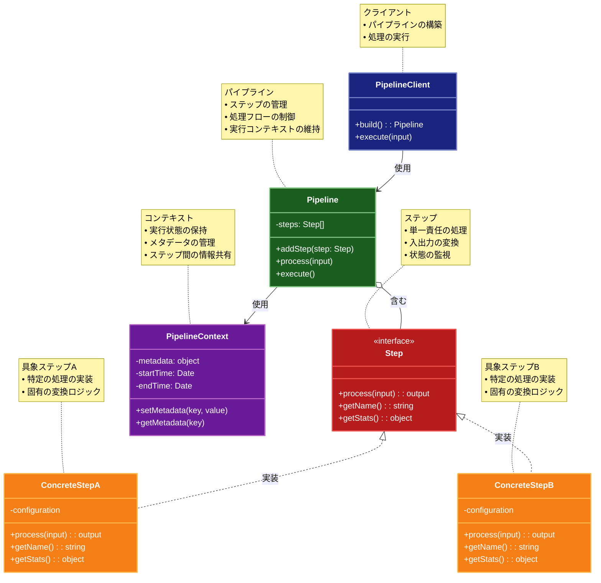

# Pipeline (パイプライン)

## 目的

一連の処理ステップを順次実行し、各ステップの出力が次のステップの入力となるような処理フローを構築します。これにより、複雑な処理を小さな独立したステップに分割し、柔軟な処理の組み合わせを実現します。

## 価値・解決する問題

- 複雑な処理フローの分割と整理
- 処理ステップの再利用性向上
- 処理フローの柔軟な組み替え
- 各ステップの独立性確保
- データ変換処理の段階的な実行
- 処理の並列化と最適化
- エラーハンドリングの局所化
- 処理の進捗監視と制御
- テスト容易性の向上（各ステップを独立してテスト可能）
- パフォーマンスのボトルネック特定が容易

## 概要・特徴

### 概要

Pipelineパターンは、複雑なデータ処理フローを一連の独立したステップに分割し、それらを順次実行する設計パターンです。各ステップは前のステップの出力を入力として受け取り、処理結果を次のステップに渡します。このパターンは、特にデータ変換、ETL処理、ビルドプロセスなどで広く使用されています。

### 特徴

- 単方向処理: データが一方向に流れ、各ステップが順次処理
- 入出力の明確化: 各ステップの入力と出力が明確に定義
- 独立性: 各ステップが独立して実装可能
- 再利用性: ステップを異なるパイプラインで再利用可能
- 柔軟性: ステップの追加・削除・並び替えが容易
- 並列処理: 独立したステップを並列実行可能
- エラー処理: 各ステップでのエラーを適切に処理
- 進捗管理: 処理の進捗状況を監視可能
- パフォーマンス最適化: ボトルネックの特定と最適化が容易

### 概要図



## 類似パターンとの比較

- [Chain of Responsibility (責任の連鎖)](chain-of-responsibility.md): Pipelineは単方向のデータ変換に注力し、これに対してChain of Responsibilityは条件付きの処理委譲に焦点を当てています。
- [Middleware (ミドルウェア)](middleware.md): Pipelineは単方向のデータ変換に注力し、これに対してMiddlewareは双方向処理とコンテキスト共有に焦点を当てています。
- [Builder (ビルダー)](builder.md): Pipelineはデータ変換の順次実行に注力し、これに対してBuilderはオブジェクトの段階的な構築に焦点を当てています。
- [Decorator (デコレーター)](decorator.md): Pipelineはデータ変換の連鎖に注力し、これに対してDecoratorは機能の動的な追加に焦点を当てています。

## 利用されているライブラリ／フレームワークの事例

- [Node.js Stream](https://nodejs.org/api/stream.html): ストリーム処理のパイプライン
- [Gulp](https://gulpjs.com/): ビルドプロセスのパイプライン
- [Apache Kafka](https://kafka.apache.org/): データストリーム処理
- [Azure Pipelines](https://azure.microsoft.com/services/devops/pipelines/): CI/CDパイプライン
- [scikit-learn Pipeline](https://scikit-learn.org/stable/modules/generated/sklearn.pipeline.Pipeline.html): 機械学習の処理パイプライン

## 解説ページリンク

- [Martin Fowler - Pipes and Filters](https://martinfowler.com/articles/collection-pipeline/)
- [Microsoft - Pipeline Pattern](https://docs.microsoft.com/azure/architecture/patterns/pipes-and-filters)
- [Baeldung - Pipeline Pattern in Java](https://www.baeldung.com/pipeline-pattern-java)
- [Design Patterns - Pipeline Pattern](https://www.oreilly.com/library/view/design-patterns-in/9781785888038/ch07.html)

## コード例

### Before:

単一の関数で全ての処理を行う実装

```typescript
interface ImageData {
  width: number;
  height: number;
  format: string;
  data: Buffer;
}

class ImageProcessor {
  async processImage(inputImage: ImageData): Promise<ImageData> {
    try {
      console.log("画像処理開始");

      // 画像のバリデーション
      if (!inputImage.data || inputImage.data.length === 0) {
        throw new Error("無効な画像データです");
      }
      if (inputImage.width <= 0 || inputImage.height <= 0) {
        throw new Error("無効な画像サイズです");
      }

      // フォーマット変換
      let processedData = inputImage.data;
      if (inputImage.format !== "jpeg") {
        processedData = await this.convertFormat(processedData, "jpeg");
      }

      // リサイズ
      if (inputImage.width > 1920 || inputImage.height > 1080) {
        processedData = await this.resize(processedData, 1920, 1080);
      }

      // 画質最適化
      processedData = await this.optimize(processedData);

      // メタデータ追加
      processedData = await this.addMetadata(processedData, {
        processed: new Date().toISOString()
      });

      console.log("画像処理完了");

      return {
        width: 1920,
        height: 1080,
        format: "jpeg",
        data: processedData
      };
    } catch (error) {
      console.error("画像処理エラー:", error);
      throw error;
    }
  }

  private async convertFormat(data: Buffer, format: string): Promise<Buffer> {
    console.log(`フォーマットを${format}に変換`);
    return data; // 実際の変換処理
  }

  private async resize(data: Buffer, width: number, height: number): Promise<Buffer> {
    console.log(`サイズを${width}x${height}に変更`);
    return data; // 実際のリサイズ処理
  }

  private async optimize(data: Buffer): Promise<Buffer> {
    console.log("画質を最適化");
    return data; // 実際の最適化処理
  }

  private async addMetadata(data: Buffer, metadata: Record<string, string>): Promise<Buffer> {
    console.log("メタデータを追加:", metadata);
    return data; // 実際のメタデータ追加処理
  }
}

// 使用例
async function example() {
  const processor = new ImageProcessor();
  const inputImage: ImageData = {
    width: 3840,
    height: 2160,
    format: "png",
    data: Buffer.from("dummy image data")
  };

  try {
    const result = await processor.processImage(inputImage);
    console.log("処理結果:", result);
  } catch (error) {
    console.error("エラー:", error);
  }
}

example();
```

### After:

Pipeline パターンを利用した実装

```typescript
interface ImageData {
  width: number;
  height: number;
  format: string;
  data: Buffer;
  metadata?: Record<string, string>;
  processingTime?: number;
  error?: Error;
}

interface PipelineStep<T> {
  execute(input: T): Promise<T>;
  name: string;
}

class Pipeline<T> {
  private steps: PipelineStep<T>[] = [];
  private errorHandlers: Array<(error: Error, data: T) => Promise<T>> = [];
  private progressHandlers: Array<(step: string, progress: number) => void> = [];

  addStep(step: PipelineStep<T>): Pipeline<T> {
    this.steps.push(step);
    return this;
  }

  onError(handler: (error: Error, data: T) => Promise<T>): Pipeline<T> {
    this.errorHandlers.push(handler);
    return this;
  }

  onProgress(handler: (step: string, progress: number) => void): Pipeline<T> {
    this.progressHandlers.push(handler);
    return this;
  }

  async execute(input: T): Promise<T> {
    let current = input;
    const startTime = Date.now();

    for (let i = 0; i < this.steps.length; i++) {
      const step = this.steps[i];
      try {
        console.log(`ステップ実行: ${step.name}`);
        this.notifyProgress(step.name, (i / this.steps.length) * 100);
        
        const stepStartTime = Date.now();
        current = await step.execute(current);
        const stepTime = Date.now() - stepStartTime;
        
        console.log(`ステップ完了: ${step.name} (${stepTime}ms)`);
      } catch (error) {
        console.error(`ステップでエラー発生: ${step.name}`, error);
        
        // エラーハンドラを実行
        for (const handler of this.errorHandlers) {
          try {
            current = await handler(error as Error, current);
          } catch (handlerError) {
            console.error("エラーハンドラでエラー発生:", handlerError);
          }
        }

        if (current.error) {
          break; // エラーが設定された場合は処理を中断
        }
      }
    }

    const totalTime = Date.now() - startTime;
    console.log(`パイプライン完了 (${totalTime}ms)`);
    this.notifyProgress("完了", 100);

    return {
      ...current,
      processingTime: totalTime
    };
  }

  private notifyProgress(step: string, progress: number): void {
    for (const handler of this.progressHandlers) {
      try {
        handler(step, progress);
      } catch (error) {
        console.error("進捗通知でエラー発生:", error);
      }
    }
  }
}

// バリデーションステップ
class ValidationStep implements PipelineStep<ImageData> {
  name = "バリデーション";

  async execute(input: ImageData): Promise<ImageData> {
    if (!input.data || input.data.length === 0) {
      throw new Error("無効な画像データです");
    }
    if (input.width <= 0 || input.height <= 0) {
      throw new Error("無効な画像サイズです");
    }
    return input;
  }
}

// フォーマット変換ステップ
class FormatConversionStep implements PipelineStep<ImageData> {
  name = "フォーマット変換";
  private targetFormat: string;

  constructor(targetFormat: string) {
    this.targetFormat = targetFormat;
  }

  async execute(input: ImageData): Promise<ImageData> {
    if (input.format === this.targetFormat) {
      return input;
    }

    return {
      ...input,
      format: this.targetFormat,
      data: await this.convertFormat(input.data, this.targetFormat)
    };
  }

  private async convertFormat(data: Buffer, format: string): Promise<Buffer> {
    console.log(`フォーマットを${format}に変換`);
    return data; // 実際の変換処理
  }
}

// リサイズステップ
class ResizeStep implements PipelineStep<ImageData> {
  name = "リサイズ";
  private maxWidth: number;
  private maxHeight: number;

  constructor(maxWidth: number, maxHeight: number) {
    this.maxWidth = maxWidth;
    this.maxHeight = maxHeight;
  }

  async execute(input: ImageData): Promise<ImageData> {
    if (input.width <= this.maxWidth && input.height <= this.maxHeight) {
      return input;
    }

    // アスペクト比を維持したリサイズ
    const ratio = Math.min(
      this.maxWidth / input.width,
      this.maxHeight / input.height
    );
    const newWidth = Math.round(input.width * ratio);
    const newHeight = Math.round(input.height * ratio);

    return {
      ...input,
      width: newWidth,
      height: newHeight,
      data: await this.resize(input.data, newWidth, newHeight)
    };
  }

  private async resize(data: Buffer, width: number, height: number): Promise<Buffer> {
    console.log(`サイズを${width}x${height}に変更`);
    return data; // 実際のリサイズ処理
  }
}

// 最適化ステップ
class OptimizationStep implements PipelineStep<ImageData> {
  name = "最適化";

  async execute(input: ImageData): Promise<ImageData> {
    return {
      ...input,
      data: await this.optimize(input.data)
    };
  }

  private async optimize(data: Buffer): Promise<Buffer> {
    console.log("画質を最適化");
    return data; // 実際の最適化処理
  }
}

// メタデータ追加ステップ
class MetadataStep implements PipelineStep<ImageData> {
  name = "メタデータ追加";

  async execute(input: ImageData): Promise<ImageData> {
    const metadata = {
      ...(input.metadata || {}),
      processed: new Date().toISOString(),
      processor: "ImagePipeline v1.0"
    };

    return {
      ...input,
      metadata,
      data: await this.addMetadata(input.data, metadata)
    };
  }

  private async addMetadata(data: Buffer, metadata: Record<string, string>): Promise<Buffer> {
    console.log("メタデータを追加:", metadata);
    return data; // 実際のメタデータ追加処理
  }
}

// 使用例
async function example() {
  // パイプラインの構築
  const pipeline = new Pipeline<ImageData>()
    .addStep(new ValidationStep())
    .addStep(new FormatConversionStep("jpeg"))
    .addStep(new ResizeStep(1920, 1080))
    .addStep(new OptimizationStep())
    .addStep(new MetadataStep());

  // エラーハンドラの追加
  pipeline.onError(async (error, data) => {
    console.error("エラーを検知:", error);
    return {
      ...data,
      error,
      metadata: {
        ...(data.metadata || {}),
        error: error.message,
        errorTime: new Date().toISOString()
      }
    };
  });

  // 進捗ハンドラの追加
  pipeline.onProgress((step, progress) => {
    console.log(`進捗: ${step} (${Math.round(progress)}%)`);
  });

  // パイプラインの実行
  const inputImage: ImageData = {
    width: 3840,
    height: 2160,
    format: "png",
    data: Buffer.from("dummy image data")
  };

  try {
    const result = await pipeline.execute(inputImage);
    console.log("処理結果:", {
      width: result.width,
      height: result.height,
      format: result.format,
      metadata: result.metadata,
      processingTime: result.processingTime,
      error: result.error
    });
  } catch (error) {
    console.error("パイプライン実行エラー:", error);
  }
}

example();
```
