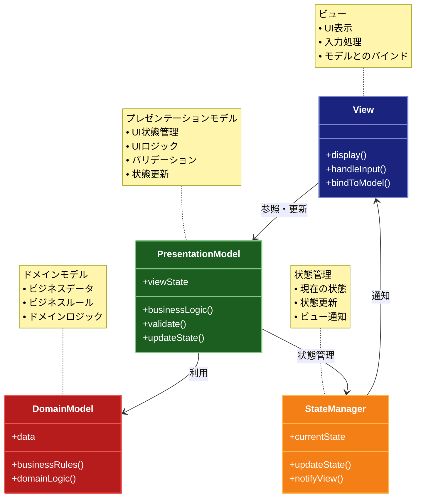

# Presentation Model パターン

## 目的

ユーザーインターフェースのロジックをビューから分離し、プレゼンテーションモデルに集約することで、UIロジックのテスト容易性と再利用性を向上させるパターン。

## 価値・解決する問題

- UIロジックをビューから分離できる
- UIロジックのテストが容易になる
- 複数のビューで同じUIロジックを再利用できる
- ビューとロジックの責務が明確になる
- UIの状態管理が容易になる

## 概要・特徴

### 概要

Presentation Modelパターンは、UIロジックをビューから分離し、プレゼンテーションモデルと呼ばれる専用のクラスに集約します。これにより、UIロジックのテストや再利用が容易になり、ビューはシンプルな表示に専念できます。

### 特徴

#### UIロジックの分離
Presentation Modelパターンの最も重要な特徴は、UIに関連するすべてのロジックをビューから分離し、専用のプレゼンテーションモデルに配置することです。これにより、ビジネスロジックだけでなく、表示ロジック、検証ロジック、状態管理なども含めたすべてのUI関連ロジックがビューコンポーネントから切り離されます。例えば、フォームの入力検証、フィールドの表示/非表示の制御、値のフォーマット、ユーザーアクションの処理ロジックなどがプレゼンテーションモデルに移動します。この分離により、ビューは単純な表示と入力処理に専念できるようになり、UIのコードが大幅に簡略化されます。特に複雑なフォームやインタラクティブなダッシュボードなど、豊富なユーザーインターフェースを持つアプリケーションでは、この分離が非常に価値があります。UIロジックの分離は、プラットフォーム固有のコードを最小限に抑え、クロスプラットフォーム開発をより効率的にする効果もあります。例えば、同じプレゼンテーションモデルをWeb、デスクトップ、モバイルなど異なるプラットフォーム向けのUIで再利用することが可能になります。

#### 状態管理の一元化
Presentation Modelパターンでは、UIの状態管理が一元化され、プレゼンテーションモデル内で統合的に処理されます。ビューに表示されるデータ、フォームの入力値、UI要素の状態（有効/無効、表示/非表示など）、選択状態などのすべてのUI状態が、プレゼンテーションモデル内で管理されます。このアプローチにより、UI状態の一貫性が保証され、状態間の複雑な依存関係も適切に処理できます。例えば、あるフィールドの値が変更されたときに、別のフィールドの有効性や表示状態が変化するような複雑なフォームでも、すべての状態変更ロジックをプレゼンテーションモデル内にカプセル化できます。さらに、状態変更の通知メカニズム（オブザーバーパターンやデータバインディングなど）を活用することで、モデルの状態変更がビューに自動的に反映されるようになり、状態の同期に関するエラーを減らすことができます。一元化された状態管理はデバッグも容易にします。問題が発生した場合、UI状態をプレゼンテーションモデル内の一箇所で検査できるため、複数のUI要素やコントロールにわたって状態を追跡する必要がなくなります。また、状態の永続化やセッション管理も単純化され、アプリケーション状態の保存と復元が容易になります。

#### テスト容易性
Presentation Modelパターンの重要な利点は、UIロジックのテスト容易性が大幅に向上することです。UIロジックがプレゼンテーションモデルに分離されているため、実際のUIコンポーネントを必要とせずに、ロジックを単体テストできます。これにより、UIテストに通常伴う複雑さ（UIオートメーションの設定、テスト実行時間の長さ、不安定性など）を回避できます。プレゼンテーションモデルは単なるクラスなので、標準的な単体テストフレームワークを使用して、入力検証、状態変更、ビジネスルールの適用などをテストできます。例えば、フォームの検証ロジックが正しく機能するか、特定のユーザーアクションが適切な状態変更を引き起こすかなどをテストできます。この高いテスト容易性により、より包括的なテストカバレッジが実現し、バグの早期発見と品質向上につながります。また、テスト駆動開発（TDD）や継続的インテグレーション（CI）のプラクティスとも非常に相性が良く、安定したアプリケーション開発を支援します。さらに、ビュー自体も単純化されているため、必要に応じてUIのテストも単純になります。これは特に、複雑なビジネスロジックを持つエンタープライズアプリケーションの開発において、品質保証と保守性の観点から大きな価値があります。

#### ロジックの再利用性
Presentation Modelパターンでは、UIロジックがビューから分離されるため、異なるビュー間でのロジックの再利用が容易になります。同じデータや機能を異なる方法で表示する複数のビューがある場合、共通のプレゼンテーションモデルを共有することができます。例えば、ユーザー情報を表示・編集するための機能を、デスクトップアプリケーション、Webインターフェース、モバイルアプリなど複数のプラットフォームで提供する場合、各プラットフォーム固有のビューを実装しつつ、共通のプレゼンテーションモデルを再利用できます。これにより、ビジネスロジックやUI処理ロジックを複数の場所で重複実装する必要がなくなり、一貫性のある動作と効率的な開発が実現します。また、基本的なプレゼンテーションモデルを作成し、それを拡張または合成することで、類似した機能を持つUIコンポーネントのファミリーを効率的に開発することもできます。この再利用性により、開発時間の短縮、コードの重複削減、一貫性の向上など、様々なメリットが生まれます。さらに、再利用可能なプレゼンテーションモデルのライブラリを構築することで、組織全体での開発効率を高めることも可能です。これは特に、一貫したUXを提供する必要がある大規模アプリケーションや、複数のアプリケーションを持つ企業で価値があります。

#### ビューの単純化
Presentation Modelパターンを適用することで、ビューコンポーネントが大幅に単純化されます。ビューはプレゼンテーションモデルからのデータの表示と、ユーザー入力のプレゼンテーションモデルへの転送という、最小限の責任だけを持つようになります。複雑なUIロジック、検証、状態管理などがすべてプレゼンテーションモデルに移動するため、ビュークラスやUI定義ファイル（XMLレイアウトやHTMLテンプレートなど）がシンプルになります。この単純化により、UIデザイナーとプログラマーの間の協業が改善されます。UIデザイナーはビューの視覚的側面に集中でき、プログラマーはロジックに集中できるため、作業の並列化と効率化が図れます。また、単純なビューは理解しやすく、保守も容易です。新しいチームメンバーが参加した場合でも、学習曲線が緩やかになり、素早く生産性を発揮できるようになります。さらに、単純なビューは変更に対する柔軟性も高まります。UIデザインの変更や再設計が必要になった場合も、ロジックに影響を与えることなく、ビュー部分だけを変更できます。これはアジャイル開発環境で特に重要で、反復的なUIの改善を容易にします。単純化されたビューは、パフォーマンスの観点からも利点があり、特に制約のあるモバイルデバイスなどで効率的に動作します。

### 概要図



## 類似パターンとの比較

- [MVP](mvp.md)
  - MVPはプレゼンターがビューとモデルの仲介役を果たすのに対して、Presentation Modelはビューの状態とロジックを完全に分離する
  - MVPはビューがインターフェースを持つのに対して、Presentation Modelはビューが直接プレゼンテーションモデルを参照する

- [MVVM](mvvm.md)
  - MVVMはデータバインディングを使用するのに対して、Presentation Modelは明示的な更新を行う
  - MVVMはビューモデルがビューの状態を表現するのに対して、Presentation ModelはUIロジックも含む

## 利用されているライブラリ／フレームワークの事例

- [Caliburn.Micro](https://github.com/Caliburn-Micro/Caliburn.Micro)
  - WPFアプリケーションフレームワーク
  - Screen/ConductorパターンによるPresentation Model実装

- [ReactiveUI](https://github.com/reactiveui/ReactiveUI)
  - クロスプラットフォームMVVMフレームワーク
  - ReactiveObjectによるPresentation Model実装

## 解説ページリンク

- [Presentation Model Pattern](https://martinfowler.com/eaaDev/PresentationModel.html)
- [The Presentation Model Pattern](https://www.oracle.com/technical-resources/articles/java/java-presentation-patterns.html)

## コード例

### Before:

```typescript
// UIロジックがビューに密結合
class UserProfileView {
  private nameInput: HTMLInputElement
  private emailInput: HTMLInputElement
  private saveButton: HTMLButtonElement
  private errorMessage: HTMLDivElement

  constructor() {
    this.nameInput = document.getElementById('name') as HTMLInputElement
    this.emailInput = document.getElementById('email') as HTMLInputElement
    this.saveButton = document.getElementById('save') as HTMLButtonElement
    this.errorMessage = document.getElementById('error') as HTMLDivElement

    this.saveButton.addEventListener('click', () => this.save())
  }

  // UIロジックがビューに混在
  private save() {
    const name = this.nameInput.value.trim()
    const email = this.emailInput.value.trim()

    // バリデーションロジック
    if (name.length < 2) {
      this.errorMessage.textContent = '名前は2文字以上必要です'
      return
    }

    if (!email.includes('@')) {
      this.errorMessage.textContent = '有効なメールアドレスを入力してください'
      return
    }

    // 保存ロジック
    this.saveButton.disabled = true
    this.errorMessage.textContent = ''
    // APIを呼び出して保存
  }
}
```

### After:

```typescript
// プレゼンテーションモデル
class UserProfilePresentationModel {
  private name: string = ''
  private email: string = ''
  private error: string = ''
  private isSaving: boolean = false

  // UIロジックを集約
  setName(name: string) {
    this.name = name.trim()
    this.validate()
  }

  setEmail(email: string) {
    this.email = email.trim()
    this.validate()
  }

  // バリデーションロジック
  private validate(): boolean {
    if (this.name.length < 2) {
      this.error = '名前は2文字以上必要です'
      return false
    }

    if (!this.email.includes('@')) {
      this.error = '有効なメールアドレスを入力してください'
      return false
    }

    this.error = ''
    return true
  }

  // 保存ロジック
  async save(): Promise<boolean> {
    if (!this.validate() || this.isSaving) {
      return false
    }

    this.isSaving = true
    try {
      // APIを呼び出して保存
      return true
    } finally {
      this.isSaving = false
    }
  }

  // 状態の取得
  getState() {
    return {
      name: this.name,
      email: this.email,
      error: this.error,
      isSaving: this.isSaving
    }
  }
}

// シンプルなビュー
class UserProfileView {
  private model: UserProfilePresentationModel
  private nameInput: HTMLInputElement
  private emailInput: HTMLInputElement
  private saveButton: HTMLButtonElement
  private errorMessage: HTMLDivElement

  constructor(model: UserProfilePresentationModel) {
    this.model = model
    this.nameInput = document.getElementById('name') as HTMLInputElement
    this.emailInput = document.getElementById('email') as HTMLInputElement
    this.saveButton = document.getElementById('save') as HTMLButtonElement
    this.errorMessage = document.getElementById('error') as HTMLDivElement

    this.setupEventListeners()
  }

  private setupEventListeners() {
    // 入力イベントをモデルに委譲
    this.nameInput.addEventListener('input', e => {
      this.model.setName((e.target as HTMLInputElement).value)
      this.updateView()
    })

    this.emailInput.addEventListener('input', e => {
      this.model.setEmail((e.target as HTMLInputElement).value)
      this.updateView()
    })

    this.saveButton.addEventListener('click', async () => {
      if (await this.model.save()) {
        this.updateView()
      }
    })
  }

  // ビューの更新
  private updateView() {
    const state = this.model.getState()
    this.errorMessage.textContent = state.error
    this.saveButton.disabled = state.isSaving
  }
}

// 使用例
const model = new UserProfilePresentationModel()
const view = new UserProfileView(model)
``` 