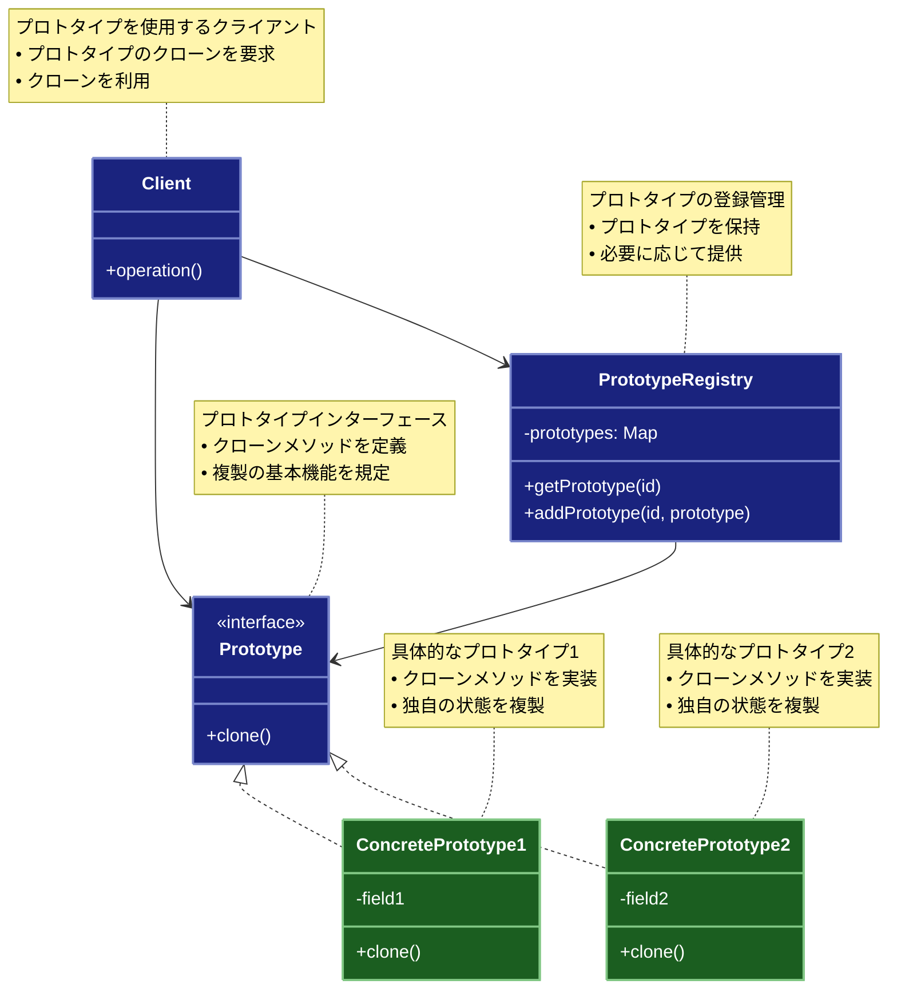

# Prototype（プロトタイプ）パターン

## 目的

既存のオブジェクトをクローンすることで、新しいオブジェクトを生成するパターンです。

## 価値・解決する問題

- オブジェクト生成のコスト削減
- 複雑なオブジェクトの複製
- 初期化の柔軟性
- サブクラス化の回避
- 状態の保持と複製

## 概要・特徴

### 概要

Prototypeパターンは、既存のオブジェクトをプロトタイプとして使用し、そのコピーを作成することで新しいオブジェクトを生成する設計パターンです。このパターンでは、新しいオブジェクトを作る際にクラスから直接インスタンス化するのではなく、既存の原型（プロトタイプ）となるオブジェクトをコピーします。これにより、複雑なオブジェクトの生成コストを削減し、実行時に動的にオブジェクトを生成することができます。

### 特徴

#### オブジェクトのクローン

既存のオブジェクト（プロトタイプ）からその複製（クローン）を作成する機能が中心です。このクローン作成により、新しいオブジェクトはプロトタイプと同じ状態を持ちます。例えば、グラフィックエディタでは、複雑な図形（円、多角形、グループ化された図形など）を一度作成した後、それをクローンして類似の図形を効率的に作成できます。クローン作成は、浅いコピー（shallow copy）と深いコピー（deep copy）の両方で実装できますが、オブジェクト間の依存関係が複雑な場合は、深いコピーが必要になることが多いです。

#### 動的な生成

実行時にどのクラスのインスタンスを生成するかを動的に決定できます。クラス名を直接指定してインスタンス化するのではなく、プロトタイプオブジェクトに基づいてクローンを作成するため、実行時の柔軟性が高まります。例えば、ゲーム開発において、プレイヤーの選択や環境条件に応じて異なるタイプの敵キャラクターやアイテムをその場で生成する場合に有用です。これにより、コンパイル時には存在しなかったオブジェクト構成も実行時に作成できるようになります。

#### 柔軟な初期化

プロトタイプとして使用するオブジェクトに事前に特定の状態や設定を与えておくことで、クローン時にその状態を引き継ぐことができます。これにより、多くのパラメータを持つ複雑なオブジェクトの初期化を簡素化できます。例えば、データベース接続設定やUIコンポーネントの初期状態など、複数の設定パラメータを持つオブジェクトを、プロトタイプとして一度設定しておくことで、同じ設定を持つ複数のインスタンスを簡単に作成できます。この特徴は、ファクトリーパターンと組み合わせることで、さらに効果的に活用できます。

#### 状態の保持

オブジェクトの現在の状態をクローン時に保持できるため、特定の状態に達したオブジェクトを複製して再利用することができます。例えば、AIシステムにおける学習済みのニューラルネットワークモデルや、特定の位置や状態にあるゲームキャラクターなど、計算コストの高い初期化や状態遷移を経たオブジェクトを複製することで、効率化が図れます。これは特に、オブジェクトが複雑な内部状態を持つ場合や、その状態に到達するまでに多くの処理が必要な場合に有効です。

#### 生成コストの削減

複雑なオブジェクトを最初から作成するよりも、既存のオブジェクトをコピーする方が効率的な場合があります。特に、オブジェクトの初期化に時間がかかる処理（データベースアクセス、ファイル読み込み、複雑な計算など）が含まれる場合、プロトタイプパターンを使用することでパフォーマンスが向上します。例えば、3Dモデリングソフトウェアで複雑なテクスチャや物理特性を持つオブジェクトを複数作成する場合、最初のオブジェクトを一度だけ初期化し、以降はそのクローンを作成することで処理時間を大幅に削減できます。

### 概要図



## 類似パターンとの比較

- [Factory Method (ファクトリーメソッド)](factory-method.md): Prototype はオブジェクトのコピーを作成し、これに対して Factory Method はオブジェクトの生成を抽象化します。
- [Abstract Factory (抽象ファクトリー)](abstract-factory.md): Prototype はオブジェクトのコピーを作成し、これに対して Abstract Factory は関連するオブジェクトのファミリーを生成します。
- [Builder (ビルダー)](builder.md): Prototype はオブジェクトのコピーを作成し、これに対して Builder は複雑なオブジェクトを段階的に構築します。

## 利用されているライブラリ／フレームワークの事例

- [JavaScript Object.create()](https://developer.mozilla.org/docs/Web/JavaScript/Reference/Global_Objects/Object/create): オブジェクトのプロトタイプ継承
- [Java Cloneable](https://docs.oracle.com/javase/8/docs/api/java/lang/Cloneable.html): オブジェクトのクローン機能
- [TypeScript Object.assign()](https://www.typescriptlang.org/docs/handbook/utility-types.html#recordkt): オブジェクトのコピー

## 解説ページリンク

- [Refactoring Guru - Prototype](https://refactoring.guru/design-patterns/prototype)
- [SourceMaking - Prototype](https://sourcemaking.com/design_patterns/prototype)
- [DZone - Prototype Pattern](https://dzone.com/articles/design-patterns-prototype)

## コード例

### Before:

オブジェクトを直接生成する実装

```typescript
// 図形の基本クラス
class Shape {
  constructor(
    public color: string,
    public x: number,
    public y: number
  ) {}

  draw(): void {
    console.log(`${this.color}の図形を(${this.x}, ${this.y})に描画`);
  }
}

// 円クラス
class Circle extends Shape {
  constructor(
    color: string,
    x: number,
    y: number,
    public radius: number
  ) {
    super(color, x, y);
  }

  draw(): void {
    console.log(`${this.color}の円を(${this.x}, ${this.y})に描画、半径: ${this.radius}`);
  }
}

// 長方形クラス
class Rectangle extends Shape {
  constructor(
    color: string,
    x: number,
    y: number,
    public width: number,
    public height: number
  ) {
    super(color, x, y);
  }

  draw(): void {
    console.log(`${this.color}の長方形を(${this.x}, ${this.y})に描画、幅: ${this.width}、高さ: ${this.height}`);
  }
}

// 図形を管理するクラス
class ShapeManager {
  private shapes: Shape[] = [];

  // 新しい円を追加
  addCircle(color: string, x: number, y: number, radius: number): void {
    const circle = new Circle(color, x, y, radius);
    this.shapes.push(circle);
  }

  // 新しい長方形を追加
  addRectangle(color: string, x: number, y: number, width: number, height: number): void {
    const rectangle = new Rectangle(color, x, y, width, height);
    this.shapes.push(rectangle);
  }

  // すべての図形を描画
  drawAll(): void {
    this.shapes.forEach(shape => shape.draw());
  }
}

// 使用例
function example() {
  const manager = new ShapeManager();

  // 異なる図形を追加
  console.log("=== 図形の追加 ===");
  manager.addCircle("赤", 10, 10, 5);
  manager.addCircle("青", 20, 20, 10);
  manager.addRectangle("緑", 0, 0, 15, 10);
  manager.addRectangle("黄", 5, 5, 20, 15);

  // すべての図形を描画
  console.log("\n=== 図形の描画 ===");
  manager.drawAll();
}

example();
```

### After:

Prototypeパターンを適用した実装

```typescript
// プロトタイプインターフェース
interface Prototype<T> {
  clone(): T;
}

// 図形の基本クラス
abstract class Shape implements Prototype<Shape> {
  constructor(
    public color: string,
    public x: number,
    public y: number
  ) {}

  abstract clone(): Shape;

  draw(): void {
    console.log(`${this.color}の図形を(${this.x}, ${this.y})に描画`);
  }

  move(x: number, y: number): void {
    this.x = x;
    this.y = y;
  }
}

// 円クラス
class Circle extends Shape {
  constructor(
    color: string,
    x: number,
    y: number,
    public radius: number
  ) {
    super(color, x, y);
  }

  clone(): Circle {
    return new Circle(this.color, this.x, this.y, this.radius);
  }

  draw(): void {
    console.log(`${this.color}の円を(${this.x}, ${this.y})に描画、半径: ${this.radius}`);
  }

  scale(factor: number): void {
    this.radius *= factor;
  }
}

// 長方形クラス
class Rectangle extends Shape {
  constructor(
    color: string,
    x: number,
    y: number,
    public width: number,
    public height: number
  ) {
    super(color, x, y);
  }

  clone(): Rectangle {
    return new Rectangle(this.color, this.x, this.y, this.width, this.height);
  }

  draw(): void {
    console.log(`${this.color}の長方形を(${this.x}, ${this.y})に描画、幅: ${this.width}、高さ: ${this.height}`);
  }

  scale(factor: number): void {
    this.width *= factor;
    this.height *= factor;
  }
}

// 図形のプロトタイプを管理するレジストリ
class ShapeRegistry {
  private static instance: ShapeRegistry;
  private prototypes: Map<string, Shape> = new Map();

  private constructor() {
    // デフォルトのプロトタイプを登録
    this.prototypes.set("circle", new Circle("白", 0, 0, 1));
    this.prototypes.set("rectangle", new Rectangle("白", 0, 0, 1, 1));
  }

  static getInstance(): ShapeRegistry {
    if (!ShapeRegistry.instance) {
      ShapeRegistry.instance = new ShapeRegistry();
    }
    return ShapeRegistry.instance;
  }

  register(key: string, prototype: Shape): void {
    this.prototypes.set(key, prototype);
  }

  unregister(key: string): void {
    this.prototypes.delete(key);
  }

  getPrototype(key: string): Shape | undefined {
    return this.prototypes.get(key);
  }

  createShape(key: string): Shape | undefined {
    const prototype = this.prototypes.get(key);
    return prototype?.clone();
  }
}

// 図形を管理するクラス
class ShapeManager {
  private shapes: Shape[] = [];
  private registry: ShapeRegistry = ShapeRegistry.getInstance();

  // プロトタイプから新しい円を追加
  addCircle(color: string, x: number, y: number, radius: number): void {
    const circle = this.registry.createShape("circle") as Circle;
    circle.color = color;
    circle.move(x, y);
    circle.scale(radius);
    this.shapes.push(circle);
  }

  // プロトタイプから新しい長方形を追加
  addRectangle(color: string, x: number, y: number, width: number, height: number): void {
    const rectangle = this.registry.createShape("rectangle") as Rectangle;
    rectangle.color = color;
    rectangle.move(x, y);
    rectangle.width = width;
    rectangle.height = height;
    this.shapes.push(rectangle);
  }

  // カスタムプロトタイプを登録
  registerPrototype(key: string, prototype: Shape): void {
    this.registry.register(key, prototype);
  }

  // プロトタイプから図形を複製
  cloneShape(key: string, x: number, y: number): Shape | undefined {
    const shape = this.registry.createShape(key);
    if (shape) {
      shape.move(x, y);
      this.shapes.push(shape);
    }
    return shape;
  }

  // すべての図形を描画
  drawAll(): void {
    this.shapes.forEach(shape => shape.draw());
  }

  // 図形の数を取得
  getShapeCount(): number {
    return this.shapes.length;
  }

  // 特定の色の図形を取得
  getShapesByColor(color: string): Shape[] {
    return this.shapes.filter(shape => shape.color === color);
  }
}

// 使用例
function example() {
  const manager = new ShapeManager();

  // 基本的な図形の追加
  console.log("=== 基本的な図形の追加 ===");
  manager.addCircle("赤", 10, 10, 5);
  manager.addCircle("青", 20, 20, 10);
  manager.addRectangle("緑", 0, 0, 15, 10);
  manager.addRectangle("黄", 5, 5, 20, 15);

  // すべての図形を描画
  console.log("\n=== 基本的な図形の描画 ===");
  manager.drawAll();

  // カスタムプロトタイプの登録
  console.log("\n=== カスタムプロトタイプの登録 ===");
  const largeRedCircle = new Circle("赤", 0, 0, 20);
  manager.registerPrototype("large-red-circle", largeRedCircle);

  const wideBlueRectangle = new Rectangle("青", 0, 0, 30, 10);
  manager.registerPrototype("wide-blue-rectangle", wideBlueRectangle);

  // カスタムプロトタイプからの複製
  console.log("\n=== カスタムプロトタイプからの複製 ===");
  manager.cloneShape("large-red-circle", 30, 30);
  manager.cloneShape("wide-blue-rectangle", 40, 40);

  // 更新された図形を描画
  console.log("\n=== 更新された図形の描画 ===");
  manager.drawAll();

  // 統計情報の表示
  console.log("\n=== 統計情報 ===");
  console.log(`総図形数: ${manager.getShapeCount()}`);
  console.log(`赤い図形の数: ${manager.getShapesByColor("赤").length}`);
  console.log(`青い図形の数: ${manager.getShapesByColor("青").length}`);
}

example();

// 関数型プログラミングスタイルによるPrototypeパターンの実装

// 型定義
type ShapeType = 'circle' | 'rectangle';

// 図形の基本型
interface ShapeState {
  type: ShapeType;
  color: string;
  x: number;
  y: number;
}

// 円の型
interface CircleState extends ShapeState {
  type: 'circle';
  radius: number;
}

// 長方形の型
interface RectangleState extends ShapeState {
  type: 'rectangle';
  width: number;
  height: number;
}

// 統合型（Union Type）
type Shape = CircleState | RectangleState;

// クローン関数（プロトタイプメソッドに相当）
const cloneShape = (shape: Shape): Shape => {
  return { ...shape };
};

// 図形の移動
const moveShape = (shape: Shape, x: number, y: number): Shape => {
  return { ...shape, x, y };
};

// 図形の色変更
const changeColor = (shape: Shape, color: string): Shape => {
  return { ...shape, color };
};

// 図形の描画
const drawShape = (shape: Shape): void => {
  switch (shape.type) {
    case 'circle':
      console.log(`${shape.color}の円を(${shape.x}, ${shape.y})に描画、半径: ${shape.radius}`);
      break;
    case 'rectangle':
      console.log(`${shape.color}の長方形を(${shape.x}, ${shape.y})に描画、幅: ${shape.width}、高さ: ${shape.height}`);
      break;
  }
};

// 図形のスケーリング
const scaleShape = (shape: Shape, factor: number): Shape => {
  if (shape.type === 'circle') {
    return { ...shape, radius: shape.radius * factor };
  } else {
    return { ...shape, width: shape.width * factor, height: shape.height * factor };
  }
};

// プロトタイプを管理するレジストリ（イミュータブルなMap）
type PrototypeRegistry = ReadonlyMap<string, Shape>;

// レジストリの作成
const createRegistry = (): PrototypeRegistry => {
  const baseRegistry = new Map<string, Shape>();
  
  // デフォルトのプロトタイプを登録
  baseRegistry.set('circle', { type: 'circle', color: '白', x: 0, y: 0, radius: 1 });
  baseRegistry.set('rectangle', { type: 'rectangle', color: '白', x: 0, y: 0, width: 1, height: 1 });
  
  return baseRegistry;
};

// レジストリに新しいプロトタイプを登録
const registerPrototype = (registry: PrototypeRegistry, key: string, prototype: Shape): PrototypeRegistry => {
  const newRegistry = new Map(registry);
  newRegistry.set(key, prototype);
  return newRegistry;
};

// レジストリからプロトタイプを削除
const unregisterPrototype = (registry: PrototypeRegistry, key: string): PrototypeRegistry => {
  const newRegistry = new Map(registry);
  newRegistry.delete(key);
  return newRegistry;
};

// レジストリからプロトタイプを取得してクローンを作成
const createFromPrototype = (registry: PrototypeRegistry, key: string): Shape | undefined => {
  const prototype = registry.get(key);
  return prototype ? cloneShape(prototype) : undefined;
};

// 図形マネージャーの状態
interface ShapeManager {
  shapes: ReadonlyArray<Shape>;
  registry: PrototypeRegistry;
}

// 図形マネージャーの初期状態
const createShapeManager = (): ShapeManager => {
  return {
    shapes: [],
    registry: createRegistry()
  };
};

// プロトタイプから円を作成して追加
const addCircle = (manager: ShapeManager, color: string, x: number, y: number, radius: number): ShapeManager => {
  const prototype = createFromPrototype(manager.registry, 'circle') as CircleState | undefined;
  
  if (!prototype) return manager;
  
  const circle: CircleState = {
    ...prototype,
    color,
    x,
    y,
    radius
  };
  
  return {
    ...manager,
    shapes: [...manager.shapes, circle]
  };
};

// プロトタイプから長方形を作成して追加
const addRectangle = (manager: ShapeManager, color: string, x: number, y: number, width: number, height: number): ShapeManager => {
  const prototype = createFromPrototype(manager.registry, 'rectangle') as RectangleState | undefined;
  
  if (!prototype) return manager;
  
  const rectangle: RectangleState = {
    ...prototype,
    color,
    x,
    y,
    width,
    height
  };
  
  return {
    ...manager,
    shapes: [...manager.shapes, rectangle]
  };
};

// カスタムプロトタイプを登録
const registerCustomPrototype = (manager: ShapeManager, key: string, prototype: Shape): ShapeManager => {
  return {
    ...manager,
    registry: registerPrototype(manager.registry, key, prototype)
  };
};

// プロトタイプから図形をクローンして追加
const cloneAndAddShape = (manager: ShapeManager, key: string, x: number, y: number): ShapeManager => {
  const shape = createFromPrototype(manager.registry, key);
  
  if (!shape) return manager;
  
  const movedShape = moveShape(shape, x, y);
  
  return {
    ...manager,
    shapes: [...manager.shapes, movedShape]
  };
};

// 全ての図形を描画（副作用を持つ関数）
const drawAllShapes = (shapes: ReadonlyArray<Shape>): void => {
  shapes.forEach(drawShape);
};

// 図形の数を取得
const getShapeCount = (shapes: ReadonlyArray<Shape>): number => shapes.length;

// 特定の色の図形を取得
const getShapesByColor = (shapes: ReadonlyArray<Shape>, color: string): ReadonlyArray<Shape> => {
  return shapes.filter(shape => shape.color === color);
};

// 関数型アプローチの使用例
function functionalExample() {
  console.log("\n=== 関数型プログラミングスタイルによる実装 ===");
  
  // 初期状態の作成
  let manager = createShapeManager();
  
  // 基本的な図形の追加
  console.log("=== 基本的な図形の追加 ===");
  manager = addCircle(manager, '赤', 10, 10, 5);
  manager = addCircle(manager, '青', 20, 20, 10);
  manager = addRectangle(manager, '緑', 0, 0, 15, 10);
  manager = addRectangle(manager, '黄', 5, 5, 20, 15);
  
  // すべての図形を描画
  console.log("\n=== 基本的な図形の描画 ===");
  drawAllShapes(manager.shapes);
  
  // カスタムプロトタイプの登録
  console.log("\n=== カスタムプロトタイプの登録 ===");
  const largeRedCircle: CircleState = { type: 'circle', color: '赤', x: 0, y: 0, radius: 20 };
  manager = registerCustomPrototype(manager, 'large-red-circle', largeRedCircle);
  
  const wideBlueRectangle: RectangleState = { type: 'rectangle', color: '青', x: 0, y: 0, width: 30, height: 10 };
  manager = registerCustomPrototype(manager, 'wide-blue-rectangle', wideBlueRectangle);
  
  // カスタムプロトタイプからの複製
  console.log("\n=== カスタムプロトタイプからの複製 ===");
  manager = cloneAndAddShape(manager, 'large-red-circle', 30, 30);
  manager = cloneAndAddShape(manager, 'wide-blue-rectangle', 40, 40);
  
  // 更新された図形を描画
  console.log("\n=== 更新された図形の描画 ===");
  drawAllShapes(manager.shapes);
  
  // 統計情報の表示
  console.log("\n=== 統計情報 ===");
  console.log(`総図形数: ${getShapeCount(manager.shapes)}`);
  console.log(`赤い図形の数: ${getShapesByColor(manager.shapes, '赤').length}`);
  console.log(`青い図形の数: ${getShapesByColor(manager.shapes, '青').length}`);
  
  // イミュータビリティの実証：オブジェクトの状態を変更してもスケーリングされた新しいオブジェクトは影響を受けない
  console.log("\n=== イミュータビリティの実証 ===");
  const originalCircle: CircleState = { type: 'circle', color: '紫', x: 0, y: 0, radius: 10 };
  const scaledCircle = scaleShape(originalCircle, 2);
  
  console.log("オリジナルの円:", originalCircle);
  console.log("スケーリングされた円:", scaledCircle);
  console.log("オリジナルは変更されていません");
}

functionalExample();
