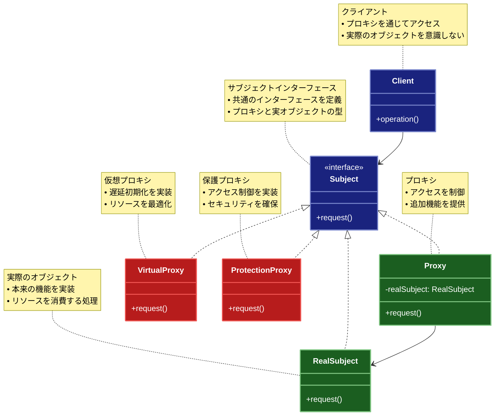

# Proxy（プロキシ）パターン

## 目的

オブジェクトへのアクセスを制御し、追加の機能（キャッシュ、アクセス制御、ログ記録など）を提供するためのパターンです。

## 価値・解決する問題

- アクセス制御の実現
- 遅延初期化の実装
- キャッシュ機能の追加
- ログ記録の実装
- リソース管理の最適化

## 概要・特徴

### 概要

Proxyパターンは、あるオブジェクトへのアクセスを代理オブジェクトを通じて間接的に行うパターンです。これにより、オブジェクトへのアクセスを制御したり、追加の機能を提供したりすることができます。プロキシは元のオブジェクト（実オブジェクト）と同じインターフェースを実装するため、クライアントからは透過的に利用でき、クライアントコードを変更せずに機能を拡張できます。ネットワーク接続、大きなオブジェクトの操作、セキュリティが必要なリソースへのアクセスなど、様々な状況でプロキシパターンが活用されています。

### 特徴

#### アクセス制御

実オブジェクトへのアクセスを制御し、保護することができます。これにより、権限チェック、アクセス制限、アクセス条件の検証などを実装できます。例えば、セキュリティプロキシは、ユーザーの権限に基づいて特定のメソッド呼び出しを許可または拒否できます。これはセキュリティが重要なシステムや、マルチユーザー環境で特に有用です。

#### 遅延初期化

実オブジェクトの生成コストが高い場合、プロキシを使って必要になるまでその生成を遅らせることができます。これにより、起動時間の短縮やメモリ使用量の最適化が可能になります。例えば、データベース接続やネットワークリソースなど、初期化コストが高いが常に使われるわけではないオブジェクトに対して有効です。クライアントが実際にそのオブジェクトを使用する時まで初期化を遅らせることで、システム全体のパフォーマンスが向上します。

#### キャッシュ機能

頻繁に使用される結果や、計算コストの高い処理の結果をキャッシュすることができます。プロキシが結果をキャッシュしておき、同じリクエストが来た場合には実オブジェクトにアクセスせずにキャッシュから結果を返すことで、パフォーマンスを向上させることができます。例えば、データベースクエリの結果や、リモートAPIからのレスポンスなど、取得コストが高いデータに対して効果的です。

#### ログ記録

実オブジェクトへのアクセスや操作をログに記録できます。これにより、デバッグ、監査、パフォーマンス計測などが容易になります。例えば、メソッド呼び出しの頻度、引数の値、実行時間などを記録することで、システムの動作を詳細に把握できます。また、障害発生時の原因究明やパフォーマンスのボトルネック特定にも役立ちます。

#### リソース管理

Proxyパターンは、リソースの効率的な管理と最適化に役立ちます。特に、限られたリソース（メモリ、接続数、ファイルハンドルなど）を使用するオブジェクトの場合、プロキシを使用してそのライフサイクルと利用を厳密に制御できます。例えば、データベース接続プールを管理するプロキシは、接続の再利用、タイムアウト処理、接続数の制限などを担当し、システム全体のリソース使用を最適化できます。また、大きな画像ファイルを扱うイメージビューアでは、プロキシが画像の解像度を動的に調整し、現在の表示に必要な分だけメモリを使用するよう最適化することができます。マルチユーザーシステムでは、プロキシがリソースの公平な分配を担当し、一部のユーザーによるリソース独占を防ぐこともできます。このようなリソース管理により、システム全体の安定性、スケーラビリティ、応答性が向上します。さらに、プロキシを通じてリソースの使用状況を監視し、必要に応じて動的にリソース割り当てを調整することも可能です。

#### 分散システムの管理

Proxyパターンは分散システムにおいて、リモートオブジェクトへのアクセスを管理する重要な役割を果たします。リモートプロキシは、ネットワークの詳細を隠蔽し、クライアントに対してはローカルオブジェクトと同様にリモートサービスを利用できるインターフェースを提供します。例えば、Javaの RMI（Remote Method Invocation）や、.NETのリモーティングはこのパターンを活用しています。分散システムでのプロキシは、ネットワーク通信の最適化（バッチ処理、非同期通信など）、エラーハンドリング（接続リトライ、フォールバック処理など）、ネットワーク遅延の吸収（非同期処理、バックグラウンドローディングなど）といった複雑な処理を担当します。また、マイクロサービスアーキテクチャにおいては、API ゲートウェイがプロキシとして機能し、ルーティング、ロードバランシング、認証、レート制限などのクロスカッティングコンサーンを一元管理します。このように、分散システムにおけるプロキシパターンの活用は、システムの複雑性を管理し、スケーラビリティと耐障害性を向上させる上で重要な役割を果たします。

### 概要図



## 類似パターンとの比較

- [Decorator (デコレーター)](decorator.md): Proxy はアクセス制御に焦点を当て、これに対して Decorator は機能の追加に焦点を当てます。
- [Adapter (アダプター)](adapter.md): Proxy はアクセス制御を提供し、これに対して Adapter はインターフェースの変換を提供します。
- [Facade (ファサード)](facade.md): Proxy は単一のオブジェクトへのアクセスを制御し、これに対して Facade は複数のオブジェクトを単純化します。

## 利用されているライブラリ／フレームワークの事例

- [JavaScript Proxy](https://developer.mozilla.org/en-US/docs/Web/JavaScript/Reference/Global_Objects/Proxy): JavaScriptのProxyオブジェクト
- [Vue.js Reactivity System](https://vuejs.org/guide/extras/reactivity-in-depth.html): リアクティブシステムでのProxy使用
- [Spring AOP](https://docs.spring.io/spring-framework/docs/current/reference/html/core.html#aop): アスペクト指向プログラミングの実装

## 解説ページリンク

- [Refactoring Guru - Proxy Pattern](https://refactoring.guru/design-patterns/proxy)
- [Microsoft - Proxy Design Pattern](https://docs.microsoft.com/en-us/previous-versions/msp-n-p/ff650173(v=pandp.10))
- [JavaScript Proxy MDN](https://developer.mozilla.org/en-US/docs/Web/JavaScript/Reference/Global_Objects/Proxy)

## コード例

### Before:

Proxyパターンなしの実装

```typescript
interface Image {
  display(): void;
}

class RealImage implements Image {
  private filename: string;

  constructor(filename: string) {
    this.filename = filename;
    this.loadFromDisk();
  }

  private loadFromDisk(): void {
    console.log(`Loading ${this.filename} from disk`);
  }

  display(): void {
    console.log(`Displaying ${this.filename}`);
  }
}

// 使用例
const image = new RealImage("photo.jpg");
image.display();
```

### After:

Proxyパターンを適用した実装

```typescript
// インターフェースの定義
interface Image {
  display(): void;
}

interface Resource {
  id: string;
  name: string;
  url: string;
  size: number;
}

// 実際のイメージクラス
class RealImage implements Image {
  private readonly resource: Resource;
  private isLoaded: boolean = false;

  constructor(resource: Resource) {
    this.resource = resource;
  }

  private loadFromDisk(): void {
    console.log(`Loading ${this.resource.name} (${this.resource.size} bytes) from ${this.resource.url}`);
    // 実際のロード処理をシミュレート
    this.isLoaded = true;
  }

  display(): void {
    if (!this.isLoaded) {
      this.loadFromDisk();
    }
    console.log(`Displaying ${this.resource.name}`);
  }
}

// プロキシクラス（遅延ロード）
class LazyImageProxy implements Image {
  private realImage: RealImage | null = null;
  private readonly resource: Resource;

  constructor(resource: Resource) {
    this.resource = resource;
  }

  display(): void {
    if (this.realImage === null) {
      this.realImage = new RealImage(this.resource);
    }
    this.realImage.display();
  }
}

// プロキシクラス（キャッシュ）
class CachedImageProxy implements Image {
  private static cache: Map<string, RealImage> = new Map();
  private readonly resource: Resource;

  constructor(resource: Resource) {
    this.resource = resource;
  }

  display(): void {
    if (!CachedImageProxy.cache.has(this.resource.id)) {
      console.log(`Cache miss for ${this.resource.name}`);
      CachedImageProxy.cache.set(
        this.resource.id,
        new RealImage(this.resource)
      );
    } else {
      console.log(`Cache hit for ${this.resource.name}`);
    }
    CachedImageProxy.cache.get(this.resource.id)!.display();
  }

  static clearCache(): void {
    CachedImageProxy.cache.clear();
  }
}

// プロキシクラス（アクセス制御）
class ProtectedImageProxy implements Image {
  private readonly realImage: RealImage;
  private readonly accessLevel: number;
  private readonly requiredLevel: number;

  constructor(resource: Resource, accessLevel: number, requiredLevel: number) {
    this.realImage = new RealImage(resource);
    this.accessLevel = accessLevel;
    this.requiredLevel = requiredLevel;
  }

  display(): void {
    if (this.accessLevel >= this.requiredLevel) {
      this.realImage.display();
    } else {
      console.log("Access denied: Insufficient privileges");
    }
  }
}

// プロキシクラス（ログ記録）
class LoggingImageProxy implements Image {
  private readonly realImage: RealImage;
  private readonly logger: (message: string) => void;

  constructor(
    resource: Resource,
    logger: (message: string) => void = console.log
  ) {
    this.realImage = new RealImage(resource);
    this.logger = logger;
  }

  display(): void {
    const startTime = Date.now();
    this.logger(`[${new Date().toISOString()}] Accessing image: ${this.realImage}`);
    
    try {
      this.realImage.display();
      const endTime = Date.now();
      this.logger(
        `[${new Date().toISOString()}] Access completed in ${
          endTime - startTime
        }ms`
      );
    } catch (error) {
      this.logger(
        `[${new Date().toISOString()}] Error accessing image: ${
          error instanceof Error ? error.message : "Unknown error"
        }`
      );
      throw error;
    }
  }
}

// イメージギャラリーの実装
class ImageGallery {
  private readonly images: Map<string, Image> = new Map();

  addImage(resource: Resource, type: "lazy" | "cached" | "protected" | "logged" = "lazy"): void {
    let image: Image;

    switch (type) {
      case "cached":
        image = new CachedImageProxy(resource);
        break;
      case "protected":
        image = new ProtectedImageProxy(resource, 1, 2); // アクセスレベル1、要求レベル2
        break;
      case "logged":
        image = new LoggingImageProxy(resource);
        break;
      default:
        image = new LazyImageProxy(resource);
    }

    this.images.set(resource.id, image);
  }

  displayImage(id: string): void {
    const image = this.images.get(id);
    if (image) {
      image.display();
    } else {
      console.log(`Image with id ${id} not found`);
    }
  }
}

// 使用例
async function example() {
  const gallery = new ImageGallery();

  // テスト用のリソース
  const resources: Resource[] = [
    {
      id: "1",
      name: "photo1.jpg",
      url: "https://example.com/photos/1.jpg",
      size: 1024
    },
    {
      id: "2",
      name: "photo2.jpg",
      url: "https://example.com/photos/2.jpg",
      size: 2048
    },
    {
      id: "3",
      name: "photo3.jpg",
      url: "https://example.com/photos/3.jpg",
      size: 3072
    }
  ];

  console.log("=== 遅延ロードプロキシのテスト ===");
  gallery.addImage(resources[0], "lazy");
  console.log("画像を追加しました（まだロードされていません）");
  gallery.displayImage("1");
  console.log("2回目の表示（すでにロードされています）");
  gallery.displayImage("1");

  console.log("\n=== キャッシュプロキシのテスト ===");
  gallery.addImage(resources[1], "cached");
  console.log("1回目の表示（キャッシュミス）");
  gallery.displayImage("2");
  console.log("2回目の表示（キャッシュヒット）");
  gallery.displayImage("2");

  console.log("\n=== アクセス制御プロキシのテスト ===");
  gallery.addImage(resources[2], "protected");
  gallery.displayImage("3"); // アクセス拒否

  console.log("\n=== ログ記録プロキシのテスト ===");
  const loggedResource: Resource = {
    id: "4",
    name: "photo4.jpg",
    url: "https://example.com/photos/4.jpg",
    size: 4096
  };
  gallery.addImage(loggedResource, "logged");
  gallery.displayImage("4");
}

example();

### 関数型プログラミングスタイルでのProxy実装:

```typescript
// 型定義
type Resource = Readonly<{
  id: string
  name: string
  url: string
  size: number
}>

// イメージを表示するための関数型
type DisplayFunction = (resource: Resource) => void

// 実際のイメージ表示ロジック
const realImageDisplay = (resource: Resource): void => {
  console.log(`Loading ${resource.name} (${resource.size} bytes) from ${resource.url}`)
  console.log(`Displaying ${resource.name}`)
}

// 高階関数によるプロキシ実装

// 遅延ロードプロキシ
type LazyState = {
  loaded: boolean
}

const createLazyImageProxy = (): DisplayFunction => {
  // クロージャで状態を保持
  const state: Record<string, LazyState> = {}

  return (resource: Resource): void => {
    if (!state[resource.id]) {
      state[resource.id] = { loaded: false }
    }

    if (!state[resource.id].loaded) {
      console.log(`初回ロード: ${resource.name}`)
      state[resource.id].loaded = true
    } else {
      console.log(`既にロード済み: ${resource.name}`)
    }

    realImageDisplay(resource)
  }
}

// キャッシュプロキシ
const createCachedImageProxy = (): DisplayFunction => {
  // クロージャでキャッシュを保持
  const cache = new Set<string>()

  return (resource: Resource): void => {
    if (!cache.has(resource.id)) {
      console.log(`Cache miss for ${resource.name}`)
      cache.add(resource.id)
    } else {
      console.log(`Cache hit for ${resource.name}`)
    }

    realImageDisplay(resource)
  }
}

// アクセス制御プロキシ
type AccessLevel = number

const createProtectedImageProxy = (
  userAccessLevel: AccessLevel,
  requiredAccessLevel: AccessLevel
): DisplayFunction => {
  return (resource: Resource): void => {
    if (userAccessLevel >= requiredAccessLevel) {
      realImageDisplay(resource)
    } else {
      console.log(`Access denied: Insufficient privileges for ${resource.name}`)
    }
  }
}

// ログ記録プロキシ
type Logger = (message: string) => void

const createLoggingImageProxy = (
  logger: Logger = console.log
): DisplayFunction => {
  return (resource: Resource): void => {
    const startTime = Date.now()
    logger(`[${new Date().toISOString()}] Accessing image: ${resource.name}`)
    
    try {
      realImageDisplay(resource)
      const endTime = Date.now()
      logger(
        `[${new Date().toISOString()}] Access completed in ${
          endTime - startTime
        }ms`
      )
    } catch (error) {
      logger(
        `[${new Date().toISOString()}] Error accessing image: ${
          error instanceof Error ? error.message : "Unknown error"
        }`
      )
      throw error
    }
  }
}

// 複数のプロキシを組み合わせる関数型コンポジション
const composeProxies = (...proxies: Array<(fn: DisplayFunction) => DisplayFunction>) => {
  return (baseFn: DisplayFunction): DisplayFunction => {
    return proxies.reduceRight((acc, proxyFn) => proxyFn(acc), baseFn)
  }
}

// 関数型イメージギャラリーの実装
type ImageRegistry = Readonly<{
  [id: string]: {
    resource: Resource
    display: DisplayFunction
  }
}>

const createImageGallery = () => {
  // イミュータブルなレジストリを使用
  let registry: ImageRegistry = Object.freeze({})

  return {
    // イメージを追加
    addImage: (
      resource: Resource, 
      displayFn: DisplayFunction
    ): ImageRegistry => {
      const newRegistry = {
        ...registry,
        [resource.id]: {
          resource,
          display: displayFn
        }
      }
      // 状態更新
      registry = Object.freeze(newRegistry)
      return registry
    },

    // イメージを表示
    displayImage: (id: string): void => {
      const entry = registry[id]
      if (entry) {
        entry.display(entry.resource)
      } else {
        console.log(`Image with id ${id} not found`)
      }
    },

    // 現在のレジストリを取得
    getRegistry: (): ImageRegistry => registry
  }
}

// 使用例
const functionalExample = (): void => {
  console.log("\n=== 関数型プログラミングスタイルでのProxyパターン ===")
  
  // リソースデータ
  const photo1: Resource = Object.freeze({
    id: "1",
    name: "functional_photo1.jpg",
    url: "https://example.com/photos/functional/1.jpg",
    size: 1024
  })

  const photo2: Resource = Object.freeze({
    id: "2",
    name: "functional_photo2.jpg",
    url: "https://example.com/photos/functional/2.jpg",
    size: 2048
  })

  // ギャラリーの作成
  const gallery = createImageGallery()

  // 遅延ロードプロキシ
  console.log("\n--- 遅延ロードプロキシ ---")
  const lazyProxy = createLazyImageProxy()
  gallery.addImage(photo1, lazyProxy)
  gallery.displayImage("1") // 初回ロード
  gallery.displayImage("1") // 2回目（既にロード済み）

  // キャッシュプロキシ
  console.log("\n--- キャッシュプロキシ ---")
  const cachedProxy = createCachedImageProxy()
  gallery.addImage(photo2, cachedProxy)
  gallery.displayImage("2") // キャッシュミス
  gallery.displayImage("2") // キャッシュヒット

  // 複数のプロキシを組み合わせた高度な例
  console.log("\n--- 複合プロキシ ---")
  
  const photo3: Resource = Object.freeze({
    id: "3",
    name: "functional_photo3.jpg",
    url: "https://example.com/photos/functional/3.jpg",
    size: 3072
  })

  // プロキシをレイヤー化する関数
  const createCachingLayer = (fn: DisplayFunction): DisplayFunction => {
    const cache = new Set<string>()
    return (resource) => {
      if (!cache.has(resource.id)) {
        console.log(`[キャッシュ層] キャッシュミス: ${resource.name}`)
        cache.add(resource.id)
        fn(resource)
      } else {
        console.log(`[キャッシュ層] キャッシュヒット: ${resource.name}`)
        fn(resource)
      }
    }
  }
  
  const createLoggingLayer = (fn: DisplayFunction): DisplayFunction => {
    return (resource) => {
      console.log(`[ログ層] リソースアクセス開始: ${resource.name}`)
      fn(resource)
      console.log(`[ログ層] リソースアクセス完了: ${resource.name}`)
    }
  }
  
  const createAuthLayer = (
    accessLevel: number, 
    requiredLevel: number
  ): ((fn: DisplayFunction) => DisplayFunction) => {
    return (fn: DisplayFunction): DisplayFunction => {
      return (resource) => {
        if (accessLevel >= requiredLevel) {
          console.log(`[認証層] アクセス許可: ${resource.name}`)
          fn(resource)
        } else {
          console.log(`[認証層] アクセス拒否: ${resource.name}`)
        }
      }
    }
  }

  // 複数のプロキシを関数合成で組み合わせる
  const composedProxy = composeProxies(
    createCachingLayer,
    createLoggingLayer,
    createAuthLayer(5, 3) // アクセスレベル5、要求レベル3
  )(realImageDisplay)
  
  gallery.addImage(photo3, composedProxy)
  
  console.log("\n最初のアクセス:")
  gallery.displayImage("3")
  
  console.log("\n2回目のアクセス:")
  gallery.displayImage("3")
}

functionalExample()
```
