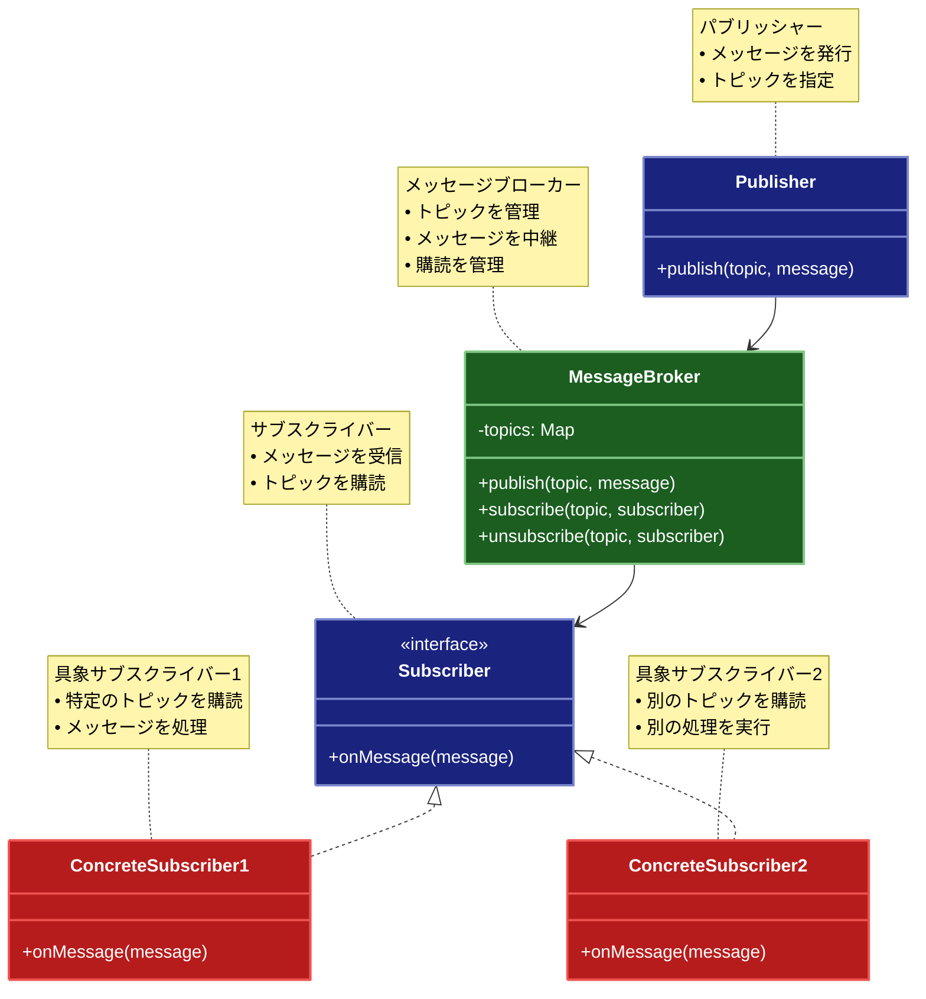

# Pub-Sub（パブリッシャー・サブスクライバー）パターン

## 目的

パブリッシャーとサブスクライバーの間にメッセージブローカーを配置し、疎結合なメッセージング機能を提供するパターンです。

## 価値・解決する問題

- コンポーネント間の疎結合
- スケーラブルな通知機能
- 非同期メッセージング
- 柔軟なメッセージルーティング
- 動的な購読管理

## 概要・特徴

### 概要

Pub-Subパターンは、メッセージの送信者（パブリッシャー）と受信者（サブスクライバー）の間にメッセージブローカーを配置し、両者を完全に分離する設計パターンです。

### 特徴

#### メッセージブローカー
Pub-Subパターンの中核となるのは、パブリッシャーとサブスクライバー間に位置するメッセージブローカーです。このブローカーはメッセージの受信、一時保存、配信を担当し、両者の直接的な結合を防ぎます。メッセージブローカーはメッセージキューを管理し、パブリッシャーからのメッセージを適切なサブスクライバーに配信する責任を持ちます。また、メッセージブローカーは配信保証の管理も行い、一時的な障害時にメッセージが失われないよう、永続化やリトライメカニズムを提供することがあります。高度なブローカーでは、メッセージのフィルタリング、変換、ルーティングなどの機能も提供し、より柔軟なメッセージング機能を実現します。RabbitMQ、Apache Kafka、Google Pub/Sub、AWS SNSといった専用のメッセージングシステムは、堅牢なメッセージブローカー機能を提供し、大規模分散システムでのメッセージングを可能にします。メッセージブローカーの存在により、システムは耐障害性が向上し、パブリッシャーやサブスクライバーの一時的な障害があっても、メッセージング機能全体が停止することはありません。

#### トピックベース通信
Pub-Subパターンでは、メッセージはトピック（またはチャネル）と呼ばれる論理的な分類に基づいて公開・購読されます。パブリッシャーは特定のトピックにメッセージを発行し、そのトピックを購読しているすべてのサブスクライバーにメッセージが配信されます。このトピックベースのアプローチにより、メッセージのカテゴリ分けと効率的なルーティングが可能になります。また、トピックには階層構造や正規表現に基づくフィルタリングを導入することもでき、より柔軟なメッセージ配信パターンを実現できます。例えば、「orders.*.completed」というトピックパターンを購読すれば、すべての地域の完了注文イベントを受け取ることができます。トピックベースの設計により、システムは新しいメッセージタイプや機能を追加する際の拡張性が高まり、既存のコードを変更することなく新しいイベントを導入できるようになります。さらに、トピックベースのアプローチは、データのストリーミング処理やイベント駆動型アーキテクチャとも自然に統合できます。

#### 非同期処理
Pub-Subパターンは本質的に非同期通信を実現します。パブリッシャーはメッセージを発行した後、サブスクライバーの処理を待つことなく次の処理に進むことができます。同様に、サブスクライバーもメッセージを受信したタイミングで独立して処理を行います。この非同期性により、システムのレスポンシブネスとスケーラビリティが向上します。パブリッシャーはサブスクライバーの処理速度に左右されず、高速にメッセージを発行できます。また、サブスクライバーも自身のペースでメッセージを処理できるため、負荷の高い処理も効率的に行えます。この非同期処理モデルは、マイクロサービスアーキテクチャやイベント駆動型システムと特に相性が良く、処理の分散と並列化を促進します。さらに、サブスクライバーがオフラインや処理中であっても、メッセージブローカーがメッセージを保持するため、信頼性の高い通信が実現できます。この特性により、システムの各部分が独立して動作し、一部の障害がシステム全体に波及するリスクを軽減できます。

#### 疎結合な設計
Pub-Subパターンの最も重要な特徴の一つは、コンポーネント間の疎結合を実現することです。パブリッシャーはサブスクライバーの存在を知らずにメッセージを発行し、サブスクライバーもどのパブリッシャーからメッセージが来たかを知る必要がありません。この疎結合な設計により、システムの保守性と拡張性が大幅に向上します。新しいサブスクライバーを追加する際も、既存のコードを変更することなく、単にトピックを購読するよう設定するだけで済みます。同様に、パブリッシャーも既存のサブスクライバーに影響を与えることなく、新しいメッセージを発行できます。この疎結合性により、異なるチームが独立して開発を進められるようになり、大規模なシステム開発においてもコードの依存関係を最小限に抑えることができます。また、異なる言語や技術で実装されたコンポーネント間の通信も容易になり、ポリグロットなシステム構成やレガシーシステムとの統合も容易になります。

#### スケーラビリティ
Pub-Subパターンは優れたスケーラビリティを提供します。メッセージブローカーを介した通信により、システムの各部分を独立してスケールできます。パブリッシャーの数が増加しても、メッセージブローカーがバッファとして機能するため、サブスクライバーに過剰な負荷がかかりません。同様に、サブスクライバーは負荷に応じて動的に追加でき、同じトピックに対して複数のサブスクライバーインスタンスを並列に動作させることで、処理能力を向上させることができます。例えば、処理負荷の高いサブスクライバーを複数インスタンス起動し、負荷分散させることが可能です。また、クラウド環境と組み合わせることで、トラフィックの変動に応じた自動スケーリングも実現できます。この特性は特に、季節変動やキャンペーンなどで負荷が大きく変動するシステムにおいて重要です。さらに、地理的に分散したシステムでも、メッセージブローカーのクラスタリングやレプリケーションにより、グローバルなスケールでの通信が可能になります。

### 概要図



## 類似パターンとの比較

- [Observer (オブザーバー)](observer.md): Pub-Sub はメッセージブローカーを介して通知を行い、これに対して Observer は直接的な通知を行います。
- [Mediator (メディエーター)](mediator.md): Pub-Sub はメッセージングに特化し、これに対して Mediator は複雑な相互作用を管理します。
- [Event-Driven Architecture (イベント駆動アーキテクチャ)](event-driven-architecture.md): Pub-Sub はメッセージングパターンの一つであり、これに対して Event-Driven Architecture はより広範なアーキテクチャパターンです。

## 利用されているライブラリ／フレームワークの事例

- [RabbitMQ](https://www.rabbitmq.com/): メッセージブローカー
- [Apache Kafka](https://kafka.apache.org/): 分散メッセージングシステム
- [Redis Pub/Sub](https://redis.io/topics/pubsub): メッセージング機能

## 解説ページリンク

- [Refactoring Guru - Pub-Sub](https://refactoring.guru/design-patterns/observer)
- [Microsoft - Pub-Sub Pattern](https://docs.microsoft.com/en-us/azure/architecture/patterns/publisher-subscriber)
- [Redis - Pub/Sub](https://redis.io/topics/pubsub)

## コード例

### Before:

直接的なメッセージ通知の実装

```typescript
// ニュースサービス
class NewsService {
  private subscribers: ((news: string) => void)[] = [];

  // 購読者を追加
  addSubscriber(callback: (news: string) => void): void {
    this.subscribers.push(callback);
  }

  // ニュースを配信
  publishNews(news: string): void {
    this.subscribers.forEach(callback => callback(news));
  }
}

// ニュース購読者
class NewsSubscriber {
  constructor(private name: string) {}

  // ニュースを受信
  receiveNews(news: string): void {
    console.log(`${this.name} received news: ${news}`);
  }
}

// 使用例
function example() {
  const newsService = new NewsService();

  // 購読者を作成
  const subscriber1 = new NewsSubscriber("User 1");
  const subscriber2 = new NewsSubscriber("User 2");

  // 購読者を登録
  newsService.addSubscriber(news => subscriber1.receiveNews(news));
  newsService.addSubscriber(news => subscriber2.receiveNews(news));

  // ニュースを配信
  newsService.publishNews("Breaking News: Important Event!");
}

example();
```

### After:

Pub-Subパターンを適用した実装

```typescript
// メッセージの型定義
interface Message {
  topic: string;
  content: any;
  timestamp: Date;
}

// サブスクライバーインターフェース
interface Subscriber {
  onMessage(message: Message): void;
}

// メッセージブローカー
class MessageBroker {
  private static instance: MessageBroker;
  private subscribers: Map<string, Set<Subscriber>> = new Map();
  private messageLog: Message[] = [];
  private readonly maxLogSize: number = 100;

  private constructor() {}

  // シングルトンインスタンスを取得
  static getInstance(): MessageBroker {
    if (!MessageBroker.instance) {
      MessageBroker.instance = new MessageBroker();
    }
    return MessageBroker.instance;
  }

  // トピックの購読
  subscribe(topic: string, subscriber: Subscriber): void {
    if (!this.subscribers.has(topic)) {
      this.subscribers.set(topic, new Set());
    }
    this.subscribers.get(topic)!.add(subscriber);
    console.log(`[Broker] New subscriber for topic: ${topic}`);
  }

  // トピックの購読解除
  unsubscribe(topic: string, subscriber: Subscriber): void {
    const topicSubscribers = this.subscribers.get(topic);
    if (topicSubscribers) {
      topicSubscribers.delete(subscriber);
      console.log(`[Broker] Subscriber removed from topic: ${topic}`);
      if (topicSubscribers.size === 0) {
        this.subscribers.delete(topic);
        console.log(`[Broker] Topic removed: ${topic}`);
      }
    }
  }

  // メッセージの配信
  publish(topic: string, content: any): void {
    const message: Message = {
      topic,
      content,
      timestamp: new Date()
    };

    console.log(`[Broker] Publishing message to topic: ${topic}`);
    console.log(`[Broker] Message content:`, content);

    const topicSubscribers = this.subscribers.get(topic);
    if (topicSubscribers) {
      topicSubscribers.forEach(subscriber => {
        try {
          subscriber.onMessage(message);
        } catch (error) {
          console.error(`[Broker] Error delivering message to subscriber:`, error);
        }
      });
    }

    this.logMessage(message);
  }

  // メッセージのログを記録
  private logMessage(message: Message): void {
    this.messageLog.push(message);
    if (this.messageLog.length > this.maxLogSize) {
      this.messageLog.shift();
    }
  }

  // トピックの購読者数を取得
  getSubscriberCount(topic: string): number {
    return this.subscribers.get(topic)?.size || 0;
  }

  // 全トピックのリストを取得
  getTopics(): string[] {
    return Array.from(this.subscribers.keys());
  }

  // メッセージログを取得
  getMessageLog(): Message[] {
    return [...this.messageLog];
  }
}

// ニュースパブリッシャー
class NewsPublisher {
  private broker: MessageBroker;

  constructor() {
    this.broker = MessageBroker.getInstance();
  }

  // ニュースを配信
  publishNews(category: string, title: string, content: string): void {
    this.broker.publish(category, {
      title,
      content,
      source: "News Agency"
    });
  }
}

// ニュース購読者
class NewsSubscriber implements Subscriber {
  private broker: MessageBroker;

  constructor(
    private name: string,
    private categories: string[]
  ) {
    this.broker = MessageBroker.getInstance();
    this.subscribeToCategories();
  }

  // カテゴリーを購読
  private subscribeToCategories(): void {
    this.categories.forEach(category => {
      this.broker.subscribe(category, this);
    });
  }

  // メッセージを受信
  onMessage(message: Message): void {
    const news = message.content;
    console.log(`\n[${this.name}] Received ${message.topic} news:`);
    console.log(`Title: ${news.title}`);
    console.log(`Content: ${news.content}`);
    console.log(`Source: ${news.source}`);
    console.log(`Time: ${message.timestamp.toLocaleString()}`);
  }

  // カテゴリーの購読を解除
  unsubscribeFromCategory(category: string): void {
    const index = this.categories.indexOf(category);
    if (index !== -1) {
      this.categories.splice(index, 1);
      this.broker.unsubscribe(category, this);
    }
  }

  // 新しいカテゴリーを購読
  subscribeToCategory(category: string): void {
    if (!this.categories.includes(category)) {
      this.categories.push(category);
      this.broker.subscribe(category, this);
    }
  }

  // 購読中のカテゴリーを取得
  getSubscribedCategories(): string[] {
    return [...this.categories];
  }
}

// 統計収集サブスクライバー
class NewsStatisticsCollector implements Subscriber {
  private broker: MessageBroker;
  private statistics: Map<string, number> = new Map();

  constructor() {
    this.broker = MessageBroker.getInstance();
    // すべてのトピックを購読
    this.broker.getTopics().forEach(topic => {
      this.broker.subscribe(topic, this);
      this.statistics.set(topic, 0);
    });
  }

  onMessage(message: Message): void {
    const count = this.statistics.get(message.topic) || 0;
    this.statistics.set(message.topic, count + 1);
  }

  // 統計情報を表示
  printStatistics(): void {
    console.log("\n=== News Statistics ===");
    this.statistics.forEach((count, topic) => {
      console.log(`${topic}: ${count} news items`);
    });
  }
}

// 使用例
function example() {
  // パブリッシャーとサブスクライバーを作成
  const publisher = new NewsPublisher();
  
  const subscriber1 = new NewsSubscriber("John", ["politics", "technology"]);
  const subscriber2 = new NewsSubscriber("Alice", ["technology", "sports"]);
  const subscriber3 = new NewsSubscriber("Bob", ["politics", "sports"]);
  
  const statisticsCollector = new NewsStatisticsCollector();

  // ニュースを配信
  console.log("=== Publishing News ===");
  
  publisher.publishNews(
    "technology",
    "New AI Breakthrough",
    "Scientists have developed a new AI system that can understand complex human emotions."
  );

  publisher.publishNews(
    "politics",
    "Important Policy Change",
    "Government announces new environmental protection policies."
  );

  publisher.publishNews(
    "sports",
    "World Cup Update",
    "Team A wins against Team B in an exciting match."
  );

  // 購読の変更
  console.log("\n=== Subscription Changes ===");
  
  console.log("\nBefore changes:");
  console.log("John's categories:", subscriber1.getSubscribedCategories());
  console.log("Alice's categories:", subscriber2.getSubscribedCategories());
  
  subscriber1.unsubscribeFromCategory("politics");
  subscriber2.subscribeToCategory("politics");
  
  console.log("\nAfter changes:");
  console.log("John's categories:", subscriber1.getSubscribedCategories());
  console.log("Alice's categories:", subscriber2.getSubscribedCategories());

  // さらにニュースを配信
  console.log("\n=== Publishing More News ===");
  
  publisher.publishNews(
    "technology",
    "5G Network Expansion",
    "Telecom companies announce nationwide 5G network coverage."
  );

  publisher.publishNews(
    "politics",
    "International Summit",
    "World leaders gather to discuss climate change."
  );

  // 統計情報を表示
  statisticsCollector.printStatistics();

  // メッセージブローカーの状態を表示
  const broker = MessageBroker.getInstance();
  console.log("\n=== Broker Status ===");
  console.log("Active topics:", broker.getTopics());
  broker.getTopics().forEach(topic => {
    console.log(`Subscribers for ${topic}:`, broker.getSubscriberCount(topic));
  });
}

example();
```
``` 