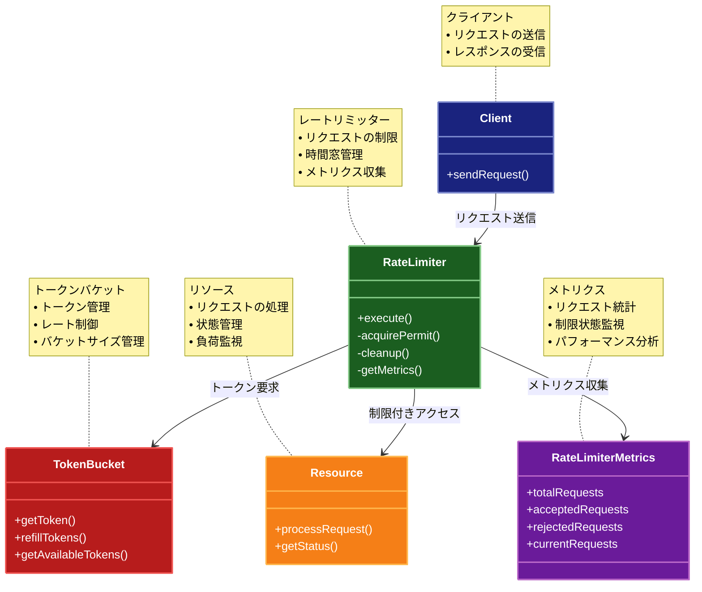

# Rate Limiter（レートリミッター）パターン

## 目的

リソースへのアクセス頻度を制限し、システムの安定性とパフォーマンスを維持するパターンです。

## 価値・解決する問題

- リソースの過剰消費を防ぎます
- システムの安定性を向上させます
- サービスの品質を維持します
- DoS攻撃を防止します
- 公平なリソース分配を実現します

## 概要・特徴

### 概要

Rate Limiterパターンは、リソースへのアクセス頻度を制限する設計パターンです。これにより、システムの安定性とパフォーマンスを維持し、公平なリソース分配を実現します。

### 特徴

- アクセス制限
- トークンバケット方式
- 時間窓方式
- 優先順位付け
- メトリクス収集

### 概要図



## 類似パターンとの比較

- [Circuit Breaker (サーキットブレーカー)](circuit-breaker.md): Rate Limiter はリクエストの制限を行い、これに対して Circuit Breaker は障害検知による遮断を行います。
- [Bulkhead (バルクヘッド)](bulkhead.md): Rate Limiter はリクエストの制限を行い、これに対して Bulkhead は分離による障害の局所化を行います。
- [Throttling (スロットリング)](throttling.md): Rate Limiter は制限を超えたリクエストを拒否し、これに対して Throttling は制限を超えたリクエストを遅延させます。

## 利用されているライブラリ／フレームワークの事例

- [Resilience4j](https://resilience4j.readme.io/): Java用の障害耐性ライブラリ
- [Polly](https://github.com/App-vNext/Polly): .NET用の回復力パターンライブラリ
- [Express Rate Limit](https://github.com/nfriedly/express-rate-limit): Express.jsのレートリミッター

## 解説ページリンク

- [Microsoft Cloud Design Patterns: Throttling](https://docs.microsoft.com/en-us/azure/architecture/patterns/throttling)
- [Rate Limiting Strategies and Techniques](https://cloud.google.com/architecture/rate-limiting-strategies-techniques)
- [Understanding Rate Limiting](https://blog.cloudflare.com/understanding-rate-limiting/)

## コード例

### Before:

レートリミッター機能のない実装

```typescript
class UserService {
  private db: Map<string, any>;

  constructor() {
    this.db = new Map([
      ["1", { id: "1", name: "John Doe", email: "john@example.com" }],
      ["2", { id: "2", name: "Jane Smith", email: "jane@example.com" }]
    ]);
  }

  async getUser(id: string): Promise<any> {
    // データベースアクセスを遅延させる
    await new Promise(resolve => setTimeout(resolve, 100));

    const user = this.db.get(id);
    if (!user) {
      throw new Error("User not found");
    }
    return user;
  }

  async updateUser(id: string, data: any): Promise<any> {
    // データベースアクセスを遅延させる
    await new Promise(resolve => setTimeout(resolve, 100));

    if (!this.db.has(id)) {
      throw new Error("User not found");
    }
    const updatedUser = { ...this.db.get(id), ...data };
    this.db.set(id, updatedUser);
    return updatedUser;
  }
}

// 使用例
async function example() {
  const service = new UserService();

  try {
    // 大量のリクエストを同時に実行
    const promises = Array.from({ length: 50 }, (_, i) => 
      service.getUser(String(i % 2 + 1))
    );

    const results = await Promise.all(promises);
    console.log("結果:", results.length);
  } catch (error) {
    console.error("エラー:", error);
  }
}

example();
```

### After:

Rate Limiterパターンを適用した実装

```typescript
// レートリミッターの設定
interface RateLimiterConfig {
  maxRequests: number;     // 最大リクエスト数
  windowMs: number;        // 時間窓（ミリ秒）
  maxWaitingTime: number;  // 最大待機時間（ミリ秒）
}

// レートリミッターのメトリクス
interface RateLimiterMetrics {
  totalRequests: number;   // 総リクエスト数
  acceptedRequests: number; // 受け入れられたリクエスト数
  rejectedRequests: number; // 拒否されたリクエスト数
  currentRequests: number;  // 現在のリクエスト数
  waitingRequests: number;  // 待機中のリクエスト数
}

// レートリミッターの実装
class RateLimiter {
  private requests: Array<number> = [];
  private waitingQueue: Array<{
    resolve: () => void;
    reject: (error: Error) => void;
    timeout: NodeJS.Timeout;
  }> = [];
  private metrics: RateLimiterMetrics = {
    totalRequests: 0,
    acceptedRequests: 0,
    rejectedRequests: 0,
    currentRequests: 0,
    waitingRequests: 0
  };

  constructor(private config: RateLimiterConfig) {
    // 定期的なクリーンアップを開始
    setInterval(() => this.cleanup(), 1000);
  }

  // リクエストを実行
  async execute<T>(operation: () => Promise<T>): Promise<T> {
    this.metrics.totalRequests++;
    this.metrics.currentRequests++;

    try {
      // リクエストを許可するかチェック
      await this.acquirePermit();

      // 操作を実行
      const result = await operation();

      this.metrics.acceptedRequests++;
      return result;
    } catch (error) {
      this.metrics.rejectedRequests++;
      throw error;
    } finally {
      this.metrics.currentRequests--;
    }
  }

  // リクエストの許可を取得
  private async acquirePermit(): Promise<void> {
    const now = Date.now();
    this.cleanup();

    // 現在のウィンドウ内のリクエスト数をチェック
    if (this.requests.length < this.config.maxRequests) {
      this.requests.push(now);
      return;
    }

    // 待機キューが許容範囲内かチェック
    if (this.waitingQueue.length >= this.config.maxRequests) {
      throw new Error("Rate limit exceeded");
    }

    // 待機キューに追加
    return new Promise<void>((resolve, reject) => {
      const timeout = setTimeout(() => {
        const index = this.waitingQueue.findIndex(item => item.timeout === timeout);
        if (index !== -1) {
          this.waitingQueue.splice(index, 1);
          this.metrics.waitingRequests--;
          reject(new Error("Request timeout"));
        }
      }, this.config.maxWaitingTime);

      this.waitingQueue.push({ resolve, reject, timeout });
      this.metrics.waitingRequests++;
    });
  }

  // 期限切れのリクエストをクリーンアップ
  private cleanup(): void {
    const now = Date.now();
    const windowStart = now - this.config.windowMs;

    // 期限切れのリクエストを削除
    while (this.requests.length > 0 && this.requests[0] <= windowStart) {
      this.requests.shift();

      // 待機中のリクエストがあれば実行
      if (this.waitingQueue.length > 0) {
        const { resolve, timeout } = this.waitingQueue.shift()!;
        clearTimeout(timeout);
        this.metrics.waitingRequests--;
        this.requests.push(now);
        resolve();
      }
    }
  }

  // メトリクスを取得
  getMetrics(): RateLimiterMetrics {
    return { ...this.metrics };
  }
}

// ユーザーの型
interface User {
  id: string;
  name: string;
  email: string;
  updatedAt: number;
}

// データベースの実装
class Database {
  private db: Map<string, User>;

  constructor() {
    this.db = new Map([
      ["1", {
        id: "1",
        name: "John Doe",
        email: "john@example.com",
        updatedAt: Date.now()
      }],
      ["2", {
        id: "2",
        name: "Jane Smith",
        email: "jane@example.com",
        updatedAt: Date.now()
      }]
    ]);
  }

  async read(id: string): Promise<User> {
    // データベースアクセスを遅延させる
    await new Promise(resolve => setTimeout(resolve, 100));

    const user = this.db.get(id);
    if (!user) {
      throw new Error("User not found");
    }
    return user;
  }

  async write(id: string, user: User): Promise<void> {
    // データベースアクセスを遅延させる
    await new Promise(resolve => setTimeout(resolve, 100));

    this.db.set(id, {
      ...user,
      updatedAt: Date.now()
    });
  }
}

// レートリミッター機能を持つユーザーサービス
class RateLimitedUserService {
  private readLimiter: RateLimiter;
  private writeLimiter: RateLimiter;
  private db: Database;

  constructor(
    readConfig?: Partial<RateLimiterConfig>,
    writeConfig?: Partial<RateLimiterConfig>
  ) {
    this.readLimiter = new RateLimiter({
      maxRequests: 10,    // 10リクエスト
      windowMs: 1000,     // 1秒間
      maxWaitingTime: 5000, // 最大5秒待機
      ...readConfig
    });

    this.writeLimiter = new RateLimiter({
      maxRequests: 5,     // 5リクエスト
      windowMs: 1000,     // 1秒間
      maxWaitingTime: 10000, // 最大10秒待機
      ...writeConfig
    });

    this.db = new Database();
  }

  // ユーザーを取得
  async getUser(id: string): Promise<User> {
    return await this.readLimiter.execute(async () => {
      return await this.db.read(id);
    });
  }

  // ユーザーを更新
  async updateUser(id: string, data: Partial<User>): Promise<User> {
    return await this.writeLimiter.execute(async () => {
      const currentUser = await this.db.read(id);
      const updatedUser: User = {
        ...currentUser,
        ...data,
        id, // IDは変更不可
        updatedAt: Date.now()
      };
      await this.db.write(id, updatedUser);
      return updatedUser;
    });
  }

  // メトリクスを取得
  getMetrics(): {
    read: RateLimiterMetrics;
    write: RateLimiterMetrics;
  } {
    return {
      read: this.readLimiter.getMetrics(),
      write: this.writeLimiter.getMetrics()
    };
  }
}

// 使用例
async function example() {
  const service = new RateLimitedUserService({
    maxRequests: 5,      // 5リクエスト
    windowMs: 1000,      // 1秒間
    maxWaitingTime: 5000 // 最大5秒待機
  });

  try {
    console.log("=== 大量のリクエストを同時に実行 ===");
    const startTime = Date.now();

    // 20個のリクエストを同時に実行
    const promises = Array.from({ length: 20 }, (_, i) => {
      const id = String(i % 2 + 1);
      return service.getUser(id)
        .then(user => ({ status: "fulfilled", value: user }))
        .catch(error => ({ status: "rejected", reason: error.message }));
    });

    const results = await Promise.all(promises);
    const endTime = Date.now();

    console.log("\n=== 実行結果 ===");
    console.log("成功:", results.filter(r => r.status === "fulfilled").length);
    console.log("失敗:", results.filter(r => r.status === "rejected").length);
    console.log("実行時間:", endTime - startTime, "ms");
    console.log("メトリクス:", service.getMetrics());

    console.log("\n=== 1秒待機後に再度実行 ===");
    await new Promise(resolve => setTimeout(resolve, 1000));

    const user = await service.getUser("1");
    console.log("ユーザー取得成功:", user);
    console.log("メトリクス:", service.getMetrics());

  } catch (error) {
    console.error("エラー:", error);
  }
}

// 実行
example();