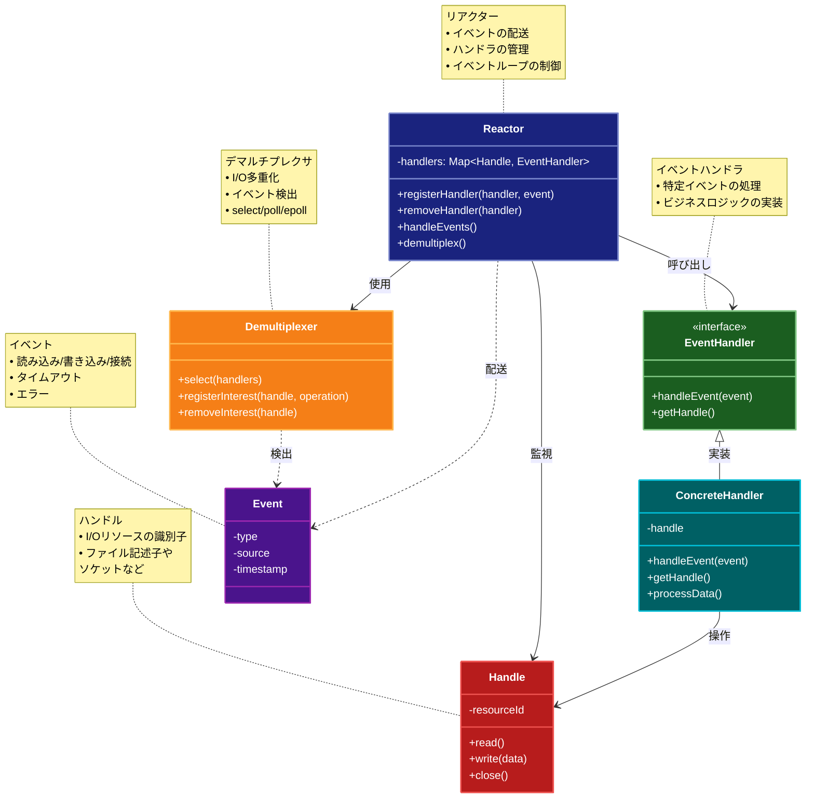

# Reactor (リアクター)

## 目的

Reactor パターンは、非同期 I/O イベントの効率的な処理と分配を実現するパターンです。イベントの受付とハンドリングを分離し、シングルスレッド環境下でも多数の接続を効率的に処理することが可能になります。

## 価値・解決する問題

- ノンブロッキング I/O による高いスループットの実現
- イベント駆動型のアーキテクチャにより、効率的なリソース利用が可能
- イベントハンドラの登録と分配を明確にすることで、システムの可読性と保守性が向上

## コード例

### Before:

従来のブロッキング I/O を利用したシンプルな実装例

```typescript
"use strict";

const net = require("net");

const server = net.createServer((socket) => {
  socket.on("data", (data: Buffer) => {
    // データ受信後にブロッキング処理を実施
    const response = data.toString().toUpperCase();
    socket.write(response);
  });
});

server.listen(3000, () => {
  console.log("サーバーがポート3000で待機中");
});
```

### After:

Reactor パターンを模倣し、非同期イベントディスパッチの仕組みを実現した例

```typescript
"use strict";

import {createServer, Socket} from "net";

class Reactor {
  private eventHandlers: {
    [event: string]: ((socket: Socket, data: Buffer) => void)[];
  } = {};

  // イベントハンドラを登録するメソッド
  on(event: string, handler: (socket: Socket, data: Buffer) => void): void {
    if (!this.eventHandlers[event]) {
      this.eventHandlers[event] = [];
    }
    this.eventHandlers[event].push(handler);
  }

  // 登録されたイベントハンドラをディスパッチするメソッド
  dispatch(event: string, socket: Socket, data: Buffer): void {
    const handlers = this.eventHandlers[event];
    if (handlers) {
      handlers.forEach((handler) => handler(socket, data));
    }
  }
}

const reactor = new Reactor();

// 'data'イベントのハンドラを登録
reactor.on("data", (socket, data) => {
  const response = data.toString().toUpperCase();
  socket.write(response);
});

const server = createServer((socket) => {
  socket.on("data", (data: Buffer) => {
    reactor.dispatch("data", socket, data);
  });
});

server.listen(3000, () => {
  console.log("Reactorパターンを利用したサーバーがポート3000で待機中");
});
```

## 類似パターンとの比較

- [Reactive Programming (リアクティブプログラミング)](rx.md): Reactor は主に I/O イベントの効率的な分配に特化するのに対し、Reactive Programming はデータの流れに基づいた非同期処理を提供します。

## 利用されているライブラリ／フレームワークの事例

- [Netty](https://netty.io/): Java の非同期イベント駆動ネットワークアプリケーションフレームワークで、Reactor パターンを採用
- [Node.js](https://nodejs.org/): イベントループの実装で Reactor パターンの考え方を採用し、非同期 I/O を効率的に処理
- [libuv](https://libuv.org/): Node.js の基盤となっているイベントループライブラリで、Reactor パターンを活用した I/O 処理を実現

## 概要・特徴

### 概要

Reactorパターンは、イベント駆動型のアーキテクチャで、非同期I/O操作と多重イベント処理を効率的に管理するための設計パターンです。イベントハンドラを登録し、I/Oイベントが発生すると対応するハンドラが呼び出される仕組みを提供します。

### 特徴

#### シングルスレッドで複数の接続を処理
Reactorパターンは、単一のスレッドを使用して複数のクライアント接続やI/Oチャネルを同時に処理できます。スレッドの生成・管理コストを削減し、コンテキストスイッチによるオーバーヘッドを最小限に抑えながら、高いスケーラビリティを実現します。数千の接続を少ないリソースで効率的に処理できるため、高パフォーマンスなネットワークサーバーに適しています。

#### イベントループベースのアーキテクチャ
中心となるイベントループ（Reactor）がシステム全体のイベント処理フローを制御します。このループはイベントの検出、ディスパッチ、ハンドラの呼び出しを繰り返し行い、アプリケーションのライフサイクル全体を管理します。イベント駆動型の設計により、システムはイベントが発生した時にのみリソースを消費し、待機中は最小限のリソース使用に抑えられます。

#### 非ブロッキングI/O操作
すべてのI/O操作は非ブロッキングモードで実行され、処理が完了するまで待機することなく制御が即座に戻ります。これにより、一つの操作が完了するのを待つ間も他の操作を処理できるため、システム全体のスループットが向上します。長時間実行される操作がシステム全体をブロックすることがなく、応答性の高いアプリケーションを構築できます。

#### イベントハンドラの登録と呼び出し
特定のイベントに対応するハンドラを動的に登録・削除できる柔軟な仕組みを提供します。各ハンドラは特定のイベントタイプや関心を持つI/Oチャネルに関連付けられ、対応するイベントが発生した時にのみ呼び出されます。これにより、機能の追加や変更が容易になり、システムの拡張性が向上します。

#### 効率的なリソース利用
必要最小限のリソース（メモリ、CPU、スレッド）でシステムを運用できます。イベントが発生していない時はアイドル状態となり、システムリソースの消費を抑えられます。また、リソースを効率的に使用することで、より多くのクライアント接続を同時に処理できるため、システムの全体的なパフォーマンスとスケーラビリティが向上します。

### 概要図


