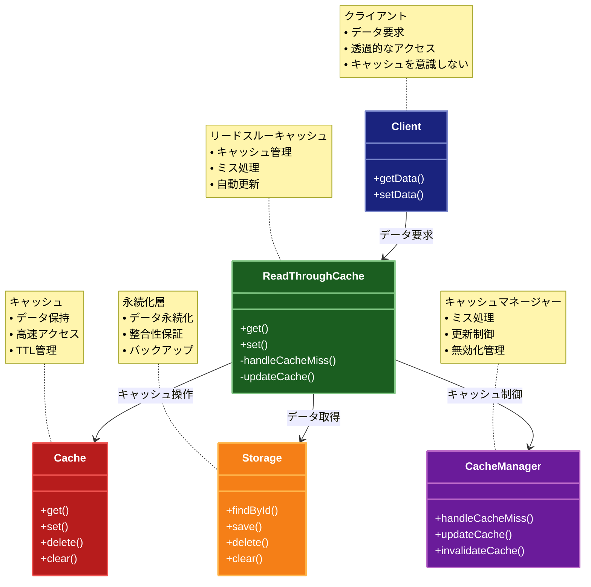

# Read-Through（リードスルー）パターン

## 目的

データの読み取り時にキャッシュミスが発生した場合、自動的に永続化層からデータを取得してキャッシュに格納し、透過的なキャッシュ管理を実現するパターンです。

## 価値・解決する問題

- 読み取りパフォーマンスを向上させます
- キャッシュ管理を透過的に行います
- データの一貫性を維持します
- アプリケーションの複雑性を低減します
- キャッシュミスの処理を自動化します

## 概要・特徴

### 概要

Read-Throughパターンは、キャッシュミス時の永続化層からのデータ取得とキャッシュへの格納を自動化するパターンです。アプリケーションはキャッシュの存在を意識することなく、一貫したインターフェースを通じてデータにアクセスできます。このパターンではキャッシュレイヤー自体がデータソースへのアクセスを管理し、キャッシュとデータベースの間の連携を隠蔽します。

### 特徴

#### 透過的なキャッシュ管理

アプリケーションはキャッシュの存在を意識せず、単一のインターフェースを通じてデータにアクセスできます。キャッシュミスの処理やデータの取得ロジックはキャッシュレイヤー内にカプセル化されており、アプリケーションコードからは完全に隠蔽されています。これにより、アプリケーション開発者はキャッシュの詳細を気にすることなく、ビジネスロジックに集中できます。例えば、データアクセスライブラリを使用する際、開発者はキャッシュの有無に関わらず同じAPIを使用し、キャッシュレイヤーが自動的にデータの取得と管理を行います。

#### 自動的なキャッシュ更新

キャッシュミスが発生した場合、キャッシュレイヤーが自動的にデータソースからデータを取得し、キャッシュに格納します。この自動更新メカニズムにより、最初のリクエスト以降のアクセスが高速化されます。例えば、ユーザー情報を取得する場合、最初のリクエストでデータベースからデータが取得され、同時にキャッシュに格納されるため、同じユーザー情報への後続のリクエストは高速に処理されます。これにより、特に読み取り頻度の高いデータに対するパフォーマンスが大幅に向上します。

#### 一貫したデータアクセスインターフェース

アプリケーションはデータがキャッシュから取得されるか、データベースから取得されるかを意識することなく、同じインターフェースを使用できます。この一貫性により、コードの可読性が向上し、キャッシュの追加や削除によるアプリケーションコードの変更が最小限に抑えられます。例えば、同じリポジトリインターフェースがキャッシュの有無に関わらず使用され、キャッシュの実装が変更されても、アプリケーションコードを変更する必要がありません。

#### レイテンシの最適化

キャッシュミス時の処理が最適化され、データベースからのデータ取得とキャッシュへの格納が効率的に行われます。多くの実装では、非同期処理や並行処理を利用して、キャッシュミス時のパフォーマンスペナルティを最小限に抑えています。これにより、大量のリクエストを処理するシステムでも一貫したレスポンス時間が維持されます。例えば、複数のユーザーが同時に同じデータにアクセスする場合でも、キャッシュミスの処理が効率的に行われるため、全体的なシステムパフォーマンスが向上します。

#### キャッシュポリシーの集中管理

TTL（Time-To-Live）やキャッシュサイズなどのキャッシュポリシーがキャッシュレイヤー内で一元管理されます。これにより、キャッシュの動作を一箇所で制御でき、一貫した戦略でキャッシュを運用できます。例えば、データの種類や重要度に応じて異なるTTL値を設定したり、リソース制約に基づいてキャッシュサイズを調整したりできます。この集中管理により、システム全体のキャッシュ戦略を容易に調整でき、パフォーマンスチューニングが効率化されます。

### 概要図



## 類似パターンとの比較

- [Cache-Aside (キャッシュアサイド)](cache-aside.md): Read-Through はキャッシュ管理を透過的に行い、これに対して Cache-Aside はアプリケーションがキャッシュを明示的に管理します。
- [Write-Through (ライトスルー)](write-through.md): Read-Through は読み取り操作に焦点を当て、これに対して Write-Through は書き込み操作に焦点を当てます。
- [Write-Behind (ライトビハインド)](write-behind.md): Read-Through は読み取り時の同期的な更新を行い、これに対して Write-Behind は書き込み時の非同期更新を行います。

## 利用されているライブラリ／フレームワークの事例

- [Redis](https://redis.io/docs/manual/persistence/): キャッシュ設定
- [Hibernate](https://hibernate.org/): 2次キャッシュ機能
- [Spring Cache](https://docs.spring.io/spring-framework/docs/current/reference/html/integration.html#cache): キャッシュ抽象化

## 解説ページリンク

- [Microsoft - Cache-Aside Pattern](https://docs.microsoft.com/en-us/azure/architecture/patterns/cache-aside)
- [AWS - Caching Strategies](https://aws.amazon.com/caching/best-practices/)
- [Redis Documentation](https://redis.io/docs/manual/persistence/)

## コード例

### Before:

キャッシュと永続化層を個別に管理する実装

```typescript
class UserRepository {
  private cache: Map<string, User>;
  private db: Database;

  constructor() {
    this.cache = new Map();
    this.db = new Database();
  }

  async getUser(id: string): Promise<User | null> {
    // キャッシュから取得
    const cachedUser = this.cache.get(id);
    if (cachedUser) {
      return cachedUser;
    }

    // データベースから取得
    const user = await this.db.findById(id);
    if (user) {
      this.cache.set(id, user);
    }
    return user;
  }
}
```

### After:

Read-Throughパターンを適用した実装

```typescript
// ユーザーを表すドメインモデル
interface User {
  id: string;
  name: string;
  email: string;
  lastUpdated: Date;
}

// キャッシュインターフェース
interface Cache<T> {
  get(key: string): Promise<T | null>;
  set(key: string, value: T): Promise<void>;
  delete(key: string): Promise<void>;
  clear(): Promise<void>;
}

// 永続化層インターフェース
interface Storage<T> {
  findById(id: string): Promise<T | null>;
  save(entity: T): Promise<void>;
  delete(id: string): Promise<void>;
  clear(): Promise<void>;
}

// Redisキャッシュの実装
class RedisCache<T> implements Cache<T> {
  private client: Redis;

  constructor(redisUrl: string) {
    this.client = new Redis(redisUrl);
  }

  async get(key: string): Promise<T | null> {
    const value = await this.client.get(key);
    return value ? JSON.parse(value) : null;
  }

  async set(key: string, value: T): Promise<void> {
    await this.client.set(key, JSON.stringify(value));
  }

  async delete(key: string): Promise<void> {
    await this.client.del(key);
  }

  async clear(): Promise<void> {
    await this.client.flushall();
  }
}

// データベースの実装
class Database<T> implements Storage<T> {
  private db: any; // 実際のデータベース接続

  constructor(dbConfig: any) {
    this.db = dbConfig;
  }

  async findById(id: string): Promise<T | null> {
    // データベースからの読み取り実装
    return this.db.findById(id);
  }

  async save(entity: T): Promise<void> {
    // データベースへの保存実装
    await this.db.save(entity);
  }

  async delete(id: string): Promise<void> {
    // データベースからの削除実装
    await this.db.delete(id);
  }

  async clear(): Promise<void> {
    // データベースのクリア実装
    await this.db.clear();
  }
}

// Read-Throughキャッシュの実装
class ReadThroughCache<T extends { id: string }> {
  private readonly ttl: number; // キャッシュの有効期限（ミリ秒）

  constructor(
    private cache: Cache<T>,
    private storage: Storage<T>,
    ttlMs: number = 3600000 // デフォルト1時間
  ) {
    this.ttl = ttlMs;
  }

  async get(id: string): Promise<T | null> {
    try {
      // まずキャッシュを確認
      const cachedValue = await this.cache.get(id);
      if (cachedValue) {
        console.log(`キャッシュヒット: ${id}`);
        return cachedValue;
      }

      console.log(`キャッシュミス: ${id}`);
      // キャッシュミスの場合、ストレージから取得
      const storedValue = await this.storage.findById(id);
      if (storedValue) {
        // 取得した値をキャッシュに保存
        await this.cache.set(id, storedValue);
        console.log(`キャッシュ更新: ${id}`);
      }
      return storedValue;
    } catch (error) {
      console.error("データ取得エラー:", error);
      throw new Error("データの取得に失敗しました");
    }
  }

  async set(value: T): Promise<void> {
    try {
      // 永続化層とキャッシュを同時に更新
      await Promise.all([
        this.storage.save(value),
        this.cache.set(value.id, value)
      ]);
    } catch (error) {
      // エラーが発生した場合、キャッシュを無効化
      await this.cache.delete(value.id);
      console.error("データ保存エラー:", error);
      throw new Error("データの保存に失敗しました");
    }
  }

  async delete(id: string): Promise<void> {
    try {
      await Promise.all([
        this.storage.delete(id),
        this.cache.delete(id)
      ]);
    } catch (error) {
      console.error("データ削除エラー:", error);
      throw new Error("データの削除に失敗しました");
    }
  }

  async clear(): Promise<void> {
    try {
      await Promise.all([
        this.storage.clear(),
        this.cache.clear()
      ]);
    } catch (error) {
      console.error("キャッシュクリアエラー:", error);
      throw new Error("キャッシュのクリアに失敗しました");
    }
  }
}

// ユーザーリポジトリの実装
class UserRepository {
  private cache: ReadThroughCache<User>;

  constructor(redisUrl: string, dbConfig: any) {
    this.cache = new ReadThroughCache<User>(
      new RedisCache(redisUrl),
      new Database(dbConfig)
    );
  }

  async getUser(id: string): Promise<User | null> {
    return this.cache.get(id);
  }

  async saveUser(user: User): Promise<void> {
    user.lastUpdated = new Date();
    await this.cache.set(user);
  }

  async deleteUser(id: string): Promise<void> {
    await this.cache.delete(id);
  }

  async clearAll(): Promise<void> {
    await this.cache.clear();
  }
}

// 使用例
async function example() {
  try {
    // リポジトリの初期化
    const userRepo = new UserRepository(
      "redis://localhost:6379",
      { /* データベース設定 */ }
    );

    // ユーザーの作成と保存
    const user: User = {
      id: "1",
      name: "山田太郎",
      email: "yamada@example.com",
      lastUpdated: new Date()
    };

    console.log("=== ユーザーの保存 ===");
    await userRepo.saveUser(user);
    console.log("ユーザーを保存しました");

    // 初回のユーザー取得（キャッシュミス → データベースから取得）
    console.log("\n=== ユーザーの初回取得 ===");
    const firstFetch = await userRepo.getUser("1");
    console.log("初回取得したユーザー:", firstFetch);

    // 2回目のユーザー取得（キャッシュヒット）
    console.log("\n=== ユーザーの2回目の取得 ===");
    const secondFetch = await userRepo.getUser("1");
    console.log("2回目に取得したユーザー:", secondFetch);

    // ユーザーの更新
    if (firstFetch) {
      console.log("\n=== ユーザーの更新 ===");
      firstFetch.name = "山田次郎";
      await userRepo.saveUser(firstFetch);
      console.log("ユーザーを更新しました");

      // 更新後の取得（キャッシュヒット）
      const updatedUser = await userRepo.getUser("1");
      console.log("更新後のユーザー:", updatedUser);
    }

    // ユーザーの削除
    console.log("\n=== ユーザーの削除 ===");
    await userRepo.deleteUser("1");
    console.log("ユーザーを削除しました");

    const deletedUser = await userRepo.getUser("1");
    console.log("削除後のユーザー:", deletedUser);

  } catch (error) {
    console.error("エラー:", error);
  }
}

example();
``` 