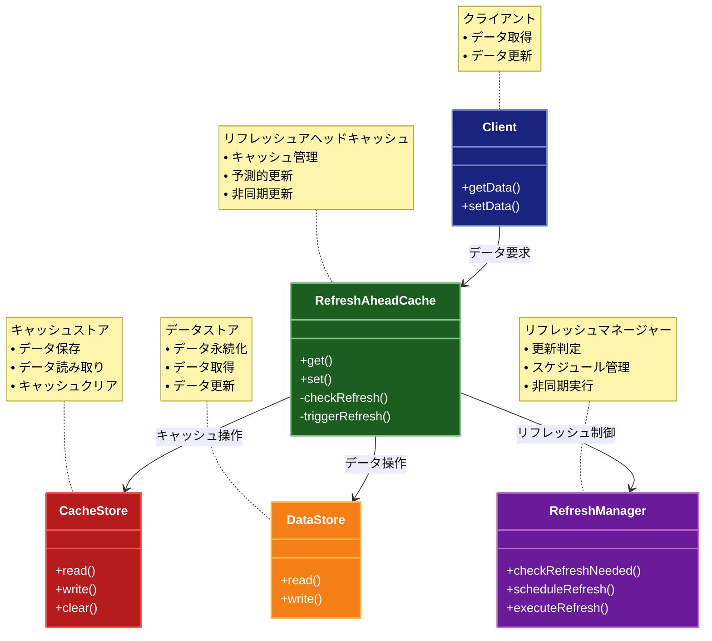

# Refresh-Ahead Cache（リフレッシュアヘッドキャッシュ）パターン

## 目的

キャッシュの有効期限が切れる前に、予測的にキャッシュを更新することで、キャッシュミスを最小限に抑え、アプリケーションのパフォーマンスを向上させるパターンです。

## 価値・解決する問題

- キャッシュミスを最小限に抑えます
- レイテンシを低減します
- データの鮮度を保ちます
- システムの応答性を向上させます
- 予測的な更新により負荷を分散します

## 概要・特徴

### 概要

Refresh-Ahead Cacheパターンは、キャッシュの有効期限が切れる前に、予測的にキャッシュを更新する設計パターンです。これにより、キャッシュミスを最小限に抑え、アプリケーションのパフォーマンスを向上させます。

### 特徴

#### 予測的な更新
キャッシュされたデータの有効期限が切れる前に、事前にバックグラウンドでデータを更新します。例えば、有効期限の80%が経過した時点で自動的に更新処理を開始することで、ユーザーがリクエストする前に最新データをキャッシュに用意します。これにより、ユーザーリクエスト時のキャッシュミスを防ぎ、システム全体のレスポンス速度を向上させます。頻繁にアクセスされるデータに対して特に効果的です。

#### 非同期更新
キャッシュの更新はバックグラウンドで非同期に行われます。クライアントのリクエストに応答するメインスレッドとは別のスレッドまたはプロセスでデータの更新が実行されるため、ユーザーのリクエスト処理がブロックされることはありません。これにより、複数のキャッシュエントリを同時に更新することができ、システム全体のスループットが向上します。

#### 負荷分散
データソースへのアクセスピークを平坦化し、均等に分散させることができます。通常のキャッシュでは有効期限切れが集中すると、同時に多くのリクエストがデータソースに殺到することがありますが、このパターンでは更新を予測的に行うため、データソースへのアクセスが時間的に分散されます。これにより、データベースなどのバックエンドシステムへの負荷を軽減し、システム全体の安定性が向上します。

#### 高可用性
バックエンドのデータソースが一時的に利用できない場合でも、キャッシュされたデータが利用可能であれば、アプリケーションは機能し続けることができます。また、更新の失敗時には古いデータを保持し続けることで、サービスの中断を最小限に抑えることができます。これにより、システム全体の耐障害性が向上し、バックエンドシステムの一時的な障害がエンドユーザーに影響を与えにくくなります。

#### 応答性の向上
ユーザーリクエストの大部分がキャッシュから直接応答されるため、システム全体の応答性が向上します。特に、データの取得に時間がかかるオペレーションや、複雑な計算を必要とするデータに対して顕著な効果があります。キャッシュミスの頻度が低減されるため、ユーザーが待機時間の長いレスポンスを経験する確率も大幅に減少します。

### 概要図



## 類似パターンとの比較

- [Cache Aside (キャッシュアサイド)](cache-aside.md): Refresh-Ahead Cache は予測的に更新し、これに対して Cache Aside は必要時に更新します。
- [Read-Through (リードスルーキャッシュ)](read-through.md): Refresh-Ahead Cache は予測的に更新し、これに対して Read-Through は読み取り時に更新します。
- [Write-Through (ライトスルーキャッシュ)](write-through.md): Refresh-Ahead Cache は予測的に更新し、これに対して Write-Through は書き込み時に更新します。

## 利用されているライブラリ／フレームワークの事例

- [EhCache](https://www.ehcache.org/): Java用のキャッシュライブラリ
- [NCache](https://www.alachisoft.com/ncache/): .NET用の分散キャッシュ
- [Hibernate Second Level Cache](https://hibernate.org/orm/documentation/): Hibernateのキャッシュ機能

## 解説ページリンク

- [Microsoft Cloud Design Patterns: Cache-Aside](https://docs.microsoft.com/en-us/azure/architecture/patterns/cache-aside)
- [Caching Strategies and How to Choose the Right One](https://codeahoy.com/2017/08/11/caching-strategies-and-how-to-choose-the-right-one/)
- [Hibernate Second Level Cache](https://docs.jboss.org/hibernate/orm/5.4/userguide/html_single/Hibernate_User_Guide.html#caching)

## コード例

### Before:

キャッシュ機能のない実装

```typescript
class UserService {
  private db: Map<string, any>;

  constructor() {
    // データベースの代わりにMapを使用
    this.db = new Map([
      ["1", { id: "1", name: "John Doe", email: "john@example.com" }],
      ["2", { id: "2", name: "Jane Smith", email: "jane@example.com" }]
    ]);
  }

  async getUser(id: string): Promise<any> {
    // データベースから直接ユーザーを取得
    const user = this.db.get(id);
    if (!user) {
      throw new Error("User not found");
    }
    return user;
  }

  async updateUser(id: string, data: any): Promise<any> {
    // データベースを直接更新
    if (!this.db.has(id)) {
      throw new Error("User not found");
    }
    const updatedUser = { ...this.db.get(id), ...data };
    this.db.set(id, updatedUser);
    return updatedUser;
  }
}

// 使用例
async function example() {
  const service = new UserService();

  try {
    const user = await service.getUser("1");
    console.log("ユーザー取得:", user);

    const updatedUser = await service.updateUser("1", { name: "John Updated" });
    console.log("ユーザー更新:", updatedUser);
  } catch (error) {
    console.error("エラー:", error);
  }
}

example();
```

### After:

Refresh-Ahead Cacheパターンを適用した実装

```typescript
// キャッシュエントリの型
interface CacheEntry<T> {
  value: T;
  expiresAt: number;
  refreshAt: number;  // リフレッシュを開始する時刻
  isRefreshing: boolean;  // リフレッシュ中かどうか
}

// キャッシュの設定
interface CacheConfig {
  ttl: number;           // キャッシュの有効期限（ミリ秒）
  refreshAheadTime: number; // 有効期限前のリフレッシュ開始時間（ミリ秒）
  maxSize: number;       // キャッシュの最大サイズ
  cleanupInterval: number; // クリーンアップ間隔（ミリ秒）
}

// データストアのインターフェース
interface DataStore<T> {
  read(key: string): Promise<T>;
  write(key: string, value: T): Promise<void>;
}

// Refresh-Aheadキャッシュの実装
class RefreshAheadCache<T> {
  private cache: Map<string, CacheEntry<T>>;
  private config: CacheConfig;
  private refreshQueue: Set<string>;

  constructor(
    private readonly store: DataStore<T>,
    config: Partial<CacheConfig> = {}
  ) {
    this.config = {
      ttl: 5 * 60 * 1000,  // 5分
      refreshAheadTime: 1 * 60 * 1000, // 1分
      maxSize: 1000,
      cleanupInterval: 60 * 1000, // 1分
      ...config
    };

    this.cache = new Map();
    this.refreshQueue = new Set();

    // 定期的なクリーンアップを開始
    setInterval(() => this.cleanup(), this.config.cleanupInterval);

    // 定期的なリフレッシュチェックを開始
    setInterval(() => this.checkRefresh(), 1000); // 1秒ごとにチェック
  }

  // データを取得
  async get(key: string): Promise<T> {
    const entry = this.cache.get(key);
    const now = Date.now();
    
    // キャッシュヒット時
    if (entry) {
      // 有効期限内の場合
      if (now <= entry.expiresAt) {
        // リフレッシュが必要かチェック
        if (now >= entry.refreshAt && !entry.isRefreshing) {
          this.triggerRefresh(key);
        }
        console.log(`キャッシュヒット: ${key}`);
        return entry.value;
      }
    }

    // キャッシュミス時はストアから読み込み
    console.log(`キャッシュミス: ${key}`);
    const value = await this.store.read(key);
    
    this.setCache(key, value);
    return value;
  }

  // データを更新
  async set(key: string, value: T): Promise<void> {
    // ストアを更新
    await this.store.write(key, value);
    
    // キャッシュを更新
    this.setCache(key, value);
  }

  // キャッシュにデータを設定
  private setCache(key: string, value: T): void {
    // キャッシュが最大サイズに達している場合、最も古いエントリを削除
    if (this.cache.size >= this.config.maxSize) {
      const oldestKey = this.cache.keys().next().value;
      this.cache.delete(oldestKey);
    }

    const now = Date.now();
    this.cache.set(key, {
      value,
      expiresAt: now + this.config.ttl,
      refreshAt: now + (this.config.ttl - this.config.refreshAheadTime),
      isRefreshing: false
    });
  }

  // キャッシュをクリア
  clear(): void {
    this.cache.clear();
    this.refreshQueue.clear();
  }

  // 期限切れのエントリをクリーンアップ
  private cleanup(): void {
    const now = Date.now();
    for (const [key, entry] of this.cache.entries()) {
      if (now > entry.expiresAt) {
        this.cache.delete(key);
        this.refreshQueue.delete(key);
      }
    }
  }

  // リフレッシュが必要なエントリをチェック
  private async checkRefresh(): Promise<void> {
    const now = Date.now();
    for (const [key, entry] of this.cache.entries()) {
      if (now >= entry.refreshAt && !entry.isRefreshing && !this.refreshQueue.has(key)) {
        this.triggerRefresh(key);
      }
    }
  }

  // リフレッシュを開始
  private async triggerRefresh(key: string): Promise<void> {
    const entry = this.cache.get(key);
    if (!entry || entry.isRefreshing || this.refreshQueue.has(key)) {
      return;
    }

    // リフレッシュ中フラグを設定
    entry.isRefreshing = true;
    this.refreshQueue.add(key);

    try {
      // 非同期でデータを更新
      console.log(`キャッシュリフレッシュ開始: ${key}`);
      const value = await this.store.read(key);
      
      // キャッシュを更新
      this.setCache(key, value);
      console.log(`キャッシュリフレッシュ完了: ${key}`);
    } catch (error) {
      console.error(`キャッシュリフレッシュエラー: ${key}`, error);
    } finally {
      // リフレッシュ中フラグをクリア
      const currentEntry = this.cache.get(key);
      if (currentEntry) {
        currentEntry.isRefreshing = false;
      }
      this.refreshQueue.delete(key);
    }
  }

  // キャッシュの統計情報を取得
  getStats(): {
    size: number;
    maxSize: number;
    ttl: number;
    refreshAheadTime: number;
    refreshQueueSize: number;
  } {
    return {
      size: this.cache.size,
      maxSize: this.config.maxSize,
      ttl: this.config.ttl,
      refreshAheadTime: this.config.refreshAheadTime,
      refreshQueueSize: this.refreshQueue.size
    };
  }
}

// ユーザーの型
interface User {
  id: string;
  name: string;
  email: string;
  updatedAt: number;
}

// データベースの実装
class Database implements DataStore<User> {
  private db: Map<string, User>;

  constructor() {
    // サンプルデータで初期化
    this.db = new Map([
      ["1", {
        id: "1",
        name: "John Doe",
        email: "john@example.com",
        updatedAt: Date.now()
      }],
      ["2", {
        id: "2",
        name: "Jane Smith",
        email: "jane@example.com",
        updatedAt: Date.now()
      }]
    ]);
  }

  // データを読み込む
  async read(key: string): Promise<User> {
    // データベースアクセスを遅延させる
    await new Promise(resolve => setTimeout(resolve, 100));

    const user = this.db.get(key);
    if (!user) {
      throw new Error("User not found");
    }
    return user;
  }

  // データを書き込む
  async write(key: string, value: User): Promise<void> {
    // データベースアクセスを遅延させる
    await new Promise(resolve => setTimeout(resolve, 100));

    this.db.set(key, {
      ...value,
      updatedAt: Date.now()
    });
  }
}

// Refresh-Aheadキャッシュを使用したユーザーサービス
class CachedUserService {
  private cache: RefreshAheadCache<User>;

  constructor(config?: Partial<CacheConfig>) {
    this.cache = new RefreshAheadCache<User>(
      new Database(),
      config
    );
  }

  // ユーザーを取得
  async getUser(id: string): Promise<User> {
    return await this.cache.get(id);
  }

  // ユーザーを更新
  async updateUser(id: string, data: Partial<User>): Promise<User> {
    // まず現在のユーザーを取得
    const currentUser = await this.getUser(id);
    
    // 更新データを作成
    const updatedUser: User = {
      ...currentUser,
      ...data,
      id, // IDは変更不可
      updatedAt: Date.now()
    };

    // キャッシュとデータベースを更新
    await this.cache.set(id, updatedUser);

    return updatedUser;
  }

  // キャッシュの統計情報を取得
  getCacheStats(): {
    size: number;
    maxSize: number;
    ttl: number;
    refreshAheadTime: number;
    refreshQueueSize: number;
  } {
    return this.cache.getStats();
  }
}

// 使用例
async function example() {
  const service = new CachedUserService({
    ttl: 10 * 1000,        // 10秒
    refreshAheadTime: 3000, // 有効期限の3秒前にリフレッシュ
    maxSize: 100,          // 最大100エントリ
    cleanupInterval: 5000  // 5秒ごとにクリーンアップ
  });

  try {
    console.log("=== 1回目のユーザー取得（キャッシュミス） ===");
    const user1 = await service.getUser("1");
    console.log("ユーザー:", user1);
    console.log("キャッシュ統計:", service.getCacheStats());

    console.log("\n=== 2回目のユーザー取得（キャッシュヒット） ===");
    const user2 = await service.getUser("1");
    console.log("ユーザー:", user2);
    console.log("キャッシュ統計:", service.getCacheStats());

    console.log("\n=== ユーザー更新 ===");
    const updatedUser = await service.updateUser("1", {
      name: "John Updated"
    });
    console.log("更新後のユーザー:", updatedUser);
    console.log("キャッシュ統計:", service.getCacheStats());

    console.log("\n=== 更新後のユーザー取得（キャッシュヒット） ===");
    const user3 = await service.getUser("1");
    console.log("ユーザー:", user3);
    console.log("キャッシュ統計:", service.getCacheStats());

    // リフレッシュが開始されるまで待機
    console.log("\n=== リフレッシュ開始までの待機（8秒） ===");
    await new Promise(resolve => setTimeout(resolve, 8000));

    console.log("\n=== リフレッシュ中のユーザー取得（キャッシュヒット） ===");
    const user4 = await service.getUser("1");
    console.log("ユーザー:", user4);
    console.log("キャッシュ統計:", service.getCacheStats());

    // キャッシュの有効期限切れを待機
    console.log("\n=== キャッシュの有効期限切れを待機（3秒） ===");
    await new Promise(resolve => setTimeout(resolve, 3000));

    console.log("\n=== 有効期限切れ後のユーザー取得（キャッシュミス） ===");
    const user5 = await service.getUser("1");
    console.log("ユーザー:", user5);
    console.log("キャッシュ統計:", service.getCacheStats());

  } catch (error) {
    console.error("エラー:", error);
  }
}

// 実行
example();
``` 