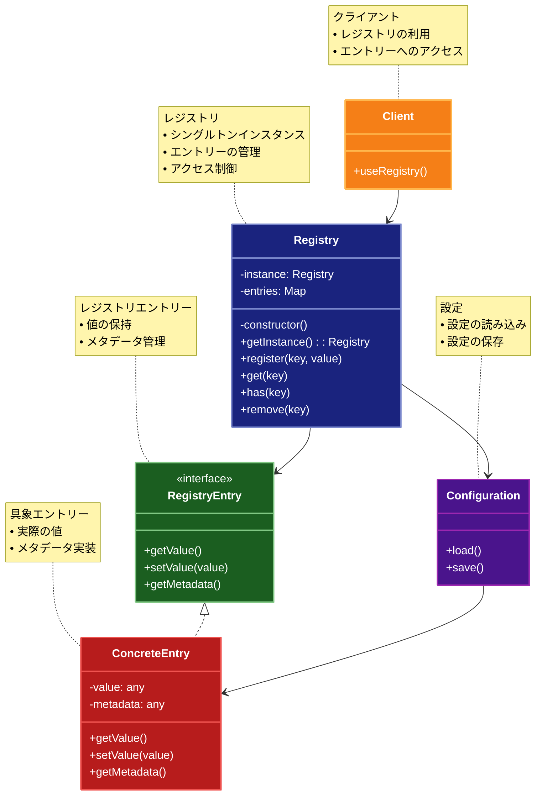

# Registry（レジストリ）パターン

## 目的

グローバルに利用可能なオブジェクトを一元管理し、安全にアクセスできるようにするパターンです。

## 価値・解決する問題

- グローバルオブジェクトの一元管理
- 依存関係の明確化
- アクセス制御の統一
- 設定の集中管理

## 概要・特徴

### 概要

Registryパターンは、グローバルに利用される設定やオブジェクトを一元管理し、安全なアクセスを提供するパターンです。

### 特徴

#### シングルトンベース
Registryパターンの実装は一般的にシングルトンパターンに基づいています。アプリケーション全体で単一のインスタンスを共有することで、オブジェクトや設定の一貫性を確保します。これにより、アプリケーションのどの部分からでも同じRegistryインスタンスにアクセスでき、登録されたオブジェクトが一貫して利用可能になります。例えば、データベース接続、ロギングサービス、設定オブジェクトなどを一度Registryに登録すれば、アプリケーション全体でそれらに統一的にアクセスできます。このアプローチにより、オブジェクトの重複生成を防ぎ、リソース使用を最適化できます。また、テスト時には、モックオブジェクトを登録することで依存関係を簡単に置き換えることも可能です。

#### 型安全なアクセス
優れたRegistryパターンの実装では、型安全性が確保されます。登録されたオブジェクトを取得する際に、適切な型変換や型チェックを行うことで、ランタイムエラーを防止します。TypeScriptなどの静的型付け言語では、ジェネリクスを活用して型安全なAPIを提供できます。例えば、`registry.get<DatabaseService>('db')`のように型パラメータを指定してオブジェクトを取得することで、コンパイル時の型チェックが可能になります。これにより、誤った型のオブジェクトを使用するミスを早期に発見でき、開発効率と信頼性が向上します。型安全なRegistryは特に大規模プロジェクトで価値を発揮し、開発者がコードの動作に自信を持って変更を加えられるようになります。

#### 依存関係の管理
Registryパターンは依存関係の管理を簡素化します。従属オブジェクト（依存対象）をRegistryに登録し、必要なコンポーネントがRegistryから取得することで、コンポーネント間の直接的な依存関係を減らせます。これはDependency Injectionの一形態とみなすこともでき、コンポーネントの結合度を低下させ、テスト容易性を向上させます。例えば、サービスクラスがデータベース接続を直接生成する代わりに、Registryから取得することで、テスト時には実際のデータベースの代わりにモックデータベースをRegistryに登録できます。また、依存関係のライフサイクル管理も容易になり、初期化順序の制御や、適切なタイミングでのリソース解放なども一元的に行えます。これらの特性により、システムの柔軟性と保守性が向上します。

#### 設定の一元化
Registryパターンは、アプリケーション設定の一元管理に特に適しています。環境変数、設定ファイル、データベース設定、APIキーなどの各種設定情報をRegistryに集約することで、設定情報へのアクセスを標準化できます。これにより、設定の変更が必要な場合、アプリケーションの単一の場所だけを修正すれば良くなり、保守性が向上します。例えば、開発環境と本番環境で異なる設定が必要な場合、環境に応じた設定をRegistryに登録し、他のコードは環境の違いを意識せずRegistryから設定を取得できます。また、設定変更の履歴追跡も容易になり、監査やデバッグの際に役立ちます。さらに、動的な設定変更をサポートする実装では、アプリケーションの再起動なしに設定を更新できる柔軟性も得られます。

#### アクセス制御
Registryパターンでは、登録されたオブジェクトや設定へのアクセスを制御する機能を実装できます。読み取り専用アクセス、特定のコンポーネントだけが書き込める制限、または特定の条件下でのみアクセス可能にするなど、様々なアクセス制御ポリシーを定義できます。例えば、設定値の変更は管理者権限を持つコンポーネントのみに許可し、他のコンポーネントは読み取りのみを許可するといった制御が可能です。また、特定のライフサイクルフェーズ（例：アプリケーション初期化中のみ）に書き込みを許可し、それ以降は読み取り専用にするといった時間的制約も実装できます。これらのアクセス制御メカニズムにより、意図しない変更からオブジェクトを保護し、システムの安定性と信頼性を高めることができます。セキュリティが重要なアプリケーションでは、この機能が特に価値を発揮します。

### 概要図



## 類似パターンとの比較

- [Service Locator (サービスロケーター)](service-locator.md): Registry は単純な値の保存と取得を提供し、これに対して Service Locator はサービスの動的な解決を提供します。
- [Singleton (シングルトン)](singleton.md): Registry は複数の値を管理し、これに対して Singleton は単一のインスタンスを管理します。
- [Multiton (マルチトン)](multiton.md): Registry は任意の値を管理し、これに対して Multiton は特定のキーに対応するインスタンスを管理します。

## 利用されているライブラリ／フレームワークの事例

- [Symfony Registry](https://symfony.com/doc/current/components/registry.html): PHPフレームワークのレジストリ
- [Windows Registry](https://docs.microsoft.com/en-us/windows/win32/sysinfo/registry): Windowsのシステムレジストリ
- [Java Preferences API](https://docs.oracle.com/javase/8/docs/api/java/util/prefs/Preferences.html): 設定の管理

## 解説ページリンク

- [Martin Fowler - Registry](https://martinfowler.com/eaaCatalog/registry.html)
- [Microsoft - Registry Pattern](https://docs.microsoft.com/en-us/previous-versions/msp-n-p/ff647095(v=pandp.10))
- [PHP - Registry Pattern](https://designpatternsphp.readthedocs.io/en/latest/Structural/Registry/README.html)

## コード例

### Before:

グローバル変数を使用した実装

```typescript
// グローバル設定
let config = {
  apiUrl: "https://api.example.com",
  timeout: 5000,
  retryCount: 3
};

// グローバルロガー
let logger = {
  log: (message: string) => console.log(message),
  error: (message: string) => console.error(message)
};

// 使用例
function makeApiCall() {
  logger.log(`APIコール: ${config.apiUrl}`);
  // APIコールの実装
}

makeApiCall();
```

### After:

Registryパターンを適用した実装

```typescript
// レジストリのエントリ型
type RegistryEntry<T> = {
  value: T;
  readonly: boolean;
  timestamp: number;
};

// レジストリの名前空間
type Namespace = "config" | "services" | "loggers" | "cache";

// 設定の型
interface AppConfig {
  apiUrl: string;
  timeout: number;
  retryCount: number;
  environment: "development" | "production";
}

// ロガーのインターフェース
interface Logger {
  log(message: string): void;
  error(message: string, error?: Error): void;
  warn(message: string): void;
  info(message: string): void;
}

// キャッシュのインターフェース
interface Cache {
  get<T>(key: string): T | null;
  set<T>(key: string, value: T, ttl?: number): void;
  delete(key: string): void;
  clear(): void;
}

// レジストリの実装
class Registry {
  private static instance: Registry;
  private entries: Map<Namespace, Map<string, RegistryEntry<any>>> = new Map();
  private readonly namespaces: Set<Namespace> = new Set([
    "config",
    "services",
    "loggers",
    "cache"
  ]);

  private constructor() {
    this.namespaces.forEach(namespace => {
      this.entries.set(namespace, new Map());
    });
  }

  static getInstance(): Registry {
    if (!Registry.instance) {
      Registry.instance = new Registry();
    }
    return Registry.instance;
  }

  // 値の設定
  set<T>(
    namespace: Namespace,
    key: string,
    value: T,
    readonly: boolean = false
  ): void {
    if (!this.namespaces.has(namespace)) {
      throw new Error(`Invalid namespace: ${namespace}`);
    }

    const namespaceEntries = this.entries.get(namespace)!;
    const existingEntry = namespaceEntries.get(key);

    if (existingEntry && existingEntry.readonly) {
      throw new Error(`Cannot modify readonly entry: ${namespace}.${key}`);
    }

    namespaceEntries.set(key, {
      value,
      readonly,
      timestamp: Date.now()
    });
  }

  // 値の取得
  get<T>(namespace: Namespace, key: string): T {
    const entry = this.entries.get(namespace)?.get(key);
    if (!entry) {
      throw new Error(`Entry not found: ${namespace}.${key}`);
    }
    return entry.value as T;
  }

  // 値の存在確認
  has(namespace: Namespace, key: string): boolean {
    return this.entries.get(namespace)?.has(key) ?? false;
  }

  // 値の削除
  delete(namespace: Namespace, key: string): boolean {
    const entry = this.entries.get(namespace)?.get(key);
    if (entry?.readonly) {
      throw new Error(`Cannot delete readonly entry: ${namespace}.${key}`);
    }
    return this.entries.get(namespace)?.delete(key) ?? false;
  }

  // 名前空間のクリア
  clear(namespace: Namespace): void {
    const namespaceEntries = this.entries.get(namespace)!;
    // 読み取り専用エントリの確認
    const readonlyEntries = Array.from(namespaceEntries.entries())
      .filter(([_, entry]) => entry.readonly);
    
    // 新しいMapを作成し、読み取り専用エントリのみを保持
    const newMap = new Map(readonlyEntries);
    this.entries.set(namespace, newMap);
  }

  // 名前空間内のすべてのキーを取得
  getKeys(namespace: Namespace): string[] {
    return Array.from(this.entries.get(namespace)?.keys() ?? []);
  }

  // エントリの情報を取得
  getEntryInfo(namespace: Namespace, key: string): {
    readonly: boolean;
    timestamp: number;
  } | null {
    const entry = this.entries.get(namespace)?.get(key);
    if (!entry) return null;
    return {
      readonly: entry.readonly,
      timestamp: entry.timestamp
    };
  }
}

// コンソールロガーの実装
class ConsoleLogger implements Logger {
  log(message: string): void {
    console.log(`[LOG] ${message}`);
  }

  error(message: string, error?: Error): void {
    console.error(`[ERROR] ${message}`, error);
  }

  warn(message: string): void {
    console.warn(`[WARN] ${message}`);
  }

  info(message: string): void {
    console.info(`[INFO] ${message}`);
  }
}

// インメモリキャッシュの実装
class InMemoryCache implements Cache {
  private cache: Map<string, { value: any; expiry: number | null }> = new Map();

  get<T>(key: string): T | null {
    const entry = this.cache.get(key);
    if (!entry) return null;

    if (entry.expiry && entry.expiry < Date.now()) {
      this.cache.delete(key);
      return null;
    }

    return entry.value as T;
  }

  set<T>(key: string, value: T, ttl?: number): void {
    this.cache.set(key, {
      value,
      expiry: ttl ? Date.now() + ttl : null
    });
  }

  delete(key: string): void {
    this.cache.delete(key);
  }

  clear(): void {
    this.cache.clear();
  }
}

// アプリケーションの設定管理
class ApplicationRegistry {
  private static registry = Registry.getInstance();

  // 初期設定
  static initialize(environment: "development" | "production"): void {
    // 基本設定
    const config: AppConfig = {
      apiUrl: environment === "production"
        ? "https://api.example.com"
        : "http://localhost:3000",
      timeout: 5000,
      retryCount: 3,
      environment
    };
    this.registry.set("config", "app", config, true);

    // ロガーの設定
    this.registry.set("loggers", "console", new ConsoleLogger(), true);

    // キャッシュの設定
    this.registry.set("cache", "memory", new InMemoryCache(), true);
  }

  // 設定の取得
  static getConfig(): AppConfig {
    return this.registry.get("config", "app");
  }

  // ロガーの取得
  static getLogger(): Logger {
    return this.registry.get("loggers", "console");
  }

  // キャッシュの取得
  static getCache(): Cache {
    return this.registry.get("cache", "memory");
  }

  // カスタム設定の追加
  static setCustomConfig(key: string, value: any): void {
    this.registry.set("config", key, value);
  }

  // 設定の一覧取得
  static listConfigs(): string[] {
    return this.registry.getKeys("config");
  }
}

// APIクライアントの実装
class ApiClient {
  private config: AppConfig;
  private logger: Logger;
  private cache: Cache;

  constructor() {
    this.config = ApplicationRegistry.getConfig();
    this.logger = ApplicationRegistry.getLogger();
    this.cache = ApplicationRegistry.getCache();
  }

  async fetchData(endpoint: string): Promise<any> {
    const cacheKey = `api:${endpoint}`;
    const cachedData = this.cache.get(cacheKey);
    
    if (cachedData) {
      this.logger.info(`キャッシュからデータを取得: ${endpoint}`);
      return cachedData;
    }

    try {
      this.logger.info(`APIリクエスト: ${this.config.apiUrl}${endpoint}`);
      // APIリクエストのシミュレーション
      const data = await new Promise(resolve => 
        setTimeout(() => resolve({ success: true, data: "サンプルデータ" }), 100)
      );

      this.cache.set(cacheKey, data, 60000); // 1分間キャッシュ
      return data;
    } catch (error) {
      this.logger.error("APIリクエストエラー", error as Error);
      throw error;
    }
  }
}

// 使用例
async function example() {
  // アプリケーションの初期化
  console.log("=== アプリケーションの初期化 ===");
  ApplicationRegistry.initialize("development");
  
  // 設定の確認
  console.log("\n=== 設定の確認 ===");
  console.log("アプリケーション設定:", ApplicationRegistry.getConfig());
  
  // カスタム設定の追加
  console.log("\n=== カスタム設定の追加 ===");
  ApplicationRegistry.setCustomConfig("feature.flags", {
    newFeature: true,
    beta: true
  });
  
  // 設定一覧の取得
  console.log("\n=== 設定一覧 ===");
  console.log("設定キー:", ApplicationRegistry.listConfigs());

  // APIクライアントの使用
  console.log("\n=== APIクライアントの使用 ===");
  const apiClient = new ApiClient();
  
  try {
    // 1回目のリクエスト（キャッシュミス）
    const data1 = await apiClient.fetchData("/users");
    console.log("1回目のレスポンス:", data1);

    // 2回目のリクエスト（キャッシュヒット）
    const data2 = await apiClient.fetchData("/users");
    console.log("2回目のレスポンス:", data2);
  } catch (error) {
    console.error("エラー:", error);
  }
}

// 実行
example();
``` 