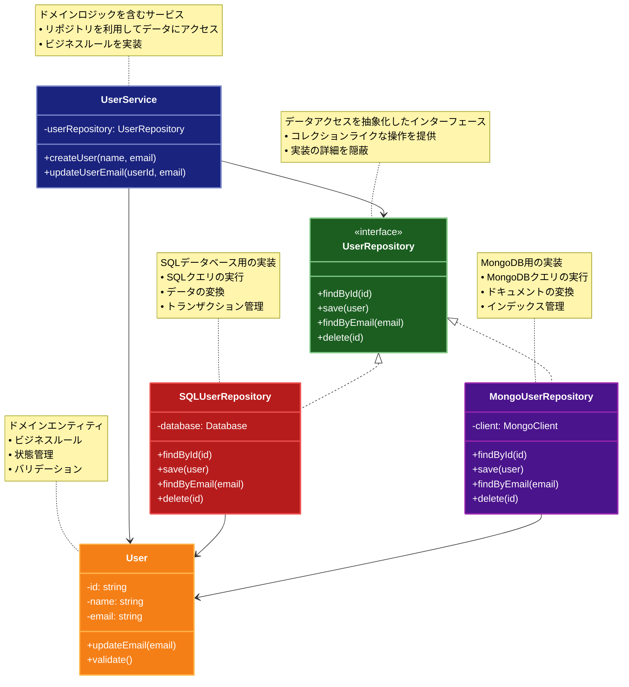

# Repository (リポジトリ)

## 目的

データの永続化層へのアクセスを抽象化し、データアクセスロジックをビジネスロジックから分離することで、保守性と再利用性を向上させます。

## 価値・解決する問題

- データアクセスロジックの集中管理
- データストアの実装詳細からドメインモデルを保護
- テスト容易性の向上（モックリポジトリによるテストが容易）
- データアクセス方法の一貫性確保

## 概要・特徴

### 概要

Repositoryパターンは、データの永続化層へのアクセスを抽象化し、コレクションのようなインターフェースを提供することで、ドメインモデルとデータアクセスロジックを分離します。これにより、ドメインロジックがデータストアの実装詳細から保護され、テストや保守が容易になります。

### 特徴

#### ドメインモデル中心の抽象化を提供
リポジトリはドメインモデルに焦点を当てた抽象化層を提供します。ドメインオブジェクトをデータベースのテーブル構造や永続化メカニズムの詳細から切り離し、純粋なドメインモデルとして扱うことを可能にします。これにより、ドメインモデルはビジネスルールとその振る舞いに集中でき、データの永続化やデータベースとのマッピングについて意識する必要がなくなります。結果として、ドメインモデルの可読性と保守性が向上します。

#### コレクションライクなインターフェース
リポジトリは通常、イン・メモリコレクション（配列やリストなど）の操作に似たインターフェースを提供します。例えば、オブジェクトの追加・削除・検索・更新などの操作がメソッドとして用意されています。これにより、データストアがリレーショナルデータベースであっても、NoSQLデータベースであっても、あるいはWebサービスであっても、クライアントコードは同じインターフェースを介してデータにアクセスできます。この抽象化により、データストアの実装が変更されても、クライアントコードへの影響を最小限に抑えることができます。

#### データアクセスの一貫性を確保
アプリケーション全体でデータアクセスのパターンと実装を一貫させることができます。同じエンティティに対するすべてのデータアクセス操作が一箇所（リポジトリ）に集約されるため、重複コードが削減され、データアクセスに関するバグが減少します。また、パフォーマンスの最適化やキャッシング戦略もリポジトリレベルで一元的に実装できるため、アプリケーション全体のパフォーマンスと保守性が向上します。

#### テスト容易性の向上
リポジトリインターフェースを介してドメインモデルとデータアクセスが分離されるため、テスト時にリポジトリの実装をモックに置き換えることが容易になります。これにより、データベースに依存せずにビジネスロジックの単体テストを行うことができ、テストの実行速度とメンテナンス性が向上します。また、リポジトリ自体のテストも、実際のデータベースを使用するインテグレーションテストとして独立して行うことができます。これらの特性により、自動テストのカバレッジと品質が向上し、開発サイクルが効率化されます。

### 概要図



## コード例

### Before:

直接データベースにアクセスする実装

```typescript
"use strict";

interface User {
  id: number;
  name: string;
  email: string;
}

class UserService {
  private db: any; // データベース接続

  async findUser(id: number): Promise<User | null> {
    // SQLを直接記述
    const result = await this.db.query("SELECT * FROM users WHERE id = ?", [
      id,
    ]);
    return result.length > 0 ? result[0] : null;
  }

  async saveUser(user: User): Promise<void> {
    await this.db.query(
      "INSERT INTO users (id, name, email) VALUES (?, ?, ?)",
      [user.id, user.name, user.email]
    );
  }
}
```

### After:

Repository パターンを利用した実装

```typescript
"use strict";

// エンティティの定義
interface User {
  id: number;
  name: string;
  email: string;
}

// リポジトリインターフェース
interface UserRepository {
  findById(id: number): Promise<User | null>;
  save(user: User): Promise<void>;
  findByEmail(email: string): Promise<User | null>;
  delete(id: number): Promise<void>;
}

// SQLデータベース用の具体的な実装
class SQLUserRepository implements UserRepository {
  private db: any; // データベース接続

  async findById(id: number): Promise<User | null> {
    const result = await this.db.query("SELECT * FROM users WHERE id = ?", [
      id,
    ]);
    return result.length > 0 ? this.mapToUser(result[0]) : null;
  }

  async save(user: User): Promise<void> {
    await this.db.query(
      "INSERT INTO users (id, name, email) VALUES (?, ?, ?) " +
        "ON DUPLICATE KEY UPDATE name = ?, email = ?",
      [user.id, user.name, user.email, user.name, user.email]
    );
  }

  async findByEmail(email: string): Promise<User | null> {
    const result = await this.db.query("SELECT * FROM users WHERE email = ?", [
      email,
    ]);
    return result.length > 0 ? this.mapToUser(result[0]) : null;
  }

  async delete(id: number): Promise<void> {
    await this.db.query("DELETE FROM users WHERE id = ?", [id]);
  }

  private mapToUser(data: any): User {
    return {
      id: data.id,
      name: data.name,
      email: data.email,
    };
  }
}

// インメモリ実装（テスト用）
class InMemoryUserRepository implements UserRepository {
  private users: Map<number, User> = new Map();

  async findById(id: number): Promise<User | null> {
    return this.users.get(id) || null;
  }

  async save(user: User): Promise<void> {
    this.users.set(user.id, {...user});
  }

  async findByEmail(email: string): Promise<User | null> {
    return (
      Array.from(this.users.values()).find((u) => u.email === email) || null
    );
  }

  async delete(id: number): Promise<void> {
    this.users.delete(id);
  }
}

// ユースケース層での利用例
class UserService {
  constructor(private userRepository: UserRepository) {}

  async createUser(name: string, email: string): Promise<User> {
    const existingUser = await this.userRepository.findByEmail(email);
    if (existingUser) {
      throw new Error("User with this email already exists");
    }

    const newUser: User = {
      id: Date.now(), // 実際のアプリケーションでは適切なID生成方法を使用
      name,
      email,
    };

    await this.userRepository.save(newUser);
    return newUser;
  }

  async updateUserEmail(userId: number, newEmail: string): Promise<void> {
    const user = await this.userRepository.findById(userId);
    if (!user) {
      throw new Error("User not found");
    }

    user.email = newEmail;
    await this.userRepository.save(user);
  }
}
```

## 類似パターンとの比較

- [DAO (Data Access Object)](dao.md): Repository はドメインモデル中心の抽象化を提供し、これに対して DAO はデータストア中心の抽象化を提供します。
- [Unit of Work (ユニットオブワーク)](unit-of-work.md): Repository はデータアクセスを抽象化し、これに対して Unit of Work は変更の追跡と一括コミットを管理します。

## 利用されているライブラリ／フレームワークの事例

- [TypeORM](https://typeorm.io/): TypeScript/JavaScript の ORM で、Repository パターンを採用
- [Spring Data JPA](https://spring.io/projects/spring-data-jpa): Java の JPA 実装で、Repository パターンを中心としたデータアクセス層を提供
- [Entity Framework Core](https://docs.microsoft.com/ef/core/): .NET の ORM で、Repository パターンをベースとしたデータアクセスを実現
