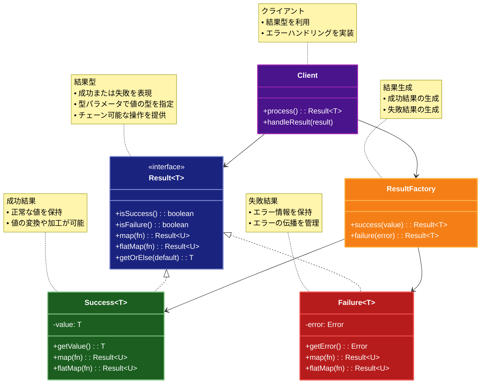

# Result（結果）パターン

## 目的

エラーハンドリングを型安全に行い、例外に頼らない明示的なエラー処理を実現するパターンです。

## 価値・解決する問題

- 型安全なエラーハンドリング
- 例外に頼らない明示的なエラー処理
- エラー情報の構造化
- コードの可読性向上

## 概要・特徴

### 概要

Resultパターンは、関数の戻り値として成功または失敗を表す型を返すことで、エラーハンドリングを型安全に行うパターンです。

### 特徴

#### 型安全性の提供

Resultパターンは、関数の結果として成功と失敗の両方の可能性を型システムを通じて表現します。これにより、コンパイル時にエラーハンドリングの漏れを検出できるため、実行時エラーのリスクが大幅に低減されます。

型安全性には以下のような利点があります：

- **コンパイル時チェック**: エラー処理を忘れた場合にコンパイルエラーとして検出できる
- **IDE補完とヒント**: 開発環境が適切なメソッドを提案し、型に基づいたヒントを提供
- **リファクタリング安全性**: コードの変更時に、影響範囲が型システムを通じて明確になる
- **自己文書化**: 関数のシグネチャだけで成功/失敗の可能性が明示される
- **バグの早期発見**: ランタイムで起こりうる問題をコンパイル時に発見できる

例えば、TypeScriptにおいては、Result<User, ApiError>というシグネチャが、ユーザー情報の取得が成功するか、APIエラーが発生する可能性があることを明示します。開発者はこの戻り値を処理する際、必ず両方のケースを考慮する必要があり、処理漏れがあればコンパイラや静的解析ツールがそれを指摘します。

#### 明示的なエラー処理の強制

Resultパターンは、エラー処理を明示的に行うことを強制します。try-catchのような例外ベースのアプローチでは、エラーハンドリングが任意であり、捕捉されないまま上位層に伝播する可能性がありますが、Resultパターンではエラー状態を無視することができません。

明示的なエラー処理の利点には以下があります：

- **処理漏れの防止**: すべての失敗ケースを考慮することが言語仕様やパターンによって強制される
- **コード可読性の向上**: エラー処理ロジックがコード上で明示的に表現される
- **堅牢性の向上**: 例外の捕捉漏れによる予期せぬプログラム終了を防止
- **デバッグ容易性**: エラーの発生源と処理箇所が明確で追跡しやすい
- **意図の明確化**: エラーを無視する場合も、それが意図的であることを明示できる

例えば、ファイル操作において、Result<FileContents, FileError>を返す関数があった場合、呼び出し側はこの結果を処理する際に必ず成功と失敗の両方のケースを検討する必要があります。これにより「ファイルが存在しない」「権限がない」などのエラーケースの処理漏れを防ぎます。

#### エラー情報の構造化

Resultパターンでは、エラー情報を構造化されたデータとして扱います。単なる文字列メッセージや汎用的な例外ではなく、型付けされたエラーオブジェクトを使用することで、より詳細で文脈に応じたエラー情報を提供できます。

構造化されたエラー情報の利点：

- **詳細なエラーコンテキスト**: エラーに関する豊富な情報を保持可能
- **エラーの分類**: エラーの種類に基づいた条件分岐や処理分けが可能
- **国際化対応**: エラーコードと表示メッセージを分離し、多言語対応が容易
- **一貫したエラー表現**: システム全体で一貫したエラー表現方法を強制
- **デバッグ情報の充実**: スタックトレースや環境情報などの詳細情報を含められる

例えば、API通信のエラーでは、HTTPステータスコード、サーバーレスポンス、リクエスト情報、タイムスタンプなどの情報を構造化されたApiErrorオブジェクトとして表現できます。これにより、エラーの原因を特定しやすくなり、適切な回復処理や代替処理を実装できます。

#### チェーン可能な操作の提供

Resultパターンには通常、`map`、`flatMap`（またはbind）、`andThen`などのメソッドが用意されており、これらを使って一連の操作をチェーンできます。これにより、成功パスと失敗パスが明確に分かれたエレガントな処理フローを構築できます。

チェーン可能な操作の利点：

- **コードの線形性**: ネストの深いコードを避け、読みやすい線形の処理フローを維持
- **早期リターンの自動化**: 処理チェーンの途中で失敗が発生した場合、以降の処理はスキップされる
- **関数型プログラミングとの親和性**: 純粋関数と組み合わせた宣言的なスタイルが可能
- **コード量の削減**: 繰り返しのエラーチェックが不要になり、ボイラープレートコードを削減
- **テスト容易性**: 各変換ステップを独立してテストしやすい

例えば、ユーザー登録プロセスでは、入力検証、重複チェック、データベース保存、通知送信などの一連の操作を`flatMap`や`andThen`でチェーンできます。各ステップが失敗する可能性があっても、チェーン全体が適切にエラーを伝播します。

```typescript
// 例: チェーン可能な操作の利用
return validateInput(input)
  .flatMap(validatedInput => checkForDuplicates(validatedInput))
  .flatMap(uniqueInput => saveToDatabase(uniqueInput))
  .flatMap(savedUser => sendWelcomeEmail(savedUser))
  .match({
    success: user => ({ status: 'success', user }),
    failure: error => ({ status: 'error', message: error.message })
  });
```

#### コンテキストの保持とエラー伝播

Resultパターンは、操作の結果だけでなく、その処理コンテキストも保持します。これにより、エラーが発生した場合でも、どのような操作が試みられ、どの時点で失敗したのかという情報を失うことなく伝播させることができます。

コンテキスト保持の利点：

- **エラー追跡の向上**: エラーの原因と発生箇所の特定が容易
- **意味のあるエラーメッセージ**: より具体的で文脈に沿ったエラー情報を提供可能
- **階層的なエラーラッピング**: 低レベルのエラーを高レベルのコンテキストでラップ可能
- **デバッグ容易性**: 処理の流れとエラーの関係を明確に把握可能
- **監査とロギング**: エラー発生時の状態を詳細に記録可能

例えば、データインポート処理では、「ファイル読み込み」→「パース」→「検証」→「保存」という複数のステップがあり、それぞれでエラーが発生する可能性があります。Resultパターンを使用すると、各ステップのコンテキストを保持したまま結果を伝播でき、最終的なエラーメッセージでも「インポート処理中のパースステップでJSONフォーマットエラーが発生しました」のように具体的な情報を提供できます。

#### 分岐処理と条件付き実行

Resultパターンは、成功または失敗の状態に基づいた条件付き処理を簡潔に表現できます。`match`、`fold`、`cata`（catamorphism）などのメソッドを使用して、両方の場合の処理を一箇所にまとめて記述できます。

分岐処理の利点：

- **網羅性の保証**: すべての可能性（成功/失敗）に対する処理を強制
- **条件分岐の集約**: 関連する処理ロジックを一箇所にまとめることでコードの把握が容易
- **DRYの促進**: 繰り返しの条件チェックを回避
- **型の安全な変換**: 成功と失敗の場合で異なる型への変換が型安全に行える
- **宣言的なスタイル**: 命令型の条件分岐より意図が明確になる宣言的な表現

例えば、ユーザー認証結果に基づいてUIを更新する場合：

```typescript
// 例: 分岐処理の利用
authResult.match({
  success: user => {
    displayDashboard();
    loadUserPreferences(user);
    trackSuccessfulLogin(user.id);
  },
  failure: error => {
    displayLoginError(error.message);
    suggestPasswordReset(error.code === 'INVALID_PASSWORD');
    trackFailedLoginAttempt(error);
  }
});
```

このパターンにより、成功と失敗の両方のケースに対する処理を明確に記述でき、どちらかの処理を忘れることがなくなります。

#### 相互運用性と標準パターン

Resultパターンは、多くの言語やライブラリでサポートされており、またMonadのような標準的な関数型プログラミングパターンに準拠していることが多いため、異なるライブラリやコードベース間での相互運用性が高いという特徴があります。

相互運用性の利点：

- **エコシステムとの統合**: 多くのライブラリやフレームワークがResultパターンをサポート
- **学習曲線の緩和**: 一度パターンを学べば異なる言語やライブラリでも活用可能
- **標準的なインターフェース**: Monadのような標準パターンに準拠した一貫したAPI
- **ユーティリティの再利用**: 汎用的なヘルパー関数やコンビネーターを活用可能
- **コミュニティのサポート**: 広く採用されているため、情報やベストプラクティスが豊富

例えば、TypeScriptでは`fp-ts`や`neverthrow`、Rustでは標準ライブラリの`Result`型、Kotlinでは`Result`または`Either`型など、多くの実装が存在します。これらはそれぞれの言語の特性に最適化されつつも、基本的な概念とインターフェースは共通しているため、パターンの知識を異なる環境でも活用できます。

### 概要図



## 類似パターンとの比較

- [Optional (オプショナル)](optional.md): Result は成功/失敗を型で表現し、これに対して Optional は値の存在を型で表現します。
- [Maybe (メイビー)](maybe.md): Result は成功/失敗を型で表現し、これに対して Maybe は値の不確実性を表現します。
- [Either (イーザー)](either.md): Result は成功/失敗を型で表現し、これに対して Either は2つの型のうちどちらかを表現します。

## 利用されているライブラリ／フレームワークの事例

- [Rust Result](https://doc.rust-lang.org/std/result/): エラー処理
- [Scala Try](https://www.scala-lang.org/api/current/scala/util/Try.html): 例外処理
- [fp-ts Either](https://gcanti.github.io/fp-ts/modules/Either.ts.html): 関数型プログラミング

## 解説ページリンク

- [Rust - Result](https://doc.rust-lang.org/std/result/)
- [Scala - Try](https://www.scala-lang.org/api/current/scala/util/Try.html)
- [TypeScript - fp-ts](https://gcanti.github.io/fp-ts/modules/Either.ts.html)

## コード例

### Before:

例外を使用したエラー処理の実装

```typescript
// ユーザー型の定義
interface User {
  id: number;
  name: string;
  email: string;
}

// データベースエラーの定義
class DatabaseError extends Error {
  constructor(message: string) {
    super(message);
    this.name = "DatabaseError";
  }
}

// バリデーションエラーの定義
class ValidationError extends Error {
  constructor(message: string) {
    super(message);
    this.name = "ValidationError";
  }
}

// ユーザーサービス
class UserService {
  private users: Map<number, User> = new Map();

  constructor() {
    // テストデータの追加
    this.users.set(1, {
      id: 1,
      name: "John Doe",
      email: "john@example.com"
    });
  }

  // ユーザーを作成
  createUser(name: string, email: string): User {
    // 入力値の検証
    if (!name || name.length < 2) {
      throw new ValidationError("名前は2文字以上である必要があります");
    }

    if (!email || !email.includes("@")) {
      throw new ValidationError("無効なメールアドレスです");
    }

    // IDの生成
    const id = this.users.size + 1;

    // ユーザーの作成
    const user: User = { id, name, email };
    this.users.set(id, user);

    return user;
  }

  // ユーザーを取得
  getUser(id: number): User {
    const user = this.users.get(id);
    if (!user) {
      throw new DatabaseError(`ID ${id} のユーザーが見つかりません`);
    }
    return user;
  }

  // メールアドレスを更新
  updateEmail(id: number, newEmail: string): User {
    // メールアドレスの検証
    if (!newEmail || !newEmail.includes("@")) {
      throw new ValidationError("無効なメールアドレスです");
    }

    // ユーザーの取得と更新
    const user = this.getUser(id);
    user.email = newEmail;
    this.users.set(id, user);

    return user;
  }
}

// 使用例
function example() {
  const service = new UserService();

  try {
    // ユーザーの作成
    console.log("=== ユーザーの作成 ===");
    const newUser = service.createUser("Alice", "alice@example.com");
    console.log("ユーザーを作成しました:", newUser);

    // 無効なユーザーの作成
    console.log("\n=== 無効なユーザーの作成 ===");
    service.createUser("", "invalid-email");
  } catch (error) {
    if (error instanceof ValidationError) {
      console.error("バリデーションエラー:", error.message);
    } else {
      console.error("予期しないエラー:", error);
    }
  }

  try {
    // 存在しないユーザーの取得
    console.log("\n=== 存在しないユーザーの取得 ===");
    service.getUser(999);
  } catch (error) {
    if (error instanceof DatabaseError) {
      console.error("データベースエラー:", error.message);
    } else {
      console.error("予期しないエラー:", error);
    }
  }

  try {
    // メールアドレスの更新
    console.log("\n=== メールアドレスの更新 ===");
    const updatedUser = service.updateEmail(1, "john.doe@example.com");
    console.log("メールアドレスを更新しました:", updatedUser);

    // 無効なメールアドレスでの更新
    console.log("\n=== 無効なメールアドレスでの更新 ===");
    service.updateEmail(1, "invalid-email");
  } catch (error) {
    if (error instanceof ValidationError) {
      console.error("バリデーションエラー:", error.message);
    } else if (error instanceof DatabaseError) {
      console.error("データベースエラー:", error.message);
    } else {
      console.error("予期しないエラー:", error);
    }
  }
}

example();
```

### After:

Resultパターンを適用した実装

```typescript
// 成功の結果を表現するクラス
class Ok<T, E> {
  constructor(private value: T) {}

  isOk(): this is Ok<T, E> {
    return true;
  }

  isErr(): this is Err<T, E> {
    return false;
  }

  // 値を取得
  unwrap(): T {
    return this.value;
  }

  // エラーを取得（常にエラー）
  unwrapErr(): E {
    throw new Error("Ok値からエラーを取得しようとしました");
  }

  // 値が存在する場合に関数を適用
  map<U>(fn: (value: T) => U): Result<U, E> {
    return new Ok(fn(this.value));
  }

  // エラーの場合に関数を適用
  mapErr<F>(_fn: (error: E) => F): Result<T, F> {
    return new Ok(this.value);
  }

  // 値が存在する場合にResultを返す関数を適用
  flatMap<U>(fn: (value: T) => Result<U, E>): Result<U, E> {
    return fn(this.value);
  }

  // 値を取得（エラーの場合はデフォルト値）
  unwrapOr(_defaultValue: T): T {
    return this.value;
  }

  // 値を取得（エラーの場合は関数を実行）
  unwrapOrElse(_fn: () => T): T {
    return this.value;
  }

  // 成功の場合に処理を実行
  match<U>(ok: (value: T) => U, _err: (error: E) => U): U {
    return ok(this.value);
  }
}

// 失敗の結果を表現するクラス
class Err<T, E> {
  constructor(private error: E) {}

  isOk(): this is Ok<T, E> {
    return false;
  }

  isErr(): this is Err<T, E> {
    return true;
  }

  // 値を取得（常にエラー）
  unwrap(): T {
    throw new Error(`エラーを値として取得しようとしました: ${this.error}`);
  }

  // エラーを取得
  unwrapErr(): E {
    return this.error;
  }

  // 値が存在する場合に関数を適用
  map<U>(_fn: (value: T) => U): Result<U, E> {
    return new Err(this.error);
  }

  // エラーの場合に関数を適用
  mapErr<F>(fn: (error: E) => F): Result<T, F> {
    return new Err(fn(this.error));
  }

  // 値が存在する場合にResultを返す関数を適用
  flatMap<U>(_fn: (value: T) => Result<U, E>): Result<U, E> {
    return new Err(this.error);
  }

  // 値を取得（エラーの場合はデフォルト値）
  unwrapOr(defaultValue: T): T {
    return defaultValue;
  }

  // 値を取得（エラーの場合は関数を実行）
  unwrapOrElse(fn: () => T): T {
    return fn();
  }

  // エラーの場合に処理を実行
  match<U>(_ok: (value: T) => U, err: (error: E) => U): U {
    return err(this.error);
  }
}

// Result型の定義
type Result<T, E> = Ok<T, E> | Err<T, E>;

// Resultのユーティリティ関数
const Result = {
  ok<T, E>(value: T): Result<T, E> {
    return new Ok(value);
  },

  err<T, E>(error: E): Result<T, E> {
    return new Err(error);
  },

  all<T, E>(results: Result<T, E>[]): Result<T[], E> {
    const values: T[] = [];
    for (const result of results) {
      if (result.isErr()) {
        return result;
      }
      values.push(result.unwrap());
    }
    return Result.ok(values);
  }
};

// ユーザー型の定義
interface User {
  id: number;
  name: string;
  email: string;
}

// エラー型の定義
type UserError =
  | { type: "ValidationError"; message: string }
  | { type: "DatabaseError"; message: string };

// ユーザーサービス
class UserService {
  private users: Map<number, User> = new Map();

  constructor() {
    // テストデータの追加
    this.users.set(1, {
      id: 1,
      name: "John Doe",
      email: "john@example.com"
    });
  }

  // ユーザーを作成
  createUser(name: string, email: string): Result<User, UserError> {
    // 入力値の検証
    if (!name || name.length < 2) {
      return Result.err({
        type: "ValidationError",
        message: "名前は2文字以上である必要があります"
      });
    }

    if (!email || !email.includes("@")) {
      return Result.err({
        type: "ValidationError",
        message: "無効なメールアドレスです"
      });
    }

    // IDの生成
    const id = this.users.size + 1;

    // ユーザーの作成
    const user: User = { id, name, email };
    this.users.set(id, user);

    return Result.ok(user);
  }

  // ユーザーを取得
  getUser(id: number): Result<User, UserError> {
    const user = this.users.get(id);
    if (!user) {
      return Result.err({
        type: "DatabaseError",
        message: `ID ${id} のユーザーが見つかりません`
      });
    }
    return Result.ok(user);
  }

  // メールアドレスを更新
  updateEmail(id: number, newEmail: string): Result<User, UserError> {
    // メールアドレスの検証
    if (!newEmail || !newEmail.includes("@")) {
      return Result.err({
        type: "ValidationError",
        message: "無効なメールアドレスです"
      });
    }

    // ユーザーの取得
    return this.getUser(id).map(user => {
      user.email = newEmail;
      this.users.set(id, user);
      return user;
    });
  }
}

// 使用例
function example() {
  const service = new UserService();

  // ユーザーの作成
  console.log("=== ユーザーの作成 ===");
  service.createUser("Alice", "alice@example.com")
    .match(
      user => console.log("ユーザーを作成しました:", user),
      error => console.error(`${error.type}:`, error.message)
    );

  // 無効なユーザーの作成
  console.log("\n=== 無効なユーザーの作成 ===");
  service.createUser("", "invalid-email")
    .match(
      user => console.log("ユーザーを作成しました:", user),
      error => console.error(`${error.type}:`, error.message)
    );

  // 存在しないユーザーの取得
  console.log("\n=== 存在しないユーザーの取得 ===");
  service.getUser(999)
    .match(
      user => console.log("ユーザーを取得しました:", user),
      error => console.error(`${error.type}:`, error.message)
    );

  // メールアドレスの更新
  console.log("\n=== メールアドレスの更新 ===");
  service.getUser(1)
    .flatMap(user => service.updateEmail(user.id, "john.doe@example.com"))
    .match(
      user => console.log("メールアドレスを更新しました:", user),
      error => console.error(`${error.type}:`, error.message)
    );

  // 無効なメールアドレスでの更新
  console.log("\n=== 無効なメールアドレスでの更新 ===");
  service.getUser(1)
    .flatMap(user => service.updateEmail(user.id, "invalid-email"))
    .match(
      user => console.log("メールアドレスを更新しました:", user),
      error => console.error(`${error.type}:`, error.message)
    );

  // 複数の操作の連鎖
  console.log("\n=== 複数の操作の連鎖 ===");
  service.createUser("Bob", "bob@example.com")
    .flatMap(user => service.updateEmail(user.id, "bob.smith@example.com"))
    .flatMap(user => service.getUser(user.id))
    .match(
      user => console.log("一連の操作が成功しました:", user),
      error => console.error(`${error.type}:`, error.message)
    );

  // 複数の結果の処理
  console.log("\n=== 複数の結果の処理 ===");
  const results = [
    service.getUser(1),
    service.createUser("Charlie", "charlie@example.com"),
    service.getUser(999)
  ];

  Result.all(results)
    .match(
      users => console.log("すべての操作が成功しました:", users),
      error => console.error(`${error.type}:`, error.message)
    );
}

example(); 