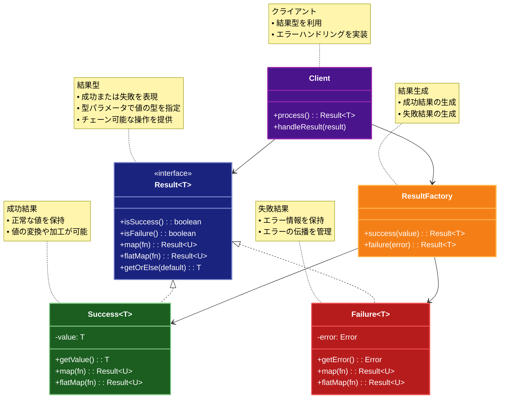

# Result（結果）パターン

## 目的

エラーハンドリングを型安全に行い、例外に頼らない明示的なエラー処理を実現するパターンです。

## 価値・解決する問題

- 型安全なエラーハンドリング
- 例外に頼らない明示的なエラー処理
- エラー情報の構造化
- コードの可読性向上

## 概要・特徴

### 概要

Resultパターンは、関数の戻り値として成功または失敗を表す型を返すことで、エラーハンドリングを型安全に行うパターンです。

### 特徴

- 型安全性
- 明示的なエラー処理
- エラー情報の構造化
- チェーン可能な操作
- パターンマッチング

### 概要図



## 類似パターンとの比較

- [Optional (オプショナル)](optional.md): Result は成功/失敗を型で表現し、これに対して Optional は値の存在を型で表現します。
- [Maybe (メイビー)](maybe.md): Result は成功/失敗を型で表現し、これに対して Maybe は値の不確実性を表現します。
- [Either (イーザー)](either.md): Result は成功/失敗を型で表現し、これに対して Either は2つの型のうちどちらかを表現します。

## 利用されているライブラリ／フレームワークの事例

- [Rust Result](https://doc.rust-lang.org/std/result/): エラー処理
- [Scala Try](https://www.scala-lang.org/api/current/scala/util/Try.html): 例外処理
- [fp-ts Either](https://gcanti.github.io/fp-ts/modules/Either.ts.html): 関数型プログラミング

## 解説ページリンク

- [Rust - Result](https://doc.rust-lang.org/std/result/)
- [Scala - Try](https://www.scala-lang.org/api/current/scala/util/Try.html)
- [TypeScript - fp-ts](https://gcanti.github.io/fp-ts/modules/Either.ts.html)

## コード例

### Before:

例外を使用したエラー処理の実装

```typescript
// ユーザー型の定義
interface User {
  id: number;
  name: string;
  email: string;
}

// データベースエラーの定義
class DatabaseError extends Error {
  constructor(message: string) {
    super(message);
    this.name = "DatabaseError";
  }
}

// バリデーションエラーの定義
class ValidationError extends Error {
  constructor(message: string) {
    super(message);
    this.name = "ValidationError";
  }
}

// ユーザーサービス
class UserService {
  private users: Map<number, User> = new Map();

  constructor() {
    // テストデータの追加
    this.users.set(1, {
      id: 1,
      name: "John Doe",
      email: "john@example.com"
    });
  }

  // ユーザーを作成
  createUser(name: string, email: string): User {
    // 入力値の検証
    if (!name || name.length < 2) {
      throw new ValidationError("名前は2文字以上である必要があります");
    }

    if (!email || !email.includes("@")) {
      throw new ValidationError("無効なメールアドレスです");
    }

    // IDの生成
    const id = this.users.size + 1;

    // ユーザーの作成
    const user: User = { id, name, email };
    this.users.set(id, user);

    return user;
  }

  // ユーザーを取得
  getUser(id: number): User {
    const user = this.users.get(id);
    if (!user) {
      throw new DatabaseError(`ID ${id} のユーザーが見つかりません`);
    }
    return user;
  }

  // メールアドレスを更新
  updateEmail(id: number, newEmail: string): User {
    // メールアドレスの検証
    if (!newEmail || !newEmail.includes("@")) {
      throw new ValidationError("無効なメールアドレスです");
    }

    // ユーザーの取得と更新
    const user = this.getUser(id);
    user.email = newEmail;
    this.users.set(id, user);

    return user;
  }
}

// 使用例
function example() {
  const service = new UserService();

  try {
    // ユーザーの作成
    console.log("=== ユーザーの作成 ===");
    const newUser = service.createUser("Alice", "alice@example.com");
    console.log("ユーザーを作成しました:", newUser);

    // 無効なユーザーの作成
    console.log("\n=== 無効なユーザーの作成 ===");
    service.createUser("", "invalid-email");
  } catch (error) {
    if (error instanceof ValidationError) {
      console.error("バリデーションエラー:", error.message);
    } else {
      console.error("予期しないエラー:", error);
    }
  }

  try {
    // 存在しないユーザーの取得
    console.log("\n=== 存在しないユーザーの取得 ===");
    service.getUser(999);
  } catch (error) {
    if (error instanceof DatabaseError) {
      console.error("データベースエラー:", error.message);
    } else {
      console.error("予期しないエラー:", error);
    }
  }

  try {
    // メールアドレスの更新
    console.log("\n=== メールアドレスの更新 ===");
    const updatedUser = service.updateEmail(1, "john.doe@example.com");
    console.log("メールアドレスを更新しました:", updatedUser);

    // 無効なメールアドレスでの更新
    console.log("\n=== 無効なメールアドレスでの更新 ===");
    service.updateEmail(1, "invalid-email");
  } catch (error) {
    if (error instanceof ValidationError) {
      console.error("バリデーションエラー:", error.message);
    } else if (error instanceof DatabaseError) {
      console.error("データベースエラー:", error.message);
    } else {
      console.error("予期しないエラー:", error);
    }
  }
}

example();
```

### After:

Resultパターンを適用した実装

```typescript
// 成功の結果を表現するクラス
class Ok<T, E> {
  constructor(private value: T) {}

  isOk(): this is Ok<T, E> {
    return true;
  }

  isErr(): this is Err<T, E> {
    return false;
  }

  // 値を取得
  unwrap(): T {
    return this.value;
  }

  // エラーを取得（常にエラー）
  unwrapErr(): E {
    throw new Error("Ok値からエラーを取得しようとしました");
  }

  // 値が存在する場合に関数を適用
  map<U>(fn: (value: T) => U): Result<U, E> {
    return new Ok(fn(this.value));
  }

  // エラーの場合に関数を適用
  mapErr<F>(_fn: (error: E) => F): Result<T, F> {
    return new Ok(this.value);
  }

  // 値が存在する場合にResultを返す関数を適用
  flatMap<U>(fn: (value: T) => Result<U, E>): Result<U, E> {
    return fn(this.value);
  }

  // 値を取得（エラーの場合はデフォルト値）
  unwrapOr(_defaultValue: T): T {
    return this.value;
  }

  // 値を取得（エラーの場合は関数を実行）
  unwrapOrElse(_fn: () => T): T {
    return this.value;
  }

  // 成功の場合に処理を実行
  match<U>(ok: (value: T) => U, _err: (error: E) => U): U {
    return ok(this.value);
  }
}

// 失敗の結果を表現するクラス
class Err<T, E> {
  constructor(private error: E) {}

  isOk(): this is Ok<T, E> {
    return false;
  }

  isErr(): this is Err<T, E> {
    return true;
  }

  // 値を取得（常にエラー）
  unwrap(): T {
    throw new Error(`エラーを値として取得しようとしました: ${this.error}`);
  }

  // エラーを取得
  unwrapErr(): E {
    return this.error;
  }

  // 値が存在する場合に関数を適用
  map<U>(_fn: (value: T) => U): Result<U, E> {
    return new Err(this.error);
  }

  // エラーの場合に関数を適用
  mapErr<F>(fn: (error: E) => F): Result<T, F> {
    return new Err(fn(this.error));
  }

  // 値が存在する場合にResultを返す関数を適用
  flatMap<U>(_fn: (value: T) => Result<U, E>): Result<U, E> {
    return new Err(this.error);
  }

  // 値を取得（エラーの場合はデフォルト値）
  unwrapOr(defaultValue: T): T {
    return defaultValue;
  }

  // 値を取得（エラーの場合は関数を実行）
  unwrapOrElse(fn: () => T): T {
    return fn();
  }

  // エラーの場合に処理を実行
  match<U>(_ok: (value: T) => U, err: (error: E) => U): U {
    return err(this.error);
  }
}

// Result型の定義
type Result<T, E> = Ok<T, E> | Err<T, E>;

// Resultのユーティリティ関数
const Result = {
  ok<T, E>(value: T): Result<T, E> {
    return new Ok(value);
  },

  err<T, E>(error: E): Result<T, E> {
    return new Err(error);
  },

  all<T, E>(results: Result<T, E>[]): Result<T[], E> {
    const values: T[] = [];
    for (const result of results) {
      if (result.isErr()) {
        return result;
      }
      values.push(result.unwrap());
    }
    return Result.ok(values);
  }
};

// ユーザー型の定義
interface User {
  id: number;
  name: string;
  email: string;
}

// エラー型の定義
type UserError =
  | { type: "ValidationError"; message: string }
  | { type: "DatabaseError"; message: string };

// ユーザーサービス
class UserService {
  private users: Map<number, User> = new Map();

  constructor() {
    // テストデータの追加
    this.users.set(1, {
      id: 1,
      name: "John Doe",
      email: "john@example.com"
    });
  }

  // ユーザーを作成
  createUser(name: string, email: string): Result<User, UserError> {
    // 入力値の検証
    if (!name || name.length < 2) {
      return Result.err({
        type: "ValidationError",
        message: "名前は2文字以上である必要があります"
      });
    }

    if (!email || !email.includes("@")) {
      return Result.err({
        type: "ValidationError",
        message: "無効なメールアドレスです"
      });
    }

    // IDの生成
    const id = this.users.size + 1;

    // ユーザーの作成
    const user: User = { id, name, email };
    this.users.set(id, user);

    return Result.ok(user);
  }

  // ユーザーを取得
  getUser(id: number): Result<User, UserError> {
    const user = this.users.get(id);
    if (!user) {
      return Result.err({
        type: "DatabaseError",
        message: `ID ${id} のユーザーが見つかりません`
      });
    }
    return Result.ok(user);
  }

  // メールアドレスを更新
  updateEmail(id: number, newEmail: string): Result<User, UserError> {
    // メールアドレスの検証
    if (!newEmail || !newEmail.includes("@")) {
      return Result.err({
        type: "ValidationError",
        message: "無効なメールアドレスです"
      });
    }

    // ユーザーの取得
    return this.getUser(id).map(user => {
      user.email = newEmail;
      this.users.set(id, user);
      return user;
    });
  }
}

// 使用例
function example() {
  const service = new UserService();

  // ユーザーの作成
  console.log("=== ユーザーの作成 ===");
  service.createUser("Alice", "alice@example.com")
    .match(
      user => console.log("ユーザーを作成しました:", user),
      error => console.error(`${error.type}:`, error.message)
    );

  // 無効なユーザーの作成
  console.log("\n=== 無効なユーザーの作成 ===");
  service.createUser("", "invalid-email")
    .match(
      user => console.log("ユーザーを作成しました:", user),
      error => console.error(`${error.type}:`, error.message)
    );

  // 存在しないユーザーの取得
  console.log("\n=== 存在しないユーザーの取得 ===");
  service.getUser(999)
    .match(
      user => console.log("ユーザーを取得しました:", user),
      error => console.error(`${error.type}:`, error.message)
    );

  // メールアドレスの更新
  console.log("\n=== メールアドレスの更新 ===");
  service.getUser(1)
    .flatMap(user => service.updateEmail(user.id, "john.doe@example.com"))
    .match(
      user => console.log("メールアドレスを更新しました:", user),
      error => console.error(`${error.type}:`, error.message)
    );

  // 無効なメールアドレスでの更新
  console.log("\n=== 無効なメールアドレスでの更新 ===");
  service.getUser(1)
    .flatMap(user => service.updateEmail(user.id, "invalid-email"))
    .match(
      user => console.log("メールアドレスを更新しました:", user),
      error => console.error(`${error.type}:`, error.message)
    );

  // 複数の操作の連鎖
  console.log("\n=== 複数の操作の連鎖 ===");
  service.createUser("Bob", "bob@example.com")
    .flatMap(user => service.updateEmail(user.id, "bob.smith@example.com"))
    .flatMap(user => service.getUser(user.id))
    .match(
      user => console.log("一連の操作が成功しました:", user),
      error => console.error(`${error.type}:`, error.message)
    );

  // 複数の結果の処理
  console.log("\n=== 複数の結果の処理 ===");
  const results = [
    service.getUser(1),
    service.createUser("Charlie", "charlie@example.com"),
    service.getUser(999)
  ];

  Result.all(results)
    .match(
      users => console.log("すべての操作が成功しました:", users),
      error => console.error(`${error.type}:`, error.message)
    );
}

example(); 