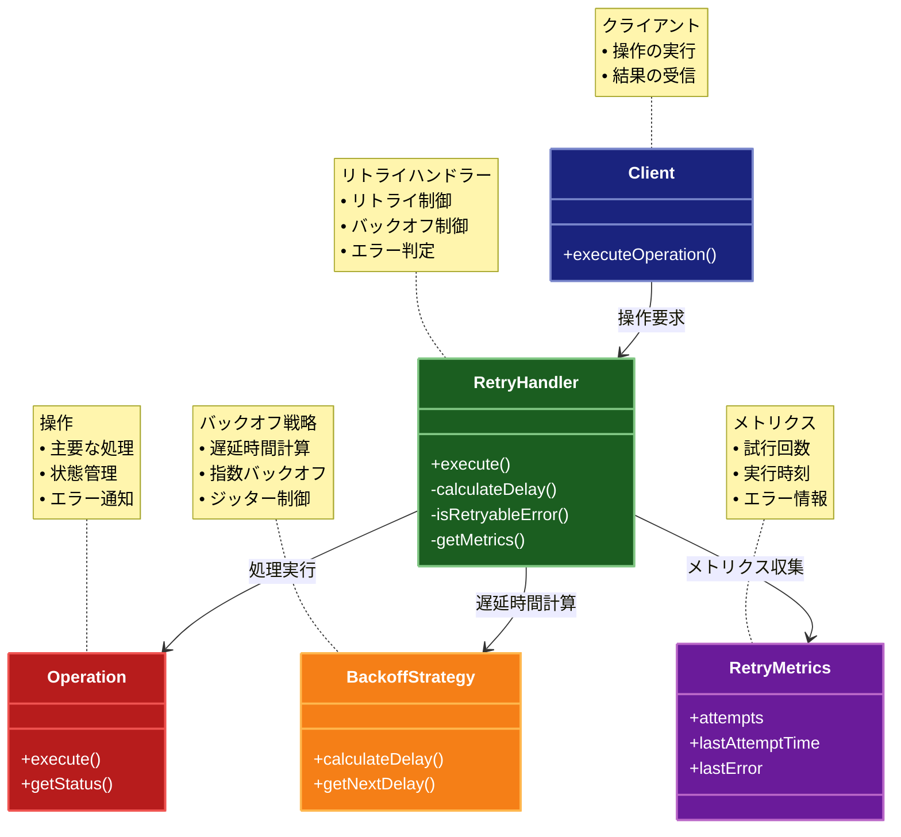

# Retry（リトライ）パターン

## 目的

一時的な障害が発生した場合に、自動的に処理を再試行することで、システムの回復力を向上させるパターンです。

## 価値・解決する問題

- 一時的な障害から自動回復します
- システムの信頼性を向上させます
- エラー処理を自動化します
- ネットワークの不安定性に対応します
- 外部サービスの一時的な障害に対応します

## 概要・特徴

### 概要

Retryパターンは、一時的な障害が発生した場合に、自動的に処理を再試行する設計パターンです。これにより、システムの回復力を向上させ、一時的な障害から自動的に回復することができます。

### 特徴

- 自動再試行
- バックオフ戦略
- 最大試行回数の制限
- エラー分類
- 条件付き再試行

### 概要図



## 類似パターンとの比較

- [Circuit Breaker (サーキットブレーカー)](circuit-breaker.md): Retry は再試行による回復を行い、これに対して Circuit Breaker は障害検知による遮断を行います。
- [Fallback (フォールバック)](fallback.md): Retry は再試行による回復を行い、これに対して Fallback は代替処理による回復を行います。
- [Bulkhead (バルクヘッド)](bulkhead.md): Retry は再試行による回復を行い、これに対して Bulkhead は分離による障害の局所化を行います。

## 利用されているライブラリ／フレームワークの事例

- [Resilience4j](https://resilience4j.readme.io/): Java用の障害耐性ライブラリ
- [Polly](https://github.com/App-vNext/Polly): .NET用の回復力パターンライブラリ
- [Axios Retry](https://github.com/softonic/axios-retry): Axiosのリトライ機能

## 解説ページリンク

- [Microsoft Cloud Design Patterns: Retry](https://docs.microsoft.com/en-us/azure/architecture/patterns/retry)
- [Martin Fowler: Circuit Breaker](https://martinfowler.com/bliki/CircuitBreaker.html)
- [Best Practices for Retry Strategies](https://docs.microsoft.com/en-us/azure/architecture/best-practices/retry-service-specific)

## コード例

### Before:

リトライ機能のない実装

```typescript
class UserService {
  private db: Map<string, any>;
  private networkFailureRate = 0.3; // 30%の確率でネットワークエラー

  constructor() {
    this.db = new Map([
      ["1", { id: "1", name: "John Doe", email: "john@example.com" }],
      ["2", { id: "2", name: "Jane Smith", email: "jane@example.com" }]
    ]);
  }

  async getUser(id: string): Promise<any> {
    // ネットワークエラーをシミュレート
    if (Math.random() < this.networkFailureRate) {
      throw new Error("Network error");
    }

    const user = this.db.get(id);
    if (!user) {
      throw new Error("User not found");
    }
    return user;
  }

  async updateUser(id: string, data: any): Promise<any> {
    // ネットワークエラーをシミュレート
    if (Math.random() < this.networkFailureRate) {
      throw new Error("Network error");
    }

    if (!this.db.has(id)) {
      throw new Error("User not found");
    }
    const updatedUser = { ...this.db.get(id), ...data };
    this.db.set(id, updatedUser);
    return updatedUser;
  }
}

// 使用例
async function example() {
  const service = new UserService();

  try {
    const user = await service.getUser("1");
    console.log("ユーザー取得:", user);

    const updatedUser = await service.updateUser("1", { name: "John Updated" });
    console.log("ユーザー更新:", updatedUser);
  } catch (error) {
    console.error("エラー:", error);
  }
}

example();
```

### After:

Retryパターンを適用した実装

```typescript
// リトライの設定
interface RetryConfig {
  maxAttempts: number;      // 最大試行回数
  initialDelay: number;     // 初期遅延時間（ミリ秒）
  maxDelay: number;         // 最大遅延時間（ミリ秒）
  backoffMultiplier: number; // バックオフ乗数
  retryableErrors: Set<string>; // リトライ可能なエラー
}

// リトライの状態
interface RetryMetrics {
  attempts: number;         // 試行回数
  lastAttemptTime: number; // 最後の試行時刻
  lastError?: Error;       // 最後のエラー
}

// リトライの実装
class Retry {
  private metrics: RetryMetrics;

  constructor(private config: RetryConfig) {
    this.metrics = {
      attempts: 0,
      lastAttemptTime: 0
    };
  }

  // 処理を実行（必要に応じてリトライ）
  async execute<T>(operation: () => Promise<T>): Promise<T> {
    this.metrics.attempts = 0;
    let lastError: Error | undefined;

    while (this.metrics.attempts < this.config.maxAttempts) {
      try {
        // 遅延を適用（最初の試行を除く）
        if (this.metrics.attempts > 0) {
          const delay = this.calculateDelay();
          await this.sleep(delay);
        }

        // 処理を実行
        this.metrics.lastAttemptTime = Date.now();
        this.metrics.attempts++;
        return await operation();

      } catch (error) {
        if (error instanceof Error) {
          lastError = error;
          this.metrics.lastError = error;

          // リトライ可能なエラーかチェック
          if (!this.isRetryableError(error)) {
            throw error;
          }

          // 最大試行回数に達した場合
          if (this.metrics.attempts >= this.config.maxAttempts) {
            throw new Error(
              `最大試行回数(${this.config.maxAttempts})に達しました: ${error.message}`
            );
          }

          console.log(
            `試行 ${this.metrics.attempts}/${this.config.maxAttempts} が失敗: ${error.message}`
          );
        } else {
          throw error;
        }
      }
    }

    // ここには到達しないはずだが、TypeScriptの型チェックのために必要
    throw lastError || new Error("Unknown error");
  }

  // 遅延時間を計算（指数バックオフ）
  private calculateDelay(): number {
    const exponentialDelay = this.config.initialDelay * 
      Math.pow(this.config.backoffMultiplier, this.metrics.attempts - 1);
    
    return Math.min(exponentialDelay, this.config.maxDelay);
  }

  // 指定時間スリープ
  private sleep(ms: number): Promise<void> {
    return new Promise(resolve => setTimeout(resolve, ms));
  }

  // エラーがリトライ可能かチェック
  private isRetryableError(error: Error): boolean {
    return this.config.retryableErrors.has(error.message);
  }

  // メトリクスを取得
  getMetrics(): RetryMetrics {
    return { ...this.metrics };
  }
}

// ユーザーの型
interface User {
  id: string;
  name: string;
  email: string;
  updatedAt: number;
}

// データベースの実装
class Database {
  private db: Map<string, User>;
  private networkFailureRate = 0.3; // 30%の確率でネットワークエラー

  constructor() {
    this.db = new Map([
      ["1", {
        id: "1",
        name: "John Doe",
        email: "john@example.com",
        updatedAt: Date.now()
      }],
      ["2", {
        id: "2",
        name: "Jane Smith",
        email: "jane@example.com",
        updatedAt: Date.now()
      }]
    ]);
  }

  async read(id: string): Promise<User> {
    // ネットワークエラーをシミュレート
    if (Math.random() < this.networkFailureRate) {
      throw new Error("Network error");
    }

    // データベースアクセスを遅延させる
    await new Promise(resolve => setTimeout(resolve, 100));

    const user = this.db.get(id);
    if (!user) {
      throw new Error("User not found");
    }
    return user;
  }

  async write(id: string, user: User): Promise<void> {
    // ネットワークエラーをシミュレート
    if (Math.random() < this.networkFailureRate) {
      throw new Error("Network error");
    }

    // データベースアクセスを遅延させる
    await new Promise(resolve => setTimeout(resolve, 100));

    this.db.set(id, {
      ...user,
      updatedAt: Date.now()
    });
  }
}

// リトライ機能を持つユーザーサービス
class RetryUserService {
  private retry: Retry;
  private db: Database;

  constructor(config?: Partial<RetryConfig>) {
    this.retry = new Retry({
      maxAttempts: 3,
      initialDelay: 1000,
      maxDelay: 5000,
      backoffMultiplier: 2,
      retryableErrors: new Set(["Network error"]),
      ...config
    });
    this.db = new Database();
  }

  // ユーザーを取得
  async getUser(id: string): Promise<User> {
    return await this.retry.execute(async () => {
      return await this.db.read(id);
    });
  }

  // ユーザーを更新
  async updateUser(id: string, data: Partial<User>): Promise<User> {
    return await this.retry.execute(async () => {
      const currentUser = await this.db.read(id);
      const updatedUser: User = {
        ...currentUser,
        ...data,
        id, // IDは変更不可
        updatedAt: Date.now()
      };
      await this.db.write(id, updatedUser);
      return updatedUser;
    });
  }

  // リトライのメトリクスを取得
  getMetrics(): RetryMetrics {
    return this.retry.getMetrics();
  }
}

// 使用例
async function example() {
  const service = new RetryUserService({
    maxAttempts: 5,        // 最大5回試行
    initialDelay: 500,     // 初期遅延0.5秒
    maxDelay: 3000,        // 最大遅延3秒
    backoffMultiplier: 2   // 遅延時間を2倍ずつ増加
  });

  try {
    console.log("=== ユーザー取得の試行 ===");
    const user = await service.getUser("1");
    console.log("ユーザー:", user);
    console.log("メトリクス:", service.getMetrics());

    console.log("\n=== ユーザー更新の試行 ===");
    const updatedUser = await service.updateUser("1", {
      name: "John Updated"
    });
    console.log("更新後のユーザー:", updatedUser);
    console.log("メトリクス:", service.getMetrics());

  } catch (error) {
    console.error("エラー:", error);
    console.log("最終メトリクス:", service.getMetrics());
  }
}

// 実行
example();