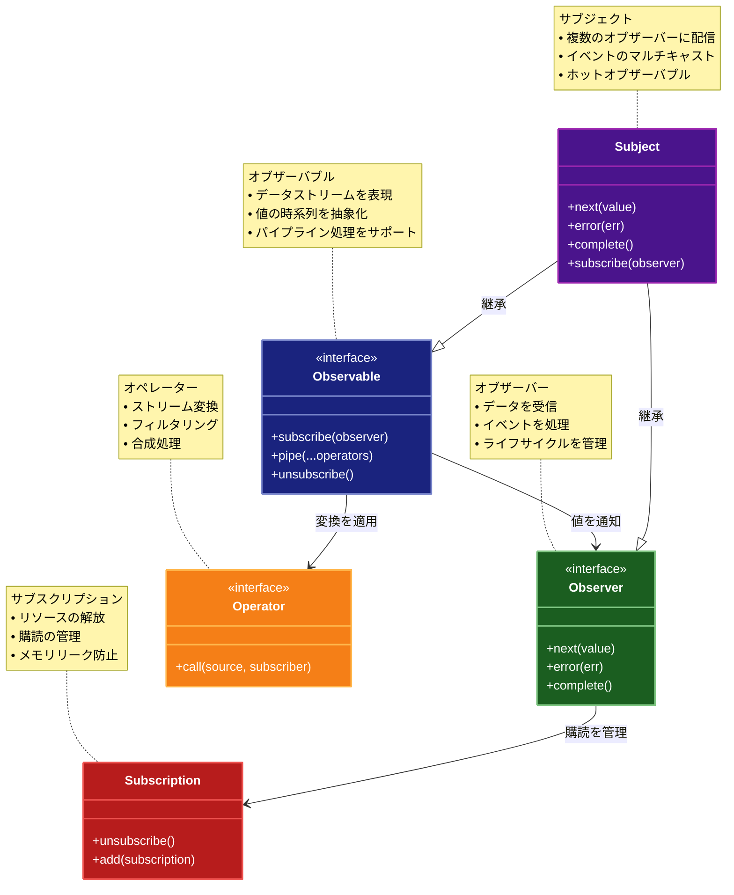

# Reactive Programming (リアクティブプログラミング)

## 目的

リアクティブプログラミングは、非同期処理やイベントストリームの処理をデータフローに基づいて扱うパターンです。これにより、非同期イベントを自然な形で処理し、リアクティブなシステムの構築を可能にします。

## 価値・解決する問題

- 非同期処理をシンプルに記述できる
- イベントストリームを統一的に扱うことで、複雑な非同期ロジックを簡潔に表現できる
- システム全体の反応性や拡張性が向上する

## 概要・特徴

### 概要

リアクティブプログラミングは、データストリームと変更の伝播に焦点を当てたプログラミングパラダイムです。データフローの変化が自動的に伝播され、それに依存する値やコンピュテーションが更新されます。

### 特徴

- データフロー中心のプログラミングモデル
- 宣言的なスタイル
- 非同期イベント処理
- プッシュベースのデータフロー
- 副作用の局所化

### 概要図



## コード例

### Before:

従来の非同期処理（コールバックや Promise を用いた例）

```typescript
"use strict";

function asyncTask(callback: (result: string) => void): void {
  setTimeout(() => {
    callback("処理完了");
  }, 1000);
}

asyncTask((result) => {
  console.log(result);
});
```

### After:

リアクティブプログラミングを利用した例。RxJS などのライブラリを用いて、オブザーバブルなストリームとして処理を記述

```typescript
"use strict";

import {Observable} from "rxjs";

// オブザーバブルを作成
const observable = new Observable<string>((subscriber) => {
  setTimeout(() => {
    subscriber.next("処理完了");
    subscriber.complete();
  }, 1000);
});

// 購読して値を受け取る
observable.subscribe({
  next: (value) => console.log(value),
  error: (err) => console.error(err),
  complete: () => console.log("完了"),
});
```

## 類似パターンとの比較

- [Reactor (リアクター)](reactor.md): Reactive Programming はデータの流れに基づいた非同期処理を提供し、これに対して Reactor は主に I/O イベントの効率的な分配に特化しています。

## 利用されているライブラリ／フレームワークの事例

- [RxJS](https://rxjs.dev/): JavaScript/TypeScript 向けのリアクティブプログラミングライブラリで、非同期データストリームを扱う
- [Bacon.js](https://baconjs.github.io/): 関数型リアクティブプログラミング（FRP）を JavaScript で実現するライブラリ
- [Most.js](https://github.com/cujojs/most): 高性能なリアクティブストリーム処理を提供する JavaScript ライブラリ
- [ReactiveX](http://reactivex.io/): 複数のプログラミング言語で利用可能なリアクティブプログラミングライブラリ群
