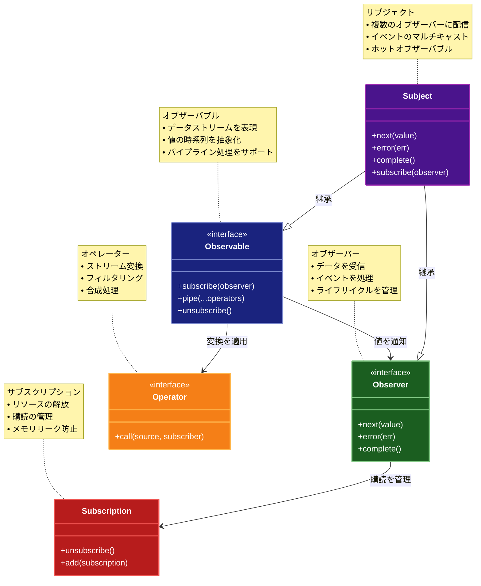

# Reactive Programming (リアクティブプログラミング)

## 目的

リアクティブプログラミングは、非同期処理やイベントストリームの処理をデータフローに基づいて扱うパターンです。これにより、非同期イベントを自然な形で処理し、リアクティブなシステムの構築を可能にします。

## 価値・解決する問題

- 非同期処理をシンプルに記述できる
- イベントストリームを統一的に扱うことで、複雑な非同期ロジックを簡潔に表現できる
- システム全体の反応性や拡張性が向上する

## 概要・特徴

### 概要

リアクティブプログラミングは、データストリームと変更の伝播に焦点を当てたプログラミングパラダイムです。データフローの変化が自動的に伝播され、それに依存する値やコンピュテーションが更新されます。

### 特徴

#### データフロー中心のプログラミングモデル
リアクティブプログラミングは、データフローとその変換に焦点を当てたプログラミングモデルを提供します。従来の命令型プログラミングがステップバイステップの手続きに焦点を当てるのに対し、リアクティブプログラミングではデータストリームとそれらの間の関係性を中心に考えます。例えば、ユーザー入力、センサーデータ、ネットワークレスポンスなど、あらゆる変化するデータをストリームとして統一的に表現できます。この抽象化により、複雑な非同期処理やイベント駆動型のアプリケーションを構築する際の概念的な一貫性が提供されます。データフロー中心のアプローチは、特にユーザーインターフェイスの反応性が重要なWebアプリケーションや、リアルタイムデータ処理が必要なシステムで価値を発揮します。

#### 宣言的なスタイル
リアクティブプログラミングは本質的に宣言的です。開発者は「何を」行いたいかを指定し、「どのように」実行するかの詳細はフレームワークに委ねます。この宣言的なアプローチにより、コードは簡潔で理解しやすくなります。例えば、データの変換、フィルタリング、結合などの操作をチェーン形式で宣言的に記述できます。これにより、複雑なデータ処理パイプラインも読みやすく保守しやすい形で表現できます。命令型プログラミングでは多くの場合、状態管理やイベント処理の複雑さにより、コードが複雑化しがちですが、宣言的なリアクティブプログラミングではこれらの複雑さが大幅に軽減されます。この宣言的なスタイルは、ビジネスロジックの意図を明確に表現し、低レベルの実装詳細から開発者を解放することで、生産性と正確性を向上させます。

#### 非同期イベント処理
リアクティブプログラミングは、非同期イベント処理を自然かつ効率的に扱う方法を提供します。従来のコールバックやPromiseベースのアプローチと比較して、より統一的で組み合わせやすいモデルを提供します。例えば、複数の非同期イベントソースを組み合わせて変換したり、時間的な順序付けや調整（遅延、スロットリング、デバウンシングなど）を適用したりすることが容易になります。また、エラー処理も統一的なパターンで行うことができ、例外の伝播や回復戦略の実装が簡素化されます。さらに、複雑な非同期シーケンス（並列処理、逐次処理、条件付き処理など）も宣言的に表現できます。これらの特性により、特にイベント駆動型のシステムやリアルタイムアプリケーション、マイクロサービスアーキテクチャにおける非同期通信などの実装が大幅に簡素化されます。

#### プッシュベースのデータフロー
リアクティブプログラミングでは、データの流れが「プッシュ」ベースであることが特徴的です。従来の「プル」ベースのアプローチでは、消費者がデータを要求（プル）するのに対し、リアクティブなシステムではデータの生産者が新しいデータが利用可能になった時点で消費者にデータをプッシュします。このモデルは「オブザーバーパターン」の拡張と考えることができますが、より豊富な操作と組み合わせの可能性を提供します。プッシュベースのモデルにより、データの変更が自動的にシステム全体に伝播され、関連するすべてのコンポーネントが更新されます。これは特に、リアルタイムデータ更新が必要なアプリケーション（株価トラッカー、チャットアプリケーション、ライブダッシュボードなど）で有用です。また、バックプレッシャー（消費者が処理できる以上のデータが生成される状況への対応）などの高度な制御メカニズムも、多くのリアクティブライブラリで提供されています。

#### 副作用の局所化
リアクティブプログラミングパラダイムは、副作用を局所化し管理するのに役立ちます。データストリーム処理のほとんどは純粋関数として表現され、副作用（データベース操作、ネットワークリクエスト、UIの更新など）はストリーム購読の特定のポイントでのみ発生します。この分離により、アプリケーションのロジックがより予測可能で、テストしやすく、デバッグしやすくなります。例えば、データ変換やフィルタリングのロジックは純粋関数として実装でき、実際の副作用（APIコールやUIの更新など）はストリームの終端でのみ発生します。この分離は、関数型プログラミングの原則と合致しており、コードの可読性と保守性を高めるとともに、並行処理や分散システムにおける複雑さを軽減します。副作用が明示的かつ局所的であることで、アプリケーションの状態変化が予測可能になり、バグの可能性が減少します。

### 概要図



## コード例

### Before:

従来の非同期処理（コールバックや Promise を用いた例）

```typescript
"use strict";

function asyncTask(callback: (result: string) => void): void {
  setTimeout(() => {
    callback("処理完了");
  }, 1000);
}

asyncTask((result) => {
  console.log(result);
});
```

### After:

リアクティブプログラミングを利用した例。RxJS などのライブラリを用いて、オブザーバブルなストリームとして処理を記述

```typescript
"use strict";

import {Observable} from "rxjs";

// オブザーバブルを作成
const observable = new Observable<string>((subscriber) => {
  setTimeout(() => {
    subscriber.next("処理完了");
    subscriber.complete();
  }, 1000);
});

// 購読して値を受け取る
observable.subscribe({
  next: (value) => console.log(value),
  error: (err) => console.error(err),
  complete: () => console.log("完了"),
});
```

## 類似パターンとの比較

- [Reactor (リアクター)](reactor.md): Reactive Programming はデータの流れに基づいた非同期処理を提供し、これに対して Reactor は主に I/O イベントの効率的な分配に特化しています。

## 利用されているライブラリ／フレームワークの事例

- [RxJS](https://rxjs.dev/): JavaScript/TypeScript 向けのリアクティブプログラミングライブラリで、非同期データストリームを扱う
- [Bacon.js](https://baconjs.github.io/): 関数型リアクティブプログラミング（FRP）を JavaScript で実現するライブラリ
- [Most.js](https://github.com/cujojs/most): 高性能なリアクティブストリーム処理を提供する JavaScript ライブラリ
- [ReactiveX](http://reactivex.io/): 複数のプログラミング言語で利用可能なリアクティブプログラミングライブラリ群
