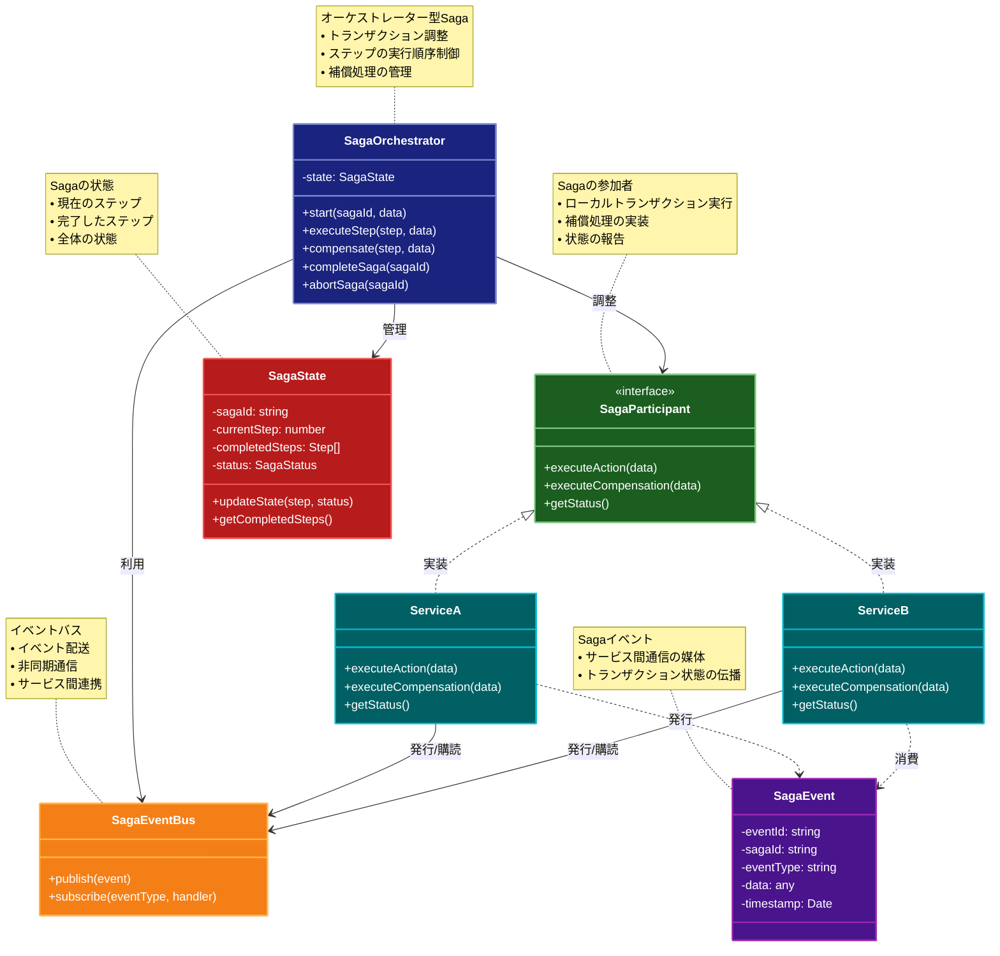

# Saga（サガ）パターン

## 目的

分散トランザクションを管理し、複数のサービスにまたがる一連の処理を整合性を保ちながら実行します。

## 価値・解決する問題

- 分散トランザクションの整合性を確保します
- 失敗時の補償処理を管理します
- サービス間の依存関係を疎結合に保ちます
- システムの回復性を向上させます
- 複雑なビジネスプロセスを管理します

## 概要・特徴

### 概要

Sagaパターンは、マイクロサービスアーキテクチャにおいて、複数のサービスにまたがるトランザクションを管理するための設計パターンです。各ステップの成功または失敗に応じて、次のステップを実行するか補償トランザクションを実行します。

### 特徴

#### 分散トランザクション管理
複数のマイクロサービスにまたがるトランザクション処理を一貫性を持って実行する機能を提供します。従来のACID特性に依存する2相コミットとは異なり、Sagaは最終的整合性の原則に基づいて動作します。各サービスはローカルトランザクションのみを担当し、サービス間の調整はSagaコーディネーターまたはイベントの連鎖によって実現されます。これにより、マイクロサービスアーキテクチャの自律性を損なうことなく、複数のサービスを横断する複雑なビジネスプロセスを実装できます。例えば、注文処理システムでは、支払い処理、在庫確認、配送手配など、複数のサービスを連携させる必要がありますが、Sagaパターンによってこれらの一連の処理を調整できます。

#### 補償トランザクション
Sagaパターンの中核となる機能で、トランザクションの途中で失敗が発生した場合に、既に実行済みの処理を取り消すための仕組みを提供します。各ステップには、対応する補償処理が定義されており、失敗時にはこれらが逆順に実行されることで、システム全体を一貫した状態に戻します。これは「ロールバック」と似ていますが、分散環境では完全なロールバックが不可能なため、ビジネスロジックによる補償処理が必要になります。例えば、クレジットカード決済が失敗した場合、既に確保した在庫を解放し、注文ステータスをキャンセルに更新するといった一連の補償処理が実行されます。補償トランザクションの設計には注意が必要で、冪等性（何度実行しても同じ結果になる特性）を持たせることが重要です。

#### イベント駆動型の処理
Sagaパターンの実装方法の一つとして、特にコレオグラフィ型Sagaでは、イベント駆動アーキテクチャを活用します。各サービスは処理完了時にイベントを発行し、次のサービスがそのイベントを購読して処理を継続します。このイベントベースの連携により、サービス間の直接的な依存関係が排除され、高い疎結合性が実現されます。障害に対する耐性も向上し、一部のサービスが一時的に利用できなくなっても、イベントは永続化されるため、サービスが復旧した際に処理を継続できます。また、新しいステップの追加や既存ステップの変更が容易になり、システムの拡張性が向上します。例えば、「注文確定イベント」に対して、新たに「ロイヤルティポイント付与」サービスを追加する場合、既存のサービスに変更を加えることなく実装できます。

#### 非同期処理
Sagaパターンは本質的に非同期処理に適しています。長時間実行される処理や、即時応答が必要ない処理を効率的に実行できます。これにより、ユーザー体験が向上し、システム全体のスループットが改善されます。例えば、ECサイトで注文完了後の在庫管理や配送準備などの後続処理は、ユーザーに注文確認を返した後、非同期で実行できます。また、サービス間の通信がメッセージングシステムを介して行われるため、一時的なネットワーク障害や処理遅延に対する耐性が高まります。各ステップは独立して実行され、システム全体の応答性が向上します。ただし、非同期処理によって全体の処理状況が複雑になるため、適切なモニタリングと可視化の仕組みが重要です。

#### 状態管理
Sagaの実行状態を追跡し、各ステップの完了状況や補償処理の必要性を判断するための仕組みを提供します。特にオーケストレーター型Sagaでは、中央のコーディネーターがSagaの状態を管理し、次に実行すべきステップや、失敗時の補償処理の順序を決定します。状態はデータベースやイベントストアなどの永続ストレージに保存され、システム障害が発生しても回復できるようになっています。また、長期実行トランザクションでは、状態管理によって処理の中断と再開が可能になります。例えば、旅行予約システムでは、フライト予約、ホテル予約、レンタカー予約など複数のステップがあり、各ステップの状態を管理することで、ユーザーが予約プロセスを一時中断しても、後で継続できるようになります。効果的な状態管理により、Sagaの実行が透明化され、デバッグやトラブルシューティングが容易になります。

### 概要図



## 類似パターンとの比較

- [Event Sourcing (イベントソーシング)](event-sourcing.md): Saga は分散トランザクションの管理に焦点を当て、これに対して Event Sourcing は状態変更の履歴管理に注力します。
- [Circuit Breaker (サーキットブレーカー)](circuit-breaker.md): Saga は分散トランザクションの整合性に焦点を当て、これに対して Circuit Breaker は障害検出と回復に注力します。
- [Retry (リトライ)](retry.md): Saga は補償トランザクションによる回復に焦点を当て、これに対して Retry は一時的な障害からの回復を試みます。

## 利用されているライブラリ／フレームワークの事例

- [Eventuate Tram Saga](https://eventuate.io/): Java向けのSagaフレームワーク
- [MassTransit](https://masstransit-project.com/): .NET向けの分散アプリケーションフレームワーク
- [Axon Framework](https://axoniq.io/): Java向けのSaga実装

## 解説ページリンク

- [Microsoft - Saga Pattern](https://docs.microsoft.com/en-us/azure/architecture/reference-architectures/saga/saga)
- [Chris Richardson - Saga Pattern](https://microservices.io/patterns/data/saga.html)
- [Eventuate - Saga Pattern](https://eventuate.io/docs/manual/eventuate-tram/latest/getting-started-sagas.html)

## コード例

### Before:

単一のトランザクションによる実装

```typescript
interface Order {
  id: string;
  userId: string;
  productId: string;
  quantity: number;
  status: string;
}

class OrderService {
  async createOrder(userId: string, productId: string, quantity: number): Promise<Order> {
    // 単一のトランザクション内で全ての処理を実行
    try {
      // 在庫確認
      if (!this.checkInventory(productId, quantity)) {
        throw new Error("在庫不足");
      }

      // 支払い処理
      if (!this.processPayment(userId, productId, quantity)) {
        throw new Error("支払い処理失敗");
      }

      // 注文作成
      const order: Order = {
        id: Math.random().toString(36).substr(2, 9),
        userId,
        productId,
        quantity,
        status: "completed"
      };

      // 在庫更新
      this.updateInventory(productId, quantity);

      return order;
    } catch (error) {
      throw error;
    }
  }

  private checkInventory(productId: string, quantity: number): boolean {
    // 在庫確認のシミュレーション
    return Math.random() > 0.1;
  }

  private processPayment(userId: string, productId: string, quantity: number): boolean {
    // 支払い処理のシミュレーション
    return Math.random() > 0.1;
  }

  private updateInventory(productId: string, quantity: number): void {
    // 在庫更新のシミュレーション
    console.log(`在庫を${quantity}個減少`);
  }
}

// 使用例
async function example() {
  const service = new OrderService();
  try {
    const order = await service.createOrder("user1", "product1", 2);
    console.log("注文成功:", order);
  } catch (error) {
    console.error("注文失敗:", error);
  }
}

example();
```

### After:

Sagaパターンを適用した実装

```typescript
// イベントとコマンドの定義
interface Event {
  type: string;
  payload: any;
}

interface Command {
  type: string;
  payload: any;
}

// サービスの定義
class InventoryService {
  async checkInventory(productId: string, quantity: number): Promise<boolean> {
    // 在庫確認のシミュレーション
    const isAvailable = Math.random() > 0.1;
    console.log(`在庫確認: ${isAvailable ? "利用可能" : "在庫不足"}`);
    return isAvailable;
  }

  async reserveInventory(productId: string, quantity: number): Promise<boolean> {
    // 在庫予約のシミュレーション
    const success = Math.random() > 0.1;
    console.log(`在庫予約: ${success ? "成功" : "失敗"}`);
    return success;
  }

  async cancelReservation(productId: string, quantity: number): Promise<void> {
    // 在庫予約キャンセルのシミュレーション
    console.log("在庫予約をキャンセル");
  }

  async confirmReservation(productId: string, quantity: number): Promise<void> {
    // 在庫予約確定のシミュレーション
    console.log("在庫予約を確定");
  }
}

class PaymentService {
  async processPayment(userId: string, amount: number): Promise<boolean> {
    // 支払い処理のシミュレーション
    const success = Math.random() > 0.1;
    console.log(`支払い処理: ${success ? "成功" : "失敗"}`);
    return success;
  }

  async refundPayment(userId: string, amount: number): Promise<void> {
    // 返金処理のシミュレーション
    console.log("支払いを返金");
  }
}

class OrderService {
  private orders: Map<string, Order> = new Map();

  async createOrder(orderId: string, userId: string, productId: string, quantity: number): Promise<void> {
    const order: Order = {
      id: orderId,
      userId,
      productId,
      quantity,
      status: "pending"
    };
    this.orders.set(orderId, order);
    console.log("注文を作成");
  }

  async updateOrderStatus(orderId: string, status: string): Promise<void> {
    const order = this.orders.get(orderId);
    if (order) {
      order.status = status;
      console.log(`注文ステータスを更新: ${status}`);
    }
  }

  getOrder(orderId: string): Order | undefined {
    return this.orders.get(orderId);
  }
}

// Sagaの実装
class OrderSaga {
  private inventoryService: InventoryService;
  private paymentService: PaymentService;
  private orderService: OrderService;

  constructor() {
    this.inventoryService = new InventoryService();
    this.paymentService = new PaymentService();
    this.orderService = new OrderService();
  }

  async execute(userId: string, productId: string, quantity: number): Promise<Order | null> {
    const orderId = Math.random().toString(36).substr(2, 9);

    try {
      // ステップ1: 在庫確認
      const isAvailable = await this.inventoryService.checkInventory(productId, quantity);
      if (!isAvailable) {
        throw new Error("在庫不足");
      }

      // ステップ2: 注文作成
      await this.orderService.createOrder(orderId, userId, productId, quantity);

      // ステップ3: 在庫予約
      const isReserved = await this.inventoryService.reserveInventory(productId, quantity);
      if (!isReserved) {
        throw new Error("在庫予約失敗");
      }

      // ステップ4: 支払い処理
      const isPaymentProcessed = await this.paymentService.processPayment(userId, quantity * 100);
      if (!isPaymentProcessed) {
        // 補償トランザクション: 在庫予約をキャンセル
        await this.inventoryService.cancelReservation(productId, quantity);
        await this.orderService.updateOrderStatus(orderId, "payment_failed");
        throw new Error("支払い処理失敗");
      }

      // ステップ5: 在庫予約確定
      await this.inventoryService.confirmReservation(productId, quantity);
      await this.orderService.updateOrderStatus(orderId, "completed");

      return this.orderService.getOrder(orderId) ?? null;

    } catch (error) {
      // エラーハンドリングと補償トランザクション
      console.error("Saga実行エラー:", error);
      
      if (this.orderService.getOrder(orderId)) {
        await this.orderService.updateOrderStatus(orderId, "failed");
      }

      return null;
    }
  }
}

// イベントバスの実装（簡易版）
class EventBus {
  private subscribers: Map<string, ((event: Event) => void)[]> = new Map();

  subscribe(eventType: string, callback: (event: Event) => void): void {
    if (!this.subscribers.has(eventType)) {
      this.subscribers.set(eventType, []);
    }
    this.subscribers.get(eventType)?.push(callback);
  }

  publish(event: Event): void {
    const callbacks = this.subscribers.get(event.type) || [];
    callbacks.forEach(callback => callback(event));
  }
}

// 使用例
async function example() {
  const saga = new OrderSaga();
  const eventBus = new EventBus();

  // イベントの購読
  eventBus.subscribe("OrderCreated", (event) => {
    console.log("注文作成イベント受信:", event);
  });

  // Sagaの実行
  console.log("注文処理を開始");
  const order = await saga.execute("user1", "product1", 2);

  if (order) {
    console.log("注文処理成功:", order);
    eventBus.publish({
      type: "OrderCreated",
      payload: order
    });
  } else {
    console.log("注文処理失敗");
  }
}

example();
```
