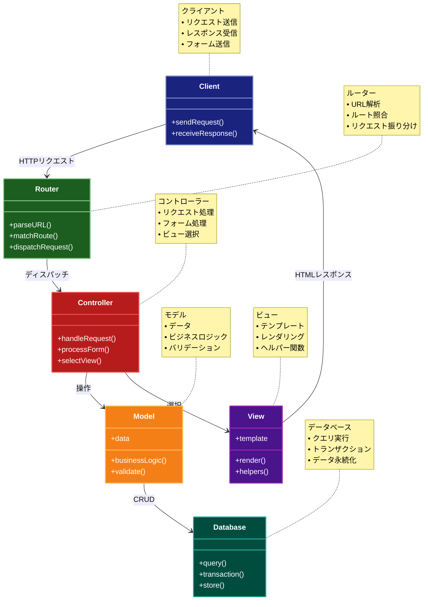

# Server-Side MVC パターン

## 目的

サーバーサイドでMVCパターンを適用し、ビジネスロジック、データ、プレゼンテーションを分離することで、Webアプリケーションの保守性と再利用性を向上させるパターン。

## 価値・解決する問題

- ビジネスロジックとプレゼンテーションの分離
- コードの再利用性の向上
- テストの容易性
- 関心事の分離
- 開発効率の向上

## 概要・特徴

### 概要

Server-Side MVCパターンは、従来のMVCパターンをサーバーサイドに適用したものです。モデル（ビジネスロジック）、ビュー（テンプレート）、コントローラー（リクエスト処理）を分離し、それぞれの責務を明確にします。

### 特徴

#### サーバーサイドでの処理
すべてのビジネスロジックとレンダリング処理がサーバー側で実行されます。クライアントにはすでに生成済みのHTMLが送信されるため、クライアント側の負荷が軽減されます。これにより、古いブラウザやスペックの低いデバイスでも一貫した体験を提供できます。またSEO面でも有利であり、サーバーで生成された完全なHTMLはウェブクローラーに認識されやすく、検索エンジンのインデックスに登録されやすくなります。

#### テンプレートエンジンの活用
動的なHTML生成のためにテンプレートエンジンを利用します。テンプレートエンジンはHTMLマークアップとプログラミングコードを分離し、再利用可能なテンプレートを作成することを可能にします。これによりフロントエンドとバックエンド開発の明確な分業が可能となり、デザイナーは開発者に依存せずテンプレートの作成や修正が行えます。代表的なテンプレートエンジンには、Thymeleaf、Jinja2、ERB、Blade、Razorなどがあります。

#### ルーティング機能
URLパターンに基づいて、リクエストを適切なコントローラーに割り当てる機能を提供します。これにより、リソース指向の設計が容易になり、RESTfulなAPIの実装も可能になります。また、URLの構造をプログラムの内部構造から分離できるため、柔軟なURL設計が可能になり、将来的なURL構造の変更も内部ロジックの変更なしに対応できます。

#### セッション管理
ユーザー認証やステート（状態）を管理するための機能を提供します。HTTPは基本的にステートレスなプロトコルですが、MVCフレームワークは標準でセッション管理機能を備えており、複数リクエスト間でのユーザー情報の保持やショッピングカートのような状態を必要とするアプリケーション開発を容易にします。また、セキュリティ機能（CSRF対策やセッションハイジャック防止など）も組み込まれていることが多いです。

#### データベース連携
モデル層を通じて、データベースとの連携が容易に行えます。多くのMVCフレームワークはORM（オブジェクトリレーショナルマッピング）やデータアクセスレイヤーを提供しており、SQLを直接書くことなくデータベース操作が可能です。これにより、開発者はビジネスロジックに集中でき、データベース固有の処理からある程度抽象化されることで、データベース変更時の影響範囲も限定的になります。

### 概要図



## 類似パターンとの比較

- [MVC](mvc.md)
  - クライアントサイドMVCはブラウザで動作するのに対して、Server-Side MVCはサーバーで動作する
  - クライアントサイドMVCは動的なUIを実現するのに対して、Server-Side MVCは各リクエストでページ全体を再描画する

- [MVP](mvp.md)
  - MVPはクライアントサイドでの対話的なUIに適しているのに対して、Server-Side MVCはサーバーサイドでの処理に適している
  - MVPはビューとプレゼンターが密接に結合するのに対して、Server-Side MVCはHTTPリクエスト/レスポンスを介して疎結合を実現する

## 利用されているライブラリ／フレームワークの事例

- [Ruby on Rails](https://github.com/rails/rails)
  - ActionControllerによるコントローラー実装
  - ActiveRecordによるモデル実装
  - Action Viewによるビュー実装

- [Spring MVC](https://github.com/spring-projects/spring-framework)
  - DispatcherServletによるリクエストハンドリング
  - Controllerアノテーションによるコントローラー実装
  - Thymeleafテンプレートエンジン

## 解説ページリンク

- [Understanding MVC Architecture](https://developer.mozilla.org/en-US/docs/Glossary/MVC)
- [Server-Side MVC Pattern](https://www.oracle.com/technical-resources/articles/java/mvc.html)

## コード例

### Before:

```typescript
// 単一のスクリプトファイルで全ての処理を行う
import express from 'express'
import { Pool } from 'pg'

const app = express()
const pool = new Pool({
  connectionString: process.env.DATABASE_URL
})

app.get('/users', async (req, res) => {
  // データベースクエリ
  const result = await pool.query('SELECT * FROM users')
  
  // HTMLの生成
  let html = '<html><body><h1>ユーザー一覧</h1><ul>'
  result.rows.forEach(user => {
    html += `<li>${user.name} (${user.email})</li>`
  })
  html += '</ul></body></html>'
  
  res.send(html)
})

app.post('/users', async (req, res) => {
  const { name, email } = req.body
  
  // バリデーション
  if (!name || !email) {
    res.status(400).send('名前とメールアドレスは必須です')
    return
  }
  
  // データベース保存
  await pool.query(
    'INSERT INTO users (name, email) VALUES ($1, $2)',
    [name, email]
  )
  
  res.redirect('/users')
})
```

### After:

```typescript
// モデル
class UserModel {
  private pool: Pool

  constructor(pool: Pool) {
    this.pool = pool
  }

  async findAll() {
    const result = await this.pool.query('SELECT * FROM users')
    return result.rows
  }

  async create(name: string, email: string) {
    // バリデーション
    if (!this.validate(name, email)) {
      throw new Error('Invalid user data')
    }

    await this.pool.query(
      'INSERT INTO users (name, email) VALUES ($1, $2)',
      [name, email]
    )
  }

  private validate(name: string, email: string): boolean {
    return Boolean(name && email && email.includes('@'))
  }
}

// ビュー
class UserView {
  render(users: any[]) {
    return `
      <html>
        <body>
          <h1>ユーザー一覧</h1>
          <ul>
            ${users.map(user => this.renderUser(user)).join('')}
          </ul>
          ${this.renderForm()}
        </body>
      </html>
    `
  }

  private renderUser(user: any) {
    return `<li>${this.escape(user.name)} (${this.escape(user.email)})</li>`
  }

  private renderForm() {
    return `
      <form method="post" action="/users">
        <div>
          <label>名前: <input type="text" name="name" required></label>
        </div>
        <div>
          <label>メール: <input type="email" name="email" required></label>
        </div>
        <button type="submit">登録</button>
      </form>
    `
  }

  private escape(str: string): string {
    return str
      .replace(/&/g, '&amp;')
      .replace(/</g, '&lt;')
      .replace(/>/g, '&gt;')
      .replace(/"/g, '&quot;')
      .replace(/'/g, '&#039;')
  }
}

// コントローラー
class UserController {
  private model: UserModel
  private view: UserView

  constructor(model: UserModel, view: UserView) {
    this.model = model
    this.view = view
  }

  async index(req: Request, res: Response) {
    try {
      const users = await this.model.findAll()
      const html = this.view.render(users)
      res.send(html)
    } catch (error) {
      res.status(500).send('Internal Server Error')
    }
  }

  async create(req: Request, res: Response) {
    const { name, email } = req.body

    try {
      await this.model.create(name, email)
      res.redirect('/users')
    } catch (error) {
      res.status(400).send(error.message)
    }
  }
}

// ルーティングとアプリケーションのセットアップ
import express from 'express'
import { Pool } from 'pg'

const app = express()
const pool = new Pool({
  connectionString: process.env.DATABASE_URL
})

const userModel = new UserModel(pool)
const userView = new UserView()
const userController = new UserController(userModel, userView)

app.use(express.urlencoded({ extended: true }))

app.get('/users', (req, res) => userController.index(req, res))
app.post('/users', (req, res) => userController.create(req, res))
``` 