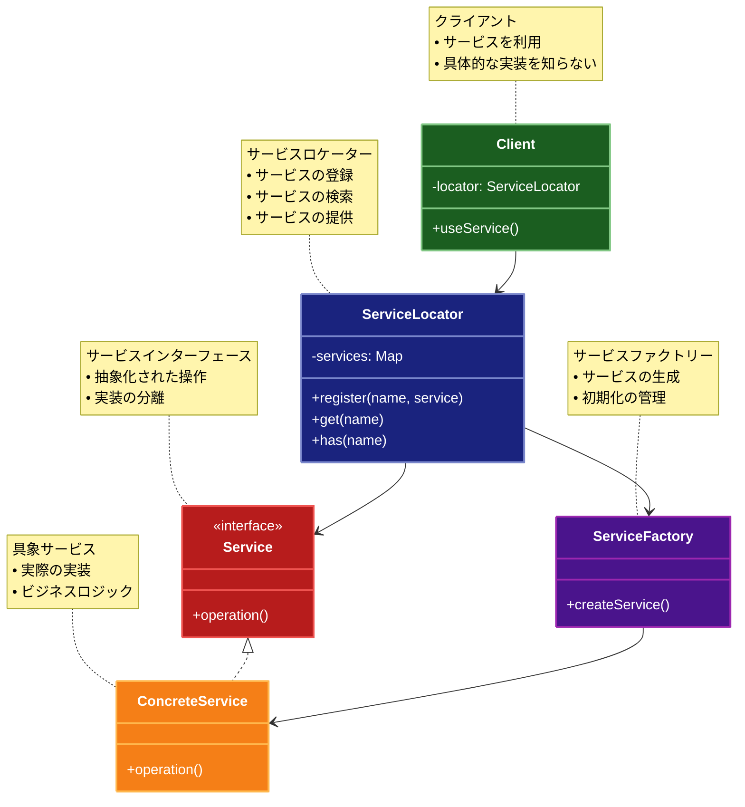

# Service Locator（サービスロケーター）パターン

## 目的

サービスの検索と取得を担当する中央レジストリを提供し、コンポーネントがサービスを直接参照することなく利用できるようにするパターンです。

## 価値・解決する問題

- 依存関係の疎結合化
- サービスの動的な解決
- テスト容易性の向上
- 実装の柔軟性確保

## 概要・特徴

### 概要

Service Locatorパターンは、サービスの検索と取得を担当する中央レジストリを提供し、コンポーネントがサービスを直接参照することなく利用できるようにする設計パターンです。

### 特徴

- 中央レジストリ
- 動的なサービス解決
- 依存関係の抽象化
- 柔軟な構成変更
- テスト容易性

### 概要図



## 類似パターンとの比較

- [Dependency Injection (依存性注入)](dependency-injection.md): Service Locator はサービスを中央レジストリから取得し、これに対して Dependency Injection は外部から依存関係を注入します。
- [Factory Method (ファクトリーメソッド)](factory-method.md): Service Locator はサービスの検索と取得を行い、これに対して Factory Method はオブジェクトの生成を抽象化します。
- [Registry (レジストリ)](registry.md): Service Locator はサービスの検索と取得を行い、これに対して Registry は設定や状態を管理します。

## 利用されているライブラリ／フレームワークの事例

- [Symfony Service Container](https://symfony.com/doc/current/service_container.html): サービスコンテナ
- [Laravel Service Container](https://laravel.com/docs/container): サービスコンテナ
- [Spring Framework](https://docs.spring.io/spring-framework/docs/current/reference/html/core.html#beans): Bean管理

## 解説ページリンク

- [Refactoring Guru - Service Locator](https://refactoring.guru/design-patterns/service-locator)
- [Microsoft - Service Locator](https://docs.microsoft.com/en-us/previous-versions/msp-n-p/ff648968(v=pandp.10))
- [Martin Fowler - Service Locator](https://martinfowler.com/articles/injection.html#UsingAServiceLocator)

## コード例

### Before:

直接的なサービス参照の実装

```typescript
// ロガーインターフェース
interface Logger {
  log(message: string): void;
  error(message: string): void;
}

// データベースインターフェース
interface Database {
  query(sql: string): Promise<any[]>;
  execute(sql: string): Promise<void>;
}

// メール送信インターフェース
interface EmailService {
  sendEmail(to: string, subject: string, body: string): Promise<void>;
}

// コンソールロガーの実装
class ConsoleLogger implements Logger {
  log(message: string): void {
    console.log(`[LOG] ${message}`);
  }

  error(message: string): void {
    console.error(`[ERROR] ${message}`);
  }
}

// インメモリデータベースの実装
class InMemoryDatabase implements Database {
  private data: Map<string, any[]> = new Map();

  async query(sql: string): Promise<any[]> {
    console.log(`Executing query: ${sql}`);
    return this.data.get(sql) || [];
  }

  async execute(sql: string): Promise<void> {
    console.log(`Executing statement: ${sql}`);
    this.data.set(sql, []);
  }
}

// コンソールメールサービスの実装
class ConsoleEmailService implements EmailService {
  async sendEmail(to: string, subject: string, body: string): Promise<void> {
    console.log(`Sending email to ${to}`);
    console.log(`Subject: ${subject}`);
    console.log(`Body: ${body}`);
  }
}

// ユーザーサービス
class UserService {
  private logger: Logger;
  private database: Database;
  private emailService: EmailService;

  constructor() {
    this.logger = new ConsoleLogger();
    this.database = new InMemoryDatabase();
    this.emailService = new ConsoleEmailService();
  }

  async createUser(name: string, email: string): Promise<void> {
    try {
      this.logger.log(`Creating user: ${name}`);
      await this.database.execute(`INSERT INTO users (name, email) VALUES ('${name}', '${email}')`);
      await this.emailService.sendEmail(
        email,
        "Welcome!",
        `Welcome to our service, ${name}!`
      );
      this.logger.log(`User created: ${name}`);
    } catch (error) {
      this.logger.error(`Failed to create user: ${error}`);
      throw error;
    }
  }

  async getUser(id: number): Promise<any> {
    try {
      this.logger.log(`Getting user: ${id}`);
      const results = await this.database.query(`SELECT * FROM users WHERE id = ${id}`);
      return results[0];
    } catch (error) {
      this.logger.error(`Failed to get user: ${error}`);
      throw error;
    }
  }
}

// 注文サービス
class OrderService {
  private logger: Logger;
  private database: Database;
  private emailService: EmailService;

  constructor() {
    this.logger = new ConsoleLogger();
    this.database = new InMemoryDatabase();
    this.emailService = new ConsoleEmailService();
  }

  async createOrder(userId: number, items: string[]): Promise<void> {
    try {
      this.logger.log(`Creating order for user: ${userId}`);
      await this.database.execute(
        `INSERT INTO orders (userId, items) VALUES (${userId}, '${JSON.stringify(items)}')`
      );
      const user = await this.database.query(`SELECT * FROM users WHERE id = ${userId}`);
      await this.emailService.sendEmail(
        user[0].email,
        "Order Confirmation",
        `Your order has been received: ${items.join(", ")}`
      );
      this.logger.log(`Order created for user: ${userId}`);
    } catch (error) {
      this.logger.error(`Failed to create order: ${error}`);
      throw error;
    }
  }

  async getOrder(id: number): Promise<any> {
    try {
      this.logger.log(`Getting order: ${id}`);
      const results = await this.database.query(`SELECT * FROM orders WHERE id = ${id}`);
      return results[0];
    } catch (error) {
      this.logger.error(`Failed to get order: ${error}`);
      throw error;
    }
  }
}

// 使用例
async function example() {
  const userService = new UserService();
  const orderService = new OrderService();

  try {
    // ユーザーの作成
    console.log("=== ユーザーの作成 ===");
    await userService.createUser("John Doe", "john@example.com");

    // 注文の作成
    console.log("\n=== 注文の作成 ===");
    await orderService.createOrder(1, ["Item 1", "Item 2"]);

    // ユーザーの取得
    console.log("\n=== ユーザーの取得 ===");
    const user = await userService.getUser(1);
    console.log("User:", user);

    // 注文の取得
    console.log("\n=== 注文の取得 ===");
    const order = await orderService.getOrder(1);
    console.log("Order:", order);
  } catch (error) {
    console.error("Error:", error);
  }
}

example();
```

### After:

Service Locatorパターンを適用した実装

```typescript
// サービスの型定義
type ServiceType = "logger" | "database" | "email" | "config";

// サービスインターフェース
interface Logger {
  log(message: string): void;
  error(message: string): void;
}

interface Database {
  query(sql: string): Promise<any[]>;
  execute(sql: string): Promise<void>;
}

interface EmailService {
  sendEmail(to: string, subject: string, body: string): Promise<void>;
}

interface Config {
  get(key: string): string;
  set(key: string, value: string): void;
}

// サービスの実装
class ConsoleLogger implements Logger {
  log(message: string): void {
    console.log(`[LOG] ${message}`);
  }

  error(message: string): void {
    console.error(`[ERROR] ${message}`);
  }
}

class InMemoryDatabase implements Database {
  private data: Map<string, any[]> = new Map();

  async query(sql: string): Promise<any[]> {
    console.log(`Executing query: ${sql}`);
    return this.data.get(sql) || [];
  }

  async execute(sql: string): Promise<void> {
    console.log(`Executing statement: ${sql}`);
    this.data.set(sql, []);
  }
}

class ConsoleEmailService implements EmailService {
  async sendEmail(to: string, subject: string, body: string): Promise<void> {
    console.log(`Sending email to ${to}`);
    console.log(`Subject: ${subject}`);
    console.log(`Body: ${body}`);
  }
}

class InMemoryConfig implements Config {
  private config: Map<string, string> = new Map();

  get(key: string): string {
    return this.config.get(key) || "";
  }

  set(key: string, value: string): void {
    this.config.set(key, value);
  }
}

// サービスロケーター
class ServiceLocator {
  private static instance: ServiceLocator;
  private services: Map<ServiceType, any>;
  private serviceFactories: Map<ServiceType, () => any>;

  private constructor() {
    this.services = new Map();
    this.serviceFactories = new Map();
    this.initializeDefaultServices();
  }

  private initializeDefaultServices(): void {
    this.registerFactory("logger", () => new ConsoleLogger());
    this.registerFactory("database", () => new InMemoryDatabase());
    this.registerFactory("email", () => new ConsoleEmailService());
    this.registerFactory("config", () => new InMemoryConfig());
  }

  static getInstance(): ServiceLocator {
    if (!ServiceLocator.instance) {
      ServiceLocator.instance = new ServiceLocator();
    }
    return ServiceLocator.instance;
  }

  // サービスファクトリーの登録
  registerFactory(type: ServiceType, factory: () => any): void {
    this.serviceFactories.set(type, factory);
    this.services.delete(type); // キャッシュをクリア
  }

  // サービスの取得
  getService<T>(type: ServiceType): T {
    if (!this.services.has(type)) {
      const factory = this.serviceFactories.get(type);
      if (!factory) {
        throw new Error(`Service not registered: ${type}`);
      }
      this.services.set(type, factory());
    }
    return this.services.get(type);
  }

  // サービスの再設定
  resetService(type: ServiceType): void {
    this.services.delete(type);
  }

  // 全サービスの再設定
  resetAll(): void {
    this.services.clear();
  }
}

// ベースサービスクラス
abstract class BaseService {
  protected get logger(): Logger {
    return ServiceLocator.getInstance().getService("logger");
  }

  protected get database(): Database {
    return ServiceLocator.getInstance().getService("database");
  }

  protected get emailService(): EmailService {
    return ServiceLocator.getInstance().getService("email");
  }

  protected get config(): Config {
    return ServiceLocator.getInstance().getService("config");
  }
}

// ユーザーサービス
class UserService extends BaseService {
  async createUser(name: string, email: string): Promise<void> {
    try {
      this.logger.log(`Creating user: ${name}`);
      await this.database.execute(`INSERT INTO users (name, email) VALUES ('${name}', '${email}')`);
      await this.emailService.sendEmail(
        email,
        "Welcome!",
        `Welcome to our service, ${name}!`
      );
      this.logger.log(`User created: ${name}`);
    } catch (error) {
      this.logger.error(`Failed to create user: ${error}`);
      throw error;
    }
  }

  async getUser(id: number): Promise<any> {
    try {
      this.logger.log(`Getting user: ${id}`);
      const results = await this.database.query(`SELECT * FROM users WHERE id = ${id}`);
      return results[0];
    } catch (error) {
      this.logger.error(`Failed to get user: ${error}`);
      throw error;
    }
  }
}

// 注文サービス
class OrderService extends BaseService {
  async createOrder(userId: number, items: string[]): Promise<void> {
    try {
      this.logger.log(`Creating order for user: ${userId}`);
      await this.database.execute(
        `INSERT INTO orders (userId, items) VALUES (${userId}, '${JSON.stringify(items)}')`
      );
      const user = await this.database.query(`SELECT * FROM users WHERE id = ${userId}`);
      await this.emailService.sendEmail(
        user[0].email,
        "Order Confirmation",
        `Your order has been received: ${items.join(", ")}`
      );
      this.logger.log(`Order created for user: ${userId}`);
    } catch (error) {
      this.logger.error(`Failed to create order: ${error}`);
      throw error;
    }
  }

  async getOrder(id: number): Promise<any> {
    try {
      this.logger.log(`Getting order: ${id}`);
      const results = await this.database.query(`SELECT * FROM orders WHERE id = ${id}`);
      return results[0];
    } catch (error) {
      this.logger.error(`Failed to get order: ${error}`);
      throw error;
    }
  }
}

// モック用のロガー
class MockLogger implements Logger {
  private logs: string[] = [];

  log(message: string): void {
    this.logs.push(`[LOG] ${message}`);
  }

  error(message: string): void {
    this.logs.push(`[ERROR] ${message}`);
  }

  getLogs(): string[] {
    return this.logs;
  }

  clear(): void {
    this.logs = [];
  }
}

// 使用例
async function example() {
  // デフォルトのサービスを使用
  console.log("=== デフォルトのサービスを使用 ===");
  const userService = new UserService();
  const orderService = new OrderService();

  try {
    // ユーザーの作成
    console.log("\n# ユーザーの作成");
    await userService.createUser("John Doe", "john@example.com");

    // 注文の作成
    console.log("\n# 注文の作成");
    await orderService.createOrder(1, ["Item 1", "Item 2"]);

    // ユーザーの取得
    console.log("\n# ユーザーの取得");
    const user = await userService.getUser(1);
    console.log("User:", user);

    // 注文の取得
    console.log("\n# 注文の取得");
    const order = await orderService.getOrder(1);
    console.log("Order:", order);

    // モックロガーを使用したテスト
    console.log("\n=== モックロガーを使用したテスト ===");
    const mockLogger = new MockLogger();
    ServiceLocator.getInstance().registerFactory("logger", () => mockLogger);

    // 新しい操作の実行
    await userService.createUser("Jane Doe", "jane@example.com");
    await orderService.createOrder(2, ["Item 3", "Item 4"]);

    // ログの確認
    console.log("\n# 記録されたログ");
    mockLogger.getLogs().forEach(log => console.log(log));

  } catch (error) {
    console.error("Error:", error);
  } finally {
    // サービスをリセット
    ServiceLocator.getInstance().resetAll();
  }
}

example();
```

