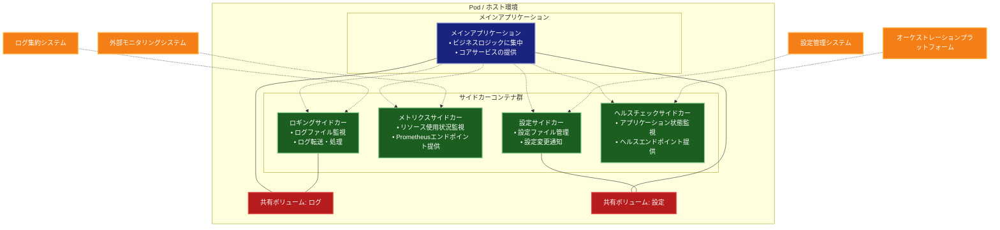

# Sidecar（サイドカー）パターン

## 目的

アプリケーションコンテナに付随する独立したコンテナを配置し、ロギング、モニタリング、プロキシ、設定更新などの補助機能を提供することで、アプリケーションの機能を拡張します。

## 価値・解決する問題

- アプリケーションとインフラストラクチャの関心事の分離
- 共通機能の標準化と再利用
- アプリケーションの可観測性の向上
- デプロイメントの柔軟性の確保
- 運用管理の効率化
- 言語やフレームワークに依存しない機能拡張

## 概要・特徴

### 概要
Sidecarパターンは、メインアプリケーションコンテナに付随する形で、補助的な機能を提供する独立したコンテナを配置するアーキテクチャパターンです。メインアプリケーションとサイドカーは同じホスト上で動作し、ストレージやネットワークなどのリソースを共有します。これにより、メインアプリケーションはビジネスロジックに集中し、横断的関心事（ロギング、モニタリング、設定管理、ヘルスチェックなど）はサイドカーに委譲できます。

### 特徴
- メインアプリケーションから横断的関心事を分離できる
- 各サイドカーは単一責任の原則に従い、特定の機能に集中できる
- 言語やフレームワークに依存せず、異なる技術スタックの組み合わせが可能
- スケーリングとデプロイがメインアプリケーションと一緒に行われる
- 開発チームは専門知識を活かして個別のサイドカーを開発・維持できる

### 概要図


## コード例

### Before:

```typescript
// アプリケーションに直接組み込まれた機能
class WebApplication {
  private readonly logger: Logger;
  private readonly metricsCollector: MetricsCollector;
  private readonly configManager: ConfigManager;
  private readonly healthChecker: HealthChecker;

  constructor() {
    // ロギング機能の初期化
    this.logger = new Logger({
      format: 'json',
      destination: '/var/log/app.log',
      rotation: {
        size: '100MB',
        keep: 5
      }
    });

    // メトリクス収集の初期化
    this.metricsCollector = new MetricsCollector({
      endpoint: 'http://monitoring-service:9090',
      interval: 10000,
      tags: {
        service: 'web-application',
        environment: process.env.NODE_ENV
      }
    });

    // 設定管理の初期化
    this.configManager = new ConfigManager({
      configServer: 'http://config-service:8888',
      refreshInterval: 30000,
      onUpdate: this.handleConfigUpdate.bind(this)
    });

    // ヘルスチェックの初期化
    this.healthChecker = new HealthChecker({
      checks: [
        this.checkDatabase.bind(this),
        this.checkCache.bind(this),
        this.checkMessageQueue.bind(this)
      ],
      interval: 5000
    });
  }

  async start() {
    try {
      // 設定の読み込み
      await this.configManager.load();

      // メトリクス収集の開始
      this.metricsCollector.start();

      // ヘルスチェックの開始
      this.healthChecker.start();

      // アプリケーションロジックの開始
      this.startServer();

      this.logger.info('Application started successfully');
    } catch (error) {
      this.logger.error('Failed to start application', error);
      process.exit(1);
    }
  }

  @Get('/api/products')
  async getProducts(req: Request, res: Response) {
    const startTime = Date.now();

    try {
      // リクエストのログ記録
      this.logger.info('Received request', {
        path: req.path,
        method: req.method,
        query: req.query
      });

      // メトリクスの記録
      this.metricsCollector.incrementCounter('api_requests_total', {
        path: '/api/products',
        method: 'GET'
      });

      // 実際の処理
      const products = await this.productService.findAll();

      // レスポンスタイムの記録
      const duration = Date.now() - startTime;
      this.metricsCollector.recordHistogram('api_request_duration_ms', duration, {
        path: '/api/products',
        method: 'GET'
      });

      return res.json(products);
    } catch (error) {
      // エラーのログ記録
      this.logger.error('Error processing request', {
        path: req.path,
        method: req.method,
        error: error.message
      });

      // エラーメトリクスの記録
      this.metricsCollector.incrementCounter('api_errors_total', {
        path: '/api/products',
        method: 'GET',
        error: error.name
      });

      throw error;
    }
  }

  private async checkDatabase(): Promise<HealthCheckResult> {
    // データベースの健全性チェック
    return this.database.ping();
  }

  private async checkCache(): Promise<HealthCheckResult> {
    // キャッシュの健全性チェック
    return this.cache.ping();
  }

  private async checkMessageQueue(): Promise<HealthCheckResult> {
    // メッセージキューの健全性チェック
    return this.messageQueue.ping();
  }

  private handleConfigUpdate(newConfig: ApplicationConfig) {
    // 設定の更新処理
    this.updateApplicationConfig(newConfig);
  }
}
```

### After:

```typescript
// シンプル化されたメインアプリケーション
class WebApplication {
  constructor(private readonly productService: ProductService) {}

  @Get('/api/products')
  async getProducts(req: Request, res: Response) {
    const products = await this.productService.findAll();
    return res.json(products);
  }
}

// Sidecarコンテナ: ロギング
class LoggingSidecar {
  private readonly logstashClient: LogstashClient;
  private readonly fileWatcher: FileWatcher;

  constructor() {
    this.logstashClient = new LogstashClient({
      host: process.env.LOGSTASH_HOST,
      port: parseInt(process.env.LOGSTASH_PORT, 10)
    });

    this.fileWatcher = new FileWatcher({
      path: '/var/log/app/*.log',
      encoding: 'utf-8'
    });
  }

  async start() {
    this.fileWatcher.on('line', async (line: string) => {
      try {
        const logEntry = JSON.parse(line);
        await this.logstashClient.send({
          ...logEntry,
          container_id: process.env.CONTAINER_ID,
          pod_name: process.env.POD_NAME,
          namespace: process.env.NAMESPACE
        });
      } catch (error) {
        console.error('Error processing log line:', error);
      }
    });

    await this.fileWatcher.start();
  }
}

// Sidecarコンテナ: メトリクス収集
class MetricsSidecar {
  private readonly promClient: PrometheusClient;
  private readonly metricsServer: MetricsServer;

  constructor() {
    this.promClient = new PrometheusClient();
    this.metricsServer = new MetricsServer({
      port: 9090
    });

    // メトリクスの定義
    this.defineMetrics();
  }

  private defineMetrics() {
    // リクエスト数
    this.promClient.newCounter({
      name: 'http_requests_total',
      help: 'Total number of HTTP requests',
      labelNames: ['method', 'path', 'status']
    });

    // レスポンスタイム
    this.promClient.newHistogram({
      name: 'http_request_duration_seconds',
      help: 'HTTP request duration in seconds',
      labelNames: ['method', 'path'],
      buckets: [0.1, 0.5, 1, 2, 5]
    });

    // メモリ使用量
    this.promClient.newGauge({
      name: 'process_memory_usage_bytes',
      help: 'Memory usage in bytes'
    });
  }

  async start() {
    // メトリクスサーバーの起動
    await this.metricsServer.start();

    // リソース使用量の定期収集
    setInterval(() => {
      const memoryUsage = process.memoryUsage();
      this.promClient.getMetric('process_memory_usage_bytes').set(memoryUsage.heapUsed);
    }, 5000);
  }
}

// Sidecarコンテナ: 設定管理
class ConfigSidecar {
  private readonly configWatcher: ConfigWatcher;
  private readonly configServer: ConfigServer;

  constructor() {
    this.configWatcher = new ConfigWatcher({
      sources: [
        {
          type: 'configmap',
          name: 'app-config'
        },
        {
          type: 'secret',
          name: 'app-secrets'
        }
      ],
      outputPath: '/config/runtime.json'
    });

    this.configServer = new ConfigServer({
      port: 3000,
      configPath: '/config/runtime.json'
    });
  }

  async start() {
    // 設定の監視開始
    this.configWatcher.on('change', async (newConfig: any) => {
      try {
        // 設定ファイルの更新
        await fs.writeFile('/config/runtime.json', JSON.stringify(newConfig, null, 2));
        
        // メインアプリケーションに通知
        await fetch('http://localhost:8080/-/reload', { method: 'POST' });
      } catch (error) {
        console.error('Error updating configuration:', error);
      }
    });

    await this.configWatcher.start();
    await this.configServer.start();
  }
}

// Sidecarコンテナ: ヘルスチェック
class HealthCheckSidecar {
  private readonly healthChecker: HealthChecker;
  private readonly healthServer: HealthServer;

  constructor() {
    this.healthChecker = new HealthChecker({
      checks: [
        {
          name: 'application',
          url: 'http://localhost:8080/-/health'
        },
        {
          name: 'database',
          url: process.env.DATABASE_HEALTH_URL
        },
        {
          name: 'cache',
          url: process.env.CACHE_HEALTH_URL
        }
      ],
      interval: 5000
    });

    this.healthServer = new HealthServer({
      port: 8081
    });
  }

  async start() {
    // ヘルスチェックの結果をサーバーで公開
    this.healthChecker.on('check', (results: HealthCheckResult[]) => {
      this.healthServer.updateStatus(results);
    });

    await this.healthChecker.start();
    await this.healthServer.start();
  }
}

// Kubernetes マニフェストの例
const deployment = {
  apiVersion: 'apps/v1',
  kind: 'Deployment',
  metadata: {
    name: 'web-application'
  },
  spec: {
    replicas: 3,
    template: {
      spec: {
        containers: [
          {
            name: 'app',
            image: 'web-application:1.0.0',
            ports: [
              { containerPort: 8080 }
            ],
            volumeMounts: [
              {
                name: 'logs',
                mountPath: '/var/log/app'
              },
              {
                name: 'config',
                mountPath: '/config'
              }
            ]
          },
          {
            name: 'logging-sidecar',
            image: 'logging-sidecar:1.0.0',
            volumeMounts: [
              {
                name: 'logs',
                mountPath: '/var/log/app'
              }
            ]
          },
          {
            name: 'metrics-sidecar',
            image: 'metrics-sidecar:1.0.0',
            ports: [
              { containerPort: 9090 }
            ]
          },
          {
            name: 'config-sidecar',
            image: 'config-sidecar:1.0.0',
            volumeMounts: [
              {
                name: 'config',
                mountPath: '/config'
              }
            ]
          },
          {
            name: 'health-sidecar',
            image: 'health-sidecar:1.0.0',
            ports: [
              { containerPort: 8081 }
            ]
          }
        ],
        volumes: [
          {
            name: 'logs',
            emptyDir: {}
          },
          {
            name: 'config',
            emptyDir: {}
          }
        ]
      }
    }
  }
};
```

## 類似パターンとの比較

- [Ambassador（アンバサダー）](ambassador.md): Sidecarは補助的な機能を提供し、Ambassadorはリモートサービスへのアクセスを抽象化します。
- [Gateway Offloading（ゲートウェイオフローディング）](gateway-offloading.md): Sidecarはアプリケーションレベルで機能を提供し、Gateway Offloadingはシステム全体で共通機能を提供します。
- [Adapter（アダプター）](adapter.md): Sidecarは機能を追加し、Adapterは既存のインターフェースを変換します。

## 利用されているライブラリ／フレームワークの事例

- [Istio](https://github.com/istio/istio): サービスメッシュの実装でSidecarパターンを活用
- [Linkerd](https://github.com/linkerd/linkerd2): プロキシSidecarを使用したサービスメッシュ
- [Envoy](https://github.com/envoyproxy/envoy): Sidecarプロキシとして広く使用されている

## 解説ページリンク

- [Microsoft - Sidecar pattern](https://learn.microsoft.com/ja-jp/azure/architecture/patterns/sidecar)  
  - クラウドアプリケーションにおけるSidecarパターンの実装方法と、具体的なユースケースを詳しく解説しています。

- [Kubernetes - Sidecar Containers](https://kubernetes.io/docs/concepts/workloads/pods/sidecar-containers/)  
  - Kubernetesにおけるサイドカーコンテナの実装方法と、実践的な使用例を提供しています。

- [Istio - Sidecar Injection](https://istio.io/latest/docs/setup/additional-setup/sidecar-injection/)  
  - サービスメッシュにおけるサイドカーパターンの実装と、Istioを使用した具体的な設定例を解説しています。

- [HashiCorp - Consul Connect Sidecar](https://www.consul.io/docs/connect/proxies/sidecar-service)  
  - Consulを使用したサービスメッシュでのサイドカー実装と、実践的な活用例を提供しています。 