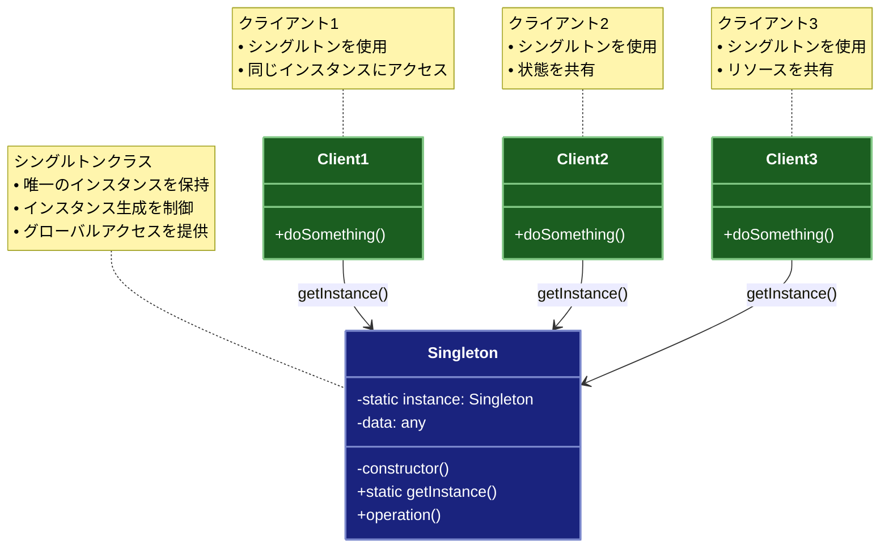

# Singleton（シングルトン）パターン

## 目的

クラスのインスタンスが1つだけ存在することを保証し、そのインスタンスへのグローバルなアクセスポイントを提供するパターンです。

## 価値・解決する問題

- インスタンスの一意性を保証します
- グローバルな状態管理を提供します
- リソースの共有を効率化します
- メモリ使用量を最適化します
- 競合状態を防ぎます

## 概要・特徴

### 概要

Singletonパターンは、クラスのインスタンスが1つだけ存在することを保証し、そのインスタンスへのグローバルなアクセスポイントを提供する設計パターンです。このパターンを使用することで、システム全体で共有される重要なリソースやサービスの一元管理が可能になり、冗長性を排除しつつ一貫性のある状態管理を実現します。特にデータベース接続、ログ記録、設定管理などの一元化が必要なケースで有効です。

Singletonパターンは、GOF（Gang of Four）デザインパターンの中でも特に広く使用され、多くのフレームワークやライブラリで基盤技術として採用されています。その単純さと実用性から、多くの開発者にとって最初に学ぶデザインパターンの一つとなっていますが、グローバル状態の管理という性質上、適切に使用しないと保守性やテスト容易性に影響を与える可能性もあります。

### 特徴

#### インスタンスの一意性

クラスのインスタンスが1つだけ存在することを保証します。これにより、複数のコンポーネントが同じインスタンスを共有し、一貫した状態を維持できます。例えば、アプリケーション全体で一貫した設定情報を使用したり、リソースの重複生成を防いだりすることができます。実装では通常、コンストラクタを私有化し、インスタンス生成を制御する静的メソッドを提供します。

具体的な実装例としては、次のようなものがあります：

- コンストラクタに`private`修飾子を使用して外部からのインスタンス化を防ぐ
- 静的な`getInstance()`メソッドを公開してインスタンス取得の制御点を提供する
- 静的な内部変数にインスタンスへの参照を保持する

#### 遅延初期化

インスタンスは必要になった時点で初めて生成される「遅延初期化（Lazy Initialization）」が可能です。これにより、初期化コストの高いオブジェクトの生成を遅らせ、アプリケーションの起動時間を短縮したり、リソース使用効率を向上させたりできます。必要なタイミングまで初期化を遅らせることで、使用されないときはメモリを消費しないという利点もあります。

遅延初期化には主に次の二つのアプローチがあります：

1. **遅延評価型**: 最初の`getInstance()`呼び出し時にインスタンスを作成する方法
2. **オンデマンド型**: アクセスされるメソッドごとにインスタンスの有無を確認し、必要に応じて作成する方法

また、パフォーマンスクリティカルなアプリケーションでは、起動時にインスタンスを事前初期化する「早期初期化（Eager Initialization）」アプローチも有効です。

#### グローバルアクセス

クラスの唯一のインスタンスに対して、アプリケーション全体からアクセスできるグローバルな入口を提供します。これにより、システムのどの部分からでも簡単にインスタンスにアクセスでき、共有機能やサービスを利用できます。また、引数として依存関係を渡す必要がなくなり、コードが簡潔になる利点があります。

グローバルアクセスの提供方法には、次のようなバリエーションがあります：

- 静的メソッド経由でのアクセス（典型的な実装）
- ファクトリを通じたアクセス（より柔軟性が高い）
- 依存性注入コンテナを通じたアクセス（テスト容易性を向上）

#### スレッドセーフティ

マルチスレッド環境での安全性を確保するための仕組みが必要です。複数のスレッドが同時に唯一のインスタンスを生成しようとした場合に、一つのインスタンスだけが生成されるよう保証する必要があります。これにはダブルチェックロック、静的初期化子、同期化ブロックなど、言語やプラットフォームに応じた様々な方法があります。

主要なスレッドセーフ実装方法には以下があります：

- **synchronized/lock ブロック**: インスタンス生成の臨界区間を保護する基本的なアプローチ
- **ダブルチェックロッキング**: 性能を向上させるため、インスタンスの存在確認を同期化の前に行う手法
- **静的初期化子**: クラスのロード時にインスタンスを作成し、JVMなどの言語ランタイムの特性を活用してスレッドセーフティを確保する方法
- **Holder クラスパターン**: 内部静的クラスを使用した遅延初期化とスレッドセーフティの両立
- **アトミック操作**: 最新のプログラミング言語で提供されるアトミック変数やCAS操作を利用する方法

#### 状態の共有

システム全体で共有される状態やデータを管理するのに適しています。例えば、アプリケーション設定、キャッシュ、コネクションプールなど、一元管理が必要な機能に利用されます。この共有性により、データの整合性が保たれ、メモリ使用量が最適化されますが、状態管理の複雑さやテスト難易度の増加といった課題も生じる可能性があります。

一般的なユースケースには以下があります：

- **設定管理**: アプリケーション全体で一貫した設定情報の提供
- **リソース管理**: データベース接続、ファイルハンドル、ネットワークソケットなどの限られたリソースの管理
- **キャッシュ**: 計算コストの高い結果や外部データへのアクセス結果のキャッシュ
- **ログ記録**: 集中型のログ記録メカニズムの提供
- **イベント統制**: イベント発行・購読システムの中央管理

#### 使用時の注意点

Singletonパターンは強力ですが、不適切に使用すると以下の問題を引き起こす可能性があります：

- **結合度の増加**: コンポーネント間の強い結合を生み出し、モジュール性を低下させる
- **テスト難易度の上昇**: テスト時にモックやスタブへの置き換えが困難になる
- **並行処理の複雑化**: 共有状態が存在することで並行処理やマルチスレッド環境での動作が複雑になる
- **責任の集中**: 単一のクラスに多くの責任が集中し、単一責任の原則に違反するリスク
- **状態管理の煩雑さ**: グローバル状態の変更がアプリケーション全体に影響するため、状態変更の追跡が難しくなる

これらの問題を緩和するためには、以下のベストプラクティスを考慮することが重要です：

- 依存性注入を活用して結合度を低減する
- インターフェースを用いて実装を抽象化し、テスト容易性を向上させる
- Singletonの責任を明確に分離し、単一責任の原則を遵守する
- 不変オブジェクトを活用して状態変更に関連する問題を最小化する
- 状態変更のイベントモデルを導入して変更の追跡と監視を容易にする

### 概要図



## 類似パターンとの比較

- [Registry (レジストリ)](registry.md): Singleton は単一のインスタンスを管理し、これに対して Registry は複数の値を管理します。
- [Multiton (マルチトン)](multiton.md): Singleton は単一のインスタンスを管理し、これに対して Multiton は複数のキーに対応するインスタンスを管理します。
- [Service Locator (サービスロケーター)](service-locator.md): Singleton はインスタンスの一意性を保証し、これに対して Service Locator はサービスの動的な解決を提供します。

## 利用されているライブラリ／フレームワークの事例

- [Angular Services](https://angular.io/guide/singleton-services): Angularのサービス
- [Java Runtime](https://docs.oracle.com/javase/8/docs/api/java/lang/Runtime.html): Javaのランタイム
- [Logger](https://docs.python.org/3/library/logging.html): Pythonのロガー

## 解説ページリンク

- [Refactoring Guru - Singleton](https://refactoring.guru/design-patterns/singleton)
- [Microsoft - Singleton Pattern](https://docs.microsoft.com/en-us/previous-versions/msp-n-p/ff650316(v=pandp.10))
- [SourceMaking - Singleton](https://sourcemaking.com/design_patterns/singleton)

## コード例

### Before:

通常のクラスの実装

```typescript
// データベース接続クラス
class Database {
  private connection: string;

  constructor() {
    // 重い処理（データベース接続の確立）
    this.connection = "db://" + Math.random();
    console.log(`新しい接続を確立: ${this.connection}`);
  }

  query(sql: string): void {
    console.log(`[${this.connection}] クエリ実行: ${sql}`);
  }
}

// 使用例
function example() {
  // 複数のインスタンスが作成される
  const db1 = new Database();
  const db2 = new Database();
  const db3 = new Database();

  db1.query("SELECT * FROM users");
  db2.query("SELECT * FROM products");
  db3.query("SELECT * FROM orders");
}

example();
```

### After:

Singletonパターンを適用した実装

```typescript
// スレッドセーフなSingletonの実装
class Database {
  private static instance: Database | null = null;
  private static instanceLock = false;
  private connection: string;
  private connectionTime: Date;
  private queryCount: number = 0;

  private constructor() {
    // プライベートコンストラクタ
    this.connection = "db://" + Math.random();
    this.connectionTime = new Date();
    console.log(`データベース接続を確立: ${this.connection}`);
  }

  // インスタンス取得メソッド（スレッドセーフ）
  static getInstance(): Database {
    // Double-checked locking pattern
    if (!Database.instance) {
      // クリティカルセクションの開始
      if (!Database.instanceLock) {
        Database.instanceLock = true;
        try {
          Database.instance = new Database();
        } finally {
          Database.instanceLock = false;
        }
      } else {
        // 他のスレッドが初期化中の場合は待機
        while (Database.instanceLock) {
          // スピンロック（実際の実装では適切な待機メカニズムを使用）
        }
        // インスタンスが作成されているか再確認
        if (!Database.instance) {
          throw new Error("データベースの初期化に失敗しました");
        }
      }
    }
    return Database.instance;
  }

  // クエリ実行メソッド
  query(sql: string): void {
    this.queryCount++;
    console.log(`[${this.connection}] クエリ実行: ${sql}`);
    console.log(`実行クエリ数: ${this.queryCount}`);
  }

  // 接続情報の取得
  getConnectionInfo(): { connection: string; uptime: number; queryCount: number } {
    const uptime = Math.floor(
      (new Date().getTime() - this.connectionTime.getTime()) / 1000
    );
    return {
      connection: this.connection,
      uptime,
      queryCount: this.queryCount
    };
  }

  // 接続のリセット（テスト用）
  static reset(): void {
    Database.instance = null;
    Database.instanceLock = false;
  }
}

// トランザクション管理クラス
class TransactionManager {
  private db: Database;

  constructor() {
    this.db = Database.getInstance();
  }

  beginTransaction(): void {
    this.db.query("BEGIN TRANSACTION");
  }

  commit(): void {
    this.db.query("COMMIT");
  }

  rollback(): void {
    this.db.query("ROLLBACK");
  }
}

// ユーザー管理クラス
class UserManager {
  private db: Database;

  constructor() {
    this.db = Database.getInstance();
  }

  createUser(username: string): void {
    this.db.query(`INSERT INTO users (username) VALUES ('${username}')`);
  }

  getUser(id: number): void {
    this.db.query(`SELECT * FROM users WHERE id = ${id}`);
  }
}

// 使用例
function example() {
  console.log("=== Singletonパターンのデモ ===\n");

  // 複数の箇所でデータベースインスタンスを取得
  console.log("1. 複数のインスタンス取得");
  const db1 = Database.getInstance();
  const db2 = Database.getInstance();
  const db3 = Database.getInstance();

  // 同じインスタンスであることを確認
  console.log("\n2. インスタンスの同一性確認");
  console.log("db1 === db2:", db1 === db2);
  console.log("db2 === db3:", db2 === db3);

  // 異なるマネージャーでの使用
  console.log("\n3. 異なるマネージャーでの使用");
  const transactionManager = new TransactionManager();
  const userManager = new UserManager();

  // トランザクション内でのユーザー作成
  console.log("\n4. トランザクション内でのユーザー作成");
  transactionManager.beginTransaction();
  try {
    userManager.createUser("Alice");
    userManager.createUser("Bob");
    transactionManager.commit();
  } catch (error) {
    transactionManager.rollback();
    console.error("エラーが発生したためロールバック:", error);
  }

  // 接続情報の確認
  console.log("\n5. データベース接続情報");
  console.log(Database.getInstance().getConnectionInfo());

  // テスト用にリセット
  console.log("\n6. インスタンスのリセット");
  Database.reset();
  const newDb = Database.getInstance();
  console.log("新しい接続情報:", newDb.getConnectionInfo());
}

// 実行
example();
```

### 関数型プログラミングスタイルでのSingleton実装:

```typescript
// 関数型プログラミングアプローチでのSingletonパターン

// モジュールスコープでの状態保持
// 即時実行関数式（IIFE）を使用してクロージャを作成
const DatabaseModule = (() => {
  // プライベート状態
  type DatabaseState = Readonly<{
    connection: string
    connectionTime: Date
    queryCount: number
  }>

  // 単一のインスタンス状態
  let state: DatabaseState | null = null

  // リセット用フラグ（テスト用）
  let resetFlag = false

  // 初期化関数（遅延初期化を実装）
  const initialize = (): DatabaseState => {
    if (resetFlag) {
      resetFlag = false
      state = null
    }

    if (state === null) {
      // 新しい接続の作成（重い処理）
      const connection = 'db://' + Math.random()
      console.log(`データベース接続を確立: ${connection}`)
      
      // イミュータブルな状態の作成
      state = Object.freeze({
        connection,
        connectionTime: new Date(),
        queryCount: 0
      })
    }
    
    return state
  }

  // クエリ実行関数
  const query = (sql: string): void => {
    // 状態の確認と初期化
    const currentState = initialize()
    
    // イミュータブルな状態の更新
    state = Object.freeze({
      ...currentState,
      queryCount: currentState.queryCount + 1
    })
    
    console.log(`[${currentState.connection}] クエリ実行: ${sql}`)
    console.log(`実行クエリ数: ${state.queryCount}`)
  }

  // 接続情報取得関数
  const getConnectionInfo = (): Readonly<{
    connection: string
    uptime: number
    queryCount: number
  }> => {
    const currentState = initialize()
    const uptime = Math.floor(
      (new Date().getTime() - currentState.connectionTime.getTime()) / 1000
    )
    
    return {
      connection: currentState.connection,
      uptime,
      queryCount: currentState.queryCount
    }
  }

  // リセット関数（テスト用）
  const reset = (): void => {
    resetFlag = true
    console.log('データベース接続をリセット')
  }

  // パブリックAPI
  return Object.freeze({
    query,
    getConnectionInfo,
    reset
  })
})()

// トランザクション管理機能
const TransactionModule = (() => {
  // トランザクション開始
  const beginTransaction = (): void => {
    DatabaseModule.query('BEGIN TRANSACTION')
  }

  // コミット
  const commit = (): void => {
    DatabaseModule.query('COMMIT')
  }

  // ロールバック
  const rollback = (): void => {
    DatabaseModule.query('ROLLBACK')
  }

  // パブリックAPI
  return Object.freeze({
    beginTransaction,
    commit,
    rollback
  })
})()

// ユーザー管理機能
const UserModule = (() => {
  // ユーザー作成
  const createUser = (username: string): void => {
    DatabaseModule.query(`INSERT INTO users (username) VALUES ('${username}')`)
  }

  // ユーザー取得
  const getUser = (id: number): void => {
    DatabaseModule.query(`SELECT * FROM users WHERE id = ${id}`)
  }

  // パブリックAPI
  return Object.freeze({
    createUser,
    getUser
  })
})()

// Node.js環境での別の実装例（CommonJS）
// 注: このアプローチは特にNode.js環境で有効
/*
// database.js
let instance = null

const createDatabaseInstance = () => {
  // 初期化済みの場合は既存のインスタンスを返す
  if (instance) return instance
  
  // 新しいインスタンスの作成
  const connection = 'db://' + Math.random()
  console.log(`データベース接続を確立: ${connection}`)
  
  instance = {
    query: (sql) => {
      console.log(`[${connection}] クエリ実行: ${sql}`)
    }
  }
  
  return instance
}

module.exports = { createDatabaseInstance }
*/

// ES Modulesでの実装例
/*
// database.js
let instance = null

export const createDatabaseInstance = () => {
  if (instance) return instance
  
  instance = {
    // データベース実装
  }
  
  return instance
}

// シングルインスタンスを直接エクスポート
const db = createDatabaseInstance()
export default db
*/

// 高度な関数型シングルトンの実装: Reader Monad風アプローチ
type DatabaseReader<T> = (db: Readonly<typeof DatabaseModule>) => T

// 依存性注入スタイルの関数合成
const withDatabase = <T>(reader: DatabaseReader<T>): T => reader(DatabaseModule)

// 使用例
const functionalExample = (): void => {
  console.log('\n=== 関数型プログラミングスタイルでのSingletonパターン ===\n')

  console.log('1. モジュール経由でのアクセス')
  // 共有状態へのアクセス
  DatabaseModule.query('SELECT * FROM products')
  DatabaseModule.query('SELECT * FROM categories')
  
  console.log('\n2. トランザクション管理の使用')
  TransactionModule.beginTransaction()
  try {
    UserModule.createUser('Carol')
    UserModule.createUser('Dave')
    TransactionModule.commit()
  } catch (error) {
    TransactionModule.rollback()
    console.error('エラーが発生したためロールバック:', error)
  }
  
  console.log('\n3. 接続情報の確認')
  console.log(DatabaseModule.getConnectionInfo())
  
  console.log('\n4. 高度な関数型アプローチの使用')
  // Reader風のパターンを使用して依存性を明示的に扱う
  const createUserFlow = (username: string): DatabaseReader<void> => 
    (db) => {
      console.log(`${username}のアカウント作成を開始...`)
      db.query(`INSERT INTO users (username) VALUES ('${username}')`)
      console.log(`${username}のアカウント作成が完了しました`)
    }
  
  // 実行
  withDatabase(createUserFlow('Eve'))
  
  // 複数の操作を合成
  const complexOperation = (username: string): DatabaseReader<void> =>
    (db) => {
      console.log('複合操作を開始...')
      db.query('BEGIN TRANSACTION')
      db.query(`INSERT INTO users (username) VALUES ('${username}')`)
      db.query(`INSERT INTO user_roles (username, role) VALUES ('${username}', 'user')`)
      db.query('COMMIT')
      console.log('複合操作が完了しました')
    }
  
  withDatabase(complexOperation('Frank'))
  
  console.log('\n5. インスタンスのリセット')
  DatabaseModule.reset()
  console.log('新しい接続情報:', DatabaseModule.getConnectionInfo())
}

// 実行
functionalExample()
```
