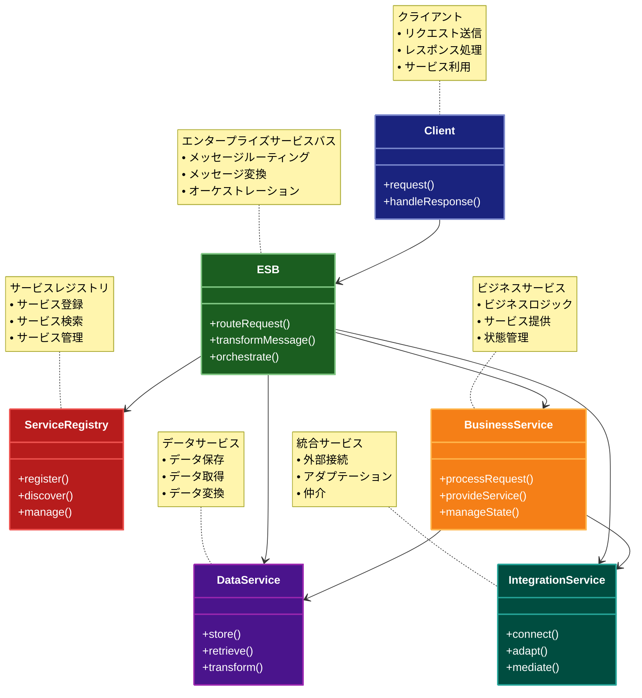

# Service-Oriented Architecture（サービス指向アーキテクチャ）

## 目的

ビジネス機能を再利用可能なサービスとして提供し、標準化されたインターフェースを通じて他のアプリケーションから利用できるようにすることで、システム間の相互運用性と再利用性を向上させます。

## 価値・解決する問題

- ビジネス機能の再利用性向上
- システム間の相互運用性確保
- 標準化されたインターフェースによる統合の容易性
- ビジネスと技術の整合性向上
- レガシーシステムの段階的な刷新
- 大規模システムの管理容易性向上

## コード例

### Before:

```typescript
// 個別のシステムごとに実装された重複したビジネスロジック
// 会計システム
class AccountingSystem {
  async processInvoice(invoice: Invoice) {
    // 請求書の検証
    if (!this.validateInvoice(invoice)) {
      throw new Error("Invalid invoice");
    }

    // 顧客情報の取得（会計システム内のローカルDB）
    const customer = await this.database.customers.findOne({
      id: invoice.customerId,
    });

    // 支払い処理
    const payment = await this.processPayment({
      amount: invoice.amount,
      customerId: customer.id,
      paymentMethod: customer.preferredPaymentMethod,
    });

    // 会計記録の更新
    await this.database.transactions.insert({
      type: "PAYMENT",
      amount: invoice.amount,
      customerId: customer.id,
      date: new Date(),
    });
  }
}

// CRMシステム
class CRMSystem {
  async updateCustomerInfo(customerId: string, info: CustomerInfo) {
    // 顧客情報の更新（CRMシステム内のローカルDB）
    await this.database.customers.update({id: customerId}, {$set: info});

    // 支払い設定の更新（重複した実装）
    if (info.paymentMethod) {
      await this.database.paymentSettings.update(
        {customerId},
        {$set: {preferredMethod: info.paymentMethod}}
      );
    }
  }
}

// 在庫管理システム
class InventorySystem {
  async processOrder(order: Order) {
    // 在庫チェック
    const stockAvailable = await this.checkStock(order.items);
    if (!stockAvailable) {
      throw new Error("Insufficient stock");
    }

    // 顧客情報の取得（在庫システム内のローカルDB）
    const customer = await this.database.customers.findOne({
      id: order.customerId,
    });

    // 配送情報の作成
    const shipment = await this.createShipment({
      items: order.items,
      address: customer.shippingAddress,
    });
  }
}
```

### After:

```typescript
// サービスインターフェース定義
interface CustomerService {
  getCustomer(id: string): Promise<Customer>;
  updateCustomer(id: string, info: CustomerInfo): Promise<Customer>;
  validateCustomer(customer: Customer): Promise<ValidationResult>;
}

interface PaymentService {
  processPayment(payment: PaymentRequest): Promise<PaymentResult>;
  getPaymentMethods(customerId: string): Promise<PaymentMethod[]>;
  updatePaymentSettings(
    customerId: string,
    settings: PaymentSettings
  ): Promise<void>;
}

interface InventoryService {
  checkStock(items: OrderItem[]): Promise<StockAvailability>;
  reserveStock(items: OrderItem[]): Promise<ReservationResult>;
  releaseStock(reservationId: string): Promise<void>;
}

// ESBを介したサービス間通信
class EnterpriseServiceBus {
  private readonly serviceRegistry: Map<string, ServiceEndpoint>;

  constructor() {
    this.serviceRegistry = new Map();
  }

  registerService(serviceName: string, endpoint: ServiceEndpoint): void {
    this.serviceRegistry.set(serviceName, endpoint);
  }

  async routeRequest(
    serviceName: string,
    operation: string,
    payload: any
  ): Promise<any> {
    const endpoint = this.serviceRegistry.get(serviceName);
    if (!endpoint) {
      throw new Error(`Service ${serviceName} not found`);
    }

    // メッセージ変換
    const transformedPayload = this.transformMessage(payload, endpoint.format);

    // サービス呼び出し
    const response = await endpoint.invoke(operation, transformedPayload);

    // レスポンス変換
    return this.transformMessage(response, "canonical");
  }

  private transformMessage(message: any, targetFormat: string): any {
    // メッセージ形式の変換ロジック
    return message; // 簡略化のため、変換処理は省略
  }
}

// サービス実装
class CustomerServiceImpl implements CustomerService {
  constructor(private database: Database) {}

  async getCustomer(id: string): Promise<Customer> {
    const customer = await this.database.customers.findOne({id});
    if (!customer) {
      throw new ServiceException("Customer not found", "CUSTOMER_NOT_FOUND");
    }
    return customer;
  }

  async updateCustomer(id: string, info: CustomerInfo): Promise<Customer> {
    // 更新前の検証
    await this.validateCustomer({id, ...info});

    // 顧客情報の更新
    const updated = await this.database.customers.update({id}, {$set: info});

    // イベント発行
    await this.publishEvent("CustomerUpdated", {
      customerId: id,
      changes: info,
      timestamp: new Date(),
    });

    return updated;
  }

  async validateCustomer(customer: Customer): Promise<ValidationResult> {
    // 顧客データの検証ロジック
    const validationRules = await this.loadValidationRules();
    return this.validateAgainstRules(customer, validationRules);
  }
}

// サービスファサード
class AccountingSystemFacade {
  constructor(private esb: EnterpriseServiceBus, private localCache: Cache) {}

  async processInvoice(invoice: Invoice): Promise<void> {
    // 顧客情報の取得（キャッシュ付き）
    const customer = await this.getCachedCustomer(invoice.customerId);

    // 支払い処理
    const paymentResult = await this.esb.routeRequest(
      "PaymentService",
      "processPayment",
      {
        amount: invoice.amount,
        customerId: customer.id,
        paymentMethod: customer.preferredPaymentMethod,
      }
    );

    // 会計記録の更新
    await this.recordTransaction({
      type: "PAYMENT",
      amount: invoice.amount,
      customerId: customer.id,
      paymentId: paymentResult.id,
      date: new Date(),
    });
  }

  private async getCachedCustomer(customerId: string): Promise<Customer> {
    const cached = await this.localCache.get(`customer:${customerId}`);
    if (cached) return cached;

    const customer = await this.esb.routeRequest(
      "CustomerService",
      "getCustomer",
      customerId
    );
    await this.localCache.set(
      `customer:${customerId}`,
      customer,
      {ttl: 300} // 5分間キャッシュ
    );
    return customer;
  }
}

// サービスオーケストレーション
class OrderProcessingOrchestrator {
  constructor(private esb: EnterpriseServiceBus) {}

  async processOrder(order: Order): Promise<OrderResult> {
    try {
      // 1. 顧客の検証
      const customer = await this.esb.routeRequest(
        "CustomerService",
        "getCustomer",
        order.customerId
      );
      const validationResult = await this.esb.routeRequest(
        "CustomerService",
        "validateCustomer",
        customer
      );
      if (!validationResult.valid) {
        throw new Error("Customer validation failed");
      }

      // 2. 在庫の確認と予約
      const stockResult = await this.esb.routeRequest(
        "InventoryService",
        "checkStock",
        order.items
      );
      if (!stockResult.available) {
        throw new Error("Insufficient stock");
      }
      const reservation = await this.esb.routeRequest(
        "InventoryService",
        "reserveStock",
        order.items
      );

      try {
        // 3. 支払い処理
        const paymentResult = await this.esb.routeRequest(
          "PaymentService",
          "processPayment",
          {
            amount: order.totalAmount,
            customerId: customer.id,
            orderId: order.id,
          }
        );

        if (paymentResult.status === "succeeded") {
          // 4. 配送手配
          const shipment = await this.esb.routeRequest(
            "ShippingService",
            "arrangeShipment",
            {
              orderId: order.id,
              items: order.items,
              address: customer.shippingAddress,
            }
          );

          return {
            status: "success",
            orderId: order.id,
            shipmentId: shipment.id,
            paymentId: paymentResult.id,
          };
        } else {
          throw new Error("Payment failed");
        }
      } catch (error) {
        // 補償トランザクション：在庫予約の解放
        await this.esb.routeRequest(
          "InventoryService",
          "releaseStock",
          reservation.id
        );
        throw error;
      }
    } catch (error) {
      return {
        status: "failed",
        orderId: order.id,
        reason: error.message,
      };
    }
  }
}

### 概要図



## 類似パターンとの比較

- [Microservices Architecture（マイクロサービスアーキテクチャ）](microservices.md): SOA は大きめのサービス単位と中央集権的な制御を特徴とし、Microservices はより小さく独立したサービスを推奨します。
- [Event-Driven Architecture（イベント駆動アーキテクチャ）](event-driven-architecture.md): SOA はサービス間の直接的な通信を基本とし、Event-Driven Architecture はイベントを介した疎結合な通信を重視します。
- [Layered Architecture（レイヤードアーキテクチャ）](layered-architecture.md): SOA はサービス単位での分割を重視し、Layered Architecture は機能の階層による分割を重視します。

## 利用されているライブラリ／フレームワークの事例

- [Apache CXF](https://github.com/apache/cxf): Web サービスフレームワークとしてサービス指向アーキテクチャを実現
- [Spring Web Services](https://github.com/spring-projects/spring-ws): SOAP ベースの Web サービス開発を支援
- [WSO2 Enterprise Service Bus](https://github.com/wso2/product-ei): エンタープライズサービスバスとしてサービス間の通信を制御
