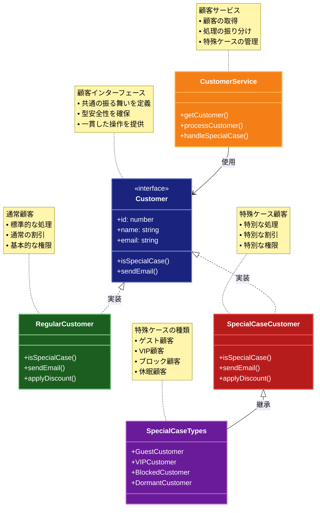

# Special Case（特殊ケース）パターン

## 目的

特殊なケースや例外的な状況を専用のオブジェクトとして扱うことで、コードの安全性と可読性を向上させるパターンです。

## 価値・解決する問題

- 特殊ケースの明確な表現
- エラー処理の簡略化
- コードの安全性向上
- 条件分岐の削減
- ビジネスロジックの明確化

## 概要・特徴

### 概要

Special Caseパターンは、特殊なケースや例外的な状況を専用のオブジェクトとして表現することで、それらの処理を一貫した方法で扱えるようにするパターンです。

### 特徴

- 特殊ケースの明確化
- エラー処理の統一
- 型安全性
- コード簡略化
- ビジネスルールの表現

### 概要図



## 類似パターンとの比較

- [Null Object (ヌルオブジェクト)](null-object.md): Special Case は特殊なケースの処理を提供し、これに対して Null Object はデフォルトの振る舞いを提供します。
- [Optional (オプショナル)](optional.md): Special Case は特殊なケースを扱い、これに対して Optional は値の存在を明示的に扱います。
- [Maybe (メイビー)](maybe.md): Special Case は特殊なケースを扱い、これに対して Maybe は値の不確実性を扱います。

## 利用されているライブラリ／フレームワークの事例

- [Spring Framework](https://spring.io/): 特殊ケースの実装例
- [Java Collections](https://docs.oracle.com/javase/8/docs/api/java/util/Collections.html): 特殊なコレクション実装
- [TypeScript Optional Chaining](https://www.typescriptlang.org/docs/handbook/release-notes/typescript-3-7.html): 特殊ケースの処理

## 解説ページリンク

- [Martin Fowler - Special Case Pattern](https://martinfowler.com/eaaCatalog/specialCase.html)
- [Refactoring Guru - Special Case Pattern](https://refactoring.guru/design-patterns/special-case)
- [DZone - Special Case Pattern](https://dzone.com/articles/design-patterns-special-case)

## コード例

### Before:

Special Caseパターンなしの実装

```typescript
interface Customer {
  id: number;
  name: string;
  email: string;
  plan: string;
}

class CustomerService {
  getCustomer(id: number): Customer | null {
    // データベースからの顧客取得を想定
    return null;
  }

  getPlan(customer: Customer | null): string {
    if (!customer) return "free";
    return customer.plan;
  }

  sendEmail(customer: Customer | null, message: string): void {
    if (!customer) return;
    console.log(`Sending email to ${customer.email}: ${message}`);
  }
}
```

### After:

Special Caseパターンを適用した実装

```typescript
// 基本的なインターフェース定義
interface Customer {
  id: number;
  name: string;
  email: string;
  plan: string;
  isSpecialCase(): boolean;
  sendEmail(message: string): void;
  applyDiscount(amount: number): number;
  canAccess(feature: string): boolean;
}

// 通常の顧客の実装
class RegularCustomer implements Customer {
  constructor(
    public readonly id: number,
    public readonly name: string,
    public readonly email: string,
    public readonly plan: string
  ) {}

  isSpecialCase(): boolean {
    return false;
  }

  sendEmail(message: string): void {
    console.log(`Sending email to ${this.email}: ${message}`);
  }

  applyDiscount(amount: number): number {
    // 通常の割引ロジック
    const discountRate = this.plan === "premium" ? 0.2 : 0.1;
    return amount * (1 - discountRate);
  }

  canAccess(feature: string): boolean {
    switch (this.plan) {
      case "premium":
        return true;
      case "basic":
        return ["chat", "support", "basic-features"].includes(feature);
      default:
        return ["basic-features"].includes(feature);
    }
  }
}

// ゲスト顧客の特殊ケース
class GuestCustomer implements Customer {
  readonly id: number = 0;
  readonly name: string = "Guest";
  readonly email: string = "guest@example.com";
  readonly plan: string = "free";

  isSpecialCase(): boolean {
    return true;
  }

  sendEmail(message: string): void {
    // ゲストにはメールを送信しない
    console.log("Skipping email for guest customer");
  }

  applyDiscount(amount: number): number {
    // ゲストには割引を適用しない
    return amount;
  }

  canAccess(feature: string): boolean {
    // ゲストは基本機能のみアクセス可能
    return ["basic-features"].includes(feature);
  }
}

// VIP顧客の特殊ケース
class VIPCustomer implements Customer {
  constructor(
    public readonly id: number,
    public readonly name: string,
    public readonly email: string,
    public readonly plan: string = "vip"
  ) {}

  isSpecialCase(): boolean {
    return true;
  }

  sendEmail(message: string): void {
    console.log(`Sending priority email to VIP ${this.email}: ${message}`);
    // VIP専用のフォローアップ
    console.log(`Scheduling VIP follow-up for ${this.name}`);
  }

  applyDiscount(amount: number): number {
    // VIP向けの特別割引
    return amount * 0.5;
  }

  canAccess(feature: string): boolean {
    // VIPは全ての機能にアクセス可能
    return true;
  }
}

// ブロックされた顧客の特殊ケース
class BlockedCustomer implements Customer {
  constructor(
    public readonly id: number,
    public readonly name: string,
    public readonly email: string,
    public readonly plan: string,
    private readonly reason: string
  ) {}

  isSpecialCase(): boolean {
    return true;
  }

  sendEmail(message: string): void {
    console.log(`Customer ${this.email} is blocked. Cannot send email.`);
    console.log(`Reason: ${this.reason}`);
  }

  applyDiscount(amount: number): number {
    // ブロックされた顧客には割引を適用しない
    return amount;
  }

  canAccess(feature: string): boolean {
    // ブロックされた顧客はアクセス不可
    return false;
  }
}

// 休眠顧客の特殊ケース
class DormantCustomer implements Customer {
  constructor(
    public readonly id: number,
    public readonly name: string,
    public readonly email: string,
    public readonly plan: string,
    private readonly lastActiveDate: Date
  ) {}

  isSpecialCase(): boolean {
    return true;
  }

  sendEmail(message: string): void {
    console.log(`Sending re-engagement email to ${this.email}: ${message}`);
    console.log(`Last active: ${this.lastActiveDate}`);
  }

  applyDiscount(amount: number): number {
    // 休眠顧客向けの特別割引
    return amount * 0.7;
  }

  canAccess(feature: string): boolean {
    // 休眠顧客は基本機能のみアクセス可能
    return ["basic-features"].includes(feature);
  }
}

// 顧客サービスの実装
class CustomerService {
  private customers: Map<number, Customer> = new Map();

  constructor() {
    // サンプルデータの初期化
    this.customers.set(1, new RegularCustomer(1, "Alice", "alice@example.com", "premium"));
    this.customers.set(2, new VIPCustomer(2, "Bob", "bob@example.com"));
    this.customers.set(3, new BlockedCustomer(3, "Charlie", "charlie@example.com", "basic", "Payment overdue"));
    this.customers.set(4, new DormantCustomer(4, "David", "david@example.com", "basic", new Date("2023-01-01")));
  }

  getCustomer(id: number): Customer {
    return this.customers.get(id) || new GuestCustomer();
  }

  processOrder(customerId: number, amount: number): void {
    const customer = this.getCustomer(customerId);
    const finalAmount = customer.applyDiscount(amount);
    
    console.log(`Processing order for ${customer.name}`);
    console.log(`Original amount: ${amount}`);
    console.log(`Final amount after discount: ${finalAmount}`);
    
    customer.sendEmail(`Your order of ${finalAmount} has been processed.`);
  }

  checkAccess(customerId: number, feature: string): boolean {
    const customer = this.getCustomer(customerId);
    return customer.canAccess(feature);
  }
}

// 使用例
async function example() {
  const service = new CustomerService();

  console.log("=== Special Caseパターンの使用例 ===");

  // 1. 通常の顧客
  console.log("\n1. 通常の顧客の処理");
  service.processOrder(1, 1000);
  console.log("Premium features access:", service.checkAccess(1, "premium-features"));

  // 2. VIP顧客
  console.log("\n2. VIP顧客の処理");
  service.processOrder(2, 1000);
  console.log("Premium features access:", service.checkAccess(2, "premium-features"));

  // 3. ブロックされた顧客
  console.log("\n3. ブロックされた顧客の処理");
  service.processOrder(3, 1000);
  console.log("Basic features access:", service.checkAccess(3, "basic-features"));

  // 4. 休眠顧客
  console.log("\n4. 休眠顧客の処理");
  service.processOrder(4, 1000);
  console.log("Basic features access:", service.checkAccess(4, "basic-features"));

  // 5. 存在しない顧客（ゲスト扱い）
  console.log("\n5. 存在しない顧客の処理");
  service.processOrder(999, 1000);
  console.log("Premium features access:", service.checkAccess(999, "premium-features"));
}

example();
``` 