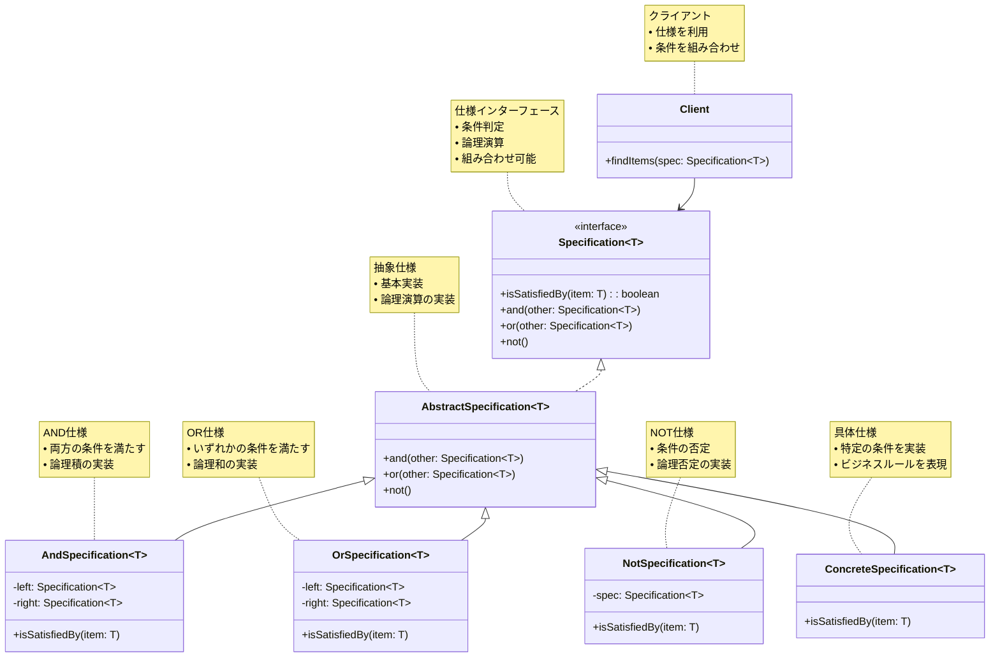

# Specification（仕様）パターン

## 目的

ビジネスルールをオブジェクトとしてカプセル化し、再利用可能な形で組み合わせることを可能にするパターンです。

## 価値・解決する問題

- ビジネスルールの再利用性を向上させます
- 複雑な条件式を整理します
- ルールの組み合わせを柔軟に行えます
- テストの容易性を向上させます
- コードの可読性を高めます

## 概要・特徴

### 概要

Specificationパターンは、ビジネスルールや検索条件をオブジェクトとしてカプセル化し、それらを組み合わせて複雑な条件を表現できるようにする設計パターンです。

### 特徴

#### ルール・条件のカプセル化
ビジネスルールや検索条件を独立したオブジェクトとしてカプセル化します。これにより、複雑な条件ロジックをアプリケーションの他の部分から分離し、特定の条件に関するコードの重複を防ぎます。例えば、「有効な注文」や「プレミアム顧客」といった概念を、それぞれSpecificationオブジェクトとして表現できます。このカプセル化により、ビジネスルールが変更された場合でも、その影響範囲を最小限に抑えることができます。また、ドメイン専門家との会話をコードに直接反映させやすくなり、ユビキタス言語の実現に貢献します。複雑なフィルタリングロジックが複数の場所に散在することを防ぎ、コードの保守性が向上するだけでなく、新しいチームメンバーにとっても理解しやすい構造となります。

#### 論理演算子による結合
複数のSpecificationオブジェクトを論理演算子（AND、OR、NOT）で結合して、より複雑な条件を構築できます。これにより、基本的な条件を組み合わせて高度なフィルタリングや検証ルールを表現することが可能になります。例えば、「有効な注文」と「国内配送」の条件を組み合わせて「国内配送可能な有効注文」という新しい条件を作成できます。このような組み合わせは、Compositeパターンと同様の構造を持ち、条件の階層的な組み立てを可能にします。CompositeSpecificationクラスを基底として利用することで、`and()`、`or()`、`not()`などのメソッドを統一的に提供し、読みやすく宣言的なスタイルでの条件構築が可能になります。これにより、複雑なクエリが必要なシナリオでも、コードの意図を明確に表現できます。

#### 再利用性の向上
一度定義したSpecificationは、アプリケーション全体で再利用できます。これにより、同じビジネスルールを異なるコンテキスト（ユーザーインターフェース、ドメインロジック、データアクセスなど）で一貫して適用できます。例えば、「在庫あり商品」というSpecificationは、商品リストの表示フィルタリングとカートへの追加可否の検証の両方で使用できます。また、基本的なSpecificationの組み合わせにより、新しいビジネスニーズに迅速に対応することも可能になります。再利用可能なSpecificationは、一種のビジネスルールのライブラリとして機能し、開発の迅速化と品質向上に貢献します。さらに、組織内での知識共有にも役立ち、標準化されたビジネスルールの実装を促進します。

#### テスト容易性
Specificationは単一責任の原則に従い、明確に定義された条件のみを表現するため、単体テストが容易です。各Specificationに対して異なる入力値でのテストケースを作成し、期待される結果を検証できます。複雑な条件も、テスト済みの基本Specificationの組み合わせで表現されるため、信頼性の高いコードになります。テストカバレッジを高めやすく、条件ロジックのバグを早期に発見できる利点もあります。また、モックオブジェクトを利用したテストも容易で、外部依存を持つSpecificationでも効率的なテストが可能です。継続的インテグレーション環境でのテスト自動化にも適しており、リファクタリングや新機能追加時の回帰テストを効果的に行えます。

#### 拡張性
新しいビジネスルールが発生した場合、既存のコードを変更することなく、新しいSpecificationクラスを追加するだけで対応できます。これは、開放/閉鎖原則（Open/Closed Principle）に従ったデザインになっています。例えば、新しい顧客セグメントや商品カテゴリに関するルールが追加された場合でも、既存のSpecificationを変更する必要はありません。また、アプリケーションの他の部分に影響を与えることなく、ビジネスルールを拡張できるため、機能追加のリスクが低減されます。さらに、異なるデータソースやコンテキストに対応するための拡張も容易です。例えば、メモリ内オブジェクトのフィルタリングだけでなく、同じSpecificationをデータベースクエリの生成に利用するための拡張も可能です。このような柔軟性により、時間の経過とともに変化するビジネス要件に適応しやすいアーキテクチャを実現できます。

## 類似パターンとの比較

- [Strategy (ストラテジー)](strategy.md): Specification はビジネスルールの組み合わせに焦点を当て、これに対して Strategy はアルゴリズムの切り替えに注力します。
- [Composite (コンポジット)](composite.md): Specification はルールの組み合わせに焦点を当て、これに対して Composite はオブジェクトの階層構造に注力します。
- [Chain of Responsibility (責任の連鎖)](chain-of-responsibility.md): Specification はルールの組み合わせに焦点を当て、これに対して Chain of Responsibility は処理の委譲に注力します。

## 利用されているライブラリ／フレームワークの事例

- [Spring Data JPA](https://spring.io/projects/spring-data-jpa): JPA Specifications
- [Entity Framework Core](https://docs.microsoft.com/en-us/ef/core/): Specification Pattern
- [TypeORM](https://typeorm.io/): Custom Repository Pattern

## 解説ページリンク

- [Martin Fowler - Specification Pattern](https://martinfowler.com/apsupp/spec.pdf)
- [DDD Community - Specification Pattern](https://dddcommunity.org/library/vernon_2009/)
- [Enterprise Craftsmanship - Specification Pattern](https://enterprisecraftsmanship.com/posts/specification-pattern-c-implementation/)

## コード例

### Before:

直接的な条件チェックの実装

```typescript
interface Product {
  id: string;
  name: string;
  price: number;
  category: string;
  stock: number;
}

class ProductService {
  private products: Product[] = [];

  findProducts(
    minPrice?: number,
    maxPrice?: number,
    category?: string,
    minStock?: number
  ): Product[] {
    return this.products.filter(product => {
      let isValid = true;

      if (minPrice !== undefined) {
        isValid = isValid && product.price >= minPrice;
      }

      if (maxPrice !== undefined) {
        isValid = isValid && product.price <= maxPrice;
      }

      if (category !== undefined) {
        isValid = isValid && product.category === category;
      }

      if (minStock !== undefined) {
        isValid = isValid && product.stock >= minStock;
      }

      return isValid;
    });
  }
}

// 使用例
const service = new ProductService();
const products = service.findProducts(1000, 5000, "electronics", 10);
```

### After:

Specificationパターンを適用した実装

```typescript
// 基本インターフェース
interface Specification<T> {
  isSatisfiedBy(item: T): boolean;
  and(other: Specification<T>): Specification<T>;
  or(other: Specification<T>): Specification<T>;
  not(): Specification<T>;
}

// 抽象クラス
abstract class AbstractSpecification<T> implements Specification<T> {
  abstract isSatisfiedBy(item: T): boolean;

  and(other: Specification<T>): Specification<T> {
    return new AndSpecification(this, other);
  }

  or(other: Specification<T>): Specification<T> {
    return new OrSpecification(this, other);
  }

  not(): Specification<T> {
    return new NotSpecification(this);
  }
}

// 論理演算子の実装
class AndSpecification<T> extends AbstractSpecification<T> {
  constructor(
    private left: Specification<T>,
    private right: Specification<T>
  ) {
    super();
  }

  isSatisfiedBy(item: T): boolean {
    return this.left.isSatisfiedBy(item) && this.right.isSatisfiedBy(item);
  }
}

class OrSpecification<T> extends AbstractSpecification<T> {
  constructor(
    private left: Specification<T>,
    private right: Specification<T>
  ) {
    super();
  }

  isSatisfiedBy(item: T): boolean {
    return this.left.isSatisfiedBy(item) || this.right.isSatisfiedBy(item);
  }
}

class NotSpecification<T> extends AbstractSpecification<T> {
  constructor(private spec: Specification<T>) {
    super();
  }

  isSatisfiedBy(item: T): boolean {
    return !this.spec.isSatisfiedBy(item);
  }
}

// 製品関連の定義
interface Product {
  id: string;
  name: string;
  price: number;
  category: string;
  stock: number;
  createdAt: Date;
}

// 具体的な仕様クラス
class PriceRangeSpecification extends AbstractSpecification<Product> {
  constructor(
    private minPrice: number,
    private maxPrice: number
  ) {
    super();
  }

  isSatisfiedBy(product: Product): boolean {
    return product.price >= this.minPrice && product.price <= this.maxPrice;
  }
}

class CategorySpecification extends AbstractSpecification<Product> {
  constructor(private category: string) {
    super();
  }

  isSatisfiedBy(product: Product): boolean {
    return product.category === this.category;
  }
}

class MinStockSpecification extends AbstractSpecification<Product> {
  constructor(private minStock: number) {
    super();
  }

  isSatisfiedBy(product: Product): boolean {
    return product.stock >= this.minStock;
  }
}

class NewProductSpecification extends AbstractSpecification<Product> {
  private readonly NEW_PRODUCT_DAYS = 30;

  isSatisfiedBy(product: Product): boolean {
    const daysOld = (Date.now() - product.createdAt.getTime()) / (1000 * 60 * 60 * 24);
    return daysOld <= this.NEW_PRODUCT_DAYS;
  }
}

// リポジトリクラス
class ProductRepository {
  private products: Product[] = [];

  constructor() {
    // サンプルデータの初期化
    this.products = [
      {
        id: "1",
        name: "スマートフォン",
        price: 80000,
        category: "electronics",
        stock: 50,
        createdAt: new Date()
      },
      {
        id: "2",
        name: "ノートPC",
        price: 150000,
        category: "electronics",
        stock: 20,
        createdAt: new Date(Date.now() - 40 * 24 * 60 * 60 * 1000)
      },
      {
        id: "3",
        name: "コーヒーメーカー",
        price: 15000,
        category: "appliances",
        stock: 100,
        createdAt: new Date()
      }
    ];
  }

  findBySpecification(spec: Specification<Product>): Product[] {
    return this.products.filter(product => spec.isSatisfiedBy(product));
  }
}

// サービスクラス
class ProductService {
  constructor(private repository: ProductRepository) {}

  findNewElectronicsWithStock(): Product[] {
    const spec = new CategorySpecification("electronics")
      .and(new MinStockSpecification(10))
      .and(new NewProductSpecification());

    return this.repository.findBySpecification(spec);
  }

  findProductsByPriceAndCategory(
    minPrice: number,
    maxPrice: number,
    category: string
  ): Product[] {
    const spec = new PriceRangeSpecification(minPrice, maxPrice)
      .and(new CategorySpecification(category));

    return this.repository.findBySpecification(spec);
  }

  findAvailableProducts(minStock: number): Product[] {
    return this.repository.findBySpecification(
      new MinStockSpecification(minStock)
    );
  }
}

// 使用例
function example() {
  const repository = new ProductRepository();
  const service = new ProductService(repository);

  console.log("=== 新着の電子機器（在庫10個以上） ===");
  const newElectronics = service.findNewElectronicsWithStock();
  console.log(newElectronics);

  console.log("\n=== 10万円以下の電子機器 ===");
  const affordableElectronics = service.findProductsByPriceAndCategory(
    0,
    100000,
    "electronics"
  );
  console.log(affordableElectronics);

  console.log("\n=== 在庫が50個以上の商品 ===");
  const wellStockedProducts = service.findAvailableProducts(50);
  console.log(wellStockedProducts);

  // カスタム仕様の組み合わせ例
  console.log("\n=== カスタム検索：高額な新商品 ===");
  const expensiveNewSpec = new PriceRangeSpecification(100000, Infinity)
    .and(new NewProductSpecification());
  
  const expensiveNewProducts = repository.findBySpecification(expensiveNewSpec);
  console.log(expensiveNewProducts);
}

example();
```

### 概要図



