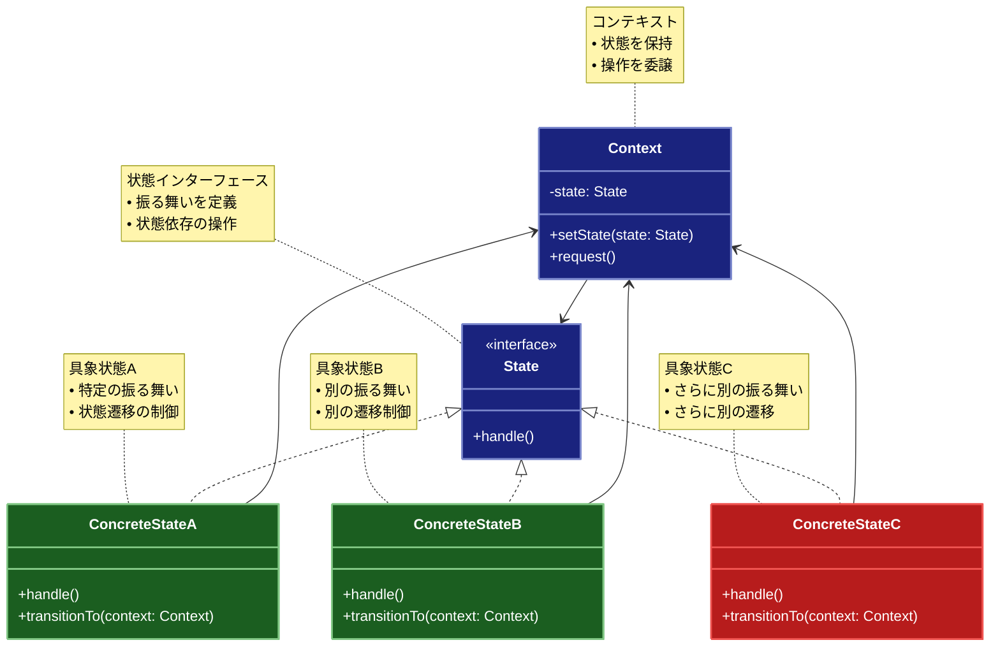

# State（ステート）パターン

## 目的

オブジェクトの内部状態が変化したときにオブジェクトの振る舞いを変更できるようにするパターンです。

## 価値・解決する問題

- 状態依存の振る舞いをカプセル化します
- 状態遷移ロジックを整理します
- 条件分岐を削減します
- コードの保守性を向上させます
- 新しい状態の追加を容易にします

## 概要・特徴

### 概要

Stateパターンは、オブジェクトの内部状態を別のクラスとして表現し、状態に応じて振る舞いを変更できるようにする設計パターンです。このパターンでは、オブジェクトの振る舞いが状態によって異なる場合に、各状態を独立したクラスとして実装し、コンテキストオブジェクトはこれらの状態クラスに処理を委譲します。状態が変わると、コンテキストは異なる状態オブジェクトを参照するようになり、結果として振る舞いも変化します。これにより、大量の条件分岐を避け、新しい状態の追加や変更を容易にする柔軟な設計が可能になります。

### 特徴

#### 状態のカプセル化

各状態を独立したクラスとしてカプセル化することで、特定の状態に関連する振る舞いと遷移ロジックを一箇所にまとめます。これにより、状態固有のコードが分散せず、各状態の責任が明確になります。例えば、ドキュメントの「下書き」「レビュー中」「公開済み」などの状態をそれぞれ別のクラスで表現することで、各状態での許可される操作や遷移条件を明確に定義できます。また、特定の状態のロジックを変更する際、他の状態に影響を与えることなく修正できるため、保守性が向上します。

#### 振る舞いの分離

オブジェクトの振る舞いとその状態を分離することで、単一責任の原則に沿った設計が可能になります。コンテキストクラスは状態の管理と操作の委譲に集中し、具体的な状態クラスは特定の状態における振る舞いの実装に集中します。例えば、注文処理システムでは、「新規注文」「支払い済み」「発送準備中」「発送済み」などの状態ごとに異なる処理ロジックを持ちますが、これらを分離することで、各クラスがより焦点を絞った責任を持つようになります。この分離により、コードの可読性と保守性が向上し、テストも容易になります。

#### 状態遷移の管理

状態間の遷移ルールを明示的に定義し、管理することができます。各状態クラスは、許可される次の状態への遷移ロジックを実装することができます。これにより、不正な状態遷移を防ぎ、状態遷移の整合性を保つことができます。例えば、ATMでは「カード挿入待ち」から「暗証番号入力中」へ遷移できますが、「取引完了」から直接「暗証番号入力中」に戻ることはできないといった制約を実装できます。この明示的な遷移管理により、システムの動作が予測可能になり、バグの発生リスクが減少します。

#### 条件分岐の削減

多数の条件分岐（if-else文やswitch文）を、状態パターンによる多態性（ポリモーフィズム）に置き換えることができます。コンテキストは現在の状態オブジェクトに処理を委譲するだけで、具体的な振る舞いは各状態クラスが実装します。例えば、メディアプレーヤーでは「再生中」「一時停止」「停止」など、各状態で再生ボタンを押した時の動作が異なりますが、大きな条件分岐ブロックではなく、各状態クラスがその振る舞いを実装します。これにより、コードが読みやすくなり、バグの発生や、条件漏れのリスクが減少します。

#### 拡張性の向上

新しい状態を追加する際に、既存のコードを変更せずに拡張できます。新しい状態クラスを追加するだけで、システム全体の振る舞いを拡張できるため、開放・閉鎖の原則（OCP）に準拠した設計となります。例えば、ワークフローシステムで新しい承認ステップを追加する場合、新しい状態クラスを作成するだけで、既存の状態クラスやコンテキストクラスを変更する必要がありません。これにより、システムの拡張性が高まり、変更の影響範囲を最小限に抑えることができます。

### 概要図



## 類似パターンとの比較

- [Strategy (ストラテジー)](strategy.md): State は状態に応じた振る舞いの変更に焦点を当て、これに対して Strategy はアルゴリズムの切り替えに注力します。
- [Command (コマンド)](command.md): State は状態に応じた振る舞いを管理し、これに対して Command は操作をオブジェクトとしてカプセル化します。
- [Null Object (ヌルオブジェクト)](null-object.md): State は状態に応じた振る舞いを提供し、これに対して Null Object はデフォルトの振る舞いを提供します。

## 利用されているライブラリ／フレームワークの事例

- [React](https://reactjs.org/): コンポーネントの状態管理
- [Redux](https://redux.js.org/): アプリケーションの状態管理
- [Spring State Machine](https://spring.io/projects/spring-statemachine): 状態遷移の管理

## 解説ページリンク

- [Refactoring Guru - State Pattern](https://refactoring.guru/design-patterns/state)
- [SourceMaking - State Pattern](https://sourcemaking.com/design_patterns/state)
- [Design Patterns - State Pattern](https://www.oodesign.com/state-pattern.html)

## コード例

### Before:

条件分岐による状態管理の実装

```typescript
enum OrderStatus {
  Created,
  Paid,
  Shipped,
  Delivered,
  Cancelled
}

class Order {
  private status: OrderStatus = OrderStatus.Created;

  processPayment(): void {
    if (this.status === OrderStatus.Created) {
      // 支払い処理
      this.status = OrderStatus.Paid;
      console.log("支払い処理完了");
    } else {
      throw new Error("Invalid operation for current status");
    }
  }

  shipOrder(): void {
    if (this.status === OrderStatus.Paid) {
      // 出荷処理
      this.status = OrderStatus.Shipped;
      console.log("商品を出荷");
    } else {
      throw new Error("Invalid operation for current status");
    }
  }

  deliverOrder(): void {
    if (this.status === OrderStatus.Shipped) {
      // 配達処理
      this.status = OrderStatus.Delivered;
      console.log("商品を配達");
    } else {
      throw new Error("Invalid operation for current status");
    }
  }

  cancelOrder(): void {
    if (this.status === OrderStatus.Created || this.status === OrderStatus.Paid) {
      // キャンセル処理
      this.status = OrderStatus.Cancelled;
      console.log("注文をキャンセル");
    } else {
      throw new Error("Invalid operation for current status");
    }
  }

  getStatus(): OrderStatus {
    return this.status;
  }
}

// 使用例
const order = new Order();
order.processPayment();
order.shipOrder();
order.deliverOrder();
```

### After:

Stateパターンを適用した実装

```typescript
// 注文の状態を表すインターフェース
interface OrderState {
  processPayment(): void;
  shipOrder(): void;
  deliverOrder(): void;
  cancelOrder(): void;
  getName(): string;
  getDescription(): string;
  canTransitionTo(state: OrderState): boolean;
}

// 注文クラス
class Order {
  private state: OrderState;
  private readonly id: string;
  private history: { state: string; timestamp: Date }[] = [];

  constructor(id: string) {
    this.id = id;
    this.state = new CreatedState();
    this.addToHistory(this.state.getName());
  }

  // 状態遷移メソッド
  setState(state: OrderState): void {
    if (!this.state.canTransitionTo(state)) {
      throw new Error(
        `Invalid state transition from ${this.state.getName()} to ${state.getName()}`
      );
    }
    this.state = state;
    this.addToHistory(state.getName());
  }

  // 履歴の記録
  private addToHistory(stateName: string): void {
    this.history.push({
      state: stateName,
      timestamp: new Date()
    });
  }

  // 操作の委譲
  processPayment(): void {
    this.state.processPayment();
  }

  shipOrder(): void {
    this.state.shipOrder();
  }

  deliverOrder(): void {
    this.state.deliverOrder();
  }

  cancelOrder(): void {
    this.state.cancelOrder();
  }

  // 状態の取得
  getState(): OrderState {
    return this.state;
  }

  // 履歴の取得
  getHistory(): { state: string; timestamp: Date }[] {
    return [...this.history];
  }

  // 注文情報の取得
  getOrderInfo(): string {
    return `Order ${this.id} - Current State: ${this.state.getName()}\n${this.state.getDescription()}`;
  }
}

// 作成済み状態
class CreatedState implements OrderState {
  processPayment(): void {
    console.log("支払い処理を実行中...");
    // 支払い処理のロジック
  }

  shipOrder(): void {
    throw new Error("支払いが完了していない注文は出荷できません");
  }

  deliverOrder(): void {
    throw new Error("出荷されていない注文は配達できません");
  }

  cancelOrder(): void {
    console.log("注文をキャンセル中...");
    // キャンセル処理のロジック
  }

  getName(): string {
    return "Created";
  }

  getDescription(): string {
    return "注文が作成され、支払い待ちの状態です";
  }

  canTransitionTo(state: OrderState): boolean {
    return state instanceof PaidState || state instanceof CancelledState;
  }
}

// 支払い済み状態
class PaidState implements OrderState {
  processPayment(): void {
    throw new Error("既に支払い済みの注文です");
  }

  shipOrder(): void {
    console.log("注文を出荷準備中...");
    // 出荷処理のロジック
  }

  deliverOrder(): void {
    throw new Error("出荷されていない注文は配達できません");
  }

  cancelOrder(): void {
    console.log("支払い済み注文をキャンセル中...");
    // 返金処理のロジック
  }

  getName(): string {
    return "Paid";
  }

  getDescription(): string {
    return "支払いが完了し、出荷待ちの状態です";
  }

  canTransitionTo(state: OrderState): boolean {
    return state instanceof ShippedState || state instanceof CancelledState;
  }
}

// 出荷済み状態
class ShippedState implements OrderState {
  processPayment(): void {
    throw new Error("既に支払い済みの注文です");
  }

  shipOrder(): void {
    throw new Error("既に出荷済みの注文です");
  }

  deliverOrder(): void {
    console.log("配達処理を実行中...");
    // 配達処理のロジック
  }

  cancelOrder(): void {
    throw new Error("出荷済みの注文はキャンセルできません");
  }

  getName(): string {
    return "Shipped";
  }

  getDescription(): string {
    return "商品が出荷され、配達待ちの状態です";
  }

  canTransitionTo(state: OrderState): boolean {
    return state instanceof DeliveredState;
  }
}

// 配達済み状態
class DeliveredState implements OrderState {
  processPayment(): void {
    throw new Error("既に支払い済みの注文です");
  }

  shipOrder(): void {
    throw new Error("既に出荷済みの注文です");
  }

  deliverOrder(): void {
    throw new Error("既に配達済みの注文です");
  }

  cancelOrder(): void {
    throw new Error("配達済みの注文はキャンセルできません");
  }

  getName(): string {
    return "Delivered";
  }

  getDescription(): string {
    return "商品が配達完了した状態です";
  }

  canTransitionTo(state: OrderState): boolean {
    return false; // 最終状態
  }
}

// キャンセル状態
class CancelledState implements OrderState {
  processPayment(): void {
    throw new Error("キャンセルされた注文は処理できません");
  }

  shipOrder(): void {
    throw new Error("キャンセルされた注文は処理できません");
  }

  deliverOrder(): void {
    throw new Error("キャンセルされた注文は処理できません");
  }

  cancelOrder(): void {
    throw new Error("既にキャンセルされた注文です");
  }

  getName(): string {
    return "Cancelled";
  }

  getDescription(): string {
    return "注文がキャンセルされた状態です";
  }

  canTransitionTo(state: OrderState): boolean {
    return false; // 最終状態
  }
}

// 注文管理クラス
class OrderManager {
  private orders: Map<string, Order> = new Map();

  createOrder(orderId: string): Order {
    const order = new Order(orderId);
    this.orders.set(orderId, order);
    return order;
  }

  getOrder(orderId: string): Order | undefined {
    return this.orders.get(orderId);
  }

  processOrder(orderId: string): void {
    const order = this.getOrder(orderId);
    if (!order) {
      throw new Error(`Order not found: ${orderId}`);
    }

    try {
      // 支払い処理
      order.processPayment();
      order.setState(new PaidState());

      // 出荷処理
      order.shipOrder();
      order.setState(new ShippedState());

      // 配達処理
      order.deliverOrder();
      order.setState(new DeliveredState());

    } catch (error) {
      console.error(`Error processing order ${orderId}:`, error);
      order.setState(new CancelledState());
    }
  }
}

// 使用例
async function example() {
  const orderManager = new OrderManager();

  // 正常な注文処理フロー
  console.log("=== 正常な注文処理 ===");
  const order1 = orderManager.createOrder("ORDER-001");
  console.log("\n# 初期状態");
  console.log(order1.getOrderInfo());

  try {
    orderManager.processOrder("ORDER-001");
    console.log("\n# 処理完了後");
    console.log(order1.getOrderInfo());
    console.log("\n# 状態遷移履歴");
    order1.getHistory().forEach(entry => {
      console.log(`${entry.state}: ${entry.timestamp}`);
    });
  } catch (error) {
    console.error("Error:", error);
  }

  // エラーケース
  console.log("\n=== エラーケースの処理 ===");
  const order2 = orderManager.createOrder("ORDER-002");
  console.log("\n# 配達前のキャンセル");
  try {
    order2.cancelOrder();
    order2.setState(new CancelledState());
    console.log(order2.getOrderInfo());
  } catch (error) {
    console.error("Error:", error);
  }

  // 無効な状態遷移
  console.log("\n=== 無効な状態遷移 ===");
  const order3 = orderManager.createOrder("ORDER-003");
  try {
    order3.deliverOrder(); // Created状態での配達試行
  } catch (error) {
    console.error("Error:", error.message);
  }
}

example();