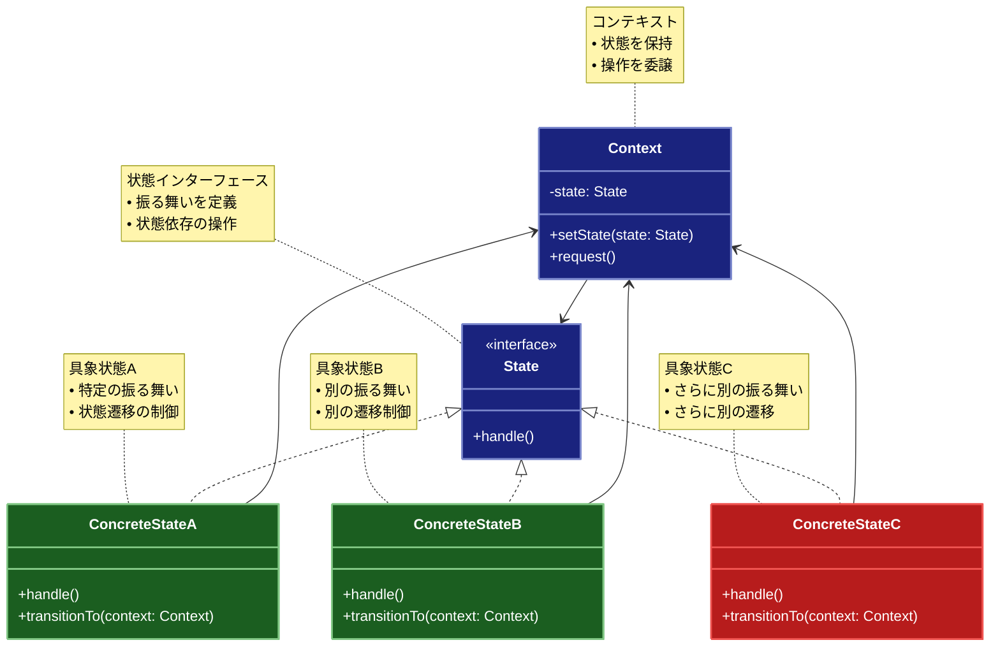

# State（ステート）パターン

## 目的

オブジェクトの内部状態が変化したときにオブジェクトの振る舞いを変更できるようにするパターンです。

## 価値・解決する問題

- 状態依存の振る舞いをカプセル化します
- 状態遷移ロジックを整理します
- 条件分岐を削減します
- コードの保守性を向上させます
- 新しい状態の追加を容易にします

## 概要・特徴

### 概要

Stateパターンは、オブジェクトの内部状態を別のクラスとして表現し、その状態に基づいて振る舞いを変化させるデザインパターンです。状態の変化に伴い、オブジェクトはクラスを変更したかのように振る舞いを変えます。

### 特徴

#### 状態のカプセル化
Stateパターンでは、各状態に関連する振る舞いを個別のクラスにカプセル化します。これにより、特定の状態に関するコードが一箇所に集約され、関心の分離が実現されます。状態固有のロジックが独立したクラスに分割されるため、各状態クラスはその状態に関連する振る舞いのみに集中でき、コードの管理が容易になります。また、状態クラスが特定のコンテキストに依存せず独立して実装されることで、異なるコンテキストでの再利用も可能になります。この明確な構造により、開発者は各状態のロジックを個別に理解、開発、テストできるようになり、複雑な状態遷移のシステムを扱う際の認知的な負荷を減らすことができます。

#### 振る舞いの分離
オブジェクトの振る舞いを状態ごとに分離することで、コードの組織化と保守性が向上します。各状態は独自のクラスとして実装されるため、新しい状態を追加する際には既存のコードを変更せずに、新しい状態クラスを追加するだけで済みます。これはOpen/Closed原則（拡張に対して開かれ、修正に対して閉じている）に準拠しており、既存の機能を壊すリスクを最小限に抑えながらシステムを拡張できます。また、各状態の振る舞いが明確に分離されていることで、特定の状態の動作を変更する際も、その状態クラスのみを修正すれば良く、他の状態や全体のコンテキストに影響を与えることなく変更を加えられます。

#### 状態遷移の管理
Stateパターンでは、状態間の遷移ロジックを明示的に定義し管理します。状態遷移の条件と処理が明確に定義されることで、システムの動作が予測可能になり、状態遷移に関連するバグを減らすことができます。状態遷移は、コンテキストクラス内で一元管理する方法と、各状態クラスが次の状態を決定する方法の2つのアプローチが可能です。前者ではコンテキストが全ての状態遷移の制御を持ち、システム全体の状態フローを把握しやすくなります。後者では状態クラス自身が次の状態を判断するため、状態遷移のロジックが状態ごとに分散し、より自律的なデザインとなります。どちらのアプローチを選ぶかは、アプリケーションの要件や複雑さによりますが、いずれにしてもStateパターンは状態遷移の明示的な管理を促進し、複雑な状態マシンの実装を構造化します。

#### 条件分岐の削減
複雑な条件分岐（if-elseやswitch文）をオブジェクト指向の多態性に置き換えることで、コードの可読性とメンテナンス性が向上します。従来の条件分岐に基づく実装では、状態の数が増えるにつれてコードが複雑化し、新しい状態の追加や既存状態の変更が難しくなります。Stateパターンでは、条件分岐をポリモーフィズム（多態性）に置き換えることで、各状態クラスが自身の振る舞いを定義し、コンテキストはそれを呼び出すだけの単純な構造になります。これにより、長く複雑になりがちな条件分岐のブロックが排除され、コードの流れが直線的で理解しやすくなります。また、状態に関連する条件チェックが散在することも防ぎ、「状態に応じた振る舞いの変化」という意図が明確になります。これは特に、多くの状態と複雑な遷移ルールを持つシステムにおいて、コードの品質とメンテナンス性を大きく向上させます。

#### 拡張性の向上
新しい状態や振る舞いを追加する際に、既存のコードを変更することなく拡張できます。これにより、変更に伴うリスクが最小限に抑えられ、既存機能への影響を心配せずに新機能を追加できます。例えば、文書管理システムの状態（下書き、レビュー中、承認済み、公開中など）に新しい状態（アーカイブなど）を追加する必要が生じた場合、新しい状態クラスを実装し、必要な遷移ロジックを追加するだけで対応できます。また、特定の状態の振る舞いを変更する場合も、その状態クラスのみを修正するだけで済むため、システム全体に与える影響を局所化できます。この拡張性は、長期的なメンテナンスが必要なシステムや、要件が頻繁に変更されるアジャイル開発環境において特に価値があります。さらに、新しい要件や動作が追加されても、コードベースが線形にしか成長しないため、複雑性の爆発的な増加を防ぎます。

### 概要図



## 類似パターンとの比較

- [Strategy (ストラテジー)](strategy.md): State は状態に応じた振る舞いの変更に焦点を当て、これに対して Strategy はアルゴリズムの切り替えに注力します。
- [Command (コマンド)](command.md): State は状態に応じた振る舞いを管理し、これに対して Command は操作をオブジェクトとしてカプセル化します。
- [Null Object (ヌルオブジェクト)](null-object.md): State は状態に応じた振る舞いを提供し、これに対して Null Object はデフォルトの振る舞いを提供します。

## 利用されているライブラリ／フレームワークの事例

- [React](https://reactjs.org/): コンポーネントの状態管理
- [Redux](https://redux.js.org/): アプリケーションの状態管理
- [Spring State Machine](https://spring.io/projects/spring-statemachine): 状態遷移の管理

## 解説ページリンク

- [Refactoring Guru - State Pattern](https://refactoring.guru/design-patterns/state)
- [SourceMaking - State Pattern](https://sourcemaking.com/design_patterns/state)
- [Design Patterns - State Pattern](https://www.oodesign.com/state-pattern.html)

## コード例

### Before:

条件分岐による状態管理の実装

```typescript
enum OrderStatus {
  Created,
  Paid,
  Shipped,
  Delivered,
  Cancelled
}

class Order {
  private status: OrderStatus = OrderStatus.Created;

  processPayment(): void {
    if (this.status === OrderStatus.Created) {
      // 支払い処理
      this.status = OrderStatus.Paid;
      console.log("支払い処理完了");
    } else {
      throw new Error("Invalid operation for current status");
    }
  }

  shipOrder(): void {
    if (this.status === OrderStatus.Paid) {
      // 出荷処理
      this.status = OrderStatus.Shipped;
      console.log("商品を出荷");
    } else {
      throw new Error("Invalid operation for current status");
    }
  }

  deliverOrder(): void {
    if (this.status === OrderStatus.Shipped) {
      // 配達処理
      this.status = OrderStatus.Delivered;
      console.log("商品を配達");
    } else {
      throw new Error("Invalid operation for current status");
    }
  }

  cancelOrder(): void {
    if (this.status === OrderStatus.Created || this.status === OrderStatus.Paid) {
      // キャンセル処理
      this.status = OrderStatus.Cancelled;
      console.log("注文をキャンセル");
    } else {
      throw new Error("Invalid operation for current status");
    }
  }

  getStatus(): OrderStatus {
    return this.status;
  }
}

// 使用例
const order = new Order();
order.processPayment();
order.shipOrder();
order.deliverOrder();
```

### After:

Stateパターンを適用した実装です。このアプローチでは以下の改善点があります：

1. **状態のカプセル化**: 各状態（Created、Paid、Shipped、Delivered、Cancelled）が独立したクラスとして実装され、状態固有の振る舞いが明確に分離されています。

2. **条件分岐の排除**: 大量のif-else文が多態性（ポリモーフィズム）に置き換えられ、各状態クラスが自身の振る舞いを責任を持って実装しています。

3. **状態遷移の明示的な管理**: 状態間の遷移ルールが`canTransitionTo`メソッドで明示的に定義され、不正な状態遷移を防止しています。

4. **拡張性の向上**: 新しい状態や振る舞いを追加する場合、既存のコードを変更せずに新しい状態クラスを追加するだけで済みます。

5. **履歴管理の追加**: 状態の変更履歴を記録することで、トレーサビリティが向上し、デバッグやユーザー向けの情報提供が容易になっています。

この実装では、さらにOrderManagerクラスを導入し、注文の作成から処理完了までのライフサイクル全体を管理しています。エラーハンドリングも各状態で適切に実装されており、不正な操作が行われた場合は意味のあるエラーメッセージが提供されます。

```typescript
// 注文の状態を表すインターフェース
interface OrderState {
  processPayment(): void;
  shipOrder(): void;
  deliverOrder(): void;
  cancelOrder(): void;
  getName(): string;
  getDescription(): string;
  canTransitionTo(state: OrderState): boolean;
}

// 注文クラス
class Order {
  private state: OrderState;
  private readonly id: string;
  private history: { state: string; timestamp: Date }[] = [];

  constructor(id: string) {
    this.id = id;
    this.state = new CreatedState();
    this.addToHistory(this.state.getName());
  }

  // 状態遷移メソッド
  setState(state: OrderState): void {
    if (!this.state.canTransitionTo(state)) {
      throw new Error(
        `Invalid state transition from ${this.state.getName()} to ${state.getName()}`
      );
    }
    this.state = state;
    this.addToHistory(state.getName());
  }

  // 履歴の記録
  private addToHistory(stateName: string): void {
    this.history.push({
      state: stateName,
      timestamp: new Date()
    });
  }

  // 操作の委譲
  processPayment(): void {
    this.state.processPayment();
  }

  shipOrder(): void {
    this.state.shipOrder();
  }

  deliverOrder(): void {
    this.state.deliverOrder();
  }

  cancelOrder(): void {
    this.state.cancelOrder();
  }

  // 状態の取得
  getState(): OrderState {
    return this.state;
  }

  // 履歴の取得
  getHistory(): { state: string; timestamp: Date }[] {
    return [...this.history];
  }

  // 注文情報の取得
  getOrderInfo(): string {
    return `Order ${this.id} - Current State: ${this.state.getName()}\n${this.state.getDescription()}`;
  }
}

// 作成済み状態
class CreatedState implements OrderState {
  processPayment(): void {
    console.log("支払い処理を実行中...");
    // 支払い処理のロジック
  }

  shipOrder(): void {
    throw new Error("支払いが完了していない注文は出荷できません");
  }

  deliverOrder(): void {
    throw new Error("出荷されていない注文は配達できません");
  }

  cancelOrder(): void {
    console.log("注文をキャンセル中...");
    // キャンセル処理のロジック
  }

  getName(): string {
    return "Created";
  }

  getDescription(): string {
    return "注文が作成され、支払い待ちの状態です";
  }

  canTransitionTo(state: OrderState): boolean {
    return state instanceof PaidState || state instanceof CancelledState;
  }
}

// 支払い済み状態
class PaidState implements OrderState {
  processPayment(): void {
    throw new Error("既に支払い済みの注文です");
  }

  shipOrder(): void {
    console.log("注文を出荷準備中...");
    // 出荷処理のロジック
  }

  deliverOrder(): void {
    throw new Error("出荷されていない注文は配達できません");
  }

  cancelOrder(): void {
    console.log("支払い済み注文をキャンセル中...");
    // 返金処理のロジック
  }

  getName(): string {
    return "Paid";
  }

  getDescription(): string {
    return "支払いが完了し、出荷待ちの状態です";
  }

  canTransitionTo(state: OrderState): boolean {
    return state instanceof ShippedState || state instanceof CancelledState;
  }
}

// 出荷済み状態
class ShippedState implements OrderState {
  processPayment(): void {
    throw new Error("既に支払い済みの注文です");
  }

  shipOrder(): void {
    throw new Error("既に出荷済みの注文です");
  }

  deliverOrder(): void {
    console.log("配達処理を実行中...");
    // 配達処理のロジック
  }

  cancelOrder(): void {
    throw new Error("出荷済みの注文はキャンセルできません");
  }

  getName(): string {
    return "Shipped";
  }

  getDescription(): string {
    return "商品が出荷され、配達待ちの状態です";
  }

  canTransitionTo(state: OrderState): boolean {
    return state instanceof DeliveredState;
  }
}

// 配達済み状態
class DeliveredState implements OrderState {
  processPayment(): void {
    throw new Error("既に支払い済みの注文です");
  }

  shipOrder(): void {
    throw new Error("既に出荷済みの注文です");
  }

  deliverOrder(): void {
    throw new Error("既に配達済みの注文です");
  }

  cancelOrder(): void {
    throw new Error("配達済みの注文はキャンセルできません");
  }

  getName(): string {
    return "Delivered";
  }

  getDescription(): string {
    return "商品が配達完了した状態です";
  }

  canTransitionTo(state: OrderState): boolean {
    return false; // 最終状態
  }
}

// キャンセル状態
class CancelledState implements OrderState {
  processPayment(): void {
    throw new Error("キャンセルされた注文は処理できません");
  }

  shipOrder(): void {
    throw new Error("キャンセルされた注文は処理できません");
  }

  deliverOrder(): void {
    throw new Error("キャンセルされた注文は処理できません");
  }

  cancelOrder(): void {
    throw new Error("既にキャンセルされた注文です");
  }

  getName(): string {
    return "Cancelled";
  }

  getDescription(): string {
    return "注文がキャンセルされた状態です";
  }

  canTransitionTo(state: OrderState): boolean {
    return false; // 最終状態
  }
}

// 注文管理クラス
class OrderManager {
  private orders: Map<string, Order> = new Map();

  createOrder(orderId: string): Order {
    const order = new Order(orderId);
    this.orders.set(orderId, order);
    return order;
  }

  getOrder(orderId: string): Order | undefined {
    return this.orders.get(orderId);
  }

  processOrder(orderId: string): void {
    const order = this.getOrder(orderId);
    if (!order) {
      throw new Error(`Order not found: ${orderId}`);
    }

    try {
      // 支払い処理
      order.processPayment();
      order.setState(new PaidState());

      // 出荷処理
      order.shipOrder();
      order.setState(new ShippedState());

      // 配達処理
      order.deliverOrder();
      order.setState(new DeliveredState());

    } catch (error) {
      console.error(`Error processing order ${orderId}:`, error);
      order.setState(new CancelledState());
    }
  }
}

// 使用例
async function example() {
  const orderManager = new OrderManager();

  // 正常な注文処理フロー
  console.log("=== 正常な注文処理 ===");
  const order1 = orderManager.createOrder("ORDER-001");
  console.log("\n# 初期状態");
  console.log(order1.getOrderInfo());

  try {
    orderManager.processOrder("ORDER-001");
    console.log("\n# 処理完了後");
    console.log(order1.getOrderInfo());
    console.log("\n# 状態遷移履歴");
    order1.getHistory().forEach(entry => {
      console.log(`${entry.state}: ${entry.timestamp}`);
    });
  } catch (error) {
    console.error("Error:", error);
  }

  // エラーケース
  console.log("\n=== エラーケースの処理 ===");
  const order2 = orderManager.createOrder("ORDER-002");
  console.log("\n# 配達前のキャンセル");
  try {
    order2.cancelOrder();
    order2.setState(new CancelledState());
    console.log(order2.getOrderInfo());
  } catch (error) {
    console.error("Error:", error);
  }

  // 無効な状態遷移
  console.log("\n=== 無効な状態遷移 ===");
  const order3 = orderManager.createOrder("ORDER-003");
  try {
    order3.deliverOrder(); // Created状態での配達試行
  } catch (error) {
    console.error("Error:", error.message);
  }
}

example();
```

実行例では、正常な注文処理フローとエラーケースの両方を示しており、状態パターンがどのように動作するかを実際に確認できます。このパターンを適用することで、状態依存のロジックが整理され、コードの可読性、保守性、拡張性が大幅に向上します。

特に注目すべき点として、各状態が自身の有効な操作と無効な操作を明確に定義していることがあります。例えば、「配達済み」状態では支払い処理や出荷処理などの操作は無効となり、適切なエラーメッセージを返します。これにより、ビジネスルールがコードに明示的に組み込まれ、バグの発生リスクが低減します。
</rewritten_file>