# Strangler Fig（ストラングラーフィグ）パターン

## 目的

レガシーシステムを段階的に新しいシステムに置き換えることで、リスクを最小限に抑えながらシステムの近代化を実現します。名前は、宿主の木を徐々に包み込んで置き換えていくストラングラーイチジクの生態から来ています。

## 価値・解決する問題

- リスクの最小化
- 段階的な移行の実現
- ビジネス継続性の確保
- 移行の柔軟性
- 学習機会の創出
- 投資対効果の早期実現

## 概要・特徴

### 概要

Strangler Figパターンは、レガシーシステムを一度に置き換えるのではなく、徐々に機能を新しいシステムに移行していくアプローチです。既存システムと新システムは共存し、ファサード層を通じて統合されます。

### 特徴

#### 段階的移行
Strangler Figパターンの中核的な特徴は、レガシーシステムから新システムへの段階的な移行アプローチです。巨大なレガシーシステムを一度に置き換える「ビッグバン」アプローチとは異なり、機能やサービスを小さな単位で順次移行していきます。例えば、Eコマースシステムの移行では、まず製品カタログ機能、次に顧客管理、その後に注文処理というように段階的に移行できます。この増分的なアプローチにより、各段階でのリスクが限定され、問題が発生した場合も影響範囲が小さく、元に戻すことも容易になります。また、チームは経験を積みながら移行を進められるため、プロセスが進むにつれて効率が向上します。特に大規模で複雑なシステム、または24時間365日の可用性が求められるミッションクリティカルなシステムの刷新に適しています。

#### ファサード層
ファサード層（またはプロキシ）は、クライアントのリクエストを適切なシステム（新旧どちらか）に振り分ける役割を果たします。これにより、クライアントはシステムの移行を意識することなく、一貫したインターフェースを使い続けることができます。例えば、APIゲートウェイやロードバランサーをファサードとして使用し、特定のエンドポイントやパスに対するリクエストを新システムに転送し、残りはレガシーシステムに転送するといった実装が可能です。このファサード層は移行の透明性を確保し、クライアント側での変更を最小限に抑えることができます。また、A/Bテストの実施やトラフィックの段階的な移行など、細かな制御も可能になります。移行が完了した後は、このファサード層を新システムの正式なエントリーポイントとして再定義することも可能です。

#### 機能フラグ
機能フラグ（または機能トグル）は、特定のユーザーやリクエストに対してのみ新システムの機能を有効化する仕組みです。これにより、本番環境で段階的にシステムを切り替え、影響を制御することができます。例えば、まず内部ユーザーやベータテスターに対してのみ新機能を有効化し、問題がないことを確認した後に、徐々に一般ユーザーにも展開するといった方法が取れます。また、トラフィックの一部（例：5%）だけを新システムに転送し、パフォーマンスや安定性を監視しながら徐々にその割合を増やしていくこともできます。機能フラグは、リリースと展開を分離する「ダークローンチ」や「カナリアリリース」などの手法と組み合わせることで、移行のリスクをさらに軽減することができます。

#### データの二重書き込み
移行期間中は、データの整合性を保つためにデータの二重書き込み（または同期メカニズム）が必要になることがあります。新旧のシステムが共存する間、データの不整合が生じないよう、変更データを両方のシステムに反映させる仕組みです。例えば、顧客がプロフィールを更新した場合、その変更をレガシーシステムと新システムの両方のデータベースに書き込むことで、どちらのシステムからアクセスしても同じデータが返るようにします。これには、メッセージキューを使った非同期更新や、データベースレプリケーション、Change Data Capture（CDC）などの技術が活用されます。二重書き込みの実装は複雑になりがちですが、データの一貫性を保ち、ユーザー体験を損なわないためには重要なコンポーネントです。移行が進むにつれて、この二重書き込みの必要性は徐々に減少していきます。

#### 段階的な廃止
レガシーシステムの段階的な廃止は、Strangler Figパターンの最終段階です。新システムへの移行が完了した機能やサービスは、レガシーシステムから段階的に削除していきます。これにより、レガシーシステムは徐々に「縮小」し、最終的には完全に置き換えられます。例えば、ユーザー管理機能が新システムに完全に移行された後、レガシーシステムのユーザー管理コードを削除したり、使用しなくなったデータベーステーブルを非アクティブ化したりします。この段階的な廃止により、レガシーシステムのメンテナンスコストやライセンス費用を徐々に削減でき、最終的にはリソースを完全に解放することができます。また、廃止のプロセスを通じて、未使用のコードや冗長な機能を特定し、新システムをさらに最適化する機会も得られます。

### 概要図

```mermaid
graph TB
    subgraph "移行前" 
        Client1[クライアント] --> Legacy1[レガシーシステム]
        Legacy1 --> DB1[(データベース)]
    end
    
    subgraph "移行中 (Strangler Fig適用)"
        Client2[クライアント] --> Facade[ファサード/プロキシ]
        
        Facade --> |新機能| NewSystem[新システム]
        Facade --> |レガシー機能| Legacy2[レガシーシステム]
        
        NewSystem --> NewDB[(新データベース)]
        Legacy2 --> DB2[(旧データベース)]
        
        %% データ同期
        NewDB <-.-> |データ同期| DB2
    end
    
    subgraph "移行完了"
        Client3[クライアント] --> NewSystemFull[新システム]
        NewSystemFull --> NewDBFull[(新データベース)]
    end
    
    %% スタイル定義
    classDef legacy fill:#ff9999, stroke:#cc3333, stroke-width:2px, color:#333333
    classDef newSys fill:#99ccff, stroke:#3366cc, stroke-width:2px, color:#333333
    classDef facade fill:#ffcc99, stroke:#ff9933, stroke-width:2px, color:#333333
    classDef client fill:#dddddd, stroke:#999999, stroke-width:2px, color:#333333
    classDef database fill:#ccffcc, stroke:#66cc66, stroke-width:2px, color:#333333
    
    %% スタイル適用
    class Client1,Client2,Client3 client
    class Legacy1,Legacy2 legacy
    class NewSystem,NewSystemFull newSys
    class Facade facade
    class DB1,DB2,NewDB,NewDBFull database
```



## 類似パターンとの比較

- **[Branch by Abstraction](https://martinfowler.com/bliki/BranchByAbstraction.html)**: コードベース内で抽象化を使って実装を切り替える手法。Strangler Figが異なるシステム間での移行を扱うのに対し、こちらは同一コードベース内での置き換えに焦点を当てる。
- **[Parallel Run](https://continuousdelivery.com/2018/11/testing-in-production-using-parallel-run/)**: 新旧システムを並行稼働させ、結果を比較する手法。Strangler Figに比べると検証に重点を置いている。
- **[Feature Toggles](https://martinfowler.com/articles/feature-toggles.html)**: 新機能の有効/無効を動的に切り替える仕組み。Strangler Figの一部として使われることが多い。

## 利用されているライブラリ／フレームワークの事例

- [AWS Application Migration Service](https://aws.amazon.com/application-migration-service/) - クラウド移行に適用可能なStrangler Fig手法
- [Istio](https://istio.io/) - マイクロサービス間のトラフィック管理とカナリアリリースをサポート
- [Launch Darkly](https://launchdarkly.com/) - 機能フラグ管理
- [Nginx](https://www.nginx.com/) - リバースプロキシとしてファサード層に使用

## 解説ページリンク

- [Martin Fowler - Strangler Fig Application](https://martinfowler.com/bliki/StranglerFigApplication.html)
- [Microsoft - Strangler Fig pattern](https://docs.microsoft.com/en-us/azure/architecture/patterns/strangler-fig)
- [Thoughtworks - Legacy システムの置き換え手法としての Strangler アプリケーション](https://www.thoughtworks.com/insights/blog/strangler-application)
- [Paul Hammant - Legacy Application Strangulation : Case Studies](https://paulhammant.com/2013/07/14/legacy-application-strangulation-case-studies/)

## コード例

### Before:

```typescript
// レガシーなモノリシックアプリケーション
class LegacyApplication {
  private readonly db: LegacyDatabase;

  constructor() {
    this.db = new LegacyDatabase({
      host: 'legacy-db.example.com',
      dialect: 'mysql'
    });
  }

  // 注文処理のエンドポイント
  @Route('POST', '/orders')
  async createOrder(req: Request, res: Response) {
    try {
      // 注文データの検証
      if (!this.validateOrder(req.body)) {
        return res.status(400).json({
          error: 'Invalid order data'
        });
      }

      // 在庫の確認
      const inventory = await this.db.query(`
        SELECT quantity 
        FROM inventory 
        WHERE product_id = ?
      `, [req.body.productId]);

      if (!inventory || inventory.quantity < req.body.quantity) {
        return res.status(400).json({
          error: 'Insufficient inventory'
        });
      }

      // 注文の作成
      const order = await this.db.query(`
        INSERT INTO orders (
          customer_id, 
          product_id, 
          quantity, 
          price,
          status
        ) VALUES (?, ?, ?, ?, ?)
      `, [
        req.body.customerId,
        req.body.productId,
        req.body.quantity,
        req.body.price,
        'pending'
      ]);

      // 在庫の更新
      await this.db.query(`
        UPDATE inventory 
        SET quantity = quantity - ? 
        WHERE product_id = ?
      `, [req.body.quantity, req.body.productId]);

      // 支払い処理
      const payment = await this.processPayment({
        orderId: order.id,
        amount: req.body.price * req.body.quantity,
        paymentMethod: req.body.paymentMethod
      });

      if (payment.status === 'success') {
        // 注文ステータスの更新
        await this.db.query(`
          UPDATE orders 
          SET status = 'completed' 
          WHERE id = ?
        `, [order.id]);

        // メール通知
        await this.sendOrderConfirmation(order.id);

        return res.json({
          orderId: order.id,
          status: 'completed'
        });
      } else {
        // 注文のロールバック
        await this.db.query(`
          UPDATE inventory 
          SET quantity = quantity + ? 
          WHERE product_id = ?
        `, [req.body.quantity, req.body.productId]);

        await this.db.query(`
          UPDATE orders 
          SET status = 'failed' 
          WHERE id = ?
        `, [order.id]);

        return res.status(400).json({
          error: 'Payment failed'
        });
      }
    } catch (error) {
      console.error('Error creating order:', error);
      return res.status(500).json({
        error: 'Internal server error'
      });
    }
  }

  // 注文履歴の取得
  @Route('GET', '/orders')
  async getOrders(req: Request, res: Response) {
    try {
      const orders = await this.db.query(`
        SELECT o.*, c.name as customer_name, p.name as product_name
        FROM orders o
        JOIN customers c ON o.customer_id = c.id
        JOIN products p ON o.product_id = p.id
        WHERE o.customer_id = ?
        ORDER BY o.created_at DESC
      `, [req.query.customerId]);

      return res.json(orders);
    } catch (error) {
      console.error('Error fetching orders:', error);
      return res.status(500).json({
        error: 'Internal server error'
      });
    }
  }

  private validateOrder(data: any): boolean {
    // 注文データのバリデーション
    return true;
  }

  private async processPayment(paymentData: any): Promise<PaymentResult> {
    // 支払い処理
    return { status: 'success' };
  }

  private async sendOrderConfirmation(orderId: string): Promise<void> {
    // メール送信処理
  }
}
```

### After:

```typescript
// ファサードとして機能するプロキシサーバー
class OrderProxy {
  private readonly legacyClient: LegacyClient;
  private readonly newServiceClient: NewServiceClient;
  private readonly featureFlags: FeatureFlags;

  constructor() {
    this.legacyClient = new LegacyClient({
      baseUrl: 'http://legacy-app:8080'
    });

    this.newServiceClient = new NewServiceClient({
      orderService: 'http://order-service:8081',
      inventoryService: 'http://inventory-service:8082',
      paymentService: 'http://payment-service:8083'
    });

    this.featureFlags = new FeatureFlags({
      redisUrl: process.env.REDIS_URL
    });
  }

  @Route('POST', '/orders')
  async createOrder(req: Request, res: Response) {
    try {
      // 機能フラグのチェック
      const useNewService = await this.shouldUseNewService(req);

      if (useNewService) {
        // 新しいサービスでの注文処理
        return await this.handleNewServiceOrder(req, res);
      } else {
        // レガシーシステムへの転送
        return await this.handleLegacyOrder(req, res);
      }
    } catch (error) {
      console.error('Error in order proxy:', error);
      return res.status(500).json({
        error: 'Internal server error'
      });
    }
  }

  @Route('GET', '/orders')
  async getOrders(req: Request, res: Response) {
    try {
      const useNewService = await this.shouldUseNewService(req);

      if (useNewService) {
        const orders = await this.newServiceClient.getOrders(req.query);
        return res.json(orders);
      } else {
        const response = await this.legacyClient.get('/orders', {
          params: req.query
        });
        return res.json(response.data);
      }
    } catch (error) {
      console.error('Error fetching orders:', error);
      return res.status(500).json({
        error: 'Internal server error'
      });
    }
  }

  private async shouldUseNewService(req: Request): Promise<boolean> {
    // 機能フラグとカナリアリリースの条件をチェック
    const flags = await this.featureFlags.getFlags(req.user.id);
    
    // 特定の条件に基づいて新サービスの使用を決定
    return flags.useNewOrderService &&
           this.isInCanaryGroup(req.user.id) &&
           this.isWithinServiceHours();
  }

  private async handleNewServiceOrder(req: Request, res: Response) {
    try {
      // 在庫確認
      const inventoryResponse = await this.newServiceClient.checkInventory({
        productId: req.body.productId,
        quantity: req.body.quantity
      });

      if (!inventoryResponse.available) {
        return res.status(400).json({
          error: 'Insufficient inventory'
        });
      }

      // 注文作成
      const order = await this.newServiceClient.createOrder({
        customerId: req.body.customerId,
        items: [{
          productId: req.body.productId,
          quantity: req.body.quantity,
          price: req.body.price
        }]
      });

      // 支払い処理
      const payment = await this.newServiceClient.processPayment({
        orderId: order.id,
        amount: order.totalAmount,
        method: req.body.paymentMethod
      });

      if (payment.status === 'success') {
        // 注文確定
        await this.newServiceClient.confirmOrder(order.id);
        return res.json({
          orderId: order.id,
          status: 'completed'
        });
      } else {
        // 注文キャンセル
        await this.newServiceClient.cancelOrder(order.id);
        return res.status(400).json({
          error: 'Payment failed'
        });
      }
    } catch (error) {
      // エラーメトリクスの記録
      await this.recordError('new_service', error);

      // フォールバック処理
      return this.handleLegacyOrder(req, res);
    }
  }

  private async handleLegacyOrder(req: Request, res: Response) {
    try {
      const response = await this.legacyClient.post('/orders', req.body);
      return res.status(response.status).json(response.data);
    } catch (error) {
      console.error('Error in legacy order:', error);
      return res.status(500).json({
        error: 'Internal server error'
      });
    }
  }

  private isInCanaryGroup(userId: string): boolean {
    // カナリアグループの判定
    const hash = createHash('md5')
      .update(userId)
      .digest('hex');
    const hashNum = parseInt(hash.substring(0, 8), 16);
    return hashNum % 100 < this.getCanaryPercentage();
  }

  private getCanaryPercentage(): number {
    // カナリアリリースの段階に応じたパーセンテージを返す
    const stage = process.env.CANARY_STAGE || 'initial';
    const percentages = {
      initial: 1,    // 1%のユーザー
      beta: 5,       // 5%のユーザー
      staging: 20,   // 20%のユーザー
      rollout: 50,   // 50%のユーザー
      final: 100     // 100%のユーザー
    };
    return percentages[stage] || 0;
  }

  private isWithinServiceHours(): boolean {
    // サービス提供時間内かどうかを確認
    const now = new Date();
    const hour = now.getHours();
    return hour >= 2 && hour < 4; // 深夜2時から4時の間のみ新サービスを使用
  }

  private async recordError(
    service: 'legacy' | 'new_service',
    error: any
  ): Promise<void> {
    await this.metrics.incrementCounter('order_errors', {
      service,
      type: error.name,
      message: error.message
    });
  }
}

// 新しいマイクロサービスベースの実装
@Injectable()
class OrderService {
  constructor(
    private readonly orderRepository: OrderRepository,
    private readonly eventBus: EventBus
  ) {}

  async createOrder(orderData: CreateOrderDto): Promise<Order> {
    // トランザクションの開始
    const transaction = await this.orderRepository.beginTransaction();

    try {
      // 注文の作成
      const order = await this.orderRepository.create(orderData, transaction);

      // イベントの発行
      await this.eventBus.publish('OrderCreated', {
        orderId: order.id,
        customerId: order.customerId,
        items: order.items
      });

      // トランザクションのコミット
      await transaction.commit();

      return order;
    } catch (error) {
      // トランザクションのロールバック
      await transaction.rollback();
      throw error;
    }
  }
}

@Injectable()
class InventoryService {
  constructor(
    private readonly inventoryRepository: InventoryRepository,
    private readonly eventBus: EventBus
  ) {}

  async checkAvailability(productId: string, quantity: number): Promise<boolean> {
    const inventory = await this.inventoryRepository.findByProductId(productId);
    return inventory && inventory.quantity >= quantity;
  }

  @EventHandler('OrderCreated')
  async handleOrderCreated(event: OrderCreatedEvent): Promise<void> {
    // 在庫の更新
    await this.updateInventory(event.items);
  }
}

@Injectable()
class PaymentService {
  constructor(
    private readonly paymentProvider: PaymentProvider,
    private readonly eventBus: EventBus
  ) {}

  async processPayment(paymentData: ProcessPaymentDto): Promise<PaymentResult> {
    // 支払い処理
    const result = await this.paymentProvider.charge(paymentData);

    // イベントの発行
    await this.eventBus.publish(
      result.status === 'success' ? 'PaymentSucceeded' : 'PaymentFailed',
      {
        orderId: paymentData.orderId,
        amount: paymentData.amount,
        status: result.status
      }
    );

    return result;
  }
}

// Kubernetes マニフェストの例
const deployment = {
  apiVersion: 'apps/v1',
  kind: 'Deployment',
  metadata: {
    name: 'order-proxy'
  },
  spec: {
    replicas: 3,
    template: {
      spec: {
        containers: [
          {
            name: 'order-proxy',
            image: 'order-proxy:1.0.0',
            env: [
              {
                name: 'LEGACY_SERVICE_URL',
                value: 'http://legacy-app:8080'
              },
              {
                name: 'ORDER_SERVICE_URL',
                value: 'http://order-service:8081'
              },
              {
                name: 'INVENTORY_SERVICE_URL',
                value: 'http://inventory-service:8082'
              },
              {
                name: 'PAYMENT_SERVICE_URL',
                value: 'http://payment-service:8083'
              },
              {
                name: 'REDIS_URL',
                value: 'redis://feature-flags-redis:6379'
              },
              {
                name: 'CANARY_STAGE',
                value: 'initial'
              }
            ],
            readinessProbe: {
              httpGet: {
                path: '/health',
                port: 8080
              }
            },
            livenessProbe: {
              httpGet: {
                path: '/health',
                port: 8080
              }
            }
          }
        ]
      }
    }
  }
};
``` 