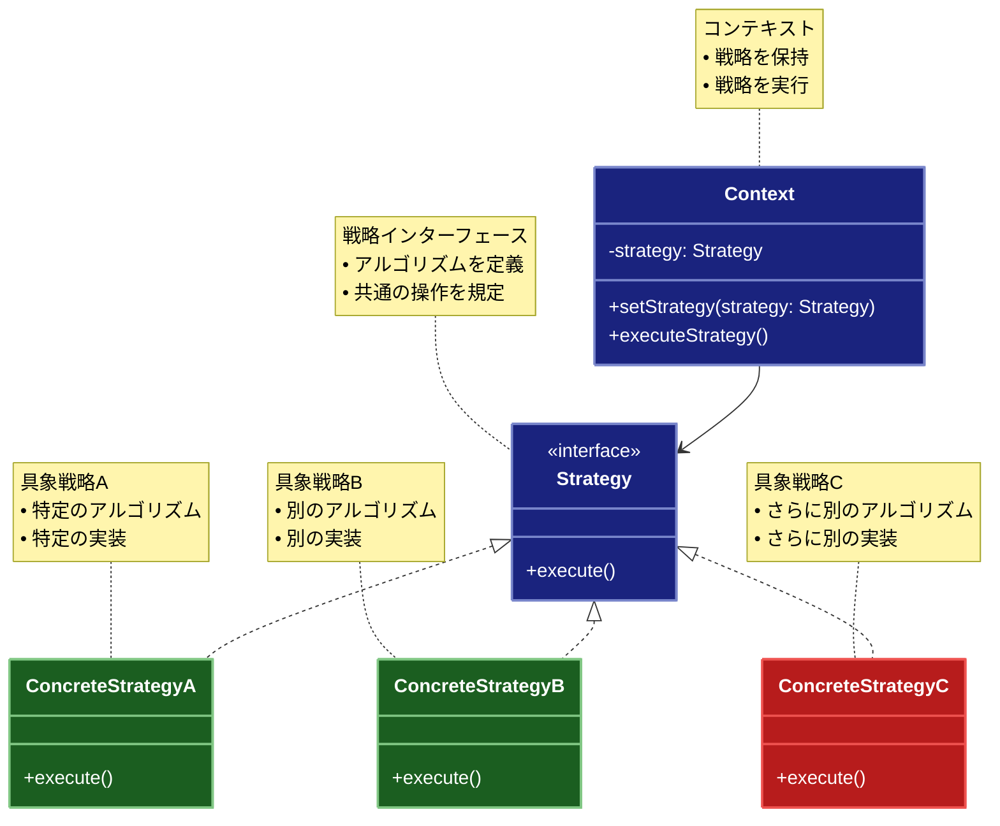

# Strategy（ストラテジー）パターン

## 目的

アルゴリズムをカプセル化し、それらを互いに交換可能にするパターンです。

## 価値・解決する問題

- アルゴリズムを動的に切り替えられます
- アルゴリズムの実装を分離できます
- 条件分岐を減らせます
- 新しいアルゴリズムの追加が容易です
- アルゴリズムの再利用が可能です

## 概要・特徴

### 概要

Strategyパターンは、アルゴリズムをカプセル化し、それらを実行時に切り替え可能にすることで、柔軟なアルゴリズムの選択を可能にする設計パターンです。このパターンでは、アルゴリズムのファミリーを定義し、各アルゴリズムをカプセル化して交換可能にします。クライアントからアルゴリズムの実装を隠蔽することで、アルゴリズムを使用するクライアントコードとは独立して変更できるようになります。

### 特徴

#### アルゴリズムの分離
Strategyパターンの中核的な特徴は、各アルゴリズムを個別のクラスにカプセル化することです。これにより、アルゴリズムの実装がクライアントコードから明確に分離され、それぞれが独立して進化できるようになります。例えば、テキストフォーマット変換のアプリケーションでは、HTML変換、Markdown変換、プレーンテキスト変換などの異なる変換アルゴリズムを別々のストラテジークラスとして実装できます。これにより、新しいフォーマット（例：JSONやXML）のサポートを追加する際に、既存のコードを変更することなく、新しいストラテジークラスを追加するだけで済みます。また、特定のアルゴリズムに問題が見つかった場合でも、そのストラテジークラスのみを修正すればよいため、変更の影響範囲が限定されます。テスト面でも大きなメリットがあり、各アルゴリズムを単独でテストできるため、複雑なアルゴリズムの検証が容易になります。この分離により、開発チームは専門分野ごとに担当を分けて並行して作業することも可能になり、開発効率が向上します。

#### 動的な切り替え
Strategyパターンの重要な特性は、実行時にアルゴリズムを動的に切り替えられることです。クライアントは状況やユーザーの要求に応じて、最適なアルゴリズムを選択し適用できます。例えば、ナビゲーションアプリケーションでは、ユーザーが「最短距離」「最短時間」「燃費効率最大」などの異なる経路計算アルゴリズムを選択できます。また、画像処理アプリケーションでは、利用可能なメモリや処理速度に応じて、高精度だが処理時間の長いアルゴリズムと、低精度だが高速なアルゴリズムを切り替えることができます。このような動的切り替えは、特に外部条件や制約が変化するシステムで価値を発揮します。例えば、サーバーの負荷に応じて異なるデータ処理アルゴリズムを使用したり、ユーザーの権限レベルによって異なる認証アルゴリズムを適用したりできます。また、A/Bテストの実装も容易になり、異なるアルゴリズムのパフォーマンスを運用環境で評価することができます。この動的切り替え機能により、システムの柔軟性と適応性が大幅に向上し、ユーザー体験のカスタマイズも可能になります。

#### 条件分岐の削減
Strategyパターンを適用する最も一般的な動機の一つは、複雑な条件分岐（if-elseやswitch文）をオブジェクト指向の委譲に置き換えることです。これにより、コードの複雑性が大幅に軽減され、読みやすさと保守性が向上します。例えば、支払い処理システムでは、クレジットカード、PayPal、銀行振込など、様々な支払い方法に対応するために、従来は長い条件分岐が使われていましたが、Strategyパターンを使用すると、各支払い方法を独立したストラテジークラスとして実装できます。これにより、条件分岐が排除され、新しい支払い方法の追加も容易になります。また、税金計算システムでは、地域や商品カテゴリによって異なる税率計算ロジックを、条件分岐ではなく個々のストラテジーとして実装できます。これにより、税法の変更があった場合も、影響を受けるストラテジーのみを修正すればよく、他のコードへの影響を最小限に抑えられます。条件分岐を削減することで得られる別の利点として、分岐の漏れや重複による論理エラーのリスクが減少し、コードの信頼性が向上します。また、各ストラテジーの責任が明確になるため、コードベースの理解や新機能の追加も容易になります。

#### 拡張性の向上
Strategyパターンは、Open-Closed原則（拡張に対しては開いていて、修正に対しては閉じている）を実践するための効果的な方法です。新しい要件やアルゴリズムが発生した場合、既存のコードを変更することなく、新しいストラテジークラスを追加するだけでシステムを拡張できます。例えば、データ圧縮アプリケーションでは、ZIP、GZIP、BZIP2などの既存の圧縮アルゴリズムに加えて、新たに開発された高効率の圧縮アルゴリズムを、既存コードに影響を与えることなく追加できます。また、機械学習システムでは、新しい分類アルゴリズムや予測モデルを、システムのコアロジックを変更せずに統合できます。この拡張性は、特に長期的なメンテナンスが必要なシステムや、進化し続ける技術領域のアプリケーションで重要です。クライアントコードを保護しながら新機能を追加できるため、リグレッションのリスクが低減し、継続的な改善が容易になります。さらに、新機能のリリースサイクルも短縮できるため、市場の変化や顧客の要求に迅速に対応できるようになります。Strategyパターンによる拡張性の向上は、アプリケーションのライフサイクル全体を通して、開発とメンテナンスのコストを削減する効果があります。

#### 再利用性の向上
Strategyパターンでは、アルゴリズムが独立したクラスとして実装されるため、異なるアプリケーションやコンテキストで容易に再利用できるようになります。例えば、ソート機能を提供するストラテジークラス群（クイックソート、マージソート、ヒープソートなど）は、データ分析アプリケーション、ファイル管理システム、データベースクエリエンジンなど、様々な種類のアプリケーションで共通して利用できます。また、暗号化アルゴリズムのストラテジー（AES、RSA、Blowfishなど）も、セキュアメッセージングアプリ、ファイル暗号化ツール、セキュリティフレームワークなど多様なシステムで再利用可能です。こうしたアルゴリズムを共通のライブラリやモジュールとして提供することで、開発チームは重複実装を避け、品質の高い検証済みのコードを活用できます。さらに、特定のアルゴリズムに改善や最適化が行われた場合、そのストラテジーを使用するすべてのアプリケーションが自動的にその恩恵を受けることができます。再利用性の向上は、特に複数のプロジェクトを抱える組織や、マイクロサービスアーキテクチャを採用している環境で大きな価値をもたらします。共通のアルゴリズムライブラリを構築することで、新しいサービスや機能の開発速度が向上し、組織全体での知識共有も促進されます。また、各ストラテジーの実装が標準化されることで、コードの一貫性が保たれ、他の開発者にとっても理解しやすい設計となります。

### 概要図



## 類似パターンとの比較

- [State (ステート)](state.md): Strategy はアルゴリズムの切り替えに焦点を当て、これに対して State は状態に応じた振る舞いの変更に注力します。
- [Command (コマンド)](command.md): Strategy はアルゴリズムの切り替えを提供し、これに対して Command は操作のカプセル化に注力します。
- [Template Method (テンプレートメソッド)](template-method.md): Strategy は実行時のアルゴリズム切り替えを提供し、これに対して Template Method は継承による振る舞いの変更を提供します。

## 利用されているライブラリ／フレームワークの事例

- [Spring Framework](https://spring.io/): 認証戦略の実装
- [Passport.js](http://www.passportjs.org/): 認証戦略の実装
- [Java Collections](https://docs.oracle.com/javase/8/docs/api/java/util/Collections.html): ソートアルゴリズム

## 解説ページリンク

- [Refactoring Guru - Strategy Pattern](https://refactoring.guru/design-patterns/strategy)
- [SourceMaking - Strategy Pattern](https://sourcemaking.com/design_patterns/strategy)
- [Design Patterns - Strategy Pattern](https://www.oodesign.com/strategy-pattern.html)

## コード例

### Before:

条件分岐によるアルゴリズムの実装

```typescript
class PaymentProcessor {
  processPayment(amount: number, paymentType: string): void {
    switch (paymentType) {
      case "credit-card":
        console.log(`クレジットカードで${amount}円を支払い`);
        break;
      case "paypal":
        console.log(`PayPalで${amount}円を支払い`);
        break;
      case "bank-transfer":
        console.log(`銀行振込で${amount}円を支払い`);
        break;
      default:
        throw new Error("未対応の支払い方法です");
    }
  }
}

// 使用例
const processor = new PaymentProcessor();
processor.processPayment(1000, "credit-card");
processor.processPayment(2000, "paypal");
```

### After:

Strategyパターンを関数型プログラミングスタイルで適用した実装

```typescript
// 支払い戦略の型定義
type PaymentStrategy = {
  pay: (amount: number) => Promise<boolean>
  validate: () => boolean
  getName: () => string
  getDescription: () => string
  getTransactionFee: (amount: number) => number
}

// 各種支払い方法のファクトリ関数

// クレジットカード支払い戦略のファクトリ関数
const createCreditCardStrategy = (
  cardNumber: string,
  expiryDate: string,
  cvv: string,
  cardHolderName: string
): PaymentStrategy => {
  // カード番号をマスクする純粋関数
  const maskCardNumber = (cardNum: string): string => 
    `****-****-****-${cardNum.slice(-4)}`

  // 検証用の純粋関数
  const validateCard = (
    cardNum: string,
    expiry: string,
    cardCvv: string,
    holderName: string
  ): boolean => 
    cardNum.length === 16 &&
    expiry.match(/^\d{2}\/\d{2}$/) !== null &&
    cardCvv.length === 3 &&
    holderName.length > 0

  return {
    pay: async (amount: number): Promise<boolean> => {
      if (!validateCard(cardNumber, expiryDate, cvv, cardHolderName)) {
        throw new Error('無効なクレジットカード情報です')
      }

      console.log(`クレジットカードで${amount}円を支払い`)
      console.log(`カード番号: ${maskCardNumber(cardNumber)}`)
      console.log(`有効期限: ${expiryDate}`)
      console.log(`カード名義: ${cardHolderName}`)

      // 実際の支払い処理をシミュレート（副作用）
      return new Promise(resolve => {
        setTimeout(() => resolve(true), 1000)
      })
    },
    
    validate: () => validateCard(cardNumber, expiryDate, cvv, cardHolderName),
    
    getName: () => 'クレジットカード',
    
    getDescription: () => `クレジットカード (${maskCardNumber(cardNumber)})`,
    
    getTransactionFee: (amount: number) => Math.floor(amount * 0.035) // 3.5%の手数料
  }
}

// PayPal支払い戦略のファクトリ関数
const createPayPalStrategy = (
  email: string,
  password: string
): PaymentStrategy => {
  // 検証用の純粋関数
  const validatePayPal = (mail: string, pass: string): boolean => 
    mail.includes('@') && pass.length >= 8

  return {
    pay: async (amount: number): Promise<boolean> => {
      if (!validatePayPal(email, password)) {
        throw new Error('無効なPayPal認証情報です')
      }

      console.log(`PayPalで${amount}円を支払い`)
      console.log(`メールアドレス: ${email}`)

      // 実際の支払い処理をシミュレート
      return new Promise(resolve => {
        setTimeout(() => resolve(true), 1500)
      })
    },
    
    validate: () => validatePayPal(email, password),
    
    getName: () => 'PayPal',
    
    getDescription: () => `PayPal (${email})`,
    
    getTransactionFee: (amount: number) => Math.floor(amount * 0.029) + 30 // 2.9% + 30円の手数料
  }
}

// 銀行振込支払い戦略のファクトリ関数
const createBankTransferStrategy = (
  bankName: string,
  accountNumber: string,
  accountName: string
): PaymentStrategy => {
  // 検証用の純粋関数
  const validateBankInfo = (
    bank: string,
    accNum: string,
    accName: string
  ): boolean => 
    bank.length > 0 && accNum.length > 0 && accName.length > 0

  return {
    pay: async (amount: number): Promise<boolean> => {
      if (!validateBankInfo(bankName, accountNumber, accountName)) {
        throw new Error('無効な銀行口座情報です')
      }

      console.log(`銀行振込で${amount}円を支払い`)
      console.log(`銀行名: ${bankName}`)
      console.log(`口座番号: ${accountNumber}`)
      console.log(`口座名義: ${accountName}`)

      // 実際の支払い処理をシミュレート
      return new Promise(resolve => {
        setTimeout(() => resolve(true), 2000)
      })
    },
    
    validate: () => validateBankInfo(bankName, accountNumber, accountName),
    
    getName: () => '銀行振込',
    
    getDescription: () => `銀行振込 (${bankName})`,
    
    getTransactionFee: () => 440 // 固定手数料440円
  }
}

// 暗号通貨支払い戦略のファクトリ関数
const createCryptoStrategy = (
  walletAddress: string,
  cryptoType: string
): PaymentStrategy => {
  // 検証用の純粋関数
  const validateWallet = (wallet: string): boolean => 
    wallet.length === 42 && wallet.startsWith('0x')

  // ウォレットアドレスを短縮表示する純粋関数
  const shortenWalletAddress = (wallet: string): string => 
    `${wallet.slice(0, 6)}...${wallet.slice(-4)}`

  return {
    pay: async (amount: number): Promise<boolean> => {
      if (!validateWallet(walletAddress)) {
        throw new Error('無効な暗号通貨ウォレット情報です')
      }

      console.log(`${cryptoType}で${amount}円相当を支払い`)
      console.log(`ウォレットアドレス: ${walletAddress}`)

      // 実際の支払い処理をシミュレート
      return new Promise(resolve => {
        setTimeout(() => resolve(true), 3000)
      })
    },
    
    validate: () => validateWallet(walletAddress),
    
    getName: () => cryptoType,
    
    getDescription: () => `${cryptoType} (${shortenWalletAddress(walletAddress)})`,
    
    getTransactionFee: (amount: number) => {
      // ガス代を想定した変動手数料
      const baseGas = 5000
      return Math.floor(baseGas * (1 + amount / 100000))
    }
  }
}

// 支払い処理関数（純粋関数ではない - 副作用を持つ）
const processPayment = async (
  strategy: PaymentStrategy,
  amount: number
): Promise<boolean> => {
  console.log(`\n=== ${strategy.getName()}での支払い処理開始 ===`)
  console.log(`支払い金額: ${amount}円`)
  
  const fee = strategy.getTransactionFee(amount)
  console.log(`取引手数料: ${fee}円`)
  console.log(`合計金額: ${amount + fee}円`)

  try {
    const result = await strategy.pay(amount + fee)
    if (result) {
      console.log('支払い処理が完了しました')
    }
    return result
  } catch (error) {
    console.error('支払い処理でエラーが発生しました:', error)
    return false
  }
}

// 注文処理関数
const processOrder = async (
  items: ReadonlyArray<{ readonly name: string; readonly price: number }>,
  payStrategy: PaymentStrategy
): Promise<boolean> => {
  // 合計金額の計算（reduce を使った関数型アプローチ）
  const total = items.reduce((sum, item) => sum + item.price, 0)
  
  console.log('\n=== 注文内容 ===')
  // map関数を使った副作用
  items.forEach(item => {
    console.log(`${item.name}: ${item.price}円`)
  })
  console.log(`小計: ${total}円`)

  return processPayment(payStrategy, total)
}

// 戦略を切り替える関数
const withNewStrategy = (
  oldStrategy: PaymentStrategy,
  newStrategy: PaymentStrategy
): PaymentStrategy => newStrategy

// 使用例
const example = async (): Promise<void> => {
  // 各支払い戦略の作成
  const creditCard = createCreditCardStrategy(
    '1234567890123456',
    '12/25',
    '123',
    'YAMADA TARO'
  )

  const paypal = createPayPalStrategy(
    'user@example.com',
    'password123'
  )

  const bankTransfer = createBankTransferStrategy(
    'サンプル銀行',
    '1234567',
    'ヤマダ タロウ'
  )

  const crypto = createCryptoStrategy(
    '0x742d35Cc6634C0532925a3b844Bc454e4438f44e',
    'Ethereum'
  )

  // 不変の注文アイテム配列
  const items = Object.freeze([
    { name: '商品A', price: 1000 },
    { name: '商品B', price: 2000 },
    { name: '商品C', price: 3000 }
  ])

  try {
    // クレジットカードでの支払い
    console.log('\n=== クレジットカードでの支払い ===')
    await processOrder(items, creditCard)

    // PayPalでの支払い
    console.log('\n=== PayPalでの支払い ===')
    await processOrder(items, paypal)

    // 銀行振込での支払い
    console.log('\n=== 銀行振込での支払い ===')
    await processOrder(items, bankTransfer)

    // 暗号通貨での支払い
    console.log('\n=== 暗号通貨での支払い ===')
    await processOrder(items, crypto)

    // 支払い戦略の動的な切り替え
    console.log('\n=== 支払い戦略の切り替え ===')
    // 元の戦略から新しい戦略への切り替え（不変性を保持）
    const newStrategy = withNewStrategy(creditCard, paypal)
    await processOrder(items, newStrategy)

  } catch (error) {
    console.error('エラー:', error)
  }
}

// 実行
example()

