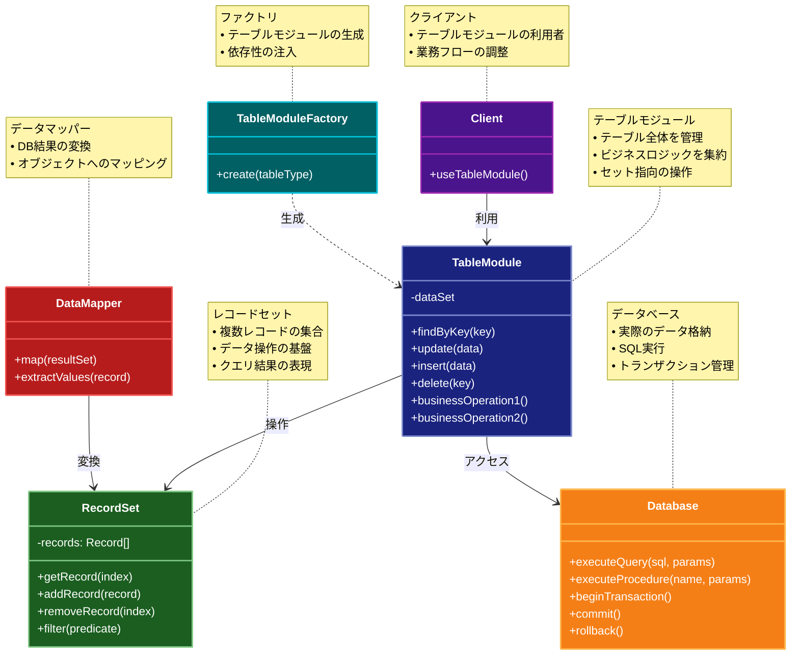

# Table Module（テーブルモジュール）パターン

## 目的

データベースのテーブルに対応する 1 つのクラスでそのテーブルに関連するすべてのビジネスロジックを管理します。

## 解決する問題・価値

- テーブル単位でのビジネスロジックの集約
- データとロジックの密接な結合
- 中規模アプリケーションでの保守性向上
- データベース操作の一貫性確保
- テーブル単位でのトランザクション管理の容易さ

## 概要・特徴

### 概要

Table Moduleパターンは、データベースの1つのテーブルに対して1つのクラスを作成し、そのテーブルに関連するすべてのビジネスロジックをそのクラスに集約するアプローチです。レコードセット全体を操作し、データとその操作を密接に結びつけます。

### 特徴

#### データベーステーブルとクラスの1対1の対応
- 各データベーステーブルに対して1つのクラスが作成され、明確な対応関係が維持されます。
- データベーススキーマの変更とクラスの変更が密接に関連付けられるため、整合性が保たれやすくなります。
- テーブル構造を反映したインターフェースを提供し、データアクセスの抽象化層として機能します。
- スキーマの変更がコードに与える影響範囲が明確になり、変更管理が容易になります。

#### テーブル全体に対する操作の提供
- 1つのレコードだけでなく、テーブル全体に対する操作メソッドを提供します。
- 集計関数や複数レコードに対する一括処理などを効率的に実装できます。
- クエリフィルタリングやソートなどのテーブル全体に対する操作が自然に表現できます。
- レコードのコレクションを扱うAPIを提供し、セット指向の操作が可能になります。

#### ビジネスロジックの集約
- 特定のテーブルに関連するすべてのビジネスロジックが1つのクラスに集約されます。
- 関連するロジックを見つけやすくなり、コードの可読性と保守性が向上します。
- 重複コードが減少し、ビジネスルールの一貫性が確保されます。
- 機能追加時に、影響範囲が明確で、適切なモジュールに実装すべきことが分かりやすくなります。

#### データセット指向のアプローチ
- 個々のオブジェクトではなく、データセットを操作する指向性を持ちます。
- 複数のレコードを一度に処理するバッチ処理に適しています。
- レポート生成やデータ分析など、セット操作が多い用途に効果的です。
- クエリ結果全体を扱う処理が自然に記述できます。

#### データベース構造との密接な結合
- アプリケーションの構造がデータベース設計に強く影響されます。
- パフォーマンスチューニングや最適化がデータベースレベルで行いやすくなります。
- データベースの特性を活かした実装ができ、効率的なデータ操作が可能になります。
- ORM（オブジェクトリレーショナルマッピング）の中間レベルの抽象化を提供します。

### 概要図



## コード例

### Before（テーブルモジュールパターン適用前）

```typescript
// 散在したビジネスロジック
function calculateOrderTotal(orderId: string) {
  const items = db.query("SELECT * FROM order_items WHERE order_id = ?", [
    orderId,
  ]);
  return items.reduce((total, item) => total + item.price * item.quantity, 0);
}

function updateOrderStatus(orderId: string, status: string) {
  db.query("UPDATE orders SET status = ? WHERE id = ?", [status, orderId]);
}

function getOrdersByCustomer(customerId: string) {
  return db.query("SELECT * FROM orders WHERE customer_id = ?", [customerId]);
}
```

### After（テーブルモジュールパターン適用後）

```typescript
class OrdersModule {
  private db: Database;

  constructor(db: Database) {
    this.db = db;
  }

  async calculateTotal(orderId: string): Promise<number> {
    const items = await this.db.query(
      "SELECT * FROM order_items WHERE order_id = ?",
      [orderId]
    );
    return items.reduce((total, item) => total + item.price * item.quantity, 0);
  }

  async updateStatus(orderId: string, status: string): Promise<void> {
    await this.db.query("UPDATE orders SET status = ? WHERE id = ?", [
      status,
      orderId,
    ]);
  }

  async getByCustomer(customerId: string): Promise<Order[]> {
    return await this.db.query("SELECT * FROM orders WHERE customer_id = ?", [
      customerId,
    ]);
  }

  async create(order: OrderData): Promise<string> {
    const orderId = await this.db.query(
      "INSERT INTO orders (customer_id, status, created_at) VALUES (?, ?, ?)",
      [order.customerId, "PENDING", new Date()]
    );
    return orderId;
  }

  async addItem(orderId: string, item: OrderItemData): Promise<void> {
    await this.db.query(
      "INSERT INTO order_items (order_id, product_id, quantity, price) VALUES (?, ?, ?, ?)",
      [orderId, item.productId, item.quantity, item.price]
    );

    const total = await this.calculateTotal(orderId);
    await this.db.query("UPDATE orders SET total = ? WHERE id = ?", [
      total,
      orderId,
    ]);
  }

  async validateOrder(orderId: string): Promise<boolean> {
    const order = await this.db.query("SELECT * FROM orders WHERE id = ?", [
      orderId,
    ]);
    const items = await this.db.query(
      "SELECT * FROM order_items WHERE order_id = ?",
      [orderId]
    );

    if (!order || items.length === 0) {
      return false;
    }

    const total = await this.calculateTotal(orderId);
    return total > 0;
  }
}

// 使用例
async function processOrder(orderData: OrderData, items: OrderItemData[]) {
  const ordersModule = new OrdersModule(db);

  const orderId = await ordersModule.create(orderData);

  for (const item of items) {
    await ordersModule.addItem(orderId, item);
  }

  if (await ordersModule.validateOrder(orderId)) {
    await ordersModule.updateStatus(orderId, "CONFIRMED");
  } else {
    await ordersModule.updateStatus(orderId, "INVALID");
  }
}
```

## 類似パターンとの比較

- [Domain Model（ドメインモデル）](domain-model.md): Table Module はデータベースのテーブル構造に密接に結びついており、テーブルごとにクラスを作成するのに対し、Domain Model はビジネス概念ごとにクラスを作成し複雑なドメインロジックを表現します。
- [Transaction Script（トランザクションスクリプト）](transaction-script.md): Table Module はテーブル単位でロジックを集約し再利用性を高めるのに対し、Transaction Script は各ビジネストランザクションを独立した手続きとして実装します。
- [Active Record（アクティブレコード）](active-record.md): Table Module はテーブル全体を 1 つのクラスで管理しテーブル単位の操作を提供するのに対し、Active Record は各レコードをオブジェクトとして表現しレコード単位の操作を提供します。

## 利用されているフレームワーク/ライブラリの例

- [ASP.NET](https://dotnet.microsoft.com/apps/aspnet)の DataSet と TableAdapter
- [Drupal](https://www.drupal.org/)のデータベース抽象化層
- [Django](https://www.djangoproject.com/)の Manager classes
- [Knex.js](https://knexjs.org/)の Query Builder
