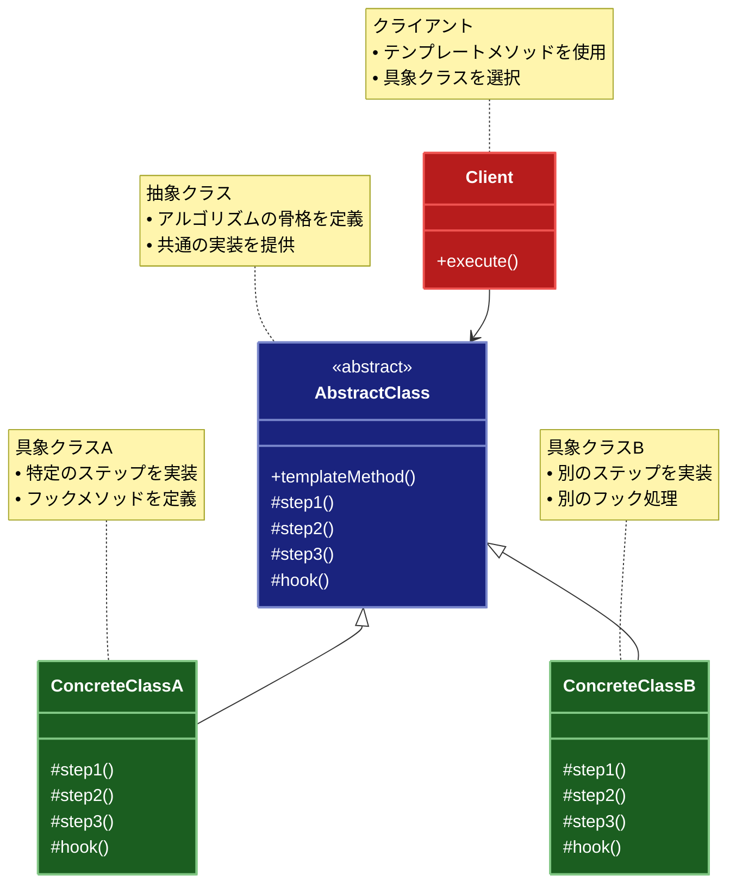

# Template Method（テンプレートメソッド）パターン

## 目的

アルゴリズムの骨格を定義し、一部のステップをサブクラスで実装できるようにするパターンです。

## 価値・解決する問題

- アルゴリズムの共通部分を再利用できます
- サブクラスで特定の処理を変更できます
- コードの重複を避けられます
- 処理の順序を固定できます
- 拡張ポイントを明確にできます

## 概要・特徴

### 概要

Template Methodパターンは、アルゴリズムの骨格を抽象クラスで定義し、具体的な実装の一部をサブクラスに委ねることで、アルゴリズムの構造を保ちながら柔軟な拡張を可能にする設計パターンです。このパターンでは、アルゴリズムの共通的な部分は親クラスで一度だけ定義し、変化する部分のみをサブクラスで実装します。これにより、共通部分のコードの重複を減らしつつ、アルゴリズムの特定のステップをサブクラスでカスタマイズできるようになります。特にフレームワーク設計やライブラリの拡張性を高めるために頻繁に使用されるパターンです。

### 特徴

#### アルゴリズムの骨格定義

親クラスでアルゴリズムの全体的な流れを定義し、その中の特定のステップを抽象メソッドとして宣言します。これにより、アルゴリズムの構造が明確に表現され、全体の流れを一箇所で管理できるようになります。例えば、ドキュメント処理のフローや、データベース操作の手順など、一連の決まった手順を持つ処理に適しています。アルゴリズムの概要が親クラスに集約されることで、プログラム全体の見通しが良くなります。

#### 処理の共通化

アルゴリズムの共通部分を親クラスに実装することで、サブクラス間でのコードの重複を防ぎます。これにより、共通処理の修正が必要になった場合も、親クラスの一箇所を変更するだけで済むため、保守性が向上します。例えば、複数のレポート生成クラスがあった場合、ヘッダーやフッターなどの共通要素を親クラスで一度だけ実装することで、各サブクラスでの実装の重複を避けられます。

#### 拡張ポイントの提供

サブクラスで実装すべき抽象メソッドとオプションで上書き可能なフックメソッドを提供することで、明確な拡張ポイントを定義します。抽象メソッドは必ずサブクラスで実装する必要がある部分で、フックメソッドはデフォルトの実装を持ち、必要に応じてサブクラスでカスタマイズできる部分です。これにより、開発者はどこをカスタマイズすべきかが明確になり、拡張時のミスが減少します。例えば、UIコンポーネントのライフサイクルメソッドや、ゲームエンジンのイベントハンドラなどが該当します。

#### 順序の保証

テンプレートメソッドではアルゴリズムの各ステップの実行順序が親クラスによって保証されるため、サブクラスがこの順序を乱すことがありません。これは、特定の順序で実行する必要がある処理や、前提条件が必要な処理に重要です。例えば、初期化、処理、クリーンアップといった順序が重要なケースや、トランザクション処理のような原子性が求められる処理に適しています。この特徴により、サブクラスの開発者は順序について心配することなく、各ステップの具体的な実装に集中できます。

#### コードの再利用

Template Methodパターンは、継承を通じてコードの再利用を促進します。共通のアルゴリズム構造や振る舞いを親クラスで一度定義することで、それを継承するすべてのサブクラスでその機能を再利用できます。例えば、データ分析アプリケーションでは、様々なデータ処理パイプライン（データの読み込み、前処理、分析、結果の出力）の共通構造を抽象クラスで定義し、特定のデータ形式やアルゴリズムに対応したサブクラスでそれを拡張できます。この方法により、新しいデータ形式や分析手法が追加されても、パイプラインの基本構造は維持されます。また、フレームワークやライブラリの設計では、ユーザーに特定の機能をカスタマイズさせつつ、正しい使用方法を強制するために利用されます。例えば、Webフレームワークではリクエスト処理の流れ（認証、バリデーション、ビジネスロジック、レスポンス生成）を定義し、開発者は特定のステップのみを実装することでフレームワークの機能を活用できます。このコードの再利用により、開発効率が向上し、アプリケーション全体の一貫性が保たれます。

#### 変更部分の制限

Template Methodパターンは、サブクラスが変更できる部分を意図的に制限することで、システムの安定性と一貫性を確保します。アルゴリズムの構造や重要な処理順序は親クラスで固定され、サブクラスは特定の抽象メソッドやフックメソッドのみを実装できます。これにより、フレームワークやライブラリの設計者はユーザーが意図せずシステムの基本動作を破壊することを防ぎながら、必要な柔軟性を提供できます。例えば、単体テストフレームワークでは、テストの設定（setUp）、実行、終了処理（tearDown）といった流れを固定し、開発者はテスト内容のみを定義します。また、金融システムでは、取引処理の流れ（入力検証、権限確認、実行、ログ記録、通知）を固定し、特定の取引タイプに応じた処理のみをカスタマイズ可能にすることで、重要なビジネスルールやセキュリティ要件の遵守を保証します。この「制限された自由」というアプローチにより、拡張性を提供しながらも、システム全体の整合性とセキュリティを維持することができます。これは特に大規模なシステムや、複数の開発者やチームが関わるプロジェクトにおいて価値があります。

### 概要図



## 類似パターンとの比較

- [Strategy (ストラテジー)](strategy.md): Template Method は継承による振る舞いの変更を提供し、これに対して Strategy は実行時のアルゴリズム切り替えを提供します。
- [Factory Method (ファクトリーメソッド)](factory-method.md): Template Method はアルゴリズムの骨格を定義し、これに対して Factory Method はオブジェクト生成の骨格を定義します。
- [Command (コマンド)](command.md): Template Method は処理の流れを定義し、これに対して Command は操作のカプセル化に注力します。

## 利用されているライブラリ／フレームワークの事例

- [Spring Framework](https://spring.io/): JdbcTemplate
- [Java Collections](https://docs.oracle.com/javase/8/docs/api/java/util/AbstractList.html): AbstractList
- [React](https://reactjs.org/): Component Lifecycle Methods

## 解説ページリンク

- [Refactoring Guru - Template Method Pattern](https://refactoring.guru/design-patterns/template-method)
- [SourceMaking - Template Method Pattern](https://sourcemaking.com/design_patterns/template_method)
- [Design Patterns - Template Method Pattern](https://www.oodesign.com/template-method-pattern.html)

## コード例

### Before:

処理の流れが重複している実装

```typescript
// データ処理クラス（CSVファイル用）
class CSVDataProcessor {
  process(filePath: string): void {
    console.log("CSVファイルの処理を開始します");

    // ファイルを読み込む
    console.log(`${filePath}を読み込んでいます...`);
    const data = this.readCSVFile(filePath);

    // データを検証
    console.log("データを検証しています...");
    if (!this.validateCSVData(data)) {
      throw new Error("CSVデータの検証に失敗しました");
    }

    // データを変換
    console.log("データを変換しています...");
    const transformedData = this.transformCSVData(data);

    // データを保存
    console.log("データを保存しています...");
    this.saveCSVData(transformedData);

    console.log("CSVファイルの処理が完了しました");
  }

  private readCSVFile(filePath: string): string[] {
    // CSVファイルを読み込む処理
    return ["header1,header2", "data1,data2", "data3,data4"];
  }

  private validateCSVData(data: string[]): boolean {
    // CSVデータを検証する処理
    return data.length > 0 && data[0].includes(",");
  }

  private transformCSVData(data: string[]): string[] {
    // CSVデータを変換する処理
    return data.map(line => line.toUpperCase());
  }

  private saveCSVData(data: string[]): void {
    // CSVデータを保存する処理
    console.log("変換されたデータ:", data);
  }
}

// データ処理クラス（JSONファイル用）
class JSONDataProcessor {
  process(filePath: string): void {
    console.log("JSONファイルの処理を開始します");

    // ファイルを読み込む
    console.log(`${filePath}を読み込んでいます...`);
    const data = this.readJSONFile(filePath);

    // データを検証
    console.log("データを検証しています...");
    if (!this.validateJSONData(data)) {
      throw new Error("JSONデータの検証に失敗しました");
    }

    // データを変換
    console.log("データを変換しています...");
    const transformedData = this.transformJSONData(data);

    // データを保存
    console.log("データを保存しています...");
    this.saveJSONData(transformedData);

    console.log("JSONファイルの処理が完了しました");
  }

  private readJSONFile(filePath: string): object {
    // JSONファイルを読み込む処理
    return { key1: "value1", key2: "value2" };
  }

  private validateJSONData(data: object): boolean {
    // JSONデータを検証する処理
    return Object.keys(data).length > 0;
  }

  private transformJSONData(data: object): object {
    // JSONデータを変換する処理
    return Object.fromEntries(
      Object.entries(data).map(([key, value]) => [key, String(value).toUpperCase()])
    );
  }

  private saveJSONData(data: object): void {
    // JSONデータを保存する処理
    console.log("変換されたデータ:", data);
  }
}

// 使用例
function example() {
  const csvProcessor = new CSVDataProcessor();
  csvProcessor.process("data.csv");

  console.log("\n---\n");

  const jsonProcessor = new JSONDataProcessor();
  jsonProcessor.process("data.json");
}

example();
```

### After:

Template Methodパターンを適用した実装

```typescript
// 抽象データ処理クラス
abstract class DataProcessor<T> {
  // テンプレートメソッド
  process(filePath: string): void {
    console.log(`${this.getProcessorName()}の処理を開始します`);

    try {
      // 前処理のフック
      this.beforeProcess(filePath);

      // ファイルを読み込む
      console.log(`${filePath}を読み込んでいます...`);
      const data = this.readData(filePath);

      // データを検証
      console.log("データを検証しています...");
      if (!this.validateData(data)) {
        throw new Error(`${this.getProcessorName()}の検証に失敗しました`);
      }

      // データを変換
      console.log("データを変換しています...");
      const transformedData = this.transformData(data);

      // データを保存
      console.log("データを保存しています...");
      this.saveData(transformedData);

      // 後処理のフック
      this.afterProcess(transformedData);

      console.log(`${this.getProcessorName()}の処理が完了しました`);

    } catch (error) {
      // エラー処理のフック
      this.handleError(error);
      throw error;
    }
  }

  // 抽象メソッド（サブクラスで実装必須）
  protected abstract readData(filePath: string): T;
  protected abstract validateData(data: T): boolean;
  protected abstract transformData(data: T): T;
  protected abstract saveData(data: T): void;
  protected abstract getProcessorName(): string;

  // フックメソッド（サブクラスでオーバーライド可能）
  protected beforeProcess(filePath: string): void {
    // デフォルトの実装は何もしない
  }

  protected afterProcess(data: T): void {
    // デフォルトの実装は何もしない
  }

  protected handleError(error: Error): void {
    console.error(`エラーが発生しました: ${error.message}`);
  }
}

// CSVデータ処理クラス
class CSVDataProcessor extends DataProcessor<string[]> {
  protected readData(filePath: string): string[] {
    // CSVファイルを読み込む処理
    return ["header1,header2", "data1,data2", "data3,data4"];
  }

  protected validateData(data: string[]): boolean {
    // CSVデータを検証する処理
    if (data.length === 0) {
      throw new Error("CSVデータが空です");
    }
    if (!data[0].includes(",")) {
      throw new Error("CSVデータの形式が不正です");
    }
    return true;
  }

  protected transformData(data: string[]): string[] {
    // CSVデータを変換する処理
    return data.map(line => line.toUpperCase());
  }

  protected saveData(data: string[]): void {
    // CSVデータを保存する処理
    console.log("変換されたCSVデータ:", data);
  }

  protected getProcessorName(): string {
    return "CSVプロセッサー";
  }

  // フックメソッドのオーバーライド
  protected beforeProcess(filePath: string): void {
    console.log("CSVファイルの文字コードをチェックしています...");
  }

  protected afterProcess(data: string[]): void {
    console.log(`処理されたCSVデータの行数: ${data.length}`);
  }
}

// JSONデータ処理クラス
class JSONDataProcessor extends DataProcessor<object> {
  protected readData(filePath: string): object {
    // JSONファイルを読み込む処理
    return { key1: "value1", key2: "value2", nested: { key3: "value3" } };
  }

  protected validateData(data: object): boolean {
    // JSONデータを検証する処理
    if (Object.keys(data).length === 0) {
      throw new Error("JSONデータが空です");
    }
    return true;
  }

  protected transformData(data: object): object {
    // JSONデータを変換する処理
    return Object.fromEntries(
      Object.entries(data).map(([key, value]) => [key, String(value).toUpperCase()])
    );
  }

  protected saveData(data: object): void {
    // JSONデータを保存する処理
    console.log("変換されたJSONデータ:", data);
  }

  protected getProcessorName(): string {
    return "JSONプロセッサー";
  }

  // フックメソッドのオーバーライド
  protected beforeProcess(filePath: string): void {
    console.log("JSONファイルの構文をチェックしています...");
  }

  protected afterProcess(data: object): void {
    console.log(`処理されたJSONデータのキー数: ${Object.keys(data).length}`);
  }
}

// XMLデータ処理クラス
class XMLDataProcessor extends DataProcessor<Document> {
  protected readData(filePath: string): Document {
    // XMLファイルを読み込む処理（ここではダミーのDOMを作成）
    const parser = new DOMParser();
    const xml = `
      <?xml version="1.0" encoding="UTF-8"?>
      <root>
        <item>value1</item>
        <item>value2</item>
      </root>
    `;
    return parser.parseFromString(xml, "text/xml");
  }

  protected validateData(data: Document): boolean {
    // XMLデータを検証する処理
    const rootElement = data.documentElement;
    if (!rootElement) {
      throw new Error("XMLデータが不正です");
    }
    return true;
  }

  protected transformData(data: Document): Document {
    // XMLデータを変換する処理
    const transformNode = (node: Node): void => {
      if (node.nodeType === Node.TEXT_NODE && node.textContent) {
        node.textContent = node.textContent.toUpperCase();
      }
      node.childNodes.forEach(transformNode);
    };

    transformNode(data.documentElement);
    return data;
  }

  protected saveData(data: Document): void {
    // XMLデータを保存する処理
    const serializer = new XMLSerializer();
    console.log("変換されたXMLデータ:", serializer.serializeToString(data));
  }

  protected getProcessorName(): string {
    return "XMLプロセッサー";
  }

  // フックメソッドのオーバーライド
  protected beforeProcess(filePath: string): void {
    console.log("XMLファイルのスキーマをチェックしています...");
  }

  protected afterProcess(data: Document): void {
    console.log(`処理されたXMLデータのノード数: ${data.documentElement.childNodes.length}`);
  }
}

// 使用例
async function example() {
  try {
    // CSVデータの処理
    console.log("=== CSVデータの処理 ===");
    const csvProcessor = new CSVDataProcessor();
    csvProcessor.process("data.csv");

    console.log("\n---\n");

    // JSONデータの処理
    console.log("=== JSONデータの処理 ===");
    const jsonProcessor = new JSONDataProcessor();
    jsonProcessor.process("data.json");

    console.log("\n---\n");

    // XMLデータの処理
    console.log("=== XMLデータの処理 ===");
    const xmlProcessor = new XMLDataProcessor();
    xmlProcessor.process("data.xml");

  } catch (error) {
    console.error("処理中にエラーが発生しました:", error);
  }
}

example();
```

example();


```typescript
// テンプレートメソッドパターンを関数型プログラミングスタイルで適用した実装

// データ処理のレスポンス型
type ProcessResult<T> = {
  success: boolean
  data?: T
  error?: Error
  stats?: {
    processingTime: number
    itemCount: number
  }
}

// ファイル処理の共通インターフェース
type DataProcessorConfig<T> = {
  // 必須の操作
  processorName: string
  readData: (filePath: string) => Promise<T>
  validateData: (data: T) => boolean | Promise<boolean>
  transformData: (data: T) => T | Promise<T>
  saveData: (data: T) => Promise<void>
  
  // オプショナルのフック
  beforeProcess?: (filePath: string) => Promise<void> | void
  afterProcess?: (data: T) => Promise<void> | void
  handleError?: (error: Error) => Promise<void> | void
}

// データ処理のテンプレート関数（高階関数）
const createDataProcessor = <T>(config: DataProcessorConfig<T>) => {
  // テンプレートメソッドに相当する関数を返す
  return async (filePath: string): Promise<ProcessResult<T>> => {
    const startTime = Date.now()
    
    console.log(`${config.processorName}の処理を開始します`)
    
    try {
      // 前処理のフック（存在する場合）
      if (config.beforeProcess) {
        await config.beforeProcess(filePath)
      }
      
      // ファイルを読み込む
      console.log(`${filePath}を読み込んでいます...`)
      const data = await config.readData(filePath)
      
      // データを検証
      console.log('データを検証しています...')
      const isValid = await config.validateData(data)
      if (!isValid) {
        throw new Error(`${config.processorName}の検証に失敗しました`)
      }
      
      // データを変換
      console.log('データを変換しています...')
      const transformedData = await config.transformData(data)
      
      // データを保存
      console.log('データを保存しています...')
      await config.saveData(transformedData)
      
      // 後処理のフック（存在する場合）
      if (config.afterProcess) {
        await config.afterProcess(transformedData)
      }
      
      const processingTime = Date.now() - startTime
      const itemCount = getItemCount(transformedData)
      
      console.log(`${config.processorName}の処理が完了しました（処理時間: ${processingTime}ms）`)
      
      // 成功結果を返す
      return {
        success: true,
        data: transformedData,
        stats: {
          processingTime,
          itemCount
        }
      }
      
    } catch (error) {
      // エラー処理のフック（存在する場合）
      if (config.handleError && error instanceof Error) {
        await config.handleError(error)
      } else {
        console.error(`エラーが発生しました: ${error instanceof Error ? error.message : '不明なエラー'}`)
      }
      
      // エラー結果を返す
      return {
        success: false,
        error: error instanceof Error ? error : new Error('不明なエラーが発生しました')
      }
    }
  }
}

// アイテム数を取得するヘルパー関数
const getItemCount = <T>(data: T): number => {
  if (Array.isArray(data)) {
    return data.length
  } else if (typeof data === 'object' && data !== null) {
    return Object.keys(data).length
  } else if (typeof data === 'string') {
    return data.length
  }
  return 0
}

// 処理結果を表示するユーティリティ関数
const displayResult = <T>(result: ProcessResult<T>): void => {
  if (result.success && result.data && result.stats) {
    console.log('--- 処理結果 ---')
    console.log(`成功: ${result.success}`)
    console.log(`処理時間: ${result.stats.processingTime}ms`)
    console.log(`項目数: ${result.stats.itemCount}`)
    console.log('データ:', result.data)
  } else if (!result.success && result.error) {
    console.log('--- エラー情報 ---')
    console.log(`エラー: ${result.error.message}`)
  }
  console.log('----------------\n')
}

// CSVデータ処理の実装
const createCSVProcessor = () => {
  return createDataProcessor<string[]>({
    processorName: 'CSVプロセッサー',
    
    readData: async (filePath: string) => {
      // CSVファイルを読み込む処理（実際のコードでは非同期ファイル読み込み）
      console.log(`${filePath} からCSVデータを読み込みました`)
      return ['header1,header2', 'data1,data2', 'data3,data4']
    },
    
    validateData: (data: string[]) => {
      // CSVデータを検証する処理
      if (data.length === 0) {
        console.log('CSVデータが空です')
        return false
      }
      if (!data[0].includes(',')) {
        console.log('CSVデータの形式が不正です')
        return false
      }
      console.log('CSVデータの検証に成功しました')
      return true
    },
    
    transformData: (data: string[]) => {
      // CSVデータを変換する処理
      const transformed = data.map(line => line.toUpperCase())
      console.log('CSVデータを大文字に変換しました')
      return transformed
    },
    
    saveData: async (data: string[]) => {
      // CSVデータを保存する処理
      console.log('変換されたCSVデータの保存を完了しました')
    },
    
    // フックメソッド
    beforeProcess: (filePath: string) => {
      console.log('CSVファイルの文字コードをチェックしています...')
    },
    
    afterProcess: (data: string[]) => {
      console.log(`処理されたCSVデータの行数: ${data.length}`)
    },
    
    handleError: (error: Error) => {
      console.error(`CSVプロセッサーでエラーが発生しました: ${error.message}`)
    }
  })
}

// JSONデータ処理の実装
const createJSONProcessor = () => {
  return createDataProcessor<Record<string, any>>({
    processorName: 'JSONプロセッサー',
    
    readData: async (filePath: string) => {
      // JSONファイルを読み込む処理（実際のコードでは非同期ファイル読み込み）
      console.log(`${filePath} からJSONデータを読み込みました`)
      return { key1: 'value1', key2: 'value2', nested: { key3: 'value3' } }
    },
    
    validateData: (data: Record<string, any>) => {
      // JSONデータを検証する処理
      if (Object.keys(data).length === 0) {
        console.log('JSONデータが空です')
        return false
      }
      console.log('JSONデータの検証に成功しました')
      return true
    },
    
    transformData: (data: Record<string, any>) => {
      // JSONデータを変換する処理（ネストされたオブジェクトも処理）
      const transformValue = (value: any): any => {
        if (typeof value === 'object' && value !== null) {
          return Object.fromEntries(
            Object.entries(value).map(([k, v]) => [k, transformValue(v)])
          )
        }
        return String(value).toUpperCase()
      }
      
      const transformed = transformValue(data)
      console.log('JSONデータを大文字に変換しました')
      return transformed
    },
    
    saveData: async (data: Record<string, any>) => {
      // JSONデータを保存する処理
      console.log('変換されたJSONデータの保存を完了しました')
    },
    
    // フックメソッド
    beforeProcess: (filePath: string) => {
      console.log('JSONファイルの構文をチェックしています...')
    },
    
    afterProcess: (data: Record<string, any>) => {
      console.log(`処理されたJSONデータのキー数: ${Object.keys(data).length}`)
    }
  })
}

// XMLデータ処理の実装
const createXMLProcessor = () => {
  return createDataProcessor<string>({
    processorName: 'XMLプロセッサー',
    
    readData: async (filePath: string) => {
      // XMLファイルを読み込む処理（実際のコードでは非同期ファイル読み込み）
      console.log(`${filePath} からXMLデータを読み込みました`)
      return `
        <?xml version="1.0" encoding="UTF-8"?>
        <root>
          <item>value1</item>
          <item>value2</item>
        </root>
      `
    },
    
    validateData: (data: string) => {
      // XMLデータを検証する処理
      if (!data.includes('<root>')) {
        console.log('XMLデータが不正です')
        return false
      }
      console.log('XMLデータの検証に成功しました')
      return true
    },
    
    transformData: (data: string) => {
      // XMLデータを変換する処理（簡易的な実装）
      // 注: 実際のXML処理にはDOMパーサーを使用すべき
      const transformed = data.replace(/>([^<]+)</g, (match, p1) => 
        '>' + p1.toUpperCase() + '<'
      )
      console.log('XMLデータのテキストノードを大文字に変換しました')
      return transformed
    },
    
    saveData: async (data: string) => {
      // XMLデータを保存する処理
      console.log('変換されたXMLデータの保存を完了しました')
    },
    
    // フックメソッド
    beforeProcess: (filePath: string) => {
      console.log('XMLファイルのスキーマをチェックしています...')
    },
    
    afterProcess: (data: string) => {
      const itemCount = (data.match(/<item>/g) || []).length
      console.log(`処理されたXMLデータの<item>ノード数: ${itemCount}`)
    }
  })
}

// コンポーズ関数（関数合成）
const compose = <T>(...fns: Array<(arg: T) => Promise<T>>) => 
  async (value: T): Promise<T> => 
    fns.reduce(
      async (acc, fn) => fn(await acc),
      Promise.resolve(value)
    )

// エラーハンドリングのデコレーター
const withErrorHandling = <T, R>(fn: (arg: T) => Promise<R>) => 
  async (arg: T): Promise<R | { error: Error }> => {
    try {
      return await fn(arg)
    } catch (error) {
      console.error('エラーが捕捉されました:', error instanceof Error ? error.message : '不明なエラー')
      return { error: error instanceof Error ? error : new Error('不明なエラー') }
    }
  }

// ログ出力のデコレーター
const withLogging = <T, R>(name: string, fn: (arg: T) => Promise<R>) => 
  async (arg: T): Promise<R> => {
    console.log(`${name} - 開始`)
    const startTime = Date.now()
    const result = await fn(arg)
    const endTime = Date.now()
    console.log(`${name} - 完了 (${endTime - startTime}ms)`)
    return result
  }

// メイン処理
const functionalExample = async (): Promise<void> => {
  console.log('=== テンプレートメソッドパターン（関数型アプローチ）のデモ ===\n')
  
  // プロセッサーの作成
  const processCSV = createCSVProcessor()
  const processJSON = createJSONProcessor()
  const processXML = createXMLProcessor()
  
  // CSVデータの処理
  console.log('=== CSVデータの処理 ===')
  const csvResult = await processCSV('data.csv')
  displayResult(csvResult)
  
  // JSONデータの処理
  console.log('=== JSONデータの処理 ===')
  const jsonResult = await processJSON('data.json')
  displayResult(jsonResult)
  
  // XMLデータの処理
  console.log('=== XMLデータの処理 ===')
  const xmlResult = await processXML('data.xml')
  displayResult(xmlResult)
  
  // 関数合成とデコレーターを使用した高度な例
  console.log('=== 応用例: 関数合成とデコレーター ===')
  const enhancedJSONProcessor = withLogging('JSONプロセッサー（拡張）', 
    withErrorHandling(async (filePath: string) => {
      const processor = createJSONProcessor()
      return await processor(filePath)
    })
  )
  
  const enhancedResult = await enhancedJSONProcessor('complex.json')
  if ('error' in enhancedResult) {
    console.log('処理中にエラーが発生しました:', enhancedResult.error)
  } else {
    displayResult(enhancedResult)
  }
}

// 実行
functionalExample()
  .then(() => console.log('すべての処理が完了しました'))
  .catch(err => console.error('予期しないエラーが発生しました:', err))
```