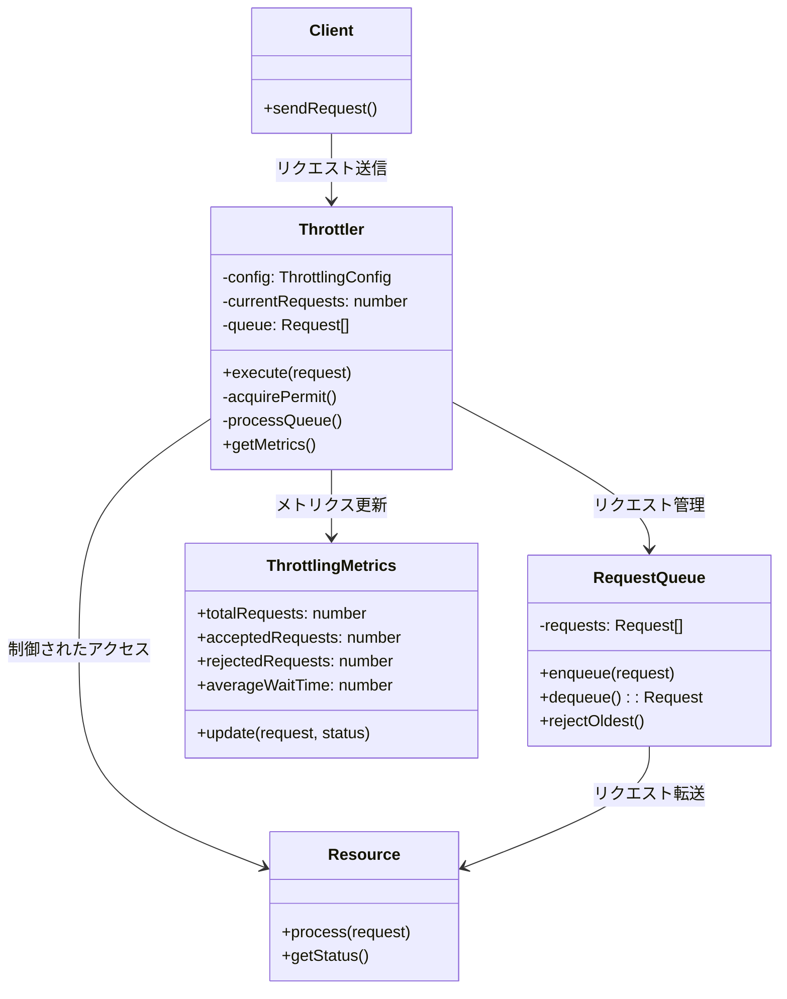

# スロットリングパターン（Throttling Pattern）

## 目的 

システムリソースへのアクセス頻度を制御し、システム負荷を適切に調整する。

## 価値・解決する問題

- システムの過負荷を防止する
- リソースの効率的な使用を実現する
- サービス品質の維持を可能にする
- 公平なリソース配分を確保する
- 予測可能なパフォーマンスを提供する

## 概要・特徴

### 概要

スロットリングパターンは、システムやサービスへのリクエスト流量を制御するためのデザインパターンです。リクエスト頻度が高すぎる場合やシステムリソースが制限に近づいた場合に、リクエストの処理速度を制限したり、一時的にリクエストを遅延させたりすることで、システム全体の安定性とパフォーマンスを確保します。

### 特徴

#### アクセス制御
システムリソースへのアクセス回数や頻度を制限することで、過負荷を防止します。設定された閾値を超えるリクエストは、遅延、キューイング、または拒否されます。リクエスト元ごとに異なる制限を設けることで、きめ細かな制御が可能になります。例えば、APIゲートウェイでは、IPアドレスやAPIキーごとに異なる制限値を設定し、重要なクライアントに優先的にリソースを割り当てることができます。また、ユーザー課金プランに応じて異なるレート制限を適用することも一般的です。効果的なアクセス制御により、DDoS攻撃などの悪意あるトラフィックからシステムを保護することも可能になります。

#### 遅延制御
リクエストの処理速度を意図的に遅くすることで、システムリソースの消費を抑制します。負荷の高い操作やリソースを多く消費する操作に対して、優先的に制限をかけることができます。応答時間よりもシステム安定性を優先する状況で特に有効です。例えば、バッチ処理やレポート生成などのリソース集約型操作に対しては、システム全体のパフォーマンスを維持するために、処理速度に制限を設けることがあります。また、段階的な遅延増加（バックオフ戦略）を実装することで、システム負荷に応じて動的に処理速度を調整することも可能です。これにより、ピーク時のパフォーマンス低下を防ぎ、一定のサービス品質を維持できます。

#### キュー管理
即時に処理できないリクエストをキューに格納し、システムが処理可能になった時点で順次処理します。キューの長さや待機時間に基づいて、リクエストの受け入れや拒否を判断します。一時的な負荷スパイクに対する耐性を向上させます。例えば、eコマースサイトでの特売セール時など、突発的なトラフィック増加に対応するために、キューベースのスロットリングを導入することがあります。キュー管理では、FIFO（先入れ先出し）だけでなく、優先度キューや公平性を考慮したキューイング戦略を採用することで、重要なリクエストが過度に遅延しないよう保証することも可能です。また、キュー内のリクエストに対して有効期限（TTL）を設定することで、古いリクエストが無期限に待機することを防ぐこともできます。

#### 優先順位付け
リクエストに優先順位を付け、重要なリクエストが低優先度のリクエストよりも先に処理されるようにします。ビジネス要件やサービスレベル契約（SLA）に基づいて、リソース配分を最適化できます。緊急性の高いリクエストに対して、スロットリング制限を緩和することも可能です。例えば、支払い処理やユーザー認証などのクリティカルな操作は、データ分析やバックグラウンド同期などの非クリティカルな操作よりも高い優先度で処理されるべきです。優先順位付けは、リクエストのタイプ、ユーザーの種類（プレミアム会員か一般ユーザーか）、ビジネス上の重要性などの要素に基づいて決定されることが多く、これにより限られたリソースの中でもビジネス価値の最大化を図ることができます。

#### メトリクス収集
リクエスト数、応答時間、拒否率などのメトリクスを収集し、スロットリング戦略の効果を評価します。収集したメトリクスに基づいて、スロットリングの設定を動的に調整することができます。システムの状態やパフォーマンスの傾向を可視化し、容量計画に役立てることができます。例えば、特定のエンドポイントへのリクエスト頻度が増加傾向にある場合、事前にスロットリング設定を見直したり、リソースを増強したりする判断材料となります。また、リアルタイムモニタリングと組み合わせることで、異常なトラフィックパターンを検出し、自動的に保護メカニズムを発動させることも可能です。適切なメトリクス収集と分析により、スロットリング設定の最適化だけでなく、システム設計自体の改善にもつながる洞察を得ることができます。

### 概要図



## 類似パターンとの比較

- **レートリミッターパターン**：単位時間あたりのリクエスト数に基づいて制限を行うのに対し、スロットリングパターンはシステムの現在の負荷状態も考慮して制限を行う点が異なります。

- **サーキットブレーカーパターン**：システムの障害を検出して回路を「開く」（リクエストを完全に遮断する）のに対し、スロットリングパターンはリクエストの流量を制御しながら処理を継続する点が異なります。

- **バルクヘッドパターン**：システムをコンパートメント化してリソースを分離するのに対し、スロットリングパターンはリクエストの流入を制御する点が異なります。

## 利用されているライブラリ／フレームワークの事例

- [Resilience4j](https://resilience4j.readme.io/): Java用の障害耐性ライブラリ
- [Polly](https://github.com/App-vNext/Polly): .NET用の回復力パターンライブラリ
- [Express Rate Limit](https://github.com/nfriedly/express-rate-limit): Express.jsのレートリミッター

## 解説ページリンク

- [Microsoft Cloud Design Patterns: Throttling](https://docs.microsoft.com/en-us/azure/architecture/patterns/throttling)
- [Rate Limiting Strategies and Techniques](https://cloud.google.com/architecture/rate-limiting-strategies-techniques)
- [Understanding Rate Limiting](https://blog.cloudflare.com/understanding-rate-limiting/)

## コード例

### Before:

スロットリング機能のない実装

```typescript
class UserService {
  private db: Map<string, any>;

  constructor() {
    this.db = new Map([
      ["1", { id: "1", name: "John Doe", email: "john@example.com" }],
      ["2", { id: "2", name: "Jane Smith", email: "jane@example.com" }]
    ]);
  }

  async getUser(id: string): Promise<any> {
    // データベースアクセスを遅延させる
    await new Promise(resolve => setTimeout(resolve, 100));

    const user = this.db.get(id);
    if (!user) {
      throw new Error("User not found");
    }
    return user;
  }

  async updateUser(id: string, data: any): Promise<any> {
    // データベースアクセスを遅延させる
    await new Promise(resolve => setTimeout(resolve, 100));

    if (!this.db.has(id)) {
      throw new Error("User not found");
    }
    const updatedUser = { ...this.db.get(id), ...data };
    this.db.set(id, updatedUser);
    return updatedUser;
  }
}

// 使用例
async function example() {
  const service = new UserService();

  try {
    // 大量のリクエストを同時に実行
    const promises = Array.from({ length: 50 }, (_, i) => 
      service.getUser(String(i % 2 + 1))
    );

    const results = await Promise.all(promises);
    console.log("結果:", results.length);
  } catch (error) {
    console.error("エラー:", error);
  }
}

example();
```

### After:

Throttlingパターンを適用した実装

```typescript
// スロットリングの設定
interface ThrottlingConfig {
  maxConcurrent: number;   // 最大同時実行数
  queueLimit: number;      // キューの最大長
  maxWaitingTime: number;  // 最大待機時間（ミリ秒）
}

// スロットリングのメトリクス
interface ThrottlingMetrics {
  totalRequests: number;    // 総リクエスト数
  acceptedRequests: number; // 受け入れられたリクエスト数
  rejectedRequests: number; // 拒否されたリクエスト数
  currentRequests: number;  // 現在のリクエスト数
  queuedRequests: number;   // キューイングされたリクエスト数
  averageWaitTime: number;  // 平均待機時間
}

// スロットリングの実装
class Throttler {
  private currentRequests: number = 0;
  private queue: Array<{
    resolve: () => void;
    reject: (error: Error) => void;
    timeout: NodeJS.Timeout;
    startTime: number;
  }> = [];
  private metrics: ThrottlingMetrics = {
    totalRequests: 0,
    acceptedRequests: 0,
    rejectedRequests: 0,
    currentRequests: 0,
    queuedRequests: 0,
    averageWaitTime: 0
  };
  private totalWaitTime: number = 0;

  constructor(private config: ThrottlingConfig) {}

  // リクエストを実行
  async execute<T>(operation: () => Promise<T>): Promise<T> {
    this.metrics.totalRequests++;
    this.metrics.currentRequests++;

    try {
      // リクエストを許可するかチェック
      await this.acquirePermit();

      // 操作を実行
      const result = await operation();

      this.metrics.acceptedRequests++;
      return result;
    } catch (error) {
      this.metrics.rejectedRequests++;
      throw error;
    } finally {
      this.metrics.currentRequests--;
      this.currentRequests--;
      this.processQueue();
    }
  }

  // リクエストの許可を取得
  private async acquirePermit(): Promise<void> {
    // 同時実行数が制限内であれば即座に許可
    if (this.currentRequests <= this.config.maxConcurrent) {
      this.currentRequests++;
      return;
    }

    // キューが制限に達している場合は拒否
    if (this.queue.length >= this.config.queueLimit) {
      throw new Error("Queue limit exceeded");
    }

    // キューに追加して待機
    const startTime = Date.now();
    return new Promise<void>((resolve, reject) => {
      const timeout = setTimeout(() => {
        const index = this.queue.findIndex(item => item.timeout === timeout);
        if (index !== -1) {
          this.queue.splice(index, 1);
          this.metrics.queuedRequests--;
          reject(new Error("Request timeout"));
        }
      }, this.config.maxWaitingTime);

      this.queue.push({ resolve, reject, timeout, startTime });
      this.metrics.queuedRequests++;
    });
  }

  // キューの処理
  private processQueue(): void {
    while (
      this.queue.length > 0 &&
      this.currentRequests < this.config.maxConcurrent
    ) {
      const { resolve, timeout, startTime } = this.queue.shift()!;
      clearTimeout(timeout);
      this.metrics.queuedRequests--;

      // 待機時間を記録
      const waitTime = Date.now() - startTime;
      this.totalWaitTime += waitTime;
      this.metrics.averageWaitTime =
        this.totalWaitTime / this.metrics.acceptedRequests;

      this.currentRequests++;
      resolve();
    }
  }

  // メトリクスを取得
  getMetrics(): ThrottlingMetrics {
    return { ...this.metrics };
  }
}

// ユーザーの型
interface User {
  id: string;
  name: string;
  email: string;
  updatedAt: number;
}

// データベースの実装
class Database {
  private db: Map<string, User>;

  constructor() {
    this.db = new Map([
      ["1", {
        id: "1",
        name: "John Doe",
        email: "john@example.com",
        updatedAt: Date.now()
      }],
      ["2", {
        id: "2",
        name: "Jane Smith",
        email: "jane@example.com",
        updatedAt: Date.now()
      }]
    ]);
  }

  async read(id: string): Promise<User> {
    // データベースアクセスを遅延させる
    await new Promise(resolve => setTimeout(resolve, 100));

    const user = this.db.get(id);
    if (!user) {
      throw new Error("User not found");
    }
    return user;
  }

  async write(id: string, user: User): Promise<void> {
    // データベースアクセスを遅延させる
    await new Promise(resolve => setTimeout(resolve, 100));

    this.db.set(id, {
      ...user,
      updatedAt: Date.now()
    });
  }
}

// スロットリング機能を持つユーザーサービス
class ThrottledUserService {
  private readThrottler: Throttler;
  private writeThrottler: Throttler;
  private db: Database;

  constructor(
    readConfig?: Partial<ThrottlingConfig>,
    writeConfig?: Partial<ThrottlingConfig>
  ) {
    this.readThrottler = new Throttler({
      maxConcurrent: 5,    // 5同時実行
      queueLimit: 10,      // キュー最大10件
      maxWaitingTime: 5000, // 最大5秒待機
      ...readConfig
    });

    this.writeThrottler = new Throttler({
      maxConcurrent: 2,    // 2同時実行
      queueLimit: 5,       // キュー最大5件
      maxWaitingTime: 10000, // 最大10秒待機
      ...writeConfig
    });

    this.db = new Database();
  }

  // ユーザーを取得
  async getUser(id: string): Promise<User> {
    return await this.readThrottler.execute(async () => {
      return await this.db.read(id);
    });
  }

  // ユーザーを更新
  async updateUser(id: string, data: Partial<User>): Promise<User> {
    return await this.writeThrottler.execute(async () => {
      const currentUser = await this.db.read(id);
      const updatedUser: User = {
        ...currentUser,
        ...data,
        id, // IDは変更不可
        updatedAt: Date.now()
      };
      await this.db.write(id, updatedUser);
      return updatedUser;
    });
  }

  // メトリクスを取得
  getMetrics(): {
    read: ThrottlingMetrics;
    write: ThrottlingMetrics;
  } {
    return {
      read: this.readThrottler.getMetrics(),
      write: this.writeThrottler.getMetrics()
    };
  }
}

// 使用例
async function example() {
  const service = new ThrottledUserService({
    maxConcurrent: 3,    // 3同時実行
    queueLimit: 5,       // キュー最大5件
    maxWaitingTime: 5000 // 最大5秒待機
  });

  try {
    console.log("=== 大量のリクエストを同時に実行 ===");
    const startTime = Date.now();

    // 20個のリクエストを同時に実行
    const promises = Array.from({ length: 20 }, (_, i) => {
      const id = String(i % 2 + 1);
      return service.getUser(id)
        .then(user => ({ status: "fulfilled", value: user }))
        .catch(error => ({ status: "rejected", reason: error.message }));
    });

    const results = await Promise.all(promises);
    const endTime = Date.now();

    console.log("\n=== 実行結果 ===");
    console.log("成功:", results.filter(r => r.status === "fulfilled").length);
    console.log("失敗:", results.filter(r => r.status === "rejected").length);
    console.log("実行時間:", endTime - startTime, "ms");
    console.log("メトリクス:", service.getMetrics());

    console.log("\n=== 1秒待機後に再度実行 ===");
    await new Promise(resolve => setTimeout(resolve, 1000));

    const user = await service.getUser("1");
    console.log("ユーザー取得成功:", user);
    console.log("メトリクス:", service.getMetrics());

  } catch (error) {
    console.error("エラー:", error);
  }
}

// 実行
example();
```
