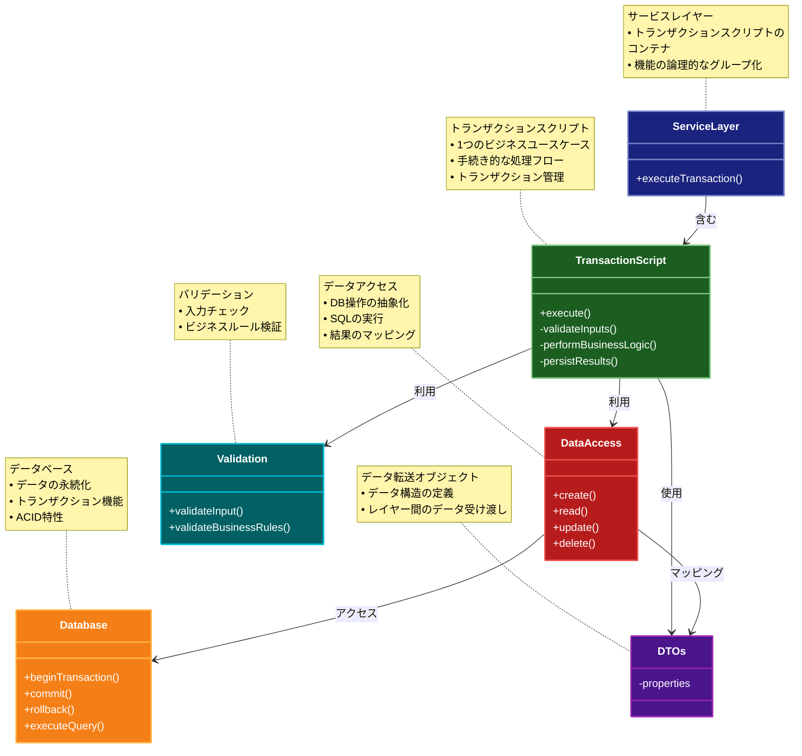

# Transaction Script（トランザクションスクリプト）パターン

## 目的

ビジネスロジックを手続き的な関数として実装し、1 つのビジネストランザクションを 1 つの関数として表現します。

## 解決する問題・価値

- シンプルなビジネスロジックの実装
- 直感的な処理フロー
- 学習コストの低さ
- デバッグの容易さ
- 小規模アプリケーションでの開発効率

## 概要・特徴

### 概要

Transaction Scriptパターンは、ビジネスロジックを手続き的な関数として実装するアプローチで、1つのビジネストランザクションを1つの関数としてまとめます。データベース操作を含む一連の処理手順をスクリプトとして記述し、トランザクションの整合性を確保します。

### 特徴

#### 手続き的なコードスタイル
Transaction Scriptパターンの最も基本的な特徴は、ビジネスロジックが手続き的に上から下へと流れるスタイルで記述される点です。オブジェクト指向の複雑な相互作用ではなく、明確なステップの連続として処理が進行します。例えば、注文処理の関数では、在庫確認、支払い処理、注文登録という手順を順次実行し、各ステップがどのように実行されるかが明示的にコードに表現されます。この直線的な処理フローにより、特に実務経験の浅い開発者でもコードを理解しやすく、実装方法も直感的です。デバッグも容易で、ブレークポイントを設定して処理の流れを順番に追うことができます。複雑なオブジェクト間の相互作用やイベント駆動型の処理と比較して、ステップごとの状態変化が予測しやすいため、問題の特定が容易になります。ただし、ビジネスロジックが複雑になるにつれて、関数が長大化したり条件分岐が増えたりする傾向があり、それに伴ってコードの可読性や保守性が低下する可能性があります。

#### 1つのビジネスユースケースを1つの関数で表現
Transaction Scriptパターンでは、「注文の作成」や「ユーザー登録」など、1つのビジネスユースケースが1つの関数またはメソッドとして明確にカプセル化されます。これにより、特定の業務処理がコードのどこに実装されているかが明確になり、開発者は機能を探すためにコードベース全体を検索する必要がなくなります。例えば、商品の出荷処理に問題が発生した場合、開発者は「shipOrder」のような名前の関数を探せば、関連するすべてのロジックがそこに集約されていることがわかります。この特性は、ドメイン駆動設計のような複雑なオブジェクトモデルよりも理解しやすく、特に短期的なプロジェクトや明確な機能要件を持つシステムに適しています。各トランザクションスクリプトは他のスクリプトから比較的独立しているため、単一の機能変更が他の機能に予期せぬ影響を与えるリスクも低減します。新しいビジネス要件が発生した場合も、既存のコードを変更せずに新しいスクリプトを追加するだけで対応できることが多く、既存機能への影響を最小限に抑えながら機能拡張できる利点があります。ただし、複数のトランザクションスクリプト間で共通のロジックが重複する傾向があり、コードの再利用性やDRY（Don't Repeat Yourself）原則の観点からは課題が生じることもあります。

#### 明確な処理フロー
Transaction Scriptパターンでは、一般的にビジネス処理が「入力検証 → ビジネスロジック処理 → データ永続化」という明確な流れに沿って実装されます。この構造により、コードの可読性が高まり、処理の各段階で何が起こっているかを理解しやすくなります。例えば、注文処理のスクリプトでは、最初に注文データの検証（商品の存在確認、数量チェックなど）を行い、次にビジネスルールの適用（割引計算、在庫減算など）を実行し、最後にデータベースへの保存を行うという明確な流れになります。エラー処理も各ステップで明示的に行われ、例えば在庫不足の場合は処理を中断し適切なエラーメッセージを返すといった制御が容易です。この明確な処理フローは、特にトランザクションの一貫性が重要なアプリケーション（会計システムや在庫管理システムなど）に適しています。また、新しいチームメンバーも処理の流れが予測しやすいため、学習コストが低く、早期から生産性を発揮できる利点があります。ただし、非同期処理や複雑なイベント処理が必要なケースでは、この直線的なアプローチでは表現力に限界が生じることもあります。

#### トランザクション整合性の確保
Transaction Scriptパターンの主要な利点の一つは、データベーストランザクションとビジネスロジックの境界が自然に一致することです。各スクリプトは一般的に単一のデータベーストランザクション内で実行され、処理の原子性が保証されます。例えば、銀行の送金処理では、送金元の残高減算と送金先の残高増加が単一のトランザクションで行われ、片方だけが成功して不整合が生じるといった問題を防ぐことができます。この特性は、特にデータの整合性が重要なビジネスアプリケーション（金融システム、在庫管理、予約システムなど）において非常に価値があります。トランザクションの境界が明確なため、ロールバック処理も実装しやすく、例外発生時にデータの一貫性を維持するための処理が記述しやすくなります。また、パフォーマンス最適化の観点からも、トランザクションの範囲が明確であるため、長時間トランザクションの回避や、必要に応じたトランザクション分割などの対策も取りやすくなります。ただし、マイクロサービスなどの分散システムでは、複数のサービスにまたがるトランザクション処理が必要になることもあり、そのような場合はSAGAパターンなどの補完的なアプローチが必要になることがあります。

#### シンプルな技術スタック
Transaction Scriptパターンは、比較的シンプルな技術スタックで実装可能です。複雑なORMやフレームワークを必要とせず、基本的なデータベースアクセス機能だけで実装できることが多いです。例えば、シンプルなDBコネクションプールとクエリ実行機能だけで、十分に効果的なトランザクションスクリプトを構築できます。これにより、特に小規模なアプリケーションや、限られた技術リソースしかない環境での開発に適しています。学習コストが低く、経験の浅い開発者でも短期間で生産性を発揮できる利点があります。また、パフォーマンスのボトルネックが発生した場合も、複雑な抽象レイヤーを経由せずに直接SQLクエリを最適化できるため、パフォーマンスチューニングが比較的容易です。アプリケーションの寿命が短い、または頻繁に変更が必要ないシステム（期間限定のプロモーションサイトやレガシーシステムの一時的な補完機能など）では、複雑なアーキテクチャよりもTransaction Scriptのシンプルさが開発効率とメンテナンスコストの観点から有利になることがあります。ただし、アプリケーションの規模が大きくなるにつれて、より構造化されたアプローチが必要になることも多く、そのような場合はDomain Modelなど他のパターンとの組み合わせや移行を検討する必要があります。

### 概要図



## コード例

### Before（トランザクションスクリプトパターン適用前）

```typescript
// 散在したビジネスロジック
class OrderProcessor {
  validateOrder(order: Order) {
    // 注文の検証ロジック
  }
}

class InventoryManager {
  checkStock(items: OrderItem[]) {
    // 在庫チェックロジック
  }
}

class PaymentProcessor {
  processPayment(order: Order) {
    // 支払い処理ロジック
  }
}

// 使用例
const orderProcessor = new OrderProcessor();
const inventoryManager = new InventoryManager();
const paymentProcessor = new PaymentProcessor();

orderProcessor.validateOrder(order);
inventoryManager.checkStock(order.items);
paymentProcessor.processPayment(order);
```

### After（トランザクションスクリプトパターン適用後）

```typescript
class OrderService {
  async processOrder(
    orderId: string,
    userId: string,
    items: Array<{id: string; quantity: number}>
  ) {
    // トランザクションを開始
    const transaction = await db.beginTransaction();

    try {
      // 注文の検証
      const order = await db.query("SELECT * FROM orders WHERE id = ?", [
        orderId,
      ]);
      if (!order) {
        throw new Error("注文が見つかりません");
      }

      // ユーザーの検証
      const user = await db.query("SELECT * FROM users WHERE id = ?", [userId]);
      if (!user) {
        throw new Error("ユーザーが見つかりません");
      }

      // 在庫のチェック
      const stockErrors = [];
      for (const item of items) {
        const [product] = await db.query(
          "SELECT * FROM products WHERE id = ? FOR UPDATE",
          [item.id]
        );
        if (!product) {
          stockErrors.push(`商品${item.id}が見つかりません`);
        } else if (product.stock < item.quantity) {
          stockErrors.push(`商品${item.id}の在庫が不足しています`);
        }
      }
      if (stockErrors.length > 0) {
        throw new Error(stockErrors.join("\n"));
      }

      // 合計金額の計算
      let totalAmount = 0;
      for (const item of items) {
        const [product] = await db.query(
          "SELECT price FROM products WHERE id = ?",
          [item.id]
        );
        totalAmount += product.price * item.quantity;
      }

      // 支払い処理
      if (user.balance < totalAmount) {
        throw new Error("残高が不足しています");
      }

      // ユーザーの残高を更新
      await db.query("UPDATE users SET balance = balance - ? WHERE id = ?", [
        totalAmount,
        userId,
      ]);

      // 在庫を更新
      for (const item of items) {
        await db.query("UPDATE products SET stock = stock - ? WHERE id = ?", [
          item.quantity,
          item.id,
        ]);
      }

      // 注文を確定
      await db.query(
        "UPDATE orders SET status = ?, total_amount = ? WHERE id = ?",
        ["CONFIRMED", totalAmount, orderId]
      );

      // 注文詳細を保存
      for (const item of items) {
        await db.query(
          "INSERT INTO order_items (order_id, product_id, quantity) VALUES (?, ?, ?)",
          [orderId, item.id, item.quantity]
        );
      }

      // トランザクションをコミット
      await transaction.commit();

      return {
        success: true,
        orderId,
        totalAmount,
      };
    } catch (error) {
      // エラーが発生した場合はロールバック
      await transaction.rollback();
      throw error;
    }
  }

  async cancelOrder(orderId: string) {
    const transaction = await db.beginTransaction();

    try {
      // 注文の取得
      const [order] = await db.query(
        "SELECT * FROM orders WHERE id = ? FOR UPDATE",
        [orderId]
      );
      if (!order) {
        throw new Error("注文が見つかりません");
      }

      if (order.status !== "CONFIRMED") {
        throw new Error("この注文はキャンセルできません");
      }

      // 注文アイテムの取得
      const orderItems = await db.query(
        "SELECT * FROM order_items WHERE order_id = ?",
        [orderId]
      );

      // 在庫を戻す
      for (const item of orderItems) {
        await db.query("UPDATE products SET stock = stock + ? WHERE id = ?", [
          item.quantity,
          item.product_id,
        ]);
      }

      // ユーザーの残高を戻す
      await db.query("UPDATE users SET balance = balance + ? WHERE id = ?", [
        order.total_amount,
        order.user_id,
      ]);

      // 注文をキャンセル
      await db.query("UPDATE orders SET status = ? WHERE id = ?", [
        "CANCELLED",
        orderId,
      ]);

      await transaction.commit();

      return {
        success: true,
        orderId,
      };
    } catch (error) {
      await transaction.rollback();
      throw error;
    }
  }
}

// 使用例
const orderService = new OrderService();

try {
  const result = await orderService.processOrder("order123", "user456", [
    {id: "product789", quantity: 2},
    {id: "product012", quantity: 1},
  ]);
  console.log("注文が完了しました:", result);
} catch (error) {
  console.error("注文処理に失敗しました:", error.message);
}
```

## 類似パターンとの比較

- [Domain Model（ドメインモデル）](domain-model.md): Transaction Script は手続き的に 1 つの関数として実装し、これに対して Domain Model はビジネスロジックをオブジェクト指向的に分散して実装します。
- [Table Module（テーブルモジュール）](table-module.md): Transaction Script はビジネストランザクション単位でロジックを実装し、これに対して Table Module はテーブル単位でロジックを集約します。
- [Active Record（アクティブレコード）](active-record.md): Transaction Script はロジックのみを関数として実装し、これに対して Active Record はデータとロジックを 1 つのクラスに統合します。
- [Unit of Work（ユニットオブワーク）](unit-of-work.md): Transaction Script は手続き的なトランザクション処理を提供し、これに対して Unit of Work は変更の追跡と一括コミットを管理します。

## 利用されているライブラリ／フレームワークの事例

- [Express.js](https://expressjs.com/): ルートハンドラーでの API エンドポイント実装において、Transaction Script パターンが広く採用されています
- [ASP.NET Web Forms](https://docs.microsoft.com/aspnet/web-forms/): コードビハインドファイルでの処理実装に Transaction Script パターンを活用
- [Laravel](https://laravel.com/): コントローラーでのビジネスロジック実装において、シンプルなケースで Transaction Script パターンを採用
- [Spring Framework](https://spring.io/): シンプルなサービスクラスでの実装に Transaction Script パターンの考え方を適用
- [Django](https://www.djangoproject.com/): ビュー関数での処理実装において、Transaction Script パターンの考え方を活用
