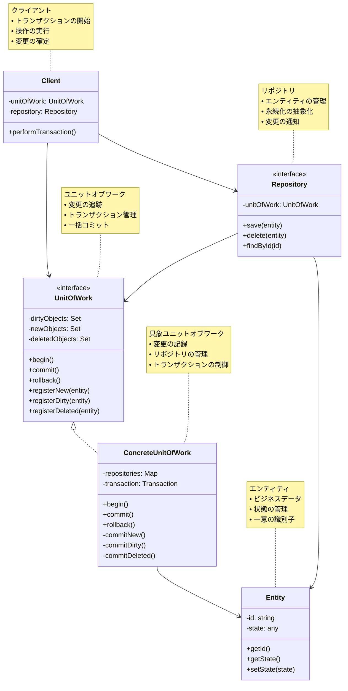

# Unit of Work (ユニットオブワーク)

## 目的

複数のデータベース操作をトランザクションとして一括管理し、データの整合性を保ちながら効率的な永続化を実現します。

## 価値・解決する問題

- トランザクションの一貫性保証
- 変更の追跡と効率的な永続化
- データベースアクセスの最適化
- ビジネスロジックからトランザクション管理を分離

## コード例

### Before:

個別のデータベース操作を直接実行する実装

```typescript
"use strict";

interface User {
  id: number;
  name: string;
  balance: number;
}

class UserService {
  private db: any; // データベース接続

  async transferMoney(
    fromUserId: number,
    toUserId: number,
    amount: number
  ): Promise<void> {
    // 個別のトランザクションで実行されるため、整合性が保証されない
    const fromUser = await this.db.query("SELECT * FROM users WHERE id = ?", [
      fromUserId,
    ]);
    const toUser = await this.db.query("SELECT * FROM users WHERE id = ?", [
      toUserId,
    ]);

    await this.db.query("UPDATE users SET balance = ? WHERE id = ?", [
      fromUser.balance - amount,
      fromUserId,
    ]);
    await this.db.query("UPDATE users SET balance = ? WHERE id = ?", [
      toUser.balance + amount,
      toUserId,
    ]);
  }
}
```

### After:

Unit of Work パターンを利用した実装

```typescript
"use strict";

// エンティティの定義
interface User {
  id: number;
  name: string;
  balance: number;
}

// Unit of Work インターフェース
interface UnitOfWork {
  begin(): Promise<void>;
  commit(): Promise<void>;
  rollback(): Promise<void>;
  getUserRepository(): UserRepository;
}

// リポジトリインターフェース
interface UserRepository {
  findById(id: number): Promise<User | null>;
  update(user: User): void;
}

// Unit of Work の実装
class DatabaseUnitOfWork implements UnitOfWork {
  private db: any; // データベース接続
  private transaction: any;
  private userRepository: UserRepository;
  private dirtyObjects: Set<User> = new Set();

  constructor(db: any) {
    this.db = db;
    this.userRepository = new DatabaseUserRepository(this);
  }

  async begin(): Promise<void> {
    this.transaction = await this.db.beginTransaction();
  }

  async commit(): Promise<void> {
    try {
      // 変更されたオブジェクトを永続化
      for (const user of this.dirtyObjects) {
        await this.db.query("UPDATE users SET balance = ? WHERE id = ?", [
          user.balance,
          user.id,
        ]);
      }
      await this.transaction.commit();
      this.dirtyObjects.clear();
    } catch (error) {
      await this.rollback();
      throw error;
    }
  }

  async rollback(): Promise<void> {
    await this.transaction.rollback();
    this.dirtyObjects.clear();
  }

  getUserRepository(): UserRepository {
    return this.userRepository;
  }

  registerDirty(user: User): void {
    this.dirtyObjects.add(user);
  }
}

// リポジトリの実装
class DatabaseUserRepository implements UserRepository {
  constructor(private unitOfWork: DatabaseUnitOfWork) {}

  async findById(id: number): Promise<User | null> {
    const result = await this.unitOfWork["db"].query(
      "SELECT * FROM users WHERE id = ?",
      [id]
    );
    return result.length > 0 ? result[0] : null;
  }

  update(user: User): void {
    this.unitOfWork.registerDirty(user);
  }
}

// サービス層での利用例
class TransferService {
  constructor(private unitOfWork: UnitOfWork) {}

  async transferMoney(
    fromUserId: number,
    toUserId: number,
    amount: number
  ): Promise<void> {
    await this.unitOfWork.begin();

    try {
      const userRepo = this.unitOfWork.getUserRepository();

      const fromUser = await userRepo.findById(fromUserId);
      const toUser = await userRepo.findById(toUserId);

      if (!fromUser || !toUser) {
        throw new Error("User not found");
      }

      if (fromUser.balance < amount) {
        throw new Error("Insufficient funds");
      }

      fromUser.balance -= amount;
      toUser.balance += amount;

      userRepo.update(fromUser);
      userRepo.update(toUser);

      await this.unitOfWork.commit();
    } catch (error) {
      await this.unitOfWork.rollback();
      throw error;
    }
  }
}
```

## 類似パターンとの比較

- [Repository (リポジトリ)](repository.md): Unit of Work は変更の追跡と一括コミットを管理し、これに対して Repository はデータアクセスを抽象化します。
- [Transaction Script (トランザクションスクリプト)](transaction-script.md): Unit of Work はドメインモデルの変更を追跡し、これに対して Transaction Script は手続き的なトランザクション処理を提供します。

## 利用されているライブラリ／フレームワークの事例

- [Entity Framework Core](https://docs.microsoft.com/ef/core/): DbContext が Unit of Work パターンを実装
- [Hibernate](https://hibernate.org/): Session オブジェクトが Unit of Work として機能
- [TypeORM](https://typeorm.io/): EntityManager が Unit of Work パターンを採用
- [Sequelize](https://sequelize.org/): Transaction オブジェクトが Unit of Work の概念を実装

### 概要図


