# Visitor（ビジター）パターン

## 目的

オブジェクト構造を表すクラスと処理を行うクラスを分離し、新しい処理を追加しやすくするパターンです。

## 価値・解決する問題

- データ構造と処理を分離できます
- 新しい処理の追加が容易です
- 関連する処理をまとめられます
- 双方向ディスパッチを実現できます
- 処理の追加が既存コードに影響を与えません

## 概要・特徴

### 概要

Visitorパターンは、データ構造とそれに対する操作を分離し、新しい操作を追加する際にデータ構造を変更せずに済むようにする設計パターンです。このパターンでは、データ構造の各要素がVisitorオブジェクトを「受け入れる」ことで、Visitorはその要素に対して特定の操作を実行します。これにより、データ構造自体は変更せずに、新しい操作をVisitorとして追加できるようになります。

### 特徴

#### データと処理の分離

Visitorパターンの最も重要な特徴は、データ構造とそれに対する操作を明確に分離することです。データ構造クラス（Element）は基本的な構造と「acceptメソッド」のみを持ち、具体的な処理はVisitorクラスに委譲します。例えば、ドキュメントオブジェクトモデル（DOM）に対する操作では、DOMの構造自体は不変のまま、異なるVisitorを通じて印刷、検証、変換などの操作を実現できます。これにより、データと操作の関心事が分離され、単一責任の原則に沿った設計が可能になります。

#### 処理の集中化

関連する処理ロジックをVisitorクラス内にまとめることができます。例えば、複数のグラフィック要素（円、四角形、三角形など）に対する描画、移動、拡大縮小などの操作をそれぞれ独立したVisitorクラスにまとめることができます。これにより、処理ロジックは各要素クラスに分散せず、機能ごとに集約されるため、関連するコードを探しやすく、保守性が向上します。また、特定の操作に関するロジックの変更も、そのVisitorクラスのみを修正すれば良いため、変更の影響範囲が限定されます。

#### 双方向ディスパッチ

Visitorパターンは「二重ディスパッチ」または「多重ディスパッチ」と呼ばれるメカニズムを実現します。これは、実行される操作が2つの要因（VisitorのタイプとElementのタイプ）によって決まる仕組みです。まず要素の`accept`メソッドがVisitorを受け入れ、次にVisitorの`visit`メソッドがElementのタイプに応じた処理を実行します。例えば、金融システムにおける異なる取引タイプ（預金、引き出し、送金など）に対する異なる処理（記録、検証、手数料計算など）を組み合わせて実行する場合に有用です。この仕組みにより、実行時の型情報に基づいた柔軟な処理分岐が可能になります。

#### 拡張性の向上

新しい処理を追加する際に、既存のデータ構造クラスを変更する必要がありません。新しいVisitorクラスを作成するだけで、すべてのElement要素に対して新しい操作を実装できます。例えば、XMLドキュメント処理システムに新しい検証ルールやフォーマット変換を追加する場合、XMLノードクラス自体を変更せずに、新しいValidatorVisitorやConverterVisitorを追加するだけで実現できます。これにより、開放/閉鎖原則（OCP）に準拠した拡張性の高いシステム設計が可能になります。

#### 関心の分離

Visitorパターンは、オブジェクト構造とそれに対する操作を明確に分離することで、関心の分離（Separation of Concerns）の原則を実現します。データ構造クラスはデータの保持と基本的な構造の管理に集中し、各種操作や処理のロジックはVisitorクラスが担当します。例えば、コンパイラの抽象構文木（AST）処理では、ASTノードクラスは構文構造の表現だけに専念し、コード生成、最適化、型チェックなどの処理はそれぞれ専用のVisitorが担当します。これにより、データ構造の専門家と特定の操作の専門家が独立して作業できるようになり、チーム開発の効率が向上します。また、テストの観点からも、データ構造と操作を分離することで、それぞれを独立してテストでき、テストの範囲と効率が向上します。特に大規模なシステムや、多様な操作が必要なドメインでは、この関心の分離が保守性と拡張性の鍵となります。さらに、この原則に従うことで、各クラスの責務が明確になり、コードの可読性と理解のしやすさも向上します。

#### クラス階層の変更の難しさ

Visitorパターンの主な制約の一つは、Element（受け入れ側）のクラス階層が頻繁に変更される場合、維持が困難になる点です。新しいElementクラスが追加されるたびに、すべてのVisitorインターフェースとその実装クラスにも対応するメソッドを追加する必要があります。例えば、グラフィックエディタで新しい図形タイプ（星形など）を追加する場合、すべての既存Visitor（描画Visitor、選択Visitor、変換Visitorなど）に対応するvisitメソッドを追加しなければなりません。これは、ビジターの数が多いシステムでは大きな変更作業を伴い、変更漏れのリスクも増加します。これを緩和するためには、デフォルト処理を持つ基底Visitorクラスを導入したり、リフレクションを活用した動的ディスパッチを実装したりするアプローチがありますが、それぞれに複雑性やパフォーマンスの問題が伴います。したがって、Visitorパターンは、データ構造の階層が安定しており、操作の種類が頻繁に変更または追加される場合に最も効果的です。階層が不安定な場合は、Strategyパターンやコマンドパターンなど、別のアプローチを検討すべきでしょう。

### 概要図

```mermaid
classDiagram
    class Visitor {
        <<interface>>
        +visitConcreteElementA(element: ConcreteElementA): void
        +visitConcreteElementB(element: ConcreteElementB): void
    }
    
    class ConcreteVisitor1 {
        +visitConcreteElementA(element: ConcreteElementA): void
        +visitConcreteElementB(element: ConcreteElementB): void
    }
    
    class ConcreteVisitor2 {
        +visitConcreteElementA(element: ConcreteElementA): void
        +visitConcreteElementB(element: ConcreteElementB): void
    }
    
    class Element {
        <<interface>>
        +accept(visitor: Visitor): void
    }
    
    class ConcreteElementA {
        +accept(visitor: Visitor): void
        +operationA(): void
    }
    
    class ConcreteElementB {
        +accept(visitor: Visitor): void
        +operationB(): void
    }
    
    class ObjectStructure {
        -elements: List<Element>
        +addElement(element: Element): void
        +removeElement(element: Element): void
        +acceptAll(visitor: Visitor): void
    }
    
    Visitor <|-- ConcreteVisitor1
    Visitor <|-- ConcreteVisitor2
    Element <|-- ConcreteElementA
    Element <|-- ConcreteElementB
    ObjectStructure o-- Element
    
    note for Visitor "• 要素に対する操作を定義するインターフェース\n• 各具象要素型に対応するvisitメソッドを提供\n• 二重ディスパッチの一方を担当"
    note for ConcreteVisitor1 "• 特定の処理を実装する具象Visitor\n• 各要素型に対して異なる処理を実行\n• 例: レポート生成、データ検証など"
    note for ConcreteVisitor2 "• 別の処理を実装する具象Visitor\n• 同じ要素に対して異なる操作を提供\n• 例: XML変換、データベース保存など"
    note for Element "• 訪問者を受け入れるインターフェース\n• acceptメソッドを通じてVisitorを受け入れる\n• すべての具象要素の共通インターフェース"
    note for ConcreteElementA "• 具体的な要素クラスA\n• Visitorに自身を渡して処理を委譲\n• 要素独自の状態やメソッドを持つ"
    note for ConcreteElementB "• 具体的な要素クラスB\n• 異なる要素として独自の振る舞いを持つ\n• Visitorに異なる処理を依頼"
    note for ObjectStructure "• 要素のコレクションを管理\n• 複合オブジェクトやリストなどの構造\n• すべての要素に対してVisitorを適用可能"
```



## 類似パターンとの比較

- [Command (コマンド)](command.md): Visitor は操作をオブジェクト構造から分離し、これに対して Command は操作自体をカプセル化します。
- [Strategy (ストラテジー)](strategy.md): Visitor は複数の異なるオブジェクトに対する操作を分離し、これに対して Strategy は単一のオブジェクトに対するアルゴリズムを切り替えます。
- [Iterator (イテレータ)](iterator.md): Visitor はオブジェクト構造に対する操作を分離し、これに対して Iterator は要素へのアクセス方法を提供します。

## 利用されているライブラリ／フレームワークの事例

- [AST Parsers](https://github.com/babel/babel/tree/main/packages/babel-traverse): 構文解析
- [Apache Commons IO](https://commons.apache.org/proper/commons-io/): ファイル操作
- [Spring Framework](https://spring.io/): Bean Validation

## 解説ページリンク

- [Refactoring Guru - Visitor Pattern](https://refactoring.guru/design-patterns/visitor)
- [SourceMaking - Visitor Pattern](https://sourcemaking.com/design_patterns/visitor)
- [Design Patterns - Visitor Pattern](https://www.oodesign.com/visitor-pattern.html)

## コード例

### Before:

オブジェクト構造に直接処理を実装した例

```typescript
// ファイルシステムの要素を表すクラス
abstract class FileSystemElement {
  constructor(
    protected name: string,
    protected size: number
  ) {}

  getName(): string {
    return this.name;
  }

  getSize(): number {
    return this.size;
  }

  // 各要素に対する操作を直接実装
  abstract calculateTotalSize(): number;
  abstract search(keyword: string): FileSystemElement[];
  abstract getPermissions(): string;
  abstract generateReport(): string;
}

// ファイルクラス
class File extends FileSystemElement {
  private permissions: string;

  constructor(
    name: string,
    size: number,
    permissions: string
  ) {
    super(name, size);
    this.permissions = permissions;
  }

  calculateTotalSize(): number {
    return this.size;
  }

  search(keyword: string): FileSystemElement[] {
    return this.name.includes(keyword) ? [this] : [];
  }

  getPermissions(): string {
    return this.permissions;
  }

  generateReport(): string {
    return `File: ${this.name}, Size: ${this.size}bytes, Permissions: ${this.permissions}`;
  }
}

// ディレクトリクラス
class Directory extends FileSystemElement {
  private children: FileSystemElement[] = [];
  private permissions: string;

  constructor(
    name: string,
    permissions: string
  ) {
    super(name, 0);
    this.permissions = permissions;
  }

  addChild(child: FileSystemElement): void {
    this.children.push(child);
    this.size += child.getSize();
  }

  calculateTotalSize(): number {
    return this.children.reduce((total, child) => total + child.calculateTotalSize(), 0);
  }

  search(keyword: string): FileSystemElement[] {
    const results: FileSystemElement[] = [];
    if (this.name.includes(keyword)) {
      results.push(this);
    }
    this.children.forEach(child => {
      results.push(...child.search(keyword));
    });
    return results;
  }

  getPermissions(): string {
    return this.permissions;
  }

  generateReport(): string {
    const childReports = this.children
      .map(child => child.generateReport())
      .join("\n  ");
    return `Directory: ${this.name}, Permissions: ${this.permissions}\n  ${childReports}`;
  }
}

// 使用例
function example() {
  // ファイルシステムの構築
  const root = new Directory("root", "drwxr-xr-x");
  
  const docs = new Directory("docs", "drwxr-xr-x");
  docs.addChild(new File("readme.md", 1024, "-rw-r--r--"));
  docs.addChild(new File("manual.pdf", 2048, "-rw-r--r--"));
  
  const src = new Directory("src", "drwxr-xr-x");
  src.addChild(new File("main.ts", 512, "-rw-r--r--"));
  src.addChild(new File("test.ts", 256, "-rw-r--r--"));
  
  root.addChild(docs);
  root.addChild(src);
  root.addChild(new File("config.json", 128, "-rw-r--r--"));

  // 各操作の実行
  console.log("=== サイズ計算 ===");
  console.log(`Total size: ${root.calculateTotalSize()} bytes`);

  console.log("\n=== 検索 (.ts) ===");
  const searchResults = root.search(".ts");
  searchResults.forEach(element => {
    console.log(`Found: ${element.getName()}`);
  });

  console.log("\n=== レポート生成 ===");
  console.log(root.generateReport());
}

example();
```

### After:

Visitorパターンを適用した実装

```typescript
// 訪問者インターフェース
interface FileSystemVisitor {
  visitFile(file: File): void;
  visitDirectory(directory: Directory): void;
}

// ファイルシステムの要素を表す抽象クラス
abstract class FileSystemElement {
  constructor(
    protected name: string,
    protected size: number
  ) {}

  getName(): string {
    return this.name;
  }

  getSize(): number {
    return this.size;
  }

  // Visitorを受け入れるメソッド
  abstract accept(visitor: FileSystemVisitor): void;
}

// ファイルクラス
class File extends FileSystemElement {
  constructor(
    name: string,
    size: number,
    private permissions: string,
    private content: string
  ) {
    super(name, size);
  }

  getPermissions(): string {
    return this.permissions;
  }

  getContent(): string {
    return this.content;
  }

  accept(visitor: FileSystemVisitor): void {
    visitor.visitFile(this);
  }
}

// ディレクトリクラス
class Directory extends FileSystemElement {
  private children: FileSystemElement[] = [];

  constructor(
    name: string,
    private permissions: string
  ) {
    super(name, 0);
  }

  addChild(child: FileSystemElement): void {
    this.children.push(child);
    this.size += child.getSize();
  }

  getChildren(): FileSystemElement[] {
    return this.children;
  }

  getPermissions(): string {
    return this.permissions;
  }

  accept(visitor: FileSystemVisitor): void {
    visitor.visitDirectory(this);
    this.children.forEach(child => child.accept(visitor));
  }
}

// サイズ計算のVisitor
class SizeCalculatorVisitor implements FileSystemVisitor {
  private totalSize: number = 0;

  visitFile(file: File): void {
    this.totalSize += file.getSize();
  }

  visitDirectory(directory: Directory): void {
    // ディレクトリ自体のサイズは0とする
  }

  getTotalSize(): number {
    return this.totalSize;
  }
}

// 検索のVisitor
class SearchVisitor implements FileSystemVisitor {
  private results: FileSystemElement[] = [];

  constructor(private keyword: string) {}

  visitFile(file: File): void {
    if (file.getName().includes(this.keyword)) {
      this.results.push(file);
    }
  }

  visitDirectory(directory: Directory): void {
    if (directory.getName().includes(this.keyword)) {
      this.results.push(directory);
    }
  }

  getResults(): FileSystemElement[] {
    return this.results;
  }
}

// レポート生成のVisitor
class ReportGeneratorVisitor implements FileSystemVisitor {
  private indentLevel: number = 0;
  private report: string[] = [];

  visitFile(file: File): void {
    this.report.push(
      "  ".repeat(this.indentLevel) +
      `File: ${file.getName()}, ` +
      `Size: ${file.getSize()}bytes, ` +
      `Permissions: ${file.getPermissions()}`
    );
  }

  visitDirectory(directory: Directory): void {
    this.report.push(
      "  ".repeat(this.indentLevel) +
      `Directory: ${directory.getName()}, ` +
      `Permissions: ${directory.getPermissions()}`
    );
    this.indentLevel++;
  }

  getReport(): string {
    return this.report.join("\n");
  }
}

// 権限チェックのVisitor
class PermissionCheckerVisitor implements FileSystemVisitor {
  private issues: string[] = [];

  visitFile(file: File): void {
    const permissions = file.getPermissions();
    if (!permissions.startsWith("-")) {
      this.issues.push(`Invalid file permissions for ${file.getName()}: ${permissions}`);
    }
    if (permissions.length !== 10) {
      this.issues.push(`Malformed permissions for ${file.getName()}: ${permissions}`);
    }
  }

  visitDirectory(directory: Directory): void {
    const permissions = directory.getPermissions();
    if (!permissions.startsWith("d")) {
      this.issues.push(`Invalid directory permissions for ${directory.getName()}: ${permissions}`);
    }
    if (permissions.length !== 10) {
      this.issues.push(`Malformed permissions for ${directory.getName()}: ${permissions}`);
    }
  }

  getIssues(): string[] {
    return this.issues;
  }
}

// バックアップ作成のVisitor
class BackupVisitor implements FileSystemVisitor {
  private backup: Map<string, string> = new Map();

  visitFile(file: File): void {
    this.backup.set(file.getName(), file.getContent());
  }

  visitDirectory(directory: Directory): void {
    // ディレクトリの構造は別途保存する必要があるが、
    // ここでは単純化のためスキップ
  }

  getBackup(): Map<string, string> {
    return this.backup;
  }
}

// 統計情報収集のVisitor
class StatisticsVisitor implements FileSystemVisitor {
  private fileCount: number = 0;
  private directoryCount: number = 0;
  private totalSize: number = 0;
  private maxFileSize: number = 0;
  private maxFileName: string = "";

  visitFile(file: File): void {
    this.fileCount++;
    this.totalSize += file.getSize();
    if (file.getSize() > this.maxFileSize) {
      this.maxFileSize = file.getSize();
      this.maxFileName = file.getName();
    }
  }

  visitDirectory(directory: Directory): void {
    this.directoryCount++;
  }

  getStatistics(): string {
    return `Statistics:
  Files: ${this.fileCount}
  Directories: ${this.directoryCount}
  Total Size: ${this.totalSize} bytes
  Largest File: ${this.maxFileName} (${this.maxFileSize} bytes)`;
  }
}

// 使用例
function example() {
  // ファイルシステムの構築
  const root = new Directory("root", "drwxr-xr-x");
  
  const docs = new Directory("docs", "drwxr-xr-x");
  docs.addChild(new File("readme.md", 1024, "-rw-r--r--", "# README\nThis is a readme file."));
  docs.addChild(new File("manual.pdf", 2048, "-rw-r--r--", "PDF content here"));
  
  const src = new Directory("src", "drwxr-xr-x");
  src.addChild(new File("main.ts", 512, "-rw-r--r--", "console.log('Hello');"));
  src.addChild(new File("test.ts", 256, "-rw-r--r--", "describe('test', () => {});"));
  
  root.addChild(docs);
  root.addChild(src);
  root.addChild(new File("config.json", 128, "-rw-r--r--", "{ \"version\": \"1.0\" }"));

  // サイズ計算
  console.log("=== サイズ計算 ===");
  const sizeCalculator = new SizeCalculatorVisitor();
  root.accept(sizeCalculator);
  console.log(`Total size: ${sizeCalculator.getTotalSize()} bytes`);

  // 検索
  console.log("\n=== 検索 (.ts) ===");
  const searcher = new SearchVisitor(".ts");
  root.accept(searcher);
  searcher.getResults().forEach(element => {
    console.log(`Found: ${element.getName()}`);
  });

  // レポート生成
  console.log("\n=== レポート生成 ===");
  const reportGenerator = new ReportGeneratorVisitor();
  root.accept(reportGenerator);
  console.log(reportGenerator.getReport());

  // 権限チェック
  console.log("\n=== 権限チェック ===");
  const permissionChecker = new PermissionCheckerVisitor();
  root.accept(permissionChecker);
  const issues = permissionChecker.getIssues();
  if (issues.length > 0) {
    console.log("Found permission issues:");
    issues.forEach(issue => console.log(`- ${issue}`));
  } else {
    console.log("No permission issues found.");
  }

  // バックアップ作成
  console.log("\n=== バックアップ作成 ===");
  const backupCreator = new BackupVisitor();
  root.accept(backupCreator);
  console.log("Backed up files:");
  backupCreator.getBackup().forEach((content, name) => {
    console.log(`- ${name}: ${content.substring(0, 20)}...`);
  });

  // 統計情報収集
  console.log("\n=== 統計情報 ===");
  const statisticsCollector = new StatisticsVisitor();
  root.accept(statisticsCollector);
  console.log(statisticsCollector.getStatistics());
}

example();
```

```typescript
// Visitorパターンを関数型プログラミングスタイルで適用した実装

// ファイルシステムの要素を表す型定義
type FileSystemItem = File | Directory

// ファイルの型定義
type File = Readonly<{
  type: 'file'
  name: string
  size: number
  permissions: string
  content: string
}>

// ディレクトリの型定義
type Directory = Readonly<{
  type: 'directory'
  name: string
  permissions: string
  children: ReadonlyArray<FileSystemItem>
}>

// 汎用的なビジター関数の型
type Visitor<T> = {
  visitFile: (file: File) => T
  visitDirectory: (directory: Directory, visitChildren: () => ReadonlyArray<T>) => T
}

// ビジターパターン実装の汎用関数
const visit = <T>(item: FileSystemItem, visitor: Visitor<T>): T => {
  switch (item.type) {
    case 'file':
      return visitor.visitFile(item)
    case 'directory':
      const visitChildren = () => 
        item.children.map(child => visit(child, visitor))
      return visitor.visitDirectory(item, visitChildren)
  }
}

// 各種ビジター実装

// サイズ計算のビジター
const sizeCalculatorVisitor: Visitor<number> = {
  visitFile: (file) => file.size,
  visitDirectory: (_, visitChildren) => 
    visitChildren().reduce((sum, size) => sum + size, 0)
}

// 検索のビジター
const createSearchVisitor = (keyword: string): Visitor<FileSystemItem[]> => ({
  visitFile: (file) => 
    file.name.includes(keyword) ? [file] : [],
  
  visitDirectory: (directory, visitChildren) => {
    const childResults = visitChildren().flat()
    return directory.name.includes(keyword)
      ? [directory, ...childResults]
      : childResults
  }
})

// レポート生成のビジター
const createReportVisitor = (): Visitor<string> => {
  const generateReport = (item: FileSystemItem, indent: number = 0): string => {
    const indentation = '  '.repeat(indent)
    
    switch (item.type) {
      case 'file':
        return `${indentation}File: ${item.name}, Size: ${item.size}bytes, Permissions: ${item.permissions}`
      
      case 'directory':
        const headerLine = `${indentation}Directory: ${item.name}, Permissions: ${item.permissions}`
        const childrenLines = item.children
          .map(child => generateReport(child, indent + 1))
          .join('\n')
        
        return `${headerLine}\n${childrenLines}`
    }
  }
  
  return {
    visitFile: (file) => generateReport(file),
    visitDirectory: (directory) => generateReport(directory)
  }
}

// 権限チェックのビジター
const permissionCheckerVisitor: Visitor<string[]> = {
  visitFile: (file) => {
    const issues: string[] = []
    const { name, permissions } = file
    
    if (!permissions.startsWith('-')) {
      issues.push(`Invalid file permissions for ${name}: ${permissions}`)
    }
    
    if (permissions.length !== 10) {
      issues.push(`Malformed permissions for ${name}: ${permissions}`)
    }
    
    return issues
  },
  
  visitDirectory: (directory, visitChildren) => {
    const issues: string[] = []
    const { name, permissions } = directory
    
    if (!permissions.startsWith('d')) {
      issues.push(`Invalid directory permissions for ${name}: ${permissions}`)
    }
    
    if (permissions.length !== 10) {
      issues.push(`Malformed permissions for ${name}: ${permissions}`)
    }
    
    // 子要素の問題も含める
    return [...issues, ...visitChildren().flat()]
  }
}

// バックアップ作成のビジター
const backupVisitor: Visitor<Map<string, string>> = {
  visitFile: (file) => {
    const backup = new Map<string, string>()
    backup.set(file.name, file.content)
    return backup
  },
  
  visitDirectory: (_, visitChildren) => {
    // 子要素のバックアップをマージ
    const backupMap = new Map<string, string>()
    
    visitChildren().forEach(childBackup => {
      childBackup.forEach((content, name) => {
        backupMap.set(name, content)
      })
    })
    
    return backupMap
  }
}

// 統計情報収集のビジター
type FileSystemStats = Readonly<{
  fileCount: number
  directoryCount: number
  totalSize: number
  largestFile: Readonly<{
    name: string
    size: number
  }>
}>

const statisticsVisitor: Visitor<FileSystemStats> = {
  visitFile: (file) => ({
    fileCount: 1,
    directoryCount: 0,
    totalSize: file.size,
    largestFile: {
      name: file.name,
      size: file.size
    }
  }),
  
  visitDirectory: (directory, visitChildren) => {
    const childStats = visitChildren()
    
    // 初期統計情報
    const initialStats: FileSystemStats = {
      fileCount: 0,
      directoryCount: 1, // 現在のディレクトリをカウント
      totalSize: 0,
      largestFile: {
        name: '',
        size: 0
      }
    }
    
    // 子要素の統計情報を集約
    return childStats.reduce((acc, stats) => {
      const largestFile = 
        acc.largestFile.size >= stats.largestFile.size
          ? acc.largestFile
          : stats.largestFile
          
      return {
        fileCount: acc.fileCount + stats.fileCount,
        directoryCount: acc.directoryCount + stats.directoryCount,
        totalSize: acc.totalSize + stats.totalSize,
        largestFile
      }
    }, initialStats)
  }
}

// 複数のビジターを組み合わせる関数
const combineVisitors = <T1, T2>(
  visitor1: Visitor<T1>,
  visitor2: Visitor<T2>
): Visitor<[T1, T2]> => ({
  visitFile: (file) => [
    visitor1.visitFile(file),
    visitor2.visitFile(file)
  ],
  
  visitDirectory: (directory, visitChildren) => {
    const childResults = visitChildren()
    const results1 = childResults.map(([r]) => r)
    const results2 = childResults.map(([_, r]) => r)
    
    return [
      visitor1.visitDirectory(directory, () => results1),
      visitor2.visitDirectory(directory, () => results2)
    ]
  }
})

// ファイルシステム構築用のヘルパー関数
const createFile = (
  name: string,
  size: number,
  permissions: string,
  content: string
): File => Object.freeze({
  type: 'file',
  name,
  size,
  permissions,
  content
})

const createDirectory = (
  name: string,
  permissions: string,
  children: ReadonlyArray<FileSystemItem> = []
): Directory => Object.freeze({
  type: 'directory',
  name,
  permissions,
  children
})

// フォーマット関数
const formatStatistics = (stats: FileSystemStats): string => `
Statistics:
  Files: ${stats.fileCount}
  Directories: ${stats.directoryCount}
  Total Size: ${stats.totalSize} bytes
  Largest File: ${stats.largestFile.name} (${stats.largestFile.size} bytes)
`.trim()

// 使用例
const functionalExample = (): void => {
  console.log('=== 関数型Visitorパターンのデモ ===')
  
  // ファイルシステムの構築（イミュータブル）
  const readme = createFile('readme.md', 1024, '-rw-r--r--', '# README\nThis is a readme file.')
  const manual = createFile('manual.pdf', 2048, '-rw-r--r--', 'PDF content here')
  const mainFile = createFile('main.ts', 512, '-rw-r--r--', "console.log('Hello');")
  const testFile = createFile('test.ts', 256, '-rw-r--r--', "describe('test', () => {});")
  const configFile = createFile('config.json', 128, '-rw-r--r--', '{ "version": "1.0" }')
  
  const docs = createDirectory('docs', 'drwxr-xr-x', [readme, manual])
  const src = createDirectory('src', 'drwxr-xr-x', [mainFile, testFile])
  
  const root = createDirectory('root', 'drwxr-xr-x', [docs, src, configFile])
  
  // サイズ計算
  console.log('\n=== サイズ計算 ===')
  const totalSize = visit(root, sizeCalculatorVisitor)
  console.log(`Total size: ${totalSize} bytes`)
  
  // 検索
  console.log('\n=== 検索 (.ts) ===')
  const searchResults = visit(root, createSearchVisitor('.ts'))
  searchResults.forEach(item => console.log(`Found: ${item.name}`))
  
  // レポート生成
  console.log('\n=== レポート生成 ===')
  const report = visit(root, createReportVisitor())
  console.log(report)
  
  // 権限チェック
  console.log('\n=== 権限チェック ===')
  const permissionIssues = visit(root, permissionCheckerVisitor)
  if (permissionIssues.length > 0) {
    console.log('Found permission issues:')
    permissionIssues.forEach(issue => console.log(`- ${issue}`))
  } else {
    console.log('No permission issues found.')
  }
  
  // バックアップ作成
  console.log('\n=== バックアップ作成 ===')
  const backup = visit(root, backupVisitor)
  console.log('Backed up files:')
  backup.forEach((content, name) => {
    console.log(`- ${name}: ${content.substring(0, 20)}...`)
  })
  
  // 統計情報収集
  console.log('\n=== 統計情報 ===')
  const stats = visit(root, statisticsVisitor)
  console.log(formatStatistics(stats))
  
  // 複合ビジター（サイズ計算と統計情報を同時に収集）
  console.log('\n=== 複合ビジター ===')
  const [size, stats2] = visit(
    root,
    combineVisitors(sizeCalculatorVisitor, statisticsVisitor)
  )
  
  console.log(`Total size (from combined visitor): ${size} bytes`)
  console.log(formatStatistics(stats2))
}

// 実行
functionalExample()
```
