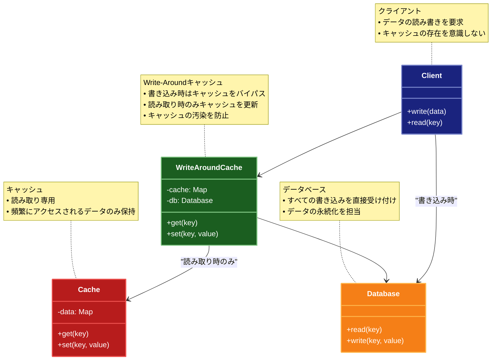

# Write Around（ライトアラウンド）パターン

## 目的

キャッシュをバイパスしてデータベースに直接書き込むことで、書き込み性能を向上させるパターンです。

## 価値・解決する問題

- 書き込み性能を向上させます
- キャッシュの整合性を維持します
- システムの複雑性を軽減します
- メモリ使用量を最適化します
- キャッシュの汚染を防ぎます

## 概要・特徴

### 概要

Write Aroundパターンは、データの書き込みをキャッシュをバイパスしてデータベースに直接行い、読み取り時に必要に応じてキャッシュを更新する設計パターンです。このアプローチにより、一度しか使われない可能性のあるデータでキャッシュが汚染されることを防ぎ、メモリリソースを効率的に使用します。特に書き込み頻度が高く、その書き込まれたデータの読み取り頻度が低いシステムに適しています。

### 特徴

#### キャッシュバイパス戦略

データの書き込み時にキャッシュをスキップし、データベースに直接書き込みます。これにより、キャッシュ更新のオーバーヘッドがなくなり、書き込み操作の処理時間が短縮されます。例えば、ログ記録システムでは、ログデータを生成する頻度は高いものの、そのデータを読み取る頻度は比較的低いため、書き込み時にキャッシュを更新する必要はありません。これにより、システムのスループットが向上し、特に書き込み負荷の高いアプリケーションで効果を発揮します。

#### 遅延キャッシュ充填

データは初めて読み取られるときにのみキャッシュに格納されます（遅延ロード）。これにより、実際に使用されるデータのみがキャッシュに保持され、メモリリソースが効率的に利用されます。例えば、大規模なデータウェアハウスでは、すべてのデータをキャッシュすることは非現実的ですが、ユーザーがクエリを実行した結果のみをキャッシュすることで、頻繁にアクセスされるデータセットに対するパフォーマンスを向上させることができます。これは特に、データセットが大きく、そのうち一部のみが頻繁にアクセスされるシステムで有効です。

#### メモリ使用量の最適化

読み取られないデータや一度しか読み取られない可能性のあるデータがキャッシュに格納されないため、キャッシュメモリの効率的な使用が可能になります。例えば、ユーザーが一度だけアクセスする可能性のあるアーカイブデータや履歴データは、キャッシュに格納されないため、より頻繁にアクセスされる重要なデータのためのスペースが確保されます。これにより、限られたメモリリソースで最大のパフォーマンス向上が得られます。

#### キャッシュ汚染の防止

一時的なデータや一度だけアクセスされるデータがキャッシュを占有することを防ぎます。これにより、キャッシュヒット率が向上し、システム全体のパフォーマンスが改善されます。例えば、バッチ処理やレポート生成など、大量のデータを一度スキャンするような操作では、そのデータをキャッシュに格納すると、より頻繁にアクセスされる重要なデータがキャッシュから追い出される可能性があります。Write Aroundパターンを使用することで、このような「キャッシュ汚染」を防ぎ、キャッシュの効率を維持します。

#### 整合性管理の簡素化

キャッシュとデータベースの間の整合性管理が簡素化されます。書き込み時にキャッシュを更新しないため、キャッシュとデータベースの同期に関する複雑な問題が軽減されます。例えば、分散システムでの書き込み競合や、Write-BehindやWrite-Throughパターンで発生する可能性のある同期エラーを回避できます。これにより、システムの複雑性が低下し、デバッグや障害復旧が容易になります。特に、データの整合性よりもパフォーマンスや可用性を優先するシステムで有効です。

### 概要図



## 類似パターンとの比較

- [Write Through (ライトスルー)](write-through.md): Write Around はキャッシュをバイパスし、これに対して Write Through はキャッシュと同時にデータベースを更新します。
- [Write Behind (ライトビハインド)](write-behind.md): Write Around はキャッシュをバイパスし、これに対して Write Behind はキャッシュを非同期で更新します。
- [Cache Aside (キャッシュアサイド)](cache-aside.md): Write Around は書き込み時にキャッシュをバイパスし、これに対して Cache Aside は読み取り時にキャッシュを更新します。

## 利用されているライブラリ／フレームワークの事例

- [Redis](https://redis.io/): キャッシュ管理
- [Memcached](https://memcached.org/): 分散キャッシュ
- [Hibernate](https://hibernate.org/): 2次キャッシュ

## 解説ページリンク

- [Microsoft - Caching Guidance](https://docs.microsoft.com/en-us/azure/architecture/best-practices/caching)
- [AWS - Caching Overview](https://aws.amazon.com/caching/)
- [Redis - Caching Patterns](https://redis.com/solutions/use-cases/caching/)

## コード例

### Before:

キャッシュを使用しない実装

```typescript
// データベースアクセスクラス
class Database {
  private data: Map<string, any> = new Map();

  async get(key: string): Promise<any> {
    console.log(`データベースから読み込み: ${key}`);
    // データベースアクセスを模擬
    await new Promise(resolve => setTimeout(resolve, 100));
    return this.data.get(key);
  }

  async set(key: string, value: any): Promise<void> {
    console.log(`データベースに書き込み: ${key}`);
    // データベースアクセスを模擬
    await new Promise(resolve => setTimeout(resolve, 100));
    this.data.set(key, value);
  }
}

// データアクセスクラス
class DataAccess {
  private db: Database;

  constructor() {
    this.db = new Database();
  }

  async getData(key: string): Promise<any> {
    return await this.db.get(key);
  }

  async setData(key: string, value: any): Promise<void> {
    await this.db.set(key, value);
  }
}

// 使用例
async function example() {
  const dataAccess = new DataAccess();

  console.log("=== データの書き込み ===");
  await dataAccess.setData("user:1", {
    id: 1,
    name: "John Doe",
    email: "john@example.com"
  });

  console.log("\n=== データの読み込み ===");
  const user = await dataAccess.getData("user:1");
  console.log("読み込んだデータ:", user);
}

example();
```

### After:

Write Aroundパターンを適用した実装

```typescript
// キャッシュクラス
class Cache {
  private data: Map<string, any>;
  private stats = {
    hits: 0,
    misses: 0,
    writes: 0
  };

  constructor(private maxSize: number = 1000) {
    this.data = new Map();
  }

  get(key: string): any {
    const value = this.data.get(key);
    if (value !== undefined) {
      this.stats.hits++;
      console.log(`キャッシュヒット: ${key}`);
    } else {
      this.stats.misses++;
      console.log(`キャッシュミス: ${key}`);
    }
    return value;
  }

  set(key: string, value: any): void {
    this.stats.writes++;
    console.log(`キャッシュに書き込み: ${key}`);

    // キャッシュサイズの管理
    if (this.data.size >= this.maxSize) {
      const oldestKey = this.data.keys().next().value;
      this.data.delete(oldestKey);
    }

    this.data.set(key, value);
  }

  invalidate(key: string): void {
    console.log(`キャッシュから削除: ${key}`);
    this.data.delete(key);
  }

  clear(): void {
    console.log("キャッシュをクリア");
    this.data.clear();
  }

  getStats(): typeof this.stats {
    return { ...this.stats };
  }
}

// データベースクラス
class Database {
  private data: Map<string, any> = new Map();
  private stats = {
    reads: 0,
    writes: 0
  };

  async get(key: string): Promise<any> {
    console.log(`データベースから読み込み: ${key}`);
    this.stats.reads++;
    // データベースアクセスを模擬
    await new Promise(resolve => setTimeout(resolve, 100));
    return this.data.get(key);
  }

  async set(key: string, value: any): Promise<void> {
    console.log(`データベースに書き込み: ${key}`);
    this.stats.writes++;
    // データベースアクセスを模擬
    await new Promise(resolve => setTimeout(resolve, 100));
    this.data.set(key, value);
  }

  getStats(): typeof this.stats {
    return { ...this.stats };
  }
}

// Write Aroundパターンを実装したデータアクセスクラス
class WriteAroundDataAccess {
  private cache: Cache;
  private db: Database;

  constructor(cacheSize?: number) {
    this.cache = new Cache(cacheSize);
    this.db = new Database();
  }

  async getData(key: string): Promise<any> {
    // まずキャッシュを確認
    let data = this.cache.get(key);
    
    if (data === undefined) {
      // キャッシュミスの場合、データベースから読み込み
      data = await this.db.get(key);
      
      if (data !== undefined) {
        // データが存在する場合のみキャッシュに保存
        this.cache.set(key, data);
      }
    }
    
    return data;
  }

  async setData(key: string, value: any): Promise<void> {
    // Write Aroundパターン: データベースに直接書き込み
    await this.db.set(key, value);
    // キャッシュは更新せず、無効化のみ行う
    this.cache.invalidate(key);
  }

  async batchSetData(items: { key: string; value: any }[]): Promise<void> {
    console.log(`バッチ処理開始: ${items.length}件のデータを書き込み`);
    
    try {
      // すべてのデータをデータベースに直接書き込み
      for (const item of items) {
        await this.db.set(item.key, item.value);
        // キャッシュは更新せず、無効化のみ行う
        this.cache.invalidate(item.key);
      }
      
      console.log("バッチ処理完了");
    } catch (error) {
      throw error;
    }
  }

  getStats(): { cache: ReturnType<Cache['getStats']>; db: ReturnType<Database['getStats']> } {
    return {
      cache: this.cache.getStats(),
      db: this.db.getStats()
    };
  }
}

// 使用例
async function example() {
  const dataAccess = new WriteAroundDataAccess();

  try {
    console.log("=== 単一データの書き込みと読み取り ===");
    await dataAccess.setData("user:1", {
      id: 1,
      name: "John Doe",
      email: "john@example.com"
    });

    const user = await dataAccess.getData("user:1");
    console.log("読み込んだデータ:", user);

    console.log("\n=== バッチ処理 ===");
    await dataAccess.batchSetData([
      {
        key: "user:2",
        value: {
          id: 2,
          name: "Jane Smith",
          email: "jane@example.com"
        }
      },
      {
        key: "user:3",
        value: {
          id: 3,
          name: "Bob Johnson",
          email: "bob@example.com"
        }
      }
    ]);

    const user2 = await dataAccess.getData("user:2");
    console.log("読み込んだデータ (user:2):", user2);

    const user3 = await dataAccess.getData("user:3");
    console.log("読み込んだデータ (user:3):", user3);

    console.log("\n=== 統計情報 ===");
    const stats = dataAccess.getStats();
    console.log("キャッシュ統計:", stats.cache);
    console.log("データベース統計:", stats.db);

  } catch (error) {
    console.error("エラーが発生しました:", error);
  }
}

example(); 